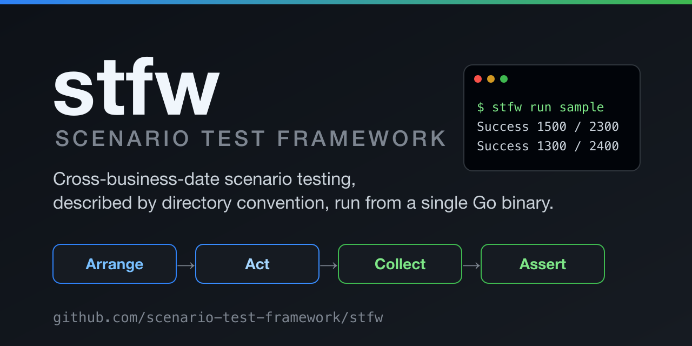

<p align="center">
  
</p>

<p align="center">
  <a href="https://github.com/scenario-test-framework/stfw/actions/workflows/ci.yml"></a>
  <a href="https://github.com/scenario-test-framework/stfw/releases"></a>
  <a href="go.mod"></a>
  <a href="https://github.com/scenario-test-framework/stfw/pkgs/container/stfw"></a>
  <a href="LICENSE"></a>
</p>

<p align="center">
  <b>English</b> | <a href="README.ja.md">日本語</a>
</p>

# stfw

**scenario test framework** — describe cross-business-date scenario tests with a directory
convention and run them automatically from a single binary.

- **Single binary**: written in Go, with the execution engine built in (no external workflow
  engine such as digdag, no JVM).
- **Convention-based**: just drop scripts into the `scenario/{name}/_{seq}_{bizdate}/_{seq}_{group}_{type}/`
  hierarchy.
- **Ordered, fail-fast**: steps run sequentially in filename order; every step after a failure is
  recorded as `Blocked`.
- **Visibility**: a JSONL execution journal + `stfw status` + a static HTML report.
- **Observability**: run / scenario / bizdate / process / step execution is exported as OTLP traces
  (view them directly in Jaeger / Grafana Tempo / Datadog, etc.).
- **Built-in plugins**: compose Arrange → Act → Collect → Assert scenario tests from ready-made parts
  (RDBMS / Redis / ssh / scp / k6 / file comparison).
- **Housekeeping**: `stfw run` automatically deletes results older than the retention window
  (`stfw.housekeep.retention_days`) at the start of a run.

> ⚠️ The v0.2 line (Bash + digdag implementation) is frozen at tag [`v0.2.0`](../../tree/v0.2.0).
> See [docs/MIGRATION.md](docs/MIGRATION.md) for the migration guide and breaking changes.

> ℹ️ Internal documentation (`docs/`) and in-code comments are written in Japanese.

## Install

### Binary (Linux / macOS / Windows)

- Linux / macOS

  ```sh
  curl -fsSL https://raw.githubusercontent.com/scenario-test-framework/stfw/master/install.sh | bash
  stfw --version
  ```

  `install.sh` auto-detects OS / arch and installs the latest release by default. You can pin a
  version or change the install directory:

  ```sh
  curl -fsSL https://raw.githubusercontent.com/scenario-test-framework/stfw/master/install.sh | \
    STFW_VERSION=X.Y.Z STFW_BINDIR=$HOME/.local/bin bash
  ```

  Uninstall:

  ```sh
  curl -fsSL https://raw.githubusercontent.com/scenario-test-framework/stfw/master/uninstall.sh | bash
  ```

  Pass the same directory if you changed the install location:

  ```sh
  curl -fsSL https://raw.githubusercontent.com/scenario-test-framework/stfw/master/uninstall.sh | \
    STFW_BINDIR=$HOME/.local/bin bash
  ```

- Windows (PowerShell)

  ```ps1
  & ([scriptblock]::Create((irm https://raw.githubusercontent.com/scenario-test-framework/stfw/master/install.ps1)))
  stfw --version
  ```

  `install.ps1` auto-detects the architecture, installs the latest release to `$HOME\bin` by default,
  and adds it to the user PATH. You can pin a version or change the install directory:

  ```ps1
  & ([scriptblock]::Create((irm https://raw.githubusercontent.com/scenario-test-framework/stfw/master/install.ps1))) `
    -Version X.Y.Z `
    -BinDir "$HOME\bin"
  ```

  Uninstall:

  ```ps1
  & ([scriptblock]::Create((irm https://raw.githubusercontent.com/scenario-test-framework/stfw/master/uninstall.ps1)))
  ```

  Pass the same directory if you changed the install location:

  ```ps1
  & ([scriptblock]::Create((irm https://raw.githubusercontent.com/scenario-test-framework/stfw/master/uninstall.ps1))) `
    -BinDir "$HOME\bin"
  ```

### Docker

```console
docker pull ghcr.io/scenario-test-framework/stfw:latest
docker run --rm -v "$PWD":/work ghcr.io/scenario-test-framework/stfw:latest --version
```

To use the built-in plugins (RDBMS / Redis / ssh family / invokeWeb), use the all-runtime-bundled
**`stfw:full`** image (ships mysql / psql / redis-cli / sshpass / Chromium):

```console
docker pull ghcr.io/scenario-test-framework/stfw:full
```

## Quick Start

```console
$ mkdir myproject && cd myproject
$ stfw init                        # initialize the project (with a sample scenario)
$ stfw run sample                  # run the scenario
$ stfw status                      # show the result tree
$ stfw report                      # regenerate the HTML report (.stfw/reports/)
```

Add a scenario:

```console
$ stfw new scenario release_test               # scenario
$ cd scenario/release_test
$ stfw new bizdate 10 20260701                 # business date (seq + YYYYMMDD)
$ cd _10_20260701
$ stfw new process 10 web scripts              # process (seq + group + type)
$ stfw validate release_test                   # static validation of the convention
```

## Docker Compose (with HTML report serving)

`compose.yaml` bundles stfw + nginx + reports-init (a one-shot that initializes volume ownership).
nginx serves the execution reports through a shared volume.

```console
$ docker compose up -d nginx                 # start report serving
$ docker compose run --rm stfw init          # initialize the project
$ docker compose run --rm stfw run sample    # run the scenario
$ open http://localhost:8080                 # view the report in a browser
```

## Directory convention

```
myproject/
├── stfw.yml                     # project settings (overrides the defaults)
├── config/
│   ├── inventory/staging.yml    # host group definitions for targets
│   ├── encrypt/                 # encryption keys (stfw secret keygen)
│   └── passwd/                  # encrypted credentials (stfw secret set)
├── plugins/                     # hierarchy hooks / custom process plugins
│   └── {run,scenario,bizdate,process}/_common/{setup,teardown}/
└── scenario/
    └── {scenario}/              # scenario
        └── _{seq}_{bizdate}/    # business date (run in ascending order)
            └── _{seq}_{group}_{type}/   # process (run in ascending order)
                └── scripts/     # steps (run sequentially ascending, stop on error)
```

## Process plugin contract

Process types are extensible through the following contract:

- Input: environment variables (`stfw_*` = flattened settings, plus execution context such as
  `STFW_PROJ_DIR`).
- Output: a return code (`0` = Success / `3` = Warn / `6` = Error).
- Any implementation language (any executable file works).

### Built-in process plugins

Compose Arrange → Act → Collect → Assert scenario tests from ready-made parts. Targets are resolved
from inventory groups and passwords from secrets; hard-coding them in configuration is forbidden.

| Phase | Plugin | Description |
|---|---|---|
| any | `scripts` | run arbitrary scripts sequentially in ascending order (Go-native) |
| Arrange | `importMysql` / `importPostgres` / `importRedis` | load data into a datastore from CSV |
| Arrange | `clearMysql` / `clearPostgres` / `clearRedis` | reset a datastore |
| Arrange | `scpPut` | place local files on a remote host atomically (scp + atomic rename) |
| Act | `invokeRest` / `invokeWeb` | API transactions / browser operations via grafana k6 |
| Act | `sshExec` | run remote scripts in bulk (ssh) |
| Collect | `collectFile` / `collectLog` | collect evidence from remote hosts (with time filtering) |
| Collect | `exportMysql` / `exportPostgres` / `exportRedis` | export a datastore to CSV |
| Assert | `compare` | directory comparison of expected values vs. evidence (compare-files) |

For a **runnable, close-to-real example** and an **end-to-end walkthrough** of how to assemble one:

- [examples/daily-balance](examples/daily-balance/) — a runnable daily-balance batch sample that
  spans business dates. It bundles postgres + a toy REST API and runs end-to-end via `./run.sh`
  (Arrange→Act→Collect→Assert composed from built-in plugins only).
- [docs/GUIDE.md](docs/GUIDE.md) — scenario authoring guide (the 4-phase model, connection info,
  and the evidence convention, end to end). *(Japanese)*

See [docs/AS-BUILT.md](docs/AS-BUILT.md) §4 for the detailed contract and settings. *(Japanese)*

## Main commands

| Command | Description |
|---|---|
| `stfw init` | initialize a project |
| `stfw new scenario/bizdate/process` | generate a hierarchy scaffold |
| `stfw scenario reverse <name> [-o dir]` | generate spec (`.yml`) + doc (`.md`) from a scenario (tree → spec + doc; default output dir `docs/`) |
| `stfw scenario scaffold <spec.yml> [--sync]` | generate a scenario skeleton from a spec (spec → tree, round-trip entry). `--sync` diff-syncs an existing scenario (add/keep/delete) |
| `stfw validate [scenario...]` | static validation of the directory convention and plugin resolution |
| `stfw run [--dry-run] <scenario...>` | run scenarios automatically in bulk |
| `stfw status [run_id]` | show the result tree |
| `stfw report [run_id] [--out dir]` | regenerate the HTML report |
| `stfw inventory list/exists` | inspect host groups |
| `stfw secret keygen/set/show/migrate` | encrypted credential management (age) |
| `stfw ssh trust <host\|group>` | register SSH server keys in known_hosts |
| `stfw plugin list/install` | process plugin management |

## Development

```console
$ go build ./...
$ go test ./...        # unit + testscript acceptance tests
```

The requirement/spec extraction assets (USDM / RDRA) live in `docs/usdm/` / `docs/rdra/` /
`docs/harvest/`. See [CLAUDE.md](CLAUDE.md) for the development conventions.

## License

[Apache License 2.0](LICENSE).
