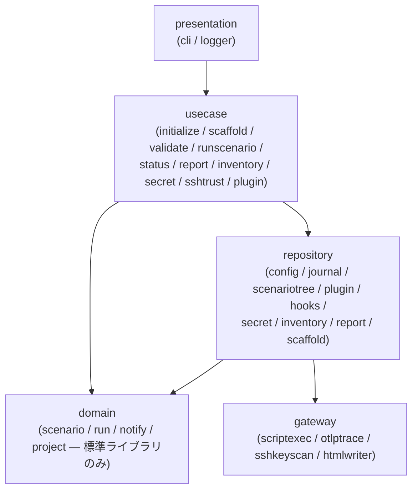

# stfw v1.0 As-Built ドキュメント（実装契約仕様書）

本書は stfw v1.0（Go 実装・ブランチ `feature/v1-go-rearch`）の **実装から起こした技術仕様書** です。
すべての記述は実コード・テスト・ゴールデンファイルを根拠とし、各節末尾に「根拠」としてファイルパスを記載します。

- 読者: stfw を利用するテスト担当者 / stfw を保守する開発者
- 位置付け: 実装契約（互換境界・スキーマ・規約）の正確な定義の集約。利用手順は [README.md](../README.md)、v0.2 からの移行は [docs/MIGRATION.md](MIGRATION.md) を参照

---

## 1. システム概要とアーキテクチャ

### 1.1 概要

stfw は業務日付をまたぐシナリオテストをディレクトリ規約で記述し、単一バイナリで自動実行する CLI である。

| 項目 | 内容 |
|---|---|
| 実装言語 | Go 1.26（`go.mod`: `go 1.26.4`） |
| 配布形態 | 単一バイナリ（実行エンジン内包・常駐サービスなし・外部データストアなし） |
| 主要依存 | cobra（CLI）, yaml.v3（設定）, filippo.io/age（暗号化）, OpenTelemetry SDK（OTLP）, smallstep/pkcs7（旧形式 secret 復号）, go-internal/testscript（受け入れテスト） |
| 静的資産 | プロジェクトテンプレート・同梱プラグイン・デフォルト設定・HTML テンプレートを `go:embed` でバイナリに同梱（`assets/assets.go`） |
| 永続化 | プロジェクトディレクトリ配下のファイルのみ（stfw.yml / journal.jsonl / age 暗号化ファイル / 静的 HTML） |
| 実行モデル | 逐次実行のみ（1 実行 = 1 プロセス）。エラー時は後続の兄弟ノードを実行せず停止 |

### 1.2 レイヤー構成（5 層モジュラモノリス）



| レイヤー | 実パッケージ | 責務 |
|---|---|---|
| presentation | `internal/presentation/cli`, `internal/presentation/logger` | cobra によるコマンド・フラグ定義、終了コードへの変換、slog + マスキング Writer のセットアップ |
| usecase | `internal/usecase/{initialize,scaffold,validate,runscenario,status,report,inventory,secret,sshtrust,plugin}` | ビジネスフロー制御。`runscenario` が実行オーケストレーション（ツリー走査 → スクリプト実行 → ジャーナル追記 → 投影）を担う |
| domain | `internal/domain/{scenario,run,notify,project}` | 依存ゼロの純粋ロジック（値オブジェクト・状態遷移・イベント定義）。他レイヤー・外部ライブラリに依存しない |
| repository | `internal/repository/*` | ファイルアクセス抽象（ドメインモデル ⇔ ファイル表現の変換） |
| gateway | `internal/gateway/*` | Driven 側 I/O（外部プロセス起動・OTLP 送信・ssh-keyscan・HTML 書き出し） |

レイヤー間はインターフェースを介さず直接依存する（IF なし・一方向依存のみ）。

### 1.3 domain の BC（境界づけられたコンテキスト）分割

| BC | パッケージ | 分類 | 内容 |
|---|---|---|---|
| scenario（シナリオ構造管理） | `internal/domain/scenario` | Core | ディレクトリ命名規約の値オブジェクト（Bizdate / Seq / Group / ScenarioName）、階層判定、走査規則を内包する ScenarioTree、規約違反 Violation |
| run（実行管理） | `internal/domain/run` | Core | RunID / NodeID 導出、ジャーナルイベント定義、状態遷移（NodeStatus / StepStatus）、Run 集約（Apply / Replay）、終了コード |
| notify（通知管理） | `internal/domain/notify` | Supporting | ジャーナルイベント → OTLP スパン記述への投影（Projector / Span）。OTel SDK には依存しない |
| project（プロジェクト環境管理） | `internal/domain/project` | Supporting | プロジェクト識別（stfw.yml）、init / keygen / secret 保存の可否判定、inventory のホスト選択、secret ファイル名導出 |

BC 間の共有は ID とジャーナルイベントのみである。notify・HTML レポートは run が発行するジャーナルイベントの投影であり、独自の状態を持たない。
この構成は `docs/arch/latest/arch-design.md` のレイヤー依存図・コンテキストマップと一致する（相違点は本書末尾ではなく保守者向け完了報告に列挙）。

> 根拠: `internal/` 配下パッケージ構成全体, `assets/assets.go`, `go.mod`, `docs/arch/latest/arch-design.md`（レイヤー依存図・BC 定義）

---

## 2. CLI リファレンス

### 2.1 共通仕様

| 項目 | 仕様 |
|---|---|
| バージョン | `stfw --version`。ビルド時に `-ldflags -X ...cli.Version=` で注入（未注入時 `1.0.0-dev`） |
| グローバルフラグ | `-l, --log-level <error\|warn\|info\|debug\|trace>`（未指定時は stfw.yml の `stfw.loglevel`、不明値は info） |
| ログ出力 | slog TextHandler を **stderr** へ出力（stdout はコマンド出力専用）。マスキング Writer（§9.4）を必ず経由する |
| プロジェクトディレクトリ解決 | ① 環境変数 `STFW_PROJ_DIR` → ② カレントから上位への `stfw.yml` 探索 → ③ カレントディレクトリ（未初期化とみなす） |

### 2.2 終了コード

| コード | 定数 | 発生条件 |
|---|---|---|
| 0 | ExitSuccess | 正常終了。validate の警告のみの場合も 0 |
| 3 | ExitWarn | `stfw plugin install` でインストール済みプラグインを再インストールした場合のみ（v0.2 互換） |
| 6 | ExitError | 上記以外の全エラー（validate のエラー違反・run の失敗・引数パースエラーを含む） |

この 0 / 3 / 6 の体系はプラグイン実行契約の終了コード（§4.6）と同一の定義（`run.ExitCode`）を共有する。

### 2.3 コマンド一覧

| コマンド | 引数・フラグ | 動作 |
|---|---|---|
| `stfw init [--skip-plugin-init]` | なし | 同梱テンプレートをプロジェクトディレクトリへ展開（sample シナリオ・フック雛形・inventory・stfw.yml・.gitignore）。`stfw.yml` が既に存在する場合はエラー（再初期化禁止）。展開後、解決可能な全プラグインの provisioning（`bin/install/install`）を自動実行する（`--skip-plugin-init` で抑止。個々の失敗は warn 継続、§4.8） |
| `stfw new scenario <name>` | name | `{proj}/scenario/{name}/` を作成し `metadata.yml` を生成（冪等）。`scenario/` ディレクトリと stfw.yml の存在が前提 |
| `stfw new bizdate <seq> <bizdate>` | seq, bizdate（YYYYMMDD） | カレントがシナリオディレクトリであることを要求。`_{seq}_{bizdate}/metadata.yml` を生成（冪等） |
| `stfw new process <seq> <group> <type>` | seq, group, type | カレントが業務日付ディレクトリであることを要求。プラグインを解決し `_{seq}_{group}_{type}/` を**削除して作り直し**、プラグイン `template/` を展開 + `metadata.yml` 生成 |
| `stfw validate [scenario...]` | 省略時は全シナリオ | ディレクトリ規約・プラグイン解決可否・`config/config.yml` 存在を静的検証。エラー違反があれば exit 6、警告のみは exit 0 |
| `stfw run [-d, --dry-run] <scenario...>` | 1 つ以上のシナリオ名 | 内蔵ランナーで実行（§4, §5）。実行前に validate 相当の静的検証を自動実行。dry-run は execute / post_execute をスキップ |
| `stfw status [run_id]` | 省略時は最新 run | ジャーナルをリプレイして階層ツリーとステータスを表示 |
| `stfw report [run_id] [-o, --out <dir>]` | 省略時は最新 run / `.stfw/reports` | ジャーナルから HTML レポート（index.html + runs/{run_id}.html）を再生成 |
| `stfw inventory list [group]` | 省略時は `all` | グループのホスト一覧を改行区切り出力（昇順・重複排除。未定義グループは空出力） |
| `stfw inventory exists <group>` | group | グループの存在を `true` / `false` で出力 |
| `stfw inventory arch <host>` | host | ホストに設定された arch を出力（未設定・未定義ホストは空行）。収集系プラグインが logfilter バイナリを arch 別に送り分けるために使う（§4.8） |
| `stfw secret keygen [-f, --force]` | | age (X25519) キーペア生成。既存キーは `--force` 必須。受信者公開鍵（`age1...`）を stdout 出力 |
| `stfw secret set [-f, --force] <host> <user> [password]` | password 省略時: 端末なら非エコー対話入力、パイプなら stdin 1 行 | age 暗号化して `config/passwd/{host}-{user}` へ保存。既存エントリは `--force` 必須 |
| `stfw secret show <host> <user>` | | 復号して stdout へ表示（意図的な表示のためマスキング登録しない） |
| `stfw secret migrate` | なし | v0.2 形式（openssl S/MIME）の secret を age へ一括変換（§9.2） |
| `stfw ssh trust <host\|group>` | inventory グループ名 or 単一ホスト | SSH サーバキーを `~/.ssh/known_hosts` へ登録（§9.6） |
| `stfw plugin list` | なし | プロセスプラグイン名一覧（プロジェクト + 同梱の和集合・`_` 始まり除外・昇順） |
| `stfw plugin install <type>` | type | プラグインの `bin/install/install` を実行。インストール済みは警告終了（exit 3） |
| `stfw plugin mysql-tsv-to-csv` | なし（stdin→stdout） | 隠しコマンド。`mysql --batch` 出力を RFC4180 CSV へ変換する組込み RDBMS プラグイン用ヘルパ（§4.9） |
| `stfw plugin redis-encode-row` | `--key/--type/--ttl`（stdin→stdout） | 隠しコマンド。redis 値を正規化し CSV 1 行へ変換する組込み Redis プラグイン用ヘルパ（§4.10） |
| `stfw plugin redis-decode` | なし（stdin→stdout） | 隠しコマンド。export CSV を redis-cli コマンド列へ変換する組込み Redis プラグイン用ヘルパ（§4.10） |

> 根拠: `internal/presentation/cli/*.go`（全コマンド定義）, `internal/domain/run/exitcode.go`, `internal/presentation/logger/logger.go`, `test/acceptance/testdata/script/{init,new,validate,status,report,inventory,secret,ssh_trust,plugin}.txtar`

---

## 3. ディレクトリ規約（互換境界 1）

### 3.1 階層構造

```
{proj}/                                  # stfw.yml の存在がプロジェクトルートの識別条件
└── scenario/                            # シナリオルート（固定名）
    └── {scenario_name}/                 # シナリオ（深さ 2）
        └── _{seq}_{bizdate}/            # 業務日付（深さ 3）
            └── _{seq}_{group}_{type}/   # プロセス（深さ 4）
                ├── config/config.yml    # プロセス設定（必須。validate がエラー検出）
                ├── metadata.yml
                └── scripts/             # scripts タイプのステップ配置先
```

階層判定は「プロジェクトルートからの相対深さ」で行う（scenario ルート = `scenario` そのもの、シナリオ = 深さ 2、業務日付 = 深さ 3、プロセス = 深さ 4）。

### 3.2 値オブジェクトの検証規則

| 要素 | 形式 | 検証規則（生成時に強制） |
|---|---|---|
| scenario_name | 任意文字列 | 空・`.`・`..`・パス区切り（`/` `\`）を禁止 |
| seq | 数字列 | 半角数字のみ（1 文字以上）。先頭ゼロは保持（内部表現は文字列） |
| bizdate | `YYYYMMDD` | 8 桁の半角数字 **かつ実在する日付**（`time.Parse("20060102")` が通ること）。v0.2 は桁数・数字のみの検査だったが v1.0 で実在日付検証を追加 |
| group | 任意文字列 | 空・`_`・パス区切りを禁止（`_` 区切りパースの保護） |
| process_type | 任意文字列 | 空・`_`・パス区切りを禁止 |

### 3.3 ディレクトリ名のパース規則

| 階層 | 形式 | パース |
|---|---|---|
| 業務日付 | `_{seq}_{bizdate}` | `_` で分割して 3 要素・先頭要素が空であること。seq / bizdate は上記の値オブジェクト検証を通す |
| プロセス | `_{seq}_{group}_{type}` | `_` で分割して 4 要素・先頭要素が空であること。seq / group / type を検証 |

v0.2 は `cut -d '_'` で切り出すのみだったが、v1.0 はパース後の値オブジェクト検証まで行う。

### 3.4 走査規則（実行対象と実行順）

- **`_` 始まりのディレクトリのみ** を実行対象とする（業務日付・プロセス階層に適用）
- 実行順は **ディレクトリ名の昇順**（Go の文字列比較 = バイト順）
- シナリオの実行順: `stfw run` で指定した順（重複除去）。指定なし（validate 等）は名前昇順
- scripts のステップ: `scripts/` **直下のファイルのみ**（サブディレクトリは対象外・symlink はファイル実体なら対象）を名前昇順

### 3.5 validate の検出項目

| レベル | 検出内容 |
|---|---|
| error（exit 6） | 業務日付・プロセスディレクトリ名の形式違反 / プロセスタイプのプラグイン未解決（`process-plugin: {type} is not installed`）/ `config/config.yml` 不存在 / **接続情報（`host` / `hosts` / `password` / `passwd`）の config 直書き**（§4.7） |
| warn（exit 0） | シナリオ配下に残存する `*.dig` ファイル（v1.0 では不要・削除推奨） / **プラグイン `plugin.yml` の `requires` に宣言された前提コマンドが PATH に存在しない**（§4.7） |

出力形式は 1 違反 1 行: `[{level}] {対象}: {メッセージ}`。`{対象}` はディレクトリ規約・接続情報違反ではプロジェクトルート相対パス、プラグイン依存（requires）違反ではプロセスタイプ名（ディレクトリに紐づかないため）。同じ検証が `stfw run` の開始前にも自動実行され、エラー違反があれば run は開始されない。実行前ゲートでは requires 欠落も **error 扱い**（validate は環境非依存でないため警告に留めるのと対）で、run は fail-fast する（ジャーナルを作成しない）。

> 根拠: `internal/domain/scenario/{bizdate,seq,group,name,dirname,hierarchy,tree,violation}.go`, `internal/repository/scenariotree.go`, `internal/usecase/validate/validate.go`, `internal/usecase/runscenario/runscenario.go`（run 前検証）, `test/acceptance/testdata/script/validate.txtar`

---

## 4. プラグイン実行契約（互換境界 2）

### 4.1 契約の骨子

- 入力: 環境変数（§4.5）。プロセスの `env` は `os.Environ()` に契約変数（キー昇順）を追記したもの
- 出力: リターンコード（0 = Success / 非 0 = Error。3 = Warn は体系上の予約だが、**ステップ・フェーズの成否判定は「0 か否か」**であり 3 も Error として扱われる）
- 実装言語: 任意（実行可能ファイルを直接 exec する。shebang 解釈は OS に委ねる）

### 4.2 プロセス 5 フェーズ

プロセス 1 件の実行は次の順で進む:

```
setup（階層フック） → pre_execute → execute → post_execute → teardown（階層フック）
```

| 規則 | 内容 |
|---|---|
| dry-run | `execute` / `post_execute` をスキップ（`pre_execute`・setup / teardown フック・ステップの計画列挙は行う） |
| setup 失敗 | プロセスを Error とし、**teardown も実行しない**（v0.2 互換） |
| フェーズ失敗 | 非 0 の時点で後続フェーズを実行せず Error |
| teardown 失敗 | プロセスの結果に影響しない（警告ログのみ） |
| teardown への追加 env | `stfw_run_status`（`Success` / `Error`）と `stfw_process_retcode`（`0` / `6`） |

プロジェクト独自プラグイン（type ≠ scripts）の場合:

- エントリポイント: `{plugin}/bin/run/{pre_execute,execute,post_execute}`（作業ディレクトリは **プロセスディレクトリ**）
- 実行前提: `{plugin}/bin/install/is_installed` を実行し **stdout が `true`**（exit 0）であること。満たさない場合はプロセス Error
- プラグイン解決順: `{proj}/plugins/process/{type}` → 同梱 `assets/plugins/process/{type}`（プロジェクト優先）
- 同梱プラグインは実行前に `.stfw/plugins/process/{type}/` へ展開（毎回削除して再展開。shebang `#!` 始まりのファイルには 0755 を付与）

### 4.3 組込み scripts タイプ（Go ネイティブ実行）

`scripts` タイプは同梱プラグイン解決時に外部スクリプトを呼ばず Go ネイティブで実行する（v0.2 scripts プラグインの移植）:

1. **計画列挙**: `scripts/` 直下のファイル名を昇順で列挙し `steps_enumerated` イベントで全件 Pending 登録（dry-run でも行う。0 件なら列挙イベントなし）
2. **setup フック** 実行（失敗時は teardown なしで Error）
3. **pre_execute 相当**: `scripts/` 直下の実行権限がないファイルへ `+0755` を付与
4. **execute**（dry-run 時スキップ）: ステップを昇順に逐次実行。作業ディレクトリは `scripts/`。exit 0 → `Success`、非 0 → `Error`（実行不能もエラー扱い・exit_code 6 で記録）。**エラー発生後の後続ステップは実行せず `Blocked` として記録**（Blocked 伝播）
5. **post_execute 相当**: 何もしない（v0.2 も exit 0 のみ）
6. **teardown フック** 実行（結果へ影響しない）

プロジェクトに `plugins/process/scripts/` を置いた場合はプロジェクト側が優先解決され、exec 契約（§4.2）で実行される（ネイティブ実行は同梱解決時のみ）。

### 4.4 階層フック

| 項目 | 仕様 |
|---|---|
| 配置 | `{proj}/plugins/{run\|scenario\|bizdate\|process}/_common/{setup\|teardown}/` 直下のファイル（昇順・symlink follow） |
| 実行タイミング | 各階層ノードの開始直後（setup）と終了直前（teardown）。process 階層は §4.2 / §4.3 の位置 |
| 作業ディレクトリ | フックスクリプトの配置ディレクトリ |
| setup 失敗 | 当該階層を Error とし子を実行しない |
| teardown | run / scenario / bizdate 階層では **エラー時も必ず実行**（v0.2 の `_error` ハンドラ相当）。`stfw_run_status` を注入。teardown 失敗は当該階層を Error にする（process 階層のみ結果に影響しない） |
| 未定義 | 正常（フックなしで続行） |

実行順の全体像（正常系ゴールデン）:

```
run setup → scenario setup → bizdate setup → process setup
  → (steps) → process teardown → bizdate teardown → scenario teardown → run teardown
```

### 4.5 公開環境変数の完全な一覧

env 契約ゴールデンテスト（`test/acceptance/testdata/script/run_env.txtar` の `env_golden.txt`）で固定されている全変数:

| 変数 | 値・意味 |
|---|---|
| `STFW_PROJ_DIR` | プロジェクトルートの絶対パス |
| `STFW_PROJ_DIR_CONFIG` | `{proj}/config` |
| `STFW_PROJ_DIR_DATA` | `{proj}/.stfw`（内部データディレクトリ） |
| `STFW_PROJ_DIR_PLUGIN` | `{proj}/plugins` |
| `STFW_VERSION` | stfw のバージョン文字列 |
| `run_id` | 実行 ID（`_{yyyymmddhhmmss}_{pid}`） |
| `run_mode` | `--run` / `--dry-run` |
| `stfw_scenario_dir` | シナリオディレクトリ絶対パス（scenario 階層以下で注入） |
| `stfw_scenario_name` | シナリオ名 |
| `stfw_bizdate_dir` | 業務日付ディレクトリ絶対パス（bizdate 階層以下で注入） |
| `stfw_bizdate_dirname` | 業務日付ディレクトリ名（`_{seq}_{bizdate}`） |
| `stfw_bizdate_seq` | 業務日付の連番 |
| `stfw_bizdate` | 業務日付（YYYYMMDD） |
| `stfw_bizdate_start_ts` | 業務日付ノードの node_start 時刻（RFC3339）。収集系プラグインが「この業務日付の実行開始以降のログ」を絞り込む基準に使う |
| `stfw_process_dir` | プロセスディレクトリ絶対パス（process 階層で注入） |
| `stfw_process_dirname` | プロセスディレクトリ名（`_{seq}_{group}_{type}`） |
| `stfw_process_seq` | プロセスの連番 |
| `stfw_process_group` | プロセスのグループ名 |
| `stfw_process_type` | プロセスタイプ（プラグイン名） |
| `stfw_plugin_cache_dir` | プラグインが provisioning した資産の永続キャッシュ（`.stfw/cache/plugins/{type}/`）。`.stfw/plugins/` と異なり実行をまたいで保持される（§4.8） |
| `stfw_*`（設定フラット化） | stfw.yml + プラグイン設定チェーンのフラット化結果（§8）。例: `stfw_loglevel`, `stfw_timezone`, `stfw_project_version`, `stfw_process_scripts_some_key` |

teardown フックのみに追加注入される変数:

| 変数 | 値・意味 |
|---|---|
| `stfw_run_status` | 当該階層の確定ステータス（`Success` / `Error`）。run / scenario / bizdate / process の teardown で注入 |
| `stfw_process_retcode` | process teardown のみ。`0`（Success）/ `6`（Error） |

各階層の env は親階層の env を複製して階層コンテキストを追記したものであり、上位階層のフック（例: run setup）には下位の `stfw_scenario_*` 等は存在しない。`STFW_HOME` は廃止（単一バイナリ化のため代替なし）。

### 4.6 終了コード体系（契約側）

| コード | 意味 | ランナーの扱い |
|---|---|---|
| 0 | SUCCESS | Success |
| 3 | WARN | **Error 扱い**（成否判定は 0 か否か。0 以外はすべて失敗として Blocked 伝播の起点になる） |
| 6 | ERROR | Error |

### 4.7 組込みプラグイン契約基盤（メタデータ・接続情報・エビデンス規約）

組込みプラグイン群（収集系・データストア系・compare・invoke。要求 REQ-012〜016）の共通基盤。

**プラグインメタデータ `plugin.yml`（ランタイム依存宣言）**

- 配置: `{plugin}/plugin.yml`（同梱・プロジェクトいずれも可）。任意ファイルで、無ければ依存宣言なし。
- スキーマ: `requires`（前提コマンドのリスト。例: `mysql`, `mysqldump`, `scp`, `k6`）。
- 検証: `stfw validate` と `stfw run` の実行前ゲートが、シナリオで使用するプロセスタイプの `requires` を `exec.LookPath`（`gateway.CommandExists`）で存在チェックする。validate は警告、run は error（fail-fast）。

**接続情報のグループ名参照（config 直書き禁止）**

- プロセス設定（`stfw.process.{type}` 配下）に接続情報（末尾セグメントが `host` / `hosts` / `password` / `passwd` のキー）を直書きすることを禁止。validate・run 双方で error。
- ホストは inventory グループ名（`host_group` / `targets[].group` 等、末尾が `group` のキーは許可）で参照し、パスワードは secret の `{host}-{user}` を参照する。解決はプラグインスクリプトが既存の `stfw inventory` / `stfw secret` サブコマンドを介して行う。

**エビデンスディレクトリ規約（互換境界 3）**

収集系・比較系プラグインの入出力ディレクトリ構造。ディレクトリ規約（§3）・プラグイン実行契約（§4）に次ぐ第 3 の互換境界。

| 種別 | パス | git |
|---|---|---|
| 収集出力ルート | `{process}/evidence/` | gitignore |
| collectFile / collectLog | `evidence/{host}/{収集元の絶対パスを再現}` | gitignore |
| exportMysql / exportPostgres | `evidence/{database}/{table}.csv` | gitignore |
| exportRedis | `evidence/{host}/{keyパターン名}.csv` | gitignore |
| invokeWeb / invokeRest | `evidence/summary.json`（k6 end-of-test サマリ） | gitignore |
| compare 期待値 | `{process}/expect/{収集系 process 名}/…`（evidence 配下と同型） | **git 管理** |
| compare 実測値 | `{process}/actual/…`（収集系 process の evidence 配下の各ファイルへの file-level symlink） | gitignore |
| compare 結果 | `{process}/result/` | gitignore |
| scpPut 配置元 | `{process}/target/{group}/…`（リモートへ配置するローカルツリー） | **git 管理** |
| sshExec / scpPut | エビデンス出力なし（sshExec の実行スクリプトは `{process}/scripts/` に git 管理で置く） | — |

`evidence/` / `actual/` / `result/` はプロジェクトテンプレートの `.gitignore` で除外する（`expect/` のみ git 管理）。パス構築・検証は `internal/domain/evidence`（絶対パス再現時のトラバーサルは常に `evidence/{host}/` 配下に収まる）が担う。

> 実装状況: 本節はプラグイン契約の**基盤**（P1）を記述する。収集系プラグイン本体（collectFile / collectLog）は §4.8（P2）、RDBMS 系（export / import / clear × MySQL / PostgreSQL）と secret 値の Masker 登録経路は §4.9（P3）、KVS 系（Redis）は §4.10（P4）、compare（Assert）は §4.11（P5）、invoke（Act: invokeWeb / invokeRest）は §4.12（P6）、リモートアクセス系（sshExec / scpPut。GitHub issue #3）は §4.13（P7）で実装済み。全組込みプラグインが実装完了。

> 根拠: `internal/usecase/runscenario/{runscenario,process,env}.go`, `internal/gateway/{scriptexec,lookpath}.go`, `internal/repository/{hooks,plugin,pluginmeta,evidence,config}.go`, `internal/domain/evidence/evidence.go`, `assets/plugins/process/scripts/`（同梱 scripts プラグイン）, `assets/template/.gitignore`, `test/acceptance/testdata/script/{run_env,run_success,run_error,run_dryrun,run_plugin,plugin_contract}.txtar`

### 4.8 組込み収集プラグイン（collectFile / collectLog）と接続情報・プロビジョニング

Collect フェーズの組込みプラグイン。エビデンスディレクトリ規約（§4.7）に従いテスト対象ホストからエビデンスを収集する。

**接続モデル（inventory + secret + ssh trust の統合）**

| 要素 | 解決元 | 備考 |
|---|---|---|
| ホスト | collect config `targets[].group` → `stfw inventory list {group}` | inventory グループ名参照（config 直書き禁止、§4.7） |
| ユーザー | collect config `targets[].user` | グループ内ホスト共通のログインユーザー |
| パスワード | `stfw secret show {host} {user}` | secret `{host}-{user}`（age 暗号化）。プラグインが `sshpass` で非対話認証 |
| arch | inventory の構造化ホストエントリ `arch` → `stfw inventory arch {host}` | collectLog が logfilter バイナリを arch 別に送り分けるために使う |
| ホストキー | `stfw ssh trust`（事前登録した `~/.ssh/known_hosts`） | ssh は `-o StrictHostKeyChecking=yes` |

inventory は後方互換で**文字列ホスト**と**構造化エントリ（`host` + `arch`）**の両形式を受理する（§8 の inventory 参照）。

**collectFile**（`assets/plugins/process/collectFile`、requires: `ssh` / `scp` / `sshpass`）

- config: `targets[]`（`group` / `user` / `paths`。`paths` は posix-extended 正規表現リスト）。
- 処理: 各 host で `ssh find -regex` により対象ファイルを列挙 → `sshpass scp` で `evidence/{host}/{収集元の絶対パスを再現}` へ収集。
- secret 欠落・scp 失敗は exit 6（それ以外の host は継続）。

**collectLog**（`assets/plugins/process/collectLog`、requires: `ssh` / `scp` / `sshpass`）

- config: `targets[]`（collectFile と同じ）+ `logfilter_version` / `logfilter_arches`（provisioning 対象の `{os}_{arch}` をスペース区切り）。
- provisioning（`bin/install/install`）: `logfilter`（scenario-test-framework/logfilter, GitHub Releases）を `logfilter_arches` 分ダウンロードし `stfw_plugin_cache_dir/logfilter/{os_arch}/logfilter` へ配置。`is_installed` はキャッシュ内の logfilter 存在で判定。
- 処理: host の arch 版 logfilter を `scp` で転送 → `ssh` で実行し「業務日付の実行開始日時以降」のログ行に絞り込み → `scp` で `evidence/{host}/{絶対パス}` へ収集 → 転送したバイナリを削除。フィルタ基準時刻は `stfw_bizdate_start_ts`（RFC3339）を logfilter の `-tf 'YYYY-MM-DD HH:MM:SS.000'` へ純 bash で変換（実行ホストの TZ 基準。**収集先ホストとの時刻同期が前提**）。

**プラグイン provisioning 機構（P2 で追加）**

- `stfw init` は展開後に解決可能な全プラグインの `bin/install/install` を自動実行する（`--skip-plugin-init` で抑止）。個々の失敗は warn 継続で、`stfw plugin install {type}` により個別再実行できる。
- provisioning 資産は**永続キャッシュ** `stfw_plugin_cache_dir`（`.stfw/cache/plugins/{type}/`）に置く。`.stfw/plugins/{type}/`（同梱プラグインの展開先）は run のたびにワイプされるため、ダウンロードしたバイナリはキャッシュ側に保持する。
- `install` / `is_installed` にはプラグイン設定（config.yml + プロジェクト上書き。プロセス非依存の `PluginConfigEnv`）も公開され、`logfilter_version` / `logfilter_arches` 等を参照できる。

> 根拠: `assets/plugins/process/{collectFile,collectLog}/`, `internal/repository/{inventory,plugin}.go`（inventory arch / `PluginCacheDir` / `PluginConfigEnv`）, `internal/usecase/plugin/plugin.go`（`InitAll` / `provisionEnv`）, `internal/usecase/inventory/inventory.go`（`Arch`）, `internal/presentation/cli/{init,inventory}.go`, `test/acceptance/testdata/script/{collect_file,collect_log,plugin_init}.txtar`

### 4.9 組込み RDBMS プラグイン（export / import / clear × MySQL / PostgreSQL）と secret マスキング

Arrange（clear / import）と Collect（export）の組込みプラグイン。DB クライアント（`mysql` / `psql`）で TCP 直結し、接続情報は §4.7 の禁止契約に従い inventory / secret から解決する（config 直書き禁止）。SSH は使わない。

**接続モデル**

| 要素 | 解決元 | 備考 |
|---|---|---|
| ホスト | config `host_group` → `stfw inventory list {host_group}` の**先頭ホスト** | RDBMS は単一 DB サーバ対象。複数解決時は先頭を使い stderr へ警告 |
| ポート | config `port`（MySQL 既定 3306 / PostgreSQL 既定 5432） | |
| データベース | config `database` | |
| ユーザー | config `user` | |
| パスワード | `stfw secret show {host} {user}` | `MYSQL_PWD` / `PGPASSWORD` 環境変数でクライアントへ渡す（コマンドライン非露出） |
| テーブル | config `tables[]` | 各テーブルを添字ループで処理 |

**プラグイン一覧**（`assets/plugins/process/{export,import,clear}{Mysql,Postgres}`、requires: MySQL=`mysql` / PostgreSQL=`psql`）

| タイプ | 処理 | 入出力 |
|---|---|---|
| exportMysql | `mysql --batch` で `SELECT * FROM t` → `stfw plugin mysql-tsv-to-csv` で RFC4180 CSV 変換 | `evidence/{database}/{table}.csv` |
| exportPostgres | `psql COPY (SELECT * FROM t) TO STDOUT WITH (FORMAT csv, HEADER, NULL '\N')` をシェルリダイレクトで受ける（ネイティブ RFC4180） | `evidence/{database}/{table}.csv` |
| importMysql | `LOAD DATA LOCAL INFILE ... FIELDS TERMINATED BY ',' OPTIONALLY ENCLOSED BY '"' IGNORE 1 LINES` | 入力 `{process}/data/{database}/{table}.csv` |
| importPostgres | `psql COPY t FROM STDIN WITH (FORMAT csv, HEADER, NULL '\N')` をシェルリダイレクトで与える | 入力 `{process}/data/{database}/{table}.csv` |
| clearMysql | `TRUNCATE TABLE t` | — |
| clearPostgres | `TRUNCATE TABLE t`（`ON_ERROR_STOP=1`） | — |

- CSV は 1 行目ヘッダー・NULL は `\N`（空文字と区別、mysqldump 慣行）。export / import は下記制約の範囲でラウンドトリップ可能。
- 入力 CSV（import）は `{process}/data/{database}/{table}.csv`（テスト作者が用意・git 管理）。ソース不在・DB クライアント非 0 は exit 6。
- **MySQL import の制約**: `LOAD DATA LOCAL INFILE` は既定で `ESCAPED BY '\\'` のため、`\N`→NULL は正しく解釈される一方、RFC4180 CSV（バックスラッシュを特別扱いしない）中の**リテラルのバックスラッシュを含む値**は MySQL のエスケープ解釈で変化し得る。厳密なラウンドトリップはバックスラッシュを含まないデータで保証される（PostgreSQL の `\copy` はこの制約を受けない）。RFC4180 と LOAD DATA の本質的な非整合。
- テーブルループは添字を**読み取り直後にインクリメント**し、`continue` でも無限ループしない（P2 の教訓）。
- SQL 組み立て時、テーブル名は識別子クオート（MySQL=バッククオート / PostgreSQL=ダブルクオート）内でクオート文字を二重化してエスケープする。ファイルパスについては、PostgreSQL は `COPY ... TO STDOUT / FROM STDIN` をシェルリダイレクトで扱いパスを SQL に載せない（psql メタコマンド `\copy` のバックスラッシュ解釈を回避）。MySQL import は LOAD DATA のパスを SQL 文字列リテラルとしてバックスラッシュ（MySQL のエスケープ文字）→シングルクオートの順に二重化する（`'`・`\` を含むシナリオ名・テーブル名でも壊れない）。
- プラグイン stdout/stderr は行バッファ方式の Masker を通すため、`gateway.RunScript` が各スクリプト完了時に Flush し、未改行の出力が後続ログより遅れて出力順が崩れないようにする。出力順序の保証は**各ストリーム内（stdout 内・stderr 内それぞれ）**まで。stdout と stderr の相対順序は、別ストリーム・別コピー goroutine のため（バッファの有無に関わらず）保証しない。

**MySQL CSV 変換ヘルパ（`stfw plugin mysql-tsv-to-csv`、隠しコマンド）**

- `mysql --batch` のタブ区切り出力（エスケープ `\n` `\t` `\0` `\\`、SQL NULL は文字列 `NULL`、行区切り LF）を stdin で受け、Go の `encoding/csv` で RFC4180 CSV へ変換して stdout へ出力する。
- NULL 判定: データ行のフィールドが完全一致 `NULL` なら `\N` を出力。ヘッダー行は NULL 判定せず un-escape のみ。
- 既知の制約（mysql クライアント出力の本質的な非可逆性。`client/mysql.cc` の `safe_put_field` で確認）: SQL NULL と文字列 `"NULL"` は `--batch` 出力上区別できず、両者を NULL（`\N`）として扱う。PostgreSQL は `\copy` がネイティブに区別するためこの制約はない。

**secret 値の Masker 登録経路（P1 で先送りした事項）**

- `stfw run` は実行前に `secret.RegisterAll` で config/passwd 配下の全シークレットを復号し Masker へ登録する（プラグインは別プロセスのため、`stfw secret show` で得たパスワードを実行側で事前登録する）。
- プラグインの stdout / stderr は Masker 経由（`Masker.Wrap`。ロガー stderr と同一のシークレットレジストリを共有）でルーティングし、登録済みシークレットを `[secret]` へ置換する。個別シークレットの復号失敗（未移行の v0.2 形式等）は実行を止めずスキップする。

> 根拠: `assets/plugins/process/{export,import,clear}{Mysql,Postgres}/`, `internal/repository/mysqlcsv.go`（`MySQLBatchTSVToCSV`）, `internal/presentation/logger/masker.go`（`secretRegistry` / `Wrap`）, `internal/usecase/secret/secret.go`（`RegisterAll`）, `internal/presentation/cli/{run,plugin}.go`, `test/acceptance/testdata/script/{rdbms_mysql,rdbms_postgres}.txtar`

### 4.10 組込み KVS プラグイン（Redis: export / import / clear）

KVS 系の Arrange / Collect プラグイン。`redis-cli` で TCP 直結し、接続情報は §4.7 の禁止契約に従い inventory / secret から解決する（config 直書き禁止）。RDBMS 系（§4.9）と同じ接続モデル（host_group→先頭ホスト、パスワードは secret `{host}-{user}`）。パスワードは `REDISCLI_AUTH` 環境変数で渡し、ACL ユーザーは `--user`、DB 番号は `-n`。

**プラグイン一覧**（`assets/plugins/process/{export,import,clear}Redis`、requires: `redis-cli`）

| タイプ | 処理 | 入出力 |
|---|---|---|
| exportRedis | `key_patterns[].match` ごとに `--scan` でキー列挙 → 各キーの type/ttl/値（`redis-cli -2 --json`）を `stfw plugin redis-encode-row` で正規化 + CSV 化 | `evidence/{host}/{name}.csv` |
| importRedis | `{process}/data/{host}/{name}.csv` を `stfw plugin redis-decode` で redis-cli コマンド列へ変換し redis-cli 標準入力へ投入（各キーは DEL 後に再作成、ttl>0 は EXPIRE） | 入力 `{process}/data/{host}/{name}.csv` |
| clearRedis | `key_patterns[].match` ごとに `--scan` で列挙したキーを DEL | — |

**CSV 形式（`key,type,ttl,value`）と正規化**

- 1 行目ヘッダー。`value` は type=string は生値、list/set/hash/zset は正規化 JSON（compare 安定性のため）。
  - list: 順序保持の JSON 配列。set: 要素ソート済み配列。hash: field 昇順の JSON オブジェクト。zset: member 昇順の `[[member,score],...]`。
- export/import はラウンドトリップ可能（import は type に応じて SET/RPUSH/SADD/HSET/ZADD を発行）。
- 値の取得は `redis-cli -2 --json`（RESP2 のフラット配列 + JSON エスケープ）。正規化・CSV 化・逆変換は Go の `encoding/json` / `encoding/csv`（隠しコマンド `stfw plugin redis-encode-row` / `redis-decode`。後者は redis-cli のダブルクオート `\xNN` 形式でバイナリ安全にコマンド生成）。
- **既知の制約**: 対象は UTF-8 テキスト値（バイナリ値は対象外）。`--scan` 出力は改行区切りのため、改行を含むキーは非対応。

**エビデンス完全性（exportRedis「成功時のみ再配置」）**

- 各キーパターンは一時ファイル（`{name}.csv.tmp.$$`）へ書き出し、全キーの type/ttl/値取得が成功した場合のみ `mv` で出力先へ再配置する。
- パターン処理の開始時に既存の出力先を削除し、per-key 失敗・SCAN 失敗・ヘッダ書き込み失敗・公開（`mv`）失敗・クラッシュのいずれでも、前回 run で成功した古いエビデンスが残らないようにする（失敗時に成果物を公開しない・再実行時に残留しない）。上記のいずれの失敗もリターンコード 6 に反映する。

> 根拠: `assets/plugins/process/{export,import,clear}Redis/`, `internal/repository/rediscsv.go`（`RedisEncodeRow` / `RedisDecode` / `redisQuote`）, `internal/presentation/cli/plugin.go`（`redis-encode-row` / `redis-decode`）, `test/acceptance/testdata/script/rdbms_redis.txtar`

### 4.11 組込み compare プラグイン（Assert・外部 OSS compare-files）

Assert フェーズの組込みプラグイン。期待値（`expect/`）と収集エビデンス（`actual/`）を外部 OSS [`scenario-test-framework/compare-files`](https://github.com/scenario-test-framework/compare-files)（Go 単一バイナリ `compare_files`）で突合し、不一致は該当ステップの Error として既存のエラー時停止・Blocked 伝播に載せる（SPEC-014-02）。

**プロビジョニング（`assets/plugins/process/compare`）**

- compare-files はローカルで `expect`/`actual` を比較するため、`install` は**実行ホストの os_arch 版 1 種のみ**を取得する（収集系プラグインのような arch 送り分けはしない）。os_arch は `uname -s`/`uname -m` から解決する。
- リリース資産名は `compare-files_{version無しv}_{os}_{arch}.tar.gz`（GitHub Releases）。既定バージョンは `v2.2.0`、ダウンロード元は `stfw_compare_files_download_base` で差し替え可能。バイナリは永続キャッシュ `${stfw_plugin_cache_dir}/compare-files/{os_arch}/compare_files` に配置する。`is_installed` が同キャッシュの存在で実行前ゲートする。
- プロビジョニングモデルは collectLog（logfilter §4.8）と同一の「初回 install 優先」。キャッシュ済みなら再ダウンロードしない。**`compare_files_version` を変更したときは `${stfw_plugin_cache_dir}/compare-files/` を削除してから再 install する**（キャッシュパスに版を含めず、両プラグインで同じ運用にそろえている）。

**ディレクトリ規約（エビデンスディレクトリ規約 §4.7）**

| ディレクトリ | 内容 | git |
|---|---|---|
| `expect/` | 直下に「同一 bizdate 内の収集系 process ディレクトリ名」を置き、その配下は当該 process の `evidence/` 配下と同型 | **git 管理** |
| `actual/` | `expect` と同じ構造。実体は各収集系 process の `evidence/` 配下の各ファイルへの **file-level symlink** | gitignore（自動生成） |
| `result/` | compare-files の比較結果（`CompareSummary.csv` 等）の出力先 | gitignore |

**処理**（`bin/run/execute`、作業ディレクトリ = プロセスディレクトリ）

1. `expect/` 直下の各エントリ名（収集系 process 名）について `${stfw_bizdate_dir}/{name}/evidence` を解決する。ディレクトリが無ければ Error（exit 6）。
2. `actual/` を作り直し、evidence 配下を **file-level symlink** でツリー再現する。
3. `compare_files -od result expect actual` を実行する。起動設定（`compare_files.json`）・比較レイアウト（`compare_layout/`）はプロセスディレクトリの `config/` から自動探索される（無ければバイナリ同梱デフォルト）。

**終了コードの対応付け**

- compare-files: `0=一致（OK/Ignore）` / `3=差分（NG/LeftOnly/RightOnly）` / `6=エラー`。
- 本プラグインは「比較不一致はステップ失敗」（SPEC-014-02）に従い、**非 0 を一律 exit 6**（Error）とする。stfw ランナーは exit≠0 を NodeError として扱い、後続ステップを Blocked にする。

**file-level symlink の理由**

- compare-files のディレクトリ比較は `filepath.WalkDir` を使い**ディレクトリへの symlink を辿らない**（symlink はファイル扱いになり配下が列挙されない）。そのため `actual/` は evidence ツリーを実ディレクトリで再現し、各**ファイル**を evidence 実体への symlink とする（ファイル比較時の `os.Open` は symlink を辿るため比較は成立する）。
- **既知の制約**: evidence 配下のファイル名に改行を含むケースは非対応（`find` の行区切り前提）。

> 根拠: `assets/plugins/process/compare/`, `test/acceptance/testdata/script/compare.txtar`, compare-files `internal/bulk/dir.go`（`relPathList`/`Counts.ProcessStatus`）・`internal/status/status.go`（`ExitCode`）

### 4.12 組込み invoke プラグイン（Act・外部 OSS grafana k6）

Act フェーズの組込みプラグイン。テスト対象への取引入力と検証を [grafana k6](https://github.com/grafana/k6)（Go 単一バイナリ `k6`）で実行する。**invokeRest**（API への取引入力・レスポンス検証）と **invokeWeb**（k6 ブラウザモードでの画面操作・検証）の 2 種（SPEC-015-01/02）。

**プロビジョニング（`assets/plugins/process/{invokeRest,invokeWeb}`）**

- k6 はローカルでテストを実行するため、`install` は**実行ホストの os_arch 版 1 種のみ**を取得する。os_arch は `uname -s`/`uname -m` から解決する。
- リリース資産名は `k6-{version}-{os}-{arch}.{tar.gz|zip}`（GitHub Releases）。**os 命名は k6 独自で `linux`/`macos`、arch は `amd64`/`arm64`。linux は `tar.gz`・macos は `zip`** のため展開ツールを OS で分岐する（tar / unzip）。既定バージョンは `v2.1.0`、ダウンロード元は `stfw_k6_download_base` で差し替え可能。バイナリは永続キャッシュ `${stfw_plugin_cache_dir}/k6/{os_arch}/k6` に配置する（collectLog と同一の「初回 install 優先」。版変更時はキャッシュ削除）。`is_installed` が同キャッシュの存在で実行前ゲートする。
- invokeWeb のブラウザモードは実行時に Chromium を必要とする（stfw:full イメージに同梱。§4.12 の install は k6 バイナリのみを配置し Chromium 導入はイメージの責務）。

**設定**（config.yml の `stfw.process.{invokeRest|invokeWeb}`）

| キー | 説明 |
|---|---|
| `script` | k6 テストスクリプトのパス（プロセスディレクトリ基準。既定 `script.js`） |
| `host_group` | （任意）inventory グループ名。先頭ホストを `-e stfw_target_host` で `__ENV` へ注入 |
| `user` | （任意）secret `{host}-{user}` のパスワードを解決 |
| `env` | （任意）k6 へ渡す `"KEY=VALUE"` のリスト（`-e` で注入） |

**処理**（`bin/run/execute`、作業ディレクトリ = プロセスディレクトリ）

1. キャッシュした k6 バイナリを解決する（未配備なら exit 6）。`script` が無ければ exit 6。
2. `host_group` があれば `stfw inventory list` で先頭ホストを解決し `-e stfw_target_host=<host>` を付与（複数解決時は先頭 + 警告）。`user` があれば secret のパスワードを解決する。
3. **パスワードは argv に載せず環境変数 `stfw_target_password` として export する**（k6 は `--include-system-env-vars` 既定 true で `__ENV` へ取り込む）。Masker が secret を出力からマスクする。
4. `k6 run --summary-export evidence/summary.json [-e ...] <script>` を実行する。invokeWeb は `K6_BROWSER_HEADLESS=true` を既定で export する。
5. end-of-test サマリを `${stfw_process_dir}/evidence/summary.json` へ出力する。

**終了コードの対応付け**

- k6: `0=成功` / `99=閾値失敗（検証 NG）` / `100+=各種エラー` / `105=外部中断`（`errext/exitcodes/codes.go`）。
- 本プラグインは「Act の失敗はステップ失敗」に従い、**非 0 を一律 exit 6**（Error）とする。stfw ランナーは exit≠0 を NodeError として扱い、後続ステップを Blocked にする。

> 根拠: `assets/plugins/process/{invokeRest,invokeWeb}/`, `test/acceptance/testdata/script/invoke.txtar`, k6 `errext/exitcodes/codes.go`（終了コード）・`internal/cmd/runtime_options.go`（`-e/--env`・`--summary-export`・`--include-system-env-vars`）

### 4.13 組込みリモートアクセスプラグイン（sshExec / scpPut）

リモート操作の組込みプラグイン（GitHub issue #3・要求 REQ-018）。収集系（collectFile / collectLog）が担うエビデンス収集の逆方向として、**sshExec**（Act: リモートスクリプト一括実行）と **scpPut**（Arrange: ローカルファイルの配置）を提供する（SPEC-018-01/02）。scp get は収集系が担うためスコープ外。

**接続基盤（収集系と共通・§4.8）**

- 接続先ホストは inventory グループで指定、ログインユーザは config で指定（ホスト + ユーザのグルーピング）。
- パスワードは secret `{host}-{user}` から `stfw secret show` で解決し、config.yml への直書きは禁止（`host`/`hosts`/`password` キーは不可、`host_group`/`group` は可）。
- SSH ホストキーは `stfw ssh trust`（known_hosts）を利用。`ssh_opts=(-o StrictHostKeyChecking=yes -o ConnectTimeout=10)`。
- **パスワードは argv 露出を避けるため `SSHPASS` 環境変数 + `sshpass -e` で渡す**（P6 invoke で確立した方針。既存 collectLog の `sshpass -p` argv 方式からの改善で、collectLog の移行は本スコープ外）。Masker が secret を出力からマスクする。
- 追加バイナリのプロビジョニングは無い（`ssh`/`scp`/`sshpass` はシステムコマンド）。`plugin.yml` の `requires` で実行前 PATH ゲート、`is_installed` は前提コマンド存在のみ確認。

**sshExec**（`assets/plugins/process/sshExec`、requires: `ssh` / `sshpass`）

- 設定: `host_group`（必須）、`user`（必須）。
- 処理: 自プロセスの `scripts/` 配下の各ファイルを**ファイル名昇順**に、解決した各ホストへ `ssh ... 'bash -s' < script`（stdin パイプ送信）で一括実行する。
- **fail-fast**: スクリプトが 1 つでも失敗したら即時 exit 6 で終了し、以降のスクリプト・ホストは実行しない（SPEC-018-01）。

**scpPut**（`assets/plugins/process/scpPut`、requires: `ssh` / `scp` / `sshpass`）

- 設定: `targets[]`（`group` / `user` / `dest`）。`dest` はリモートシェルへ渡すため**安全文字 `^[A-Za-z0-9._/-]+$` のみ許可**（シェルメタ文字はコマンド破綻・注入防止のため exit 6 で拒否）。
- 処理: ローカル `${stfw_process_dir}/target/{group}/` 配下（隠しファイル・空ディレクトリ含む）を各ホストへ配置する。
  1. `dest` の**隣接一時ディレクトリ**（`${dest}.stfw_scpput_$$_{idx}`、dest と同一 FS）へ `scp -r target/{group}/. tmp/` で put。
  2. tmp を dest へ**ディレクトリ丸ごと rename（atomic swap）**で入れ替える。既存 dest は old へ退避 → tmp を dest へ rename → old 削除。
  3. 最終 rename 失敗時は old を dest へ戻して**配置前の完全状態へロールバック**。ロールバックの mv も失敗する二重障害時は旧配置を old に保全し退避先を stderr へ通知する（旧データは失われない）。
- 原子性: dest は「配置前」か「配置後」の完全な状態でのみ観測され、転送途中の不完全ファイルや混在状態は現れない（SPEC-018-02 の「一時ディレクトリへ put 後 mv して原子的に配置」）。
- **全置換セマンティクス**: 空ディレクトリを含む source のツリー全体をそのまま反映するため、dest は source 内容で全置換される（source に無い既存 dest 内容は残らない）。dest には専用の配置先ディレクトリを指定する。

**終了コードの対応付け**

- sshExec / scpPut ともエラーは一律 exit 6（Error）。stfw ランナーは exit≠0 を NodeError として扱い後続ステップを Blocked にする。

> 根拠: `assets/plugins/process/{sshExec,scpPut}/`, `test/acceptance/testdata/script/{ssh_exec,scp_put}.txtar`, `internal/repository/plugin.go`（shebang 付きスクリプトの 0755 展開）

---

## 5. 実行ジャーナル

### 5.1 配置とファイル形式

| 項目 | 仕様 |
|---|---|
| パス | `.stfw/runs/{run_id}/journal.jsonl` |
| 形式 | 追記専用 JSONL（1 イベント = 1 行）。イベントごとに `fsync`（実行中でもリプレイ可能） |
| 作成 | run ディレクトリを `os.Mkdir`、ファイルを `O_CREATE\|O_EXCL`（0644）で新規作成。既存 run_id と衝突した場合は採番時刻を +1 秒ずつずらして最大 10 回まで再採番 |
| 不変性 | イベントの訂正・削除は行わない。再実行は常に新しい run_id の別実行 |

### 5.2 run_id / NodeID の導出規則

| ID | 規則 |
|---|---|
| run_id | `_{yyyymmddhhmmss}_{pid}`（採番時刻 + プロセス ID）。パターン `^_\d{14}_\d+$`。v0.2 の `run_spec.uniq_id` と互換 |
| NodeID | run_id にツリーのパスセグメントを `+` で連結: `{run_id}+run[+{scenario}[+{bizdate_dirname}[+{process_dirname}]]]`。深さは run=1 / scenario=2 / bizdate=3 / process=4 セグメント（run_id を除く）。セグメントに `+` `^` `/` `\` と空文字は使用不可 |
| parent_id | NodeID の最後の `+` 以降を除いた文字列。run 階層の親は run_id 自身 |

v0.2 の webhook_id 導出規則と同一（余分な `}` を付与していた v0.2 のバグは修正済み。digdag 廃止により `^sub` セグメントは含まれない）。

### 5.3 イベントスキーマ

イベント共通フィールド:

| フィールド | 型 | 意味 |
|---|---|---|
| `event` | string | イベント種別（下表の 4 種） |
| `ts` | string | イベント時刻。ISO 8601 / 実行ホストのローカルタイムゾーン（`2006-01-02T15:04:05Z07:00`） |
| `node_id` | string | 対象ノードの NodeID |

種別ごとのフィールド（`omitempty` のため無関係のフィールドは行に現れない）:

| event | 追加フィールド | 内容 |
|---|---|---|
| `node_start` | `parent_id`, `node_type`（`run\|scenario\|bizdate\|process`）, `attrs` | 階層の実行開始（Started）。attrs は階層別: run = `run_id` / `run_mode`（`--run` / `--dry-run`）/ `params`（指定シナリオ名の空白連結）、scenario = `name`、bizdate = `dirname` / `seq` / `bizdate`、process = `dirname` / `seq` / `group` / `process_type` |
| `steps_enumerated` | `steps`（string 配列・実行順） | scripts プロセスのステップ全件を Pending 登録。Started な process ノードに 1 度だけ記録できる。空リスト・重複ステップ名は不正 |
| `step_end`（Success / Error） | `step`, `status`, `exit_code`（int）, `start_ts`, `end_ts` | ステップの実行終了。start_ts / end_ts は実実行時間 |
| `step_end`（Blocked） | `step`, `status`（=`Blocked`） | 先行エラーによる未実行。exit_code / start_ts / end_ts を持たない |
| `node_end` | `status`（`Success` / `Error`） | 階層の実行終了 |

### 5.4 状態遷移

| 状態機械 | 遷移 |
|---|---|
| NodeStatus（階層: run / scenario / bizdate / process） | `Started → Success \| Error` のみ。終了状態からの再遷移は不正 |
| StepStatus（scripts のステップ） | `Pending → Success \| Error \| Blocked` のみ |

### 5.5 リプレイ時の再検証

`stfw status` / `stfw report` / 実行中の投影は、すべて同一の `Run.Apply` を通してイベントを適用する。生成（実行）経路とリプレイ（復元）経路が同じ検証を共有するため、外部から編集された不正なジャーナルはリプレイ時に検出されエラーになる（`journal replay: journal line {n}: ...`）。検証内容:

- NodeID の形式・run 所属・種別と深さの対応
- node_start: 未開始ノードであること / parent_id が導出値と一致 / 親ノードが Started であること（run を除く）
- steps_enumerated: Started な process ノードに 1 度だけ
- step_end: 列挙済みステップの Pending からの正当な遷移
- node_end: Started からの正当な遷移

`ListRunIDs` は `.stfw/runs/` 直下の run_id 形式のディレクトリを昇順で返し、最新 run は昇順の末尾（= 採番時刻が最も新しいもの）。

> 根拠: `internal/domain/run/{event,run,steps,status,runid,nodeid}.go`, `internal/repository/journal.go`, `internal/usecase/status/status.go`, `test/acceptance/testdata/script/{run_success,run_error,run_dryrun}.txtar` の `journal_golden.jsonl`

---

## 6. OTLP トレースエクスポート

### 6.1 エクスポート設定の解決順

| 優先 | 設定 | 挙動 |
|---|---|---|
| 1 | 環境変数 `OTEL_EXPORTER_OTLP_ENDPOINT` または `OTEL_EXPORTER_OTLP_TRACES_ENDPOINT` | OTel SDK（otlptracehttp）の標準解決に委ねる（stfw はオプションを指定しない） |
| 2 | stfw.yml の `stfw.otel.endpoint` | `WithEndpointURL` として使用。パス無し URL は `/v1/traces` が補完される |
| 3 | どちらも未設定 | **TracerProvider を組み立てず一切送信しない** |

プロトコルは OTLP/HTTP（`application/x-protobuf`）。リソース属性は `service.name=stfw`, `service.version={バージョン}`。

### 6.2 スパンマッピング

1 run = 1 トレース。ルート（run）の `node_end` でスパンツリー全体を確定し、開始順（親が先）でエクスポートする。step スパンは親 process スパンの直後に並ぶ。スパンの開始・終了時刻はジャーナルイベントの時刻と一致する。

| 階層 | スパン名 | スパン属性 | スパンステータス |
|---|---|---|---|
| run | `stfw run` | `stfw.run_id`, `stfw.node.type`=`run`, `stfw.node.id`, `stfw.run.mode`（`run` / `dry-run` — `--` 接頭辞を除去して正規化） | Success → Ok / Error → Error |
| scenario | シナリオ名 | `stfw.run_id`, `stfw.node.type`=`scenario`, `stfw.node.id` | 同上 |
| bizdate | ディレクトリ名 | `stfw.run_id`, `stfw.node.type`=`bizdate`, `stfw.node.id`, `stfw.bizdate`, `stfw.seq` | 同上 |
| process | ディレクトリ名 | `stfw.run_id`, `stfw.node.type`=`process`, `stfw.node.id`, `stfw.seq`, `stfw.group`, `stfw.process.type` | 同上 |
| step（Success / Error） | スクリプト名 | `stfw.run_id`, `stfw.node.type`=`step`, `stfw.node.id`（`{process_node_id}+{step名}`）, `stfw.step.status`, `stfw.step.exit_code`（int64） | Success → Ok / Error → Error（メッセージ: `step {名} failed with exit_code {n}`） |
| step（Blocked） | スクリプト名 | 同上（`stfw.step.status`=`Blocked`。exit_code なし） | **Unset**（未実行のため。開始 = 終了 = イベント時刻の点として記録） |

Error スパンのステータスメッセージ（階層）: `{node_type} {name} finished with status Error`。
未終了（node_end 未記録）のノードはスパンにしない。Pending の列挙（steps_enumerated）はスパンにしない。

### 6.3 失敗時の扱い

- 投影・送信の失敗は **警告ログのみで実行結果へ影響しない**（exporter のセットアップ失敗時は無効化して続行）
- run 終了時に `ForceFlush` + `Shutdown` を **10 秒タイムアウト** で待つ（送信先が到達不能でもそれ以上待たない）。エラー時（run 失敗時）も flush する

> 根拠: `internal/usecase/runscenario/otel.go`, `internal/domain/notify/{projector,span}.go`, `internal/gateway/otlptrace.go`, `internal/usecase/runscenario/otel_test.go`, `internal/domain/notify/projector_test.go`, `test/acceptance/testdata/script/run_otel.txtar`

---

## 7. HTML レポート

### 7.1 生成タイミングと出力構成

| 項目 | 仕様 |
|---|---|
| 実行中の増分生成 | run の `node_start` / process の `node_end` / run の `node_end` のたびに再生成（reporter がジャーナルイベントに連動）。生成失敗は警告ログのみで実行に影響しない |
| オンデマンド生成 | `stfw report [run_id] [--out dir]`（ジャーナルからの投影を再実行） |
| 出力先 | 既定 `.stfw/reports/`（`--out` で任意ディレクトリ） |
| 出力ファイル | `index.html`（run 一覧・新しい run が先頭 = run_id 降順）+ `runs/{run_id}.html`(run 詳細: サマリ + 階層ツリー表 + ステップ行) |

### 7.2 表示仕様

- run 詳細: status / mode / params / start / end / processing time（`HH:MM:SS`。24 時間超は時をそのまま加算）+ ノード表（インデント = 12 + 深さ×24 px）。未実行ステップ（Pending / Blocked）は時刻欄が空
- run 一覧: ジャーナルを読めない・run 階層イベントの無い run は `Unknown` として表示
- 実行中判定: run 階層の `node_end` 未記録なら `Started`（InProgress）

### 7.3 meta refresh・自己完結・原子的書き込み

| 項目 | 仕様 |
|---|---|
| meta refresh | 実行中の run 詳細ページ、および実行中 run を含む index に `<meta http-equiv="refresh" content="5">` を挿入。終了後の再生成で外れる |
| 自己完結 | inline CSS のみの静的 HTML（外部リソース・JS なし）。テンプレートはバイナリ同梱（`assets/report/*.tmpl`） |
| 原子的書き込み | 同一ディレクトリに一時ファイルを書いてから `rename` で置き換え（nginx 等の同時配信中でも壊れたページを見せない） |
| パーミッション | 公開前に **0644 へ chmod**（別ユーザーの配信プロセスが読めるようにする） |

> 根拠: `internal/usecase/runscenario/reporter.go`, `internal/repository/report.go`, `internal/gateway/htmlwriter.go`, `assets/report/{index,run}.html.tmpl`, `internal/domain/run/duration.go`, `test/acceptance/testdata/script/report.txtar`

---

## 8. 設定（stfw.yml）

### 8.1 上書きチェーン

| 対象 | 順序（後勝ち） |
|---|---|
| プロジェクト設定 | 同梱デフォルト（`assets/config/stfw.yml`）→ プロジェクト `{proj}/stfw.yml`（無ければデフォルトのみで動作） |
| プラグイン設定（プロセス実行時に追加注入） | プラグイン `{plugin}/config.yml` → プロジェクト `{proj}/config/plugins/process/{type}/config.yml` → プロセス `{process_dir}/config/config.yml` |

### 8.2 env フラット化規則（v0.2 export_yaml 互換）

- map はキーを `_` で連結: `stfw.loglevel` → `stfw_loglevel`
- list は添字を付与: `stfw.sample.list[0]` → `stfw_sample_list_0`
- 値中の `${VAR}` は **環境変数で展開**（未定義は空文字。bash の `source` と同挙動）
- null 値は空文字
- フラット化結果の全キーが実行時 env として全スクリプトへ公開される

> **list 値の上書きに関する既知の制約**: 上書きチェーン（§8.1）は各レイヤーを同一マップへ後勝ちでフラット化する。list は添字キー（`_0`, `_1`, …）に展開されるため、**上位レイヤーがより短い list で上書きしても、下位レイヤーの余分な末尾添字（`_2` 以降など）は残留する**（プラグインは添字を空になるまで読むため、残留要素も有効になる）。これは list 値をとる全設定（`key_patterns` / `tables` / `targets` / invoke の `env` 等）に共通する。**list を完全に置き換えたい場合は単一レイヤーで定義するか、上書き側の要素数を同数以上にする**こと（post-flatten では「list 添字」と「数値 map キー」が区別できないため、汎用的な末尾クリアは行わない）。

### 8.3 キー一覧

同梱デフォルト（`assets/config/stfw.yml`）:

| キー | デフォルト | 実装が直接参照するか |
|---|---|---|
| `stfw.loglevel` | `info` | ○（ログレベル。`--log-level` が優先） |
| `stfw.timezone` | `Asia/Tokyo` | ×（env 公開のみ。ジャーナル・レポートの時刻はプロセスのローカルタイムゾーン） |

プロジェクトテンプレート（`stfw init` が生成する `stfw.yml`）が追加で持つキー:

| キー | テンプレート値 | 実装が直接参照するか |
|---|---|---|
| `stfw.project_version` | `0.1.0` | ×（env 公開のみ） |
| `stfw.inventory` | `staging.yml` | ○（`stfw inventory` / `ssh trust` が読む inventory ファイル名） |
| `stfw.otel.endpoint` | コメントアウト | ○（OTLP 送信先。§6.1） |
| `stfw.sample.*` | サンプル | ×（フラット化のデモ） |

上記以外の任意のキーも定義でき、フラット化されて env として公開される。

### 8.4 廃止キー警告

`stfw_server_` で始まるキー（v0.2 の `stfw.server.*`）が存在する場合、読み込み時に警告を 1 回出力する:
`stfw.server.* は v1.0 で廃止されました (実行エンジン内包化により digdag server は不要です)`。設定値は実行に影響しない。
v0.2 の `stfw.webhooks.*` は警告なしで読み飛ばされる（env としてフラット化公開はされる）。

> 根拠: `internal/repository/config.go`, `assets/config/stfw.yml`, `assets/template/stfw.yml`, `internal/repository/plugin.go`（ProcessConfigEnv）, `test/acceptance/testdata/script/{run_env,run_plugin}.txtar`

---

## 9. secret / inventory / ssh trust

### 9.1 secret（age 形式）

| 項目 | 仕様 |
|---|---|
| 暗号方式 | age（X25519）。保存は ASCII armor 形式（`-----BEGIN AGE ENCRYPTED FILE-----`）+ 末尾改行 |
| キーペア | `config/encrypt/key.txt`（秘密鍵・0600・age-keygen 互換レイアウト: コメント 2 行 + 鍵 1 行）/ `config/encrypt/key.txt.pub`（受信者公開鍵・0644） |
| secret ファイル | `config/passwd/{host}-{user}`（0600）。`host` / `user` 中の `:` は `_` へ置換。空・パス区切り・`.` `..` は拒否 |
| 再生成・上書き抑止 | keygen は既存 `key.txt` があれば `--force` 必須。set は既存エントリがあれば `--force` 必須（v0.2 互換） |
| 空パスワード | 拒否（`password must not be empty`） |

### 9.2 旧形式（v0.2）からの migrate

| 項目 | 仕様 |
|---|---|
| 旧形式判定 | ファイル先頭が `-----BEGIN PKCS7-----`（openssl `smime -encrypt -outform PEM` の出力） |
| 復号 | 旧 RSA キーペア `config/encrypt/encrypt_key`（X.509 証明書）+ `config/encrypt/decrypt_key`（PKCS#8。PKCS#1 にもフォールバック）で S/MIME CMS EnvelopedData を復号 |
| 変換 | 復号値の末尾改行を除去（v0.2 の `echo \|` 由来）→ age で再暗号化。変換元は `{name}.bak` へ退避。`.bak` は一覧・以降の処理から除外 |
| 前提 | 事前に `stfw secret keygen` 済みであること。age 形式のファイルはスキップ |
| 旧形式の直接読込 | `secret show` 等は復号せずエラー（`run \`stfw secret migrate\` first` を案内） |

### 9.3 マスキング仕様

- 全ログ出力（stderr）は Masker（io.Writer ラッパ）を経由し、登録済みシークレット文字列を `[secret]` へ置換する
- 初期登録: 環境変数 `PASSWORD` / `TOKEN` の値（設定されている場合。v0.2 互換）
- 追加登録: `secret set` の入力値、`secret migrate` の復号値
- `secret show` の出力は意図的な表示のため登録しない

### 9.4 inventory

| 項目 | 仕様 |
|---|---|
| 配置 | `config/inventory/{stfw.inventory で指定したファイル名}`（テンプレート既定: `staging.yml`） |
| 形式（v0.2 互換） | `stfw_inventory:` 直下に `- {group}:` → ホストのリスト。各ホストは**文字列**（IP / ホスト名）または**構造化エントリ**（`host` + `arch`。P2 で追加・後方互換）|
| 同名グループ | ホストをマージ |
| `all` | 全グループ横断の予約グループ名 |
| 出力規則 | ホストは昇順・重複排除・空要素除外（v0.2 の `sort \| uniq` 互換） |
| exists 判定 | ホスト取得結果の有無で判定（定義済みでも空のグループは `false`） |
| arch | 構造化エントリの `arch` は `stfw inventory arch {host}` で取得。収集系プラグインの logfilter バイナリ送り分け用（§4.8。`arch` 未指定は空） |

```yaml
stfw_inventory:
  - web:
    - 127.0.0.1              # 文字列形式（v0.2 互換）
    - localhost
  - db:
    - host: db1.example      # 構造化エントリ（arch 付き）
      arch: linux_amd64
```

### 9.5 ssh trust

| 手順 | 内容 |
|---|---|
| 1. 対象解決 | 引数が inventory の存在するグループならグループ内全ホスト、そうでなければ単一ホスト（inventory が読めない場合も単一ホスト扱い） |
| 2. 登録済み判定 | `~/.ssh/known_hosts` の行にホスト文字列が **部分一致** で含まれればスキップ（正常終了・v0.2 互換） |
| 3. 旧キー削除 | `ssh-keygen -R <host>`（出力破棄） |
| 4. 再登録 | `ssh-keyscan <host>` の stdout を `~/.ssh/known_hosts` へ追記（ディレクトリ 0700 / ファイル 0600 で作成） |

> 根拠: `internal/domain/project/{secret,inventory}.go`, `internal/repository/{secret,inventory}.go`, `internal/usecase/{secret/secret.go,sshtrust/sshtrust.go}`, `internal/gateway/sshkeyscan.go`, `internal/presentation/logger/masker.go`, `test/acceptance/testdata/script/{secret,secret_migrate,ssh_trust,inventory}.txtar`

---

## 10. 配布と実行環境

### 10.1 バイナリ配布（GoReleaser）

| 項目 | 仕様 |
|---|---|
| 対応プラットフォーム | linux / darwin × amd64 / arm64、windows / amd64（windows/arm64 は除外） |
| ビルド | `CGO_ENABLED=0`, `-trimpath`, `-ldflags "-s -w -X ...cli.Version={{.Version}}"` |
| アーカイブ | `stfw_{version}_{os}_{arch}.tar.gz`（windows は zip）。LICENSE / README.md / docs/MIGRATION.md を同梱 |
| チェックサム | `checksums.txt` |
| リリース先 | GitHub Releases（`scenario-test-framework/stfw`） |

### 10.2 Docker image

| 項目 | 仕様 |
|---|---|
| ベース | ビルド: `golang:1.26` → 実行: `debian:bookworm-slim` |
| 追加パッケージ | bash, curl, openssh-client, ca-certificates（プラグイン契約が任意言語スクリプト実行のため distroless にしない） |
| ユーザー | `stfw`（uid 1000）。`/work/.stfw/reports` を事前作成し所有権を付与 |
| 実行 | `WORKDIR /work`, `ENTRYPOINT ["stfw"]` |
| 配布 | `ghcr.io/scenario-test-framework/stfw`（タグ: `latest` + semver。linux/amd64 + linux/arm64） |

### 10.3 compose.yaml（HTML レポート配信つき）

| サービス | 役割 |
|---|---|
| `stfw` | CLI 実行用（`profiles: ["cli"]` で常駐対象外。`docker compose run --rm stfw ...`）。カレントを `/work` に、named volume `reports` を `/work/.stfw/reports` にマウント |
| `reports-init` | one-shot で `reports` volume を `chown 1000:1000`（nginx が先に起動しても stfw が書けるようにする。nginx は `service_completed_successfully` に依存） |
| `nginx` | `nginx:1-alpine`。`reports` volume を `/reports` に **読み取り専用（:ro）** マウントし 8080→80 で配信（`root /reports; index index.html; autoindex on`。設定は compose の `configs` インライン定義） |

### 10.4 GitHub Actions（3 ワークフロー）

| ワークフロー | トリガー | 内容 |
|---|---|---|
| `ci.yml` | pull_request | golangci-lint + `go build ./...` + `go test ./...` |
| `build.yml` | push（master） | `go vet` + `go test` + GoReleaser snapshot（成果物を 7 日保持の artifact 化）+ Docker build（push なし） |
| `release.yml` | tag `v*` | `go test` + GoReleaser release（GitHub Releases）+ Docker multi-arch build & push（ghcr.io へ semver + latest） |

> 根拠: `.goreleaser.yaml`, `Dockerfile`, `compose.yaml`, `.github/workflows/{ci,build,release}.yml`

---

## 11. v0.2 からの主な変更

詳細は [docs/MIGRATION.md](MIGRATION.md) を参照。要点のみ:

- **全面再実装**（Bash + digdag → Go 単一バイナリ）。維持される互換境界は (1) ディレクトリ規約（§3）、(2) プラグイン実行契約（env + リターンコード 0/3/6、§4）、(3) エビデンスディレクトリ規約（§4.7）
- **webhook 通知の廃止** → OTLP トレースエクスポートへ置換（§6。属性マッピング表は MIGRATION.md 参照）
- **dig 生成の廃止** → `stfw validate` の静的検証へ昇格。`stfw server` / digdag 系コマンドの廃止
- コマンド体系の整理（`scenario -i` → `new scenario` 等。対応表は MIGRATION.md）
- secret の保存形式を openssl S/MIME → age (X25519) へ変更（`stfw secret migrate` で一括変換、§9.2）
- `STFW_HOME` の廃止、bizdate の実在日付検証の追加、run_id 採番規則は互換維持

> 根拠: `docs/MIGRATION.md`, `README.md`
