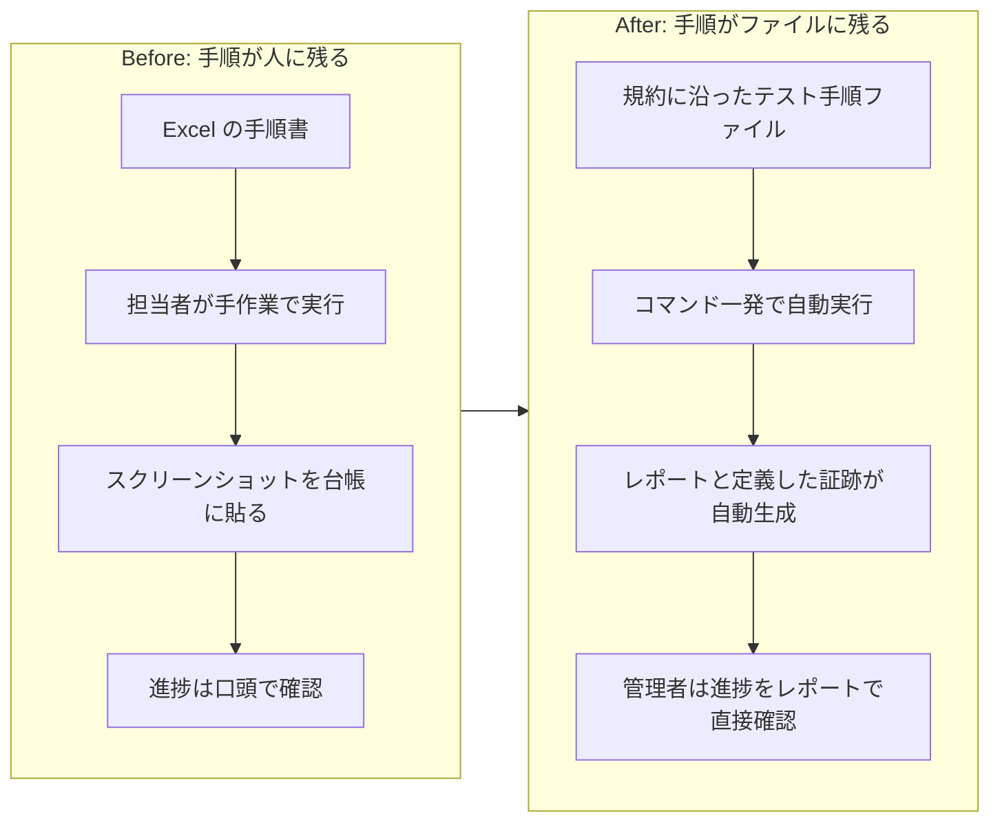
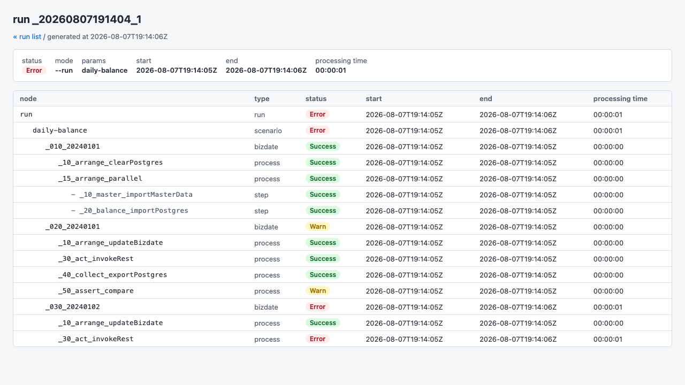

# テスト管理者のための stfw 導入ガイド

このガイドは、リリース前テストの進捗と品質に責任を持つ方(テスト管理者、プロジェクトマネージャー)に向けて書いています。
**stfw** は、手作業のテスト手順をファイルとして資産化し、自動実行、進捗の HTML レポート、証跡の規約配置までを仕組みで支えるオープンソースのツールです。
このガイドでは、現場の課題から順に「stfw で何が変わるか」を、コマンドや設定の書き方を出さずに説明します。
導入手順やテスト手順の書き方を知りたいエンジニアの方は、[README](../README.ja.md) と [シナリオ作成ガイド](GUIDE.md) をご覧ください。

## リリース前、こんな光景に見覚えはありませんか

リリース前の総合テスト期間になると、決まって同じ光景が繰り返されます。

分厚い Excel の手順書を片手に、担当者が一つひとつ手作業で操作していきます。
業務日付をまたぐテスト(「今日の処理が終わったら日付を 1 日進めて、また同じ処理を流す」といった検証)では、手順の数がそのまま倍々に膨らみます。

途中で予期しないエラーが出ると、作業はいったんストップします。
原因を切り分けられるのは、たいてい「このシステムに詳しい特定の人」だけです。

結果は画面のスクリーンショットを撮って、フォルダや資料に貼り付けていきます。
「今どこまで終わっていますか」と聞かれるたびに、担当者は作業の手を止めて口頭やチャットで報告します。

これは特別な現場の話ではなく、業務システムのリリース前テストではありふれた景色です。

## 管理者の視点で問題を整理すると

現場の担当者にとっては「毎回大変な作業」で済む話でも、テストの進捗と品質に責任を持つ立場から見ると、いくつかの構造的な問題が浮かび上がります。

**再実行のコストが高い**

業務日付をまたぐテストは、途中で失敗すると最初からやり直しになりがちです。
手順が手作業に依存しているため、「同じ手順を、同じ順番で、正確に」再現するだけで時間がかかります。
テスト期間の後半になるほど、再実行の余力がなくなっていきます。

**特定の人に依存する(属人化)**

手順書には「どう操作するか」は書けても、「エラーが起きたときにどう切り分けるか」までは書ききれません。
結果として、テストの成否が特定の担当者のスケジュールに左右されます。

**エビデンス(テスト結果の証跡)が散らばる**

スクリーンショットの撮り忘れ、テストのたびに変わる保存場所、担当者ごとに違うファイル名。
こうした状態では、あとから「このテストは本当に実施したのか」「どんな結果だったのか」を問われたときに、証跡を探し出すだけで一苦労です。

**進捗がリアルタイムに見えない**

管理者が状況を把握する手段が「担当者に聞く」しかないと、報告のたびに現場の手が止まります。
しかも報告される進捗は、担当者の主観による「体感」であることも少なくありません。

これらの原因は共通しています。
テストの「手順」が個人の頭の中や紙の手順書にとどまり、仕組みとして残っていないことです。
手順が仕組みとして残っていないので、再現できず、属人化し、証跡も散らばり、進捗も見えません。

## 解決の方向性は「手順の資産化」

この問題への向き合い方はシンプルです。
担当者の頭の中にある手順を、規約に沿ったファイルとして書き出し、**資産にする**ことです。

手順がファイルになれば、次のことが可能になります。

- 誰が実行しても、同じ手順を同じ順序で実行できます(人による手順のブレがなくなります)
- レビューできます(テスト内容の妥当性を、実行前にチームで確認できます)
- バージョン管理できます(いつ、誰が、どう変更したかが残ります)
- 何度でも実行できます(手順をなぞり直す手作業がなくなります。テストデータや環境の準備は、別途手順に組み込んで再現します)

つまり、「テストを実施する」という行為を、担当者個人のスキルに依存する作業から、チームの資産として積み上げられる仕組みへと変えるということです。

## stfw は「資産化」を仕組みとして支えるツールです

**stfw**(scenario test framework)は、この考え方を実現するオープンソースのツールです。
管理者の視点から見た価値は、次の 5 点に整理できます。

**1. 自動実行と順序保証**

決められた規約に沿ってテスト手順のファイルを配置しておくと、あとは決まった順番で自動的に実行されます。
業務日付をまたぐテストのように「日付を進めて、また流す」といった一連の流れも、人手を介さずに進みます。
途中でエラーが起きた場合はそこで実行が止まるため、停止箇所が明確になり、原因調査の起点をチームで揃えられます。
直したあとは、失敗した手順のまとまり(プロセス)だけ、またはそこから先だけを再実行できます。
前回の実行の生成物を引き継ぐ仕組みもあります(テスト対象システム側のデータや状態は、チームで維持して再現します)。
最初からやり直す以外の選択肢ができることが、「再実行の余力がない」問題への直接の答えになります。

**2. HTML レポートで進捗がひと目で分かる**

実行するたびに HTML のレポートが自動生成されます。
どのテストが成功し、どこで止まったのかを、ブラウザで確認できます。
読み方は次の節で説明します。

**3. エビデンスが規約どおりに揃う**

シナリオに収集処理として定義したデータは、あらかじめ決められた規約に沿って自動的に保存されます。
担当者ごとに保存場所やファイル名がバラつくことがありません。
扱い方は「監査用エビデンスの扱い」の節で説明します。

**4. オープンソースで無料、導入の中心は 1 つの実行ファイル**

stfw は Apache License 2.0 のオープンソースソフトウェアで、無料で利用できます。
中核となるコマンドラインツールは 1 つの実行ファイル(単一バイナリ)で動くため、実行基盤の大がかりな構築は不要です。
ただし、テスト対象に応じて外部ツール(データベースのクライアントや負荷試験ツールなど)が別途必要になることがあり、後述の体感用サンプルは Docker を使います。
必要な環境の準備は、チームのエンジニアと相談して見積もってください。

**5. AI でテストシナリオのたたき台を作れる**

stfw には Agent Skills(AI コーディングエージェントに作業手順を教える仕組み)が同梱されています。
テスト対象システムの設計情報とテストのゴールを指示すると、シナリオと期待値のたたき台を AI が生成します。
利用には AI コーディングエージェント(Claude Code)の導入が別途必要です。
生成されたたたき台は、エンジニアがレビューと壁打ちを重ねて、実際に使える精度まで固めていきます。

## 進捗の読み方(HTML レポート)

テストを実行するたびに、静的な HTML レポートが自動生成されます。
次の画像は、サンプルシナリオでわざと期待値と接続先をずらして実行したときのレポートです。

<!-- report-example.png はレポート UI の変更時に再取得してください。
     取得方法: examples/daily-balance で Day1 の期待値を書き換え + _020 assert を on_mismatch: warn に変更 +
     _030 act の host_group を db に向けて run すると Success/Warn/Error が 1 つの run に揃う。 -->

レポートは実行環境に静的な HTML ファイルとして出力されます。
管理者が手元のブラウザで見るには、チームで共有場所(Web 配信や共有フォルダ)を用意します(リポジトリに Web 配信の構成例を同梱しています)。

管理者として見るのは次の点です。

- 一覧ページには実行(run)が新しい順に並び、実行を開くと業務日付と手順の階層がツリーで表示されます(複数のテストを同時に走らせている場合、一覧の表示が一時的に古いことがあります)
- **Success(緑)** は成功、**Warn(黄)** は「期待値との差分を記録したうえで続行した」こと、**Error(赤)** はエラーで停止したことを示します
- エラーが起きた箇所で実行は止まります。中断された残りのステップは **Blocked(橙)** と表示されることがあり、まだ始まっていない後続のまとまりや業務日付はツリーに現れません。「どこまで進んで、どこで止まったか」がそのまま読み取れます
- 実行中のページは 5 秒ごとに自動で再読み込みされ、表示内容は手順のまとまり(プロセス)が終わるたびに更新されます

レポートの共有環境を用意すれば、「今どこまで終わっていますか」と担当者に聞かなくても進捗を直接確認でき、定型的な進捗確認のやり取りを減らせます。

Warn の使いどころも管理者に関係します。
期待値との差分を「即停止」ではなく「記録して続行」に切り替えると、仕様変更の直後などに「差分がどこまで波及しているか」を 1 枚のレポートで俯瞰できます。

## 監査用エビデンスの扱い

エビデンスの実体は、実行(run)ごとの作業領域に規約どおりの配置で保存されます。
「どの実行の、どの業務日付の、どの手順の証跡か」がディレクトリの位置から特定しやすくなるため、証跡整理の負担を減らせます。

一方で、運用としてチームで決めておくことが 3 点あります。

- どの手順でどんな証跡を収集するかは、シナリオを設計するときにチームで決めます。stfw が自動で行うのは「定義した収集結果を規約どおりに配置する」ことで、監査に必要な対象を自動で判断するわけではありません
- HTML レポートは進捗確認のための画面で、エビデンスのファイルへ直接リンクしていません。証跡の実体を確認する手順(作業領域の場所の共有や、監査用フォルダへの回収)はエンジニアと決めてください
- 保存期間を設定している場合、それを過ぎた実行結果は次にテストを実行したタイミングで自動削除されます(削除の時刻や成功を保証する仕組みではないため、監査上の削除保証には使えません)。監査に必要な証跡は、保存期間内に外部の保管場所へ回収する運用を決めてください

stfw が引き受けるのは「証跡が規約どおりに整理された状態で生まれる」ところまでです。
長期保管と提出の運用は、チームの監査要件に合わせて設計してください。

## 小さく始めるなら、1 つのシナリオから

「今動いているテストの仕組みを全部作り直す」というのは現実的ではありません。
まずはテストを 1 つだけ選び、そのテストだけを資産化するところから始めるのが現実的です。

最初の 1 つは、次の目安で選びます。

- 繰り返し実施している(リリースのたびに回している)
- 手作業の手間が大きい(再実行を避けたくなるほど重い)
- 手順の順序を間違えやすい(業務日付をまたぐ、複数システムを行き来する)

3 つすべてに当てはまる代表例が、日次バッチ処理の検証です。

選んだら、いきなり本物のテストを書き換える前に、動くサンプルで完成形を体感してください。
業務日付をまたいで口座残高の繰越を検証するサンプル [examples/daily-balance](../examples/daily-balance/) を同梱しています。
テスト対象のシステムも一緒に入っているため、エンジニアがそのまま手元で動かして、レポートの見た目と証跡の残り方を確認できます。
サンプルの README には、わざと期待値をずらして「テストが失敗を確実に検知する」ことを確かめる手順まで書かれています。
前の節のスクリーンショットも、このサンプルで撮ったものです。

1 つのシナリオで動作イメージがつかめたら、同じ目安で次に資産化するテストを選んでいきます。

## 次の一歩

ここまで読んで「うちのチームでも試す価値がありそうだ」と感じたら、チームのエンジニアにこのリポジトリを共有してください。

- エンジニア向けの入口: [README](../README.ja.md) / [シナリオ作成ガイド](GUIDE.md) / [Zenn の技術解説記事](https://zenn.dev/suwash/articles/stfw_20260711)
- このガイドの元になった記事: [リリース前の「シナリオテスト」、手順書と人海戦術から卒業しませんか(note)](https://note.com/suwash/n/n135933349cca)

手順書と人海戦術に頼ったテスト運用は、今日から変えられます。
まずは 1 つのシナリオを、資産として書き出すところから始めてみませんか。
