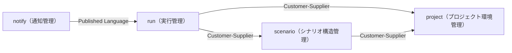
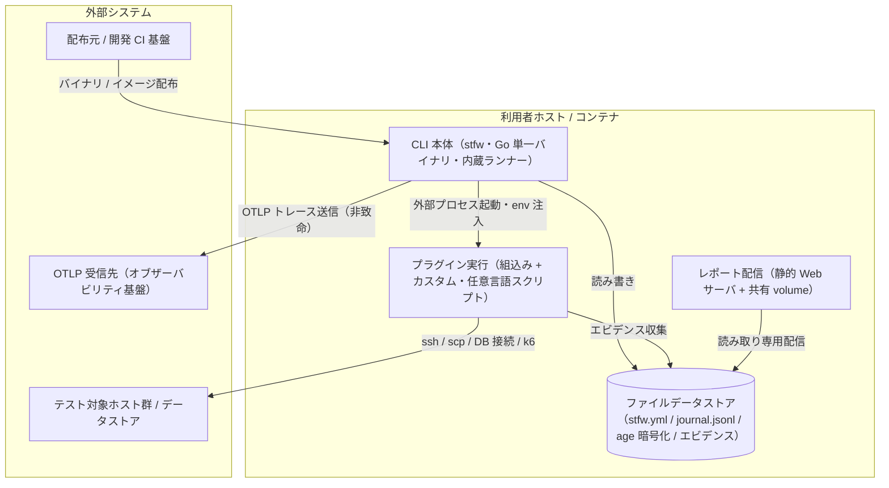
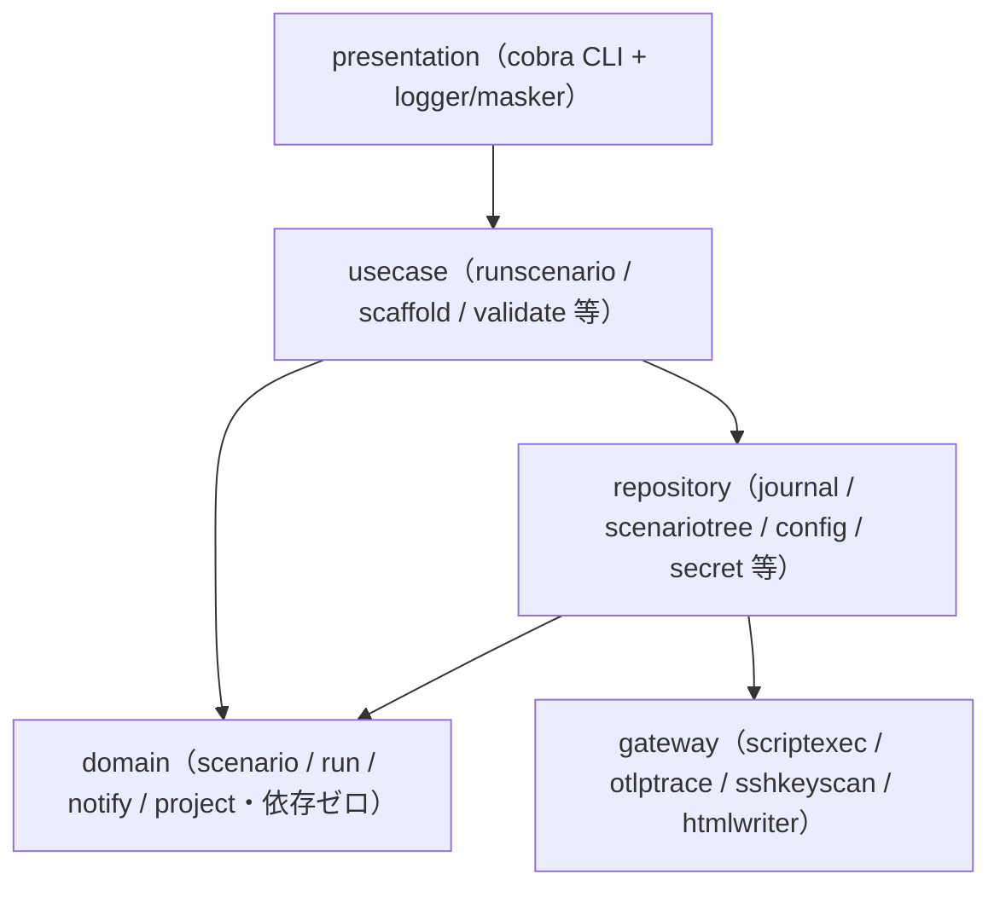
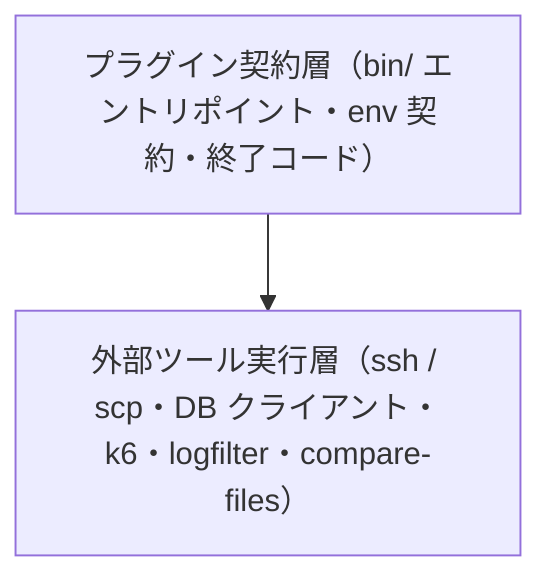

# stfw

> undefined

**最終更新**: 2026-07-08 12:12:50 arch user confirm (arch)

## 成果物一覧

| ドメイン | 最新 | イベント数 |
|---------|------|-----------:|
| [USDM（要求分解）](#usdm要求分解) | [usdm/latest/](usdm/latest/) | 4 |
| [RDRA（要件定義）](#rdra要件定義) | [rdra/latest/](rdra/latest/) | 6 |
| [NFR（非機能要求）](#nfr非機能要求) | [nfr/latest/](nfr/latest/) | 2 |
| [Arch（アーキテクチャ）](#archアーキテクチャ) | [arch/latest/](arch/latest/) | 2 |
| [Infra（インフラ設計）](#infraインフラ設計) | - | 0 |
| [Design（デザイン）](#designデザイン) | - | 0 |
| [Specs（詳細仕様）](#specs詳細仕様) | - | 0 |

## USDM（要求分解）

### 主要な成果物

- [requirements.md](usdm/latest/requirements.md)
- [requirements.yaml](usdm/latest/requirements.yaml)

| 項目 | 値 |
|------|-----|
| 要求数 | 17 |
| 仕様数 | 44 |

## RDRA（要件定義）

### 主要な成果物

- [アクター.tsv](rdra/latest/アクター.tsv)
- [外部システム.tsv](rdra/latest/外部システム.tsv)
- [情報.tsv](rdra/latest/情報.tsv)
- [状態.tsv](rdra/latest/状態.tsv)
- [条件.tsv](rdra/latest/条件.tsv)
- [バリエーション.tsv](rdra/latest/バリエーション.tsv)
- [BUC.tsv](rdra/latest/BUC.tsv)
- [関連データ.txt](rdra/latest/関連データ.txt)
- [ZeroOne.txt](rdra/latest/ZeroOne.txt)
- [システム概要.json](rdra/latest/システム概要.json)
- [views/（人間可読ビュー: Mermaid 図解つき Markdown）](rdra/latest/views/README.md)

| 項目 | 値 |
|------|-----|
| アクター | 4 |
| 外部システム | 8 |
| 情報 | 25 |
| 状態モデル | 2 |
| 条件 | 29 |
| バリエーション | 13 |
| 業務 | 4 |
| BUC | 7 |
| UC | 17 |

### 外部ツール連携

| ツール | データファイル | 手順 |
|--------|-------------|------|
| [RDRA Graph](https://vsa.co.jp/rdratool/graph/v0.94/) | [関連データ.txt](rdra/latest/関連データ.txt) | ファイル内容をコピーし、RDRA Graph に貼り付け |
| [RDRA Sheet](https://docs.google.com/spreadsheets/d/1h7J70l6DyXcuG0FKYqIpXXfdvsaqjdVFwc6jQXSh9fM/) | [ZeroOne.txt](rdra/latest/ZeroOne.txt) | ファイル内容をコピーし、テンプレートに貼り付け |

### システムコンテキスト図

```mermaid
graph TB
  SYS["stfw"]
  テスト実行者(["テスト実行者"]):::actor --> SYS
  シナリオ作成者(["シナリオ作成者"]):::actor --> SYS
  環境管理者(["環境管理者"]):::actor --> SYS
  テスト結果確認者(["テスト結果確認者"]):::actor --> SYS
  SYS --> テスト対象ホスト群(["テスト対象ホスト群"]):::external
  SYS --> OTLP_受信先（OpenTelemetry_Collector_/_互換バックエンド）(["OTLP 受信先（OpenTelemetry Collector / 互換バックエンド）"]):::external
  SYS --> 配布元（GitHub_Releases_/_ghcr.io）(["配布元（GitHub Releases / ghcr.io）"]):::external
  SYS --> 開発_CI_基盤（GitHub_Actions）(["開発 CI 基盤（GitHub Actions）"]):::external
  SYS --> テスト対象データストア（MySQL_/_PostgreSQL_/_Redis）(["テスト対象データストア（MySQL / PostgreSQL / Redis）"]):::external
  SYS --> logfilter（ログ収集_OSS）(["logfilter（ログ収集 OSS）"]):::external
  SYS --> compare-files（ファイル比較_OSS）(["compare-files（ファイル比較 OSS）"]):::external
  SYS --> grafana_k6(["grafana k6"]):::external
  classDef actor fill:#2563EB,color:#fff,stroke:none
  classDef external fill:#6B7280,color:#fff,stroke:none
```

## NFR（非機能要求）

### 主要な成果物

- [nfr-grade.md](nfr/latest/nfr-grade.md)
- [nfr-grade.yaml](nfr/latest/nfr-grade.yaml)

| 項目 | 値 |
|------|-----|
| モデルシステム | model1 |
| カテゴリ | 6 |
| 重要項目 | 80 |

## Arch（アーキテクチャ）

### 主要な成果物

- [arch-design.md](arch/latest/arch-design.md)
- [arch-design.yaml](arch/latest/arch-design.yaml)
- [coverage-report.md](arch/latest/coverage-report.md)

| 項目 | 値 |
|------|-----|
| 言語 | Go（CLI 本体）, 任意言語スクリプト（プラグイン・ステップ: シェルスクリプト等） |
| サブドメイン | 4 |
| Bounded Context | 4 |
| コンテキストマップ関係 | 4 |
| ティア | 5 |
| ポリシー | 20 |
| ルール | 15 |
| エンティティ | 25 |

### ドメインアーキテクチャ（コンテキストマップ）



### コンテナ図（システム構成）



### コンポーネント図（レイヤー依存）

**tier-cli**



**tier-plugin**



## Infra（インフラ設計）

### 主要な成果物

## Design（デザイン）

### 主要な成果物


## Specs（詳細仕様）

### 主要な成果物


### テスト環境準備業務

**プロジェクト初期化フロー**

- プロジェクトを初期化する
- 暗号化キーを生成する

**接続情報管理フロー**

- テスト対象ホスト情報を参照する
- 資格情報を暗号化登録・参照する
- 資格情報を旧形式から移行する
- SSHサーバキーを登録する

### シナリオ作成業務

**テストシナリオ作成フロー**

- シナリオ構造を組み立てる

**シナリオ静的検証フロー**

- シナリオを検証する
- シナリオをdry-runする

**プロセスプラグイン拡張フロー**

- プロセスプラグインを管理する

### シナリオ実行業務

**シナリオ一括自動実行フロー**

- シナリオを実行する
- 階層setup/teardownを実行する
- プロセスを実行する

### テスト結果確認業務

**実行結果監視・確認フロー**

- 実行状況を通知する
- 実行状況を確認する
- HTMLレポートを生成する
- シナリオを実行する

> 4 業務 / 7 BUC / 17 UC

## ADRs（設計判断記録）

| # | ドメイン | 判断 | ステータス |
|---|---------|------|----------|
| 1 | Arch | [サブドメイン分類: scenario・run を Core、notify・project を Supporting、汎用技術は Generic 扱い](arch/events/20260708_114151_initial_arch/decisions/arch-decision-001.yaml) | approved |
| 2 | Arch | [BC 設計: RDRA 4 コンテキストをそのまま BC 化し、モジュラモノリスで構成](arch/events/20260708_114151_initial_arch/decisions/arch-decision-002.yaml) | approved |
| 3 | Arch | [コンテキストマップ統合方式: ジャーナルイベントを Published Language とし BC 跨ぎの直接ファイルアクセスを禁止](arch/events/20260708_114151_initial_arch/decisions/arch-decision-003.yaml) | approved |
| 4 | Arch | [集約境界仮説: Run 集約は確定、シナリオ / プロジェクトは仮説（low）に留める](arch/events/20260708_114151_initial_arch/decisions/arch-decision-004.yaml) | approved |
| 5 | Arch | [テクノロジースタック: Go 単一バイナリ + 標準ライブラリ中心（プラグインは任意言語）](arch/events/20260708_114151_initial_arch/decisions/arch-decision-005.yaml) | approved |
| 6 | Arch | [ティアパターン選定: サーバレス実行エンジン内包（ワークフローエンジン・常駐サーバの廃止）](arch/events/20260708_114151_initial_arch/decisions/arch-decision-006.yaml) | approved |
| 7 | Arch | [データモデル戦略: 外部データストアなし・追記専用ジャーナル（JSONL）を唯一のソースとする](arch/events/20260708_114151_initial_arch/decisions/arch-decision-007.yaml) | approved |
| 8 | Arch | [認証方式選定: 専用認証基盤を持たず OS / SSH / 暗号化ファイルへ委譲](arch/events/20260708_114151_initial_arch/decisions/arch-decision-008.yaml) | approved |
| 9 | Arch | [レイヤリング戦略: 5 層・IF なし直接依存・domain 依存ゼロ](arch/events/20260708_114151_initial_arch/decisions/arch-decision-009.yaml) | approved |
| 10 | Arch | [2 層プラグインエコシステム（to-be）: 組込みプラグイン群 + カスタムプラグイン](arch/events/20260708_114151_initial_arch/decisions/arch-decision-010.yaml) | approved |
| 11 | Arch | [初期構築の確認推奨項目 5 件をユーザー確認で確定（全項目 Option A = 推奨案採用）](arch/events/20260708_121250_arch_user_confirm/decisions/arch-decision-011.yaml) | approved |

## イベント履歴

| 日時 | ドメイン | イベントID |
|------|---------|-----------|
| 2026-07-07 23:31:36 | USDM（要求分解） | [20260707_233136_harvest_initial](usdm/events/20260707_233136_harvest_initial) |
| 2026-07-07 23:31:36 | RDRA（要件定義） | [20260707_233136_harvest_initial](rdra/events/20260707_233136_harvest_initial) |
| 2026-07-08 07:37:03 | USDM（要求分解） | [20260708_073703_webhook_to_otel](usdm/events/20260708_073703_webhook_to_otel) |
| 2026-07-08 07:37:03 | RDRA（要件定義） | [20260708_073703_webhook_to_otel](rdra/events/20260708_073703_webhook_to_otel) |
| 2026-07-08 08:41:24 | RDRA（要件定義） | [20260708_084124_cleanup_webhook_mentions](rdra/events/20260708_084124_cleanup_webhook_mentions) |
| 2026-07-08 08:49:33 | USDM（要求分解） | [20260708_084933_v1_rearchitecting](usdm/events/20260708_084933_v1_rearchitecting) |
| 2026-07-08 08:49:33 | RDRA（要件定義） | [20260708_084933_v1_rearchitecting](rdra/events/20260708_084933_v1_rearchitecting) |
| 2026-07-08 10:33:05 | USDM（要求分解） | [20260708_103305_builtin_plugin_ecosystem](usdm/events/20260708_103305_builtin_plugin_ecosystem) |
| 2026-07-08 10:33:05 | RDRA（要件定義） | [20260708_103305_builtin_plugin_ecosystem](rdra/events/20260708_103305_builtin_plugin_ecosystem) |
| 2026-07-08 11:14:20 | NFR（非機能要求） | [20260708_111420_initial_nfr](nfr/events/20260708_111420_initial_nfr) |
| 2026-07-08 11:29:06 | NFR（非機能要求） | [20260708_112906_nfr_user_confirm](nfr/events/20260708_112906_nfr_user_confirm) |
| 2026-07-08 11:41:51 | Arch（アーキテクチャ） | [20260708_114151_initial_arch](arch/events/20260708_114151_initial_arch) |
| 2026-07-08 12:09:28 | RDRA（要件定義） | [20260708_120928_update_system_overview](rdra/events/20260708_120928_update_system_overview) |
| 2026-07-08 12:12:50 | Arch（アーキテクチャ） | [20260708_121250_arch_user_confirm](arch/events/20260708_121250_arch_user_confirm) |

---

*このファイルは `generateReadme.js` により自動生成されています。手動編集しないでください。*
