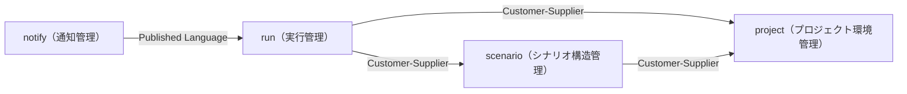
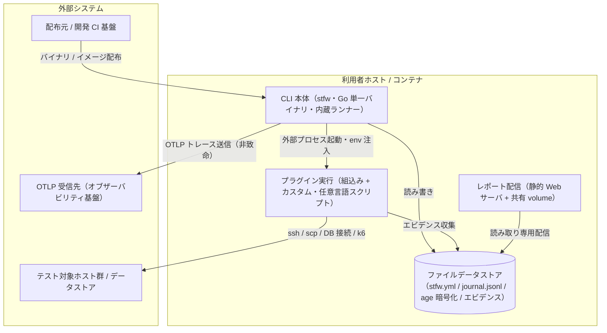
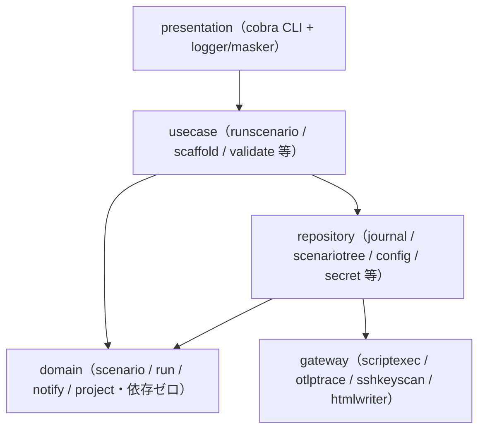
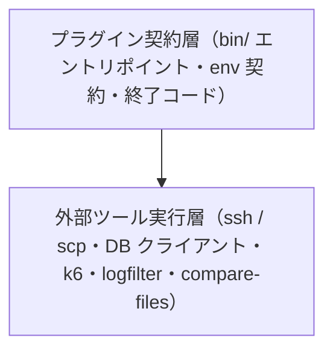
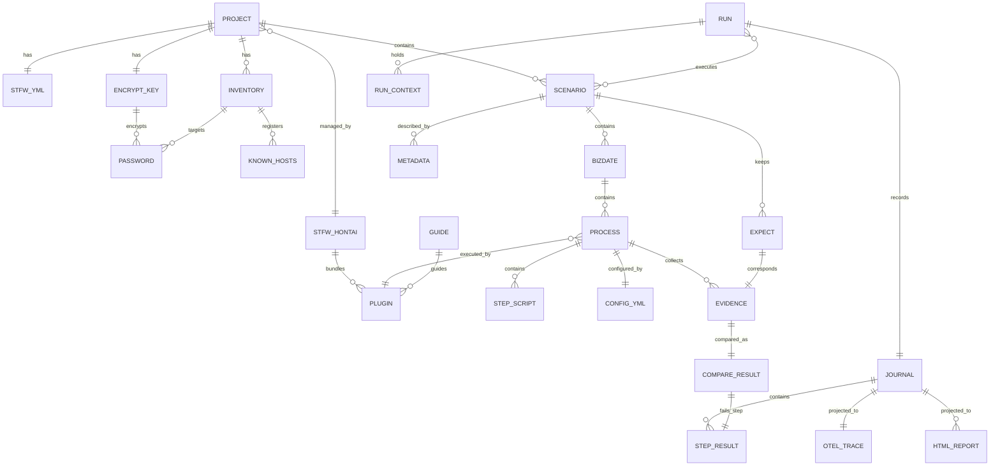

# アーキテクチャ設計書

## 概要

| 項目 | 内容 |
|------|------|
| イベントID | 20260708_121250_arch_user_confirm |
| 作成日時 | 2026-07-08T12:12:50 |
| ソース | 初期構築イベント 20260708_114151_initial_arch の確認推奨項目 5 件に対するユーザー回答の反映（全項目 Option A = 推奨案で確定。trigger_event: arch:20260708_114151_initial_arch） |
| 言語 | Go（CLI 本体）, 任意言語スクリプト（プラグイン・ステップ: シェルスクリプト等） |
| フレームワーク | cobra（CLI フレームワーク）, log/slog（構造化ログ）, yaml.v3（設定パース）, html/template + go:embed（静的 HTML レポート・テンプレート同梱）, filippo.io/age（X25519 資格情報暗号化）, OpenTelemetry SDK（OTLP トレースエクスポート）, testscript（受け入れテスト） |
| 技術的制約 | Go 単一バイナリ（サーバレス・常駐サービスなし・実行エンジン内包・逐次実行）, 外部データストアなし（プロジェクトディレクトリ配下のファイルベース永続化）, 互換境界 3 つの維持: ディレクトリ規約 / プラグイン env 契約（stfw_* + 終了コード 0/3/6）/ エビデンスディレクトリ規約, 追加ランタイム不要（JVM / Python 2 / Ruby 依存の廃止）, v1.0 は逐次実行のみ（将来 --parallel の余地をランナー分離で残す） |

## ドメインアーキテクチャ

### コンテキストマップ図

### サブドメイン分類

| ID | 名前 | 分類 | 投資方針 | 関連 BUC | confidence | 根拠 |
|----|------|:----:|---------|---------|:----------:|------|
| SD-001 | シナリオ構造管理 | core | 最優先で深いモデリングと継続的リファクタリングに投資。命名規約・ツリー構造を値オブジェクト・型で深くモデリング | テストシナリオ作成フロー, シナリオ静的検証フロー | ユーザー指定 | 規約ベースのシナリオ記述（ディレクトリ構造そのものが実行定義）が stfw の競争優位の源泉。手書きの実行手順書を不要にする中核価値 |
| SD-002 | 実行管理 | core | 最優先で深いモデリングと継続的リファクタリングに投資。状態遷移を型で強制し、ジャーナルを Run のイベントストリームとして扱う | シナリオ一括自動実行フロー | ユーザー指定 | 逐次実行・エラー時停止・Blocked 伝播・実行ジャーナルが内蔵実行エンジンの本体であり、実行順序保証と再現性という中核価値を担う |
| SD-003 | 通知管理 | supporting | good enough な品質で安定運用。ジャーナルイベントの投影（OTel トレース・HTML レポート）に徹し、独自の状態を持たない | 実行結果監視・確認フロー | ユーザー指定 | 実行状況の可視化は中核業務を支援するが差別化要因ではない。OTLP 標準への準拠により既存オブザーバビリティ基盤へ委譲する |
| SD-004 | プロジェクト環境管理 | supporting | 標準的なフレームワーク・ライブラリで実装。暗号化・SSH・HTML 生成等の Generic 能力は外部ライブラリ採用で自作回避 | stfw導入フロー, プロジェクト初期化フロー, 接続情報管理フロー, プロセスプラグイン拡張フロー | ユーザー指定 | プロジェクト初期化・設定・inventory・secret・プラグイン管理は中核業務の前提を支える支援領域。差別化要因ではない |

### 境界づけられたコンテキスト (Bounded Context)

| ID | 名前 | 所属 SD | 所有 entity | 所有 BUC | チーム | confidence | 根拠 |
|----|------|:------:|-----------|---------|--------|:----------:|------|
| BC-001 | scenario（シナリオ構造管理コンテキスト） | SD-001 | E-009, E-010, E-011, E-012, E-013, E-014, E-023 | テストシナリオ作成フロー, シナリオ静的検証フロー | - | ユーザー指定 | 情報.tsv のコンテキスト「シナリオ構造管理」に対応。シナリオ記述の語彙（規約・階層）が実行時の語彙（run_id・ステータス）と独立 |
| BC-002 | run（実行管理コンテキスト） | SD-002 | E-015, E-016, E-017, E-020, E-024, E-025 | シナリオ一括自動実行フロー | - | ユーザー指定 | 情報.tsv のコンテキスト「実行管理」に対応。実行時の状態遷移（階層実行ステータス）とジャーナルが独立した語彙体系を持つ |
| BC-003 | notify（通知管理コンテキスト） | SD-003 | E-018, E-019, E-021 | 実行結果監視・確認フロー | - | ユーザー指定 | 情報.tsv のコンテキスト「通知管理」に対応。実行結果を外部（オブザーバビリティ基盤・ブラウザ）の語彙（スパン・レポート）に翻訳する境界 |
| BC-004 | project（プロジェクト環境管理コンテキスト） | SD-004 | E-001, E-002, E-003, E-004, E-005, E-006, E-007, E-008, E-022 | stfw導入フロー, プロジェクト初期化フロー, 接続情報管理フロー, プロセスプラグイン拡張フロー | - | ユーザー指定 | 情報.tsv のコンテキスト「プロジェクト環境管理」に対応。設定・接続情報・プラグインの管理規則がシナリオ・実行の語彙と独立 |

#### ユビキタス言語

**BC-001 scenario（シナリオ構造管理コンテキスト）**

| 用語 | 定義 |
|------|------|
| シナリオ | 業務日付をまたぐ一連の業務処理を記述するテストの最上位単位。scenario/{name} ディレクトリで識別され、ディレクトリ構造そのものが実行定義となる |
| 業務日付（bizdate） | シナリオ内でテストを日付単位に区切って進行させる単位。_{seq}_{bizdate} 形式・YYYYMMDD の 8 桁数字 |
| プロセス | 業務日付内のまとまった処理単位。_{seq}_{group}_{process_type} 形式でプロセスタイプ（プラグイン）と結びつく |
| ステップ | プロセス内 scripts/ 直下の実行可能ファイル。ファイル名昇順が実行順 |

**BC-002 run（実行管理コンテキスト）**

| 用語 | 定義 |
|------|------|
| 実行（run） | stfw run で採番される run_id（_{YYYYMMDDHHMMSS}_{PID}）を ID とする一括自動実行の単位。再実行は常に新しい run_id の別実行 |
| 実行ジャーナル | 実行結果の唯一のソース。各階層・ステップの開始・終了をイベント時刻つきで記録する追記専用 JSONL |
| Blocked | 先行ステップのエラーにより未実行のままスキップされたステップの終了状態。エラー時停止ポリシーの担保 |

**BC-003 notify（通知管理コンテキスト）**

| 用語 | 定義 |
|------|------|
| スパンツリー | run をルート、scenario / bizdate / process を子、step を末端とする OTLP トレースの階層構造。実行ジャーナルのイベントの投影 |
| 投影（プロジェクション） | 実行ジャーナルのイベントを唯一の入力として OTel トレース・HTML レポートを導出する読み取りモデル生成 |

**BC-004 project（プロジェクト環境管理コンテキスト）**

| 用語 | 定義 |
|------|------|
| プロジェクト | stfw init で開始されるシナリオテストの管理単位。stfw.yml の存在で識別・上位探索される |
| インベントリ | 環境単位でテスト対象ホストをグループ（web/ap/db 等 + 予約値 all）で管理する定義 |
| secret | ホスト×ユーザー単位の資格情報を age (X25519) で暗号化保管する仕組み。平文で扱わない |
| プラグイン解決順 | 同名プラグインをプロジェクト → 組込みの順に解決し、プロジェクト側を優先する規則 |

### コンテキストマップ

| ID | from BC | to BC | パターン | 方向 | 翻訳責務 | 統合イベント | confidence |
|----|---------|-------|:-------:|:----:|---------|--------------|:----------:|
| CM-001 | BC-002 | BC-001 | customer_supplier | downstream | run（下流）が scenario（上流）の検証済みシナリオツリー（ScenarioTree）を実行対象として消費する。repository 層の scenariotree がディレクトリ構造を走査順つきドメインモデルに翻訳する | - | 中 |
| CM-002 | BC-003 | BC-002 | published_language | downstream | run（上流）が公開する実行ジャーナルのイベントスキーマ（追記専用 JSONL）を公開言語とし、notify（下流）は OTel スパンツリー・HTML レポートへ投影する。BC 跨ぎの直接ファイルアクセスは禁止し、共有は ID とイベントのみ | node_start, steps_enumerated, step_end, node_end | ユーザー指定 |
| CM-003 | BC-002 | BC-004 | customer_supplier | downstream | run（下流）が project（上流）の設定解決（デフォルト → プロジェクトの上書き順）・inventory・secret 復号・プラグイン解決を利用する。環境変数フラット化（env 契約）が翻訳面 | - | 中 |
| CM-004 | BC-001 | BC-004 | customer_supplier | downstream | scenario（下流）の scaffold 生成・静的検証が project（上流）のプラグイン存在確認（プロセス実行の前提条件）と設定解決に依存する | - | 中 |

### 集約境界の仮説

> 注: これらは戦略段階の仮説です。最終確定は dist-spec or ddd-tactical-implementation で行います。

| ID | BC | root entity | members | invariants | confidence | 備考 |
|----|----|-----------|---------|-----------|:----------:|------|
| AG-001 | BC-002 | E-015 | E-016, E-020 | • run 実行は対象シナリオが存在し run 前静的検証を通過していること • エラー発生（終了コード 0 以外・比較不一致）後の後続ステップは実行せず Blocked として記録し停止する • run_id は _{YYYYMMDDHHMMSS}_{PID} 形式で一意に採番する • 終了状態（Success / Error）からの再遷移は禁止。再実行は新しい run_id の別実行として扱う • ジャーナルからの復元（リプレイ）経路でも生成時と同じ状態遷移検証を通す | ユーザー指定 | 承認済み v1.0 計画で確定した集約（集約 = Run、ジャーナル = Run のイベントストリーム）。メンバー詳細の最終確定は dist-spec or ddd-tactical-implementation で行う |
| AG-002 | BC-001 | E-009 | E-010, E-011, E-012, E-014 | • 業務日付（bizdate）は YYYYMMDD の 8 桁数字であること • 業務日付・プロセスの連番（seq）は数値のみであること • プロセスのグループ名に「_」を含めないこと • 「_」始まりのディレクトリのみを実行対象とし、名前昇順に実行順を決定すること • シナリオ・業務日付・プロセスの各ディレクトリは scenario ルートからの深さと stfw.yml の存在で階層判定すること | ユーザー指定 | 仮説。実装ではファーストクラスコレクション ScenarioTree として表現されており、トランザクション境界を持つ集約かは未確定。最終確定は dist-spec or ddd-tactical-implementation で行う。ユーザー確認済み（2026-07-08）: 仮説のまま dist-spec へ引き継ぐことを確定 |
| AG-003 | BC-004 | E-002 | E-003, E-004, E-005, E-006, E-008 | • stfw.yml が既に存在するディレクトリでは再初期化（stfw init）をエラーとすること • 同一ホスト×ユーザーの資格情報の重複登録は不可とすること • 暗号化キーペアが存在する場合の再生成は --force 指定時のみとすること | ユーザー指定 | 仮説。project 配下はトランザクションスクリプト許容（Supporting）のため、集約として強整合を持たせるかは未確定。最終確定は dist-spec or ddd-tactical-implementation で行う。ユーザー確認済み（2026-07-08）: 仮説のまま dist-spec へ引き継ぐことを確定 |

## システムアーキテクチャ

### システム構成図

### ティア構成

| ID | ティア名 | 説明 | テクノロジー候補 |
|-----|---------|------|----------------|
| tier-cli | CLI 本体（stfw コマンド） | Go 単一バイナリの CLI。presentation〜gateway の 5 層と実行エンジン（内蔵ランナー）を内包し、init / new / validate / run / status / report / inventory / secret / ssh / plugin の各コマンドを提供する | CLI（単一バイナリ配布・ランタイム依存なし）, 内蔵実行エンジン（木構造の逐次実行）, 構造化ログ（ローカルファイル出力） |
| tier-plugin | プラグイン実行 | プロセスタイプごとの実行方式を提供する拡張ポイント。組込みプラグイン群（収集系・データストア系・検証系・実行系）とプロジェクト側カスタムプラグインの 2 層構造。CLI 本体から外部プロセスとして任意言語スクリプトを起動する | 外部プロセス実行（任意言語スクリプト・env 注入）, リモート接続 CLI（ssh / scp）, データストアクライアント CLI（RDB / KVS クライアント）, 負荷試験・E2E 実行 OSS（k6 等） |
| tier-file-datastore | ファイルデータストア | プロジェクトディレクトリ配下のファイルベース永続化。外部データストア（RDB / KVS 等）を持たない。実行ジャーナル（追記専用 JSONL）・設定 YAML・age 暗号化ファイル・エビデンス・静的 HTML を保持する | ローカルファイルシステム（YAML / JSONL / CSV / 静的 HTML）, 追記専用イベントログ（JSONL）, 公開鍵暗号化ファイル（X25519） |
| tier-report-delivery | レポート配信 | 実行ジャーナルから生成した静的 HTML レポート（index + run 詳細）をブラウザへ配信する。コンテナ構成では Web サーバ（nginx 等）が reports 共有 volume を読み取り専用配信する（stfw 自体はサーバレスのまま） | 静的 HTML（自己完結・ビルド不要・インライン CSS）, 静的 Web サーバ（コンテナ構成のリバースプロキシ）, 共有 volume（読み取り専用配信） |
| tier-distribution | 配布・CI | フレームワーク自体の品質保証と配布を担う開発時ティア。マルチプラットフォームバイナリ・コンテナイメージ・compose 定義を配布し、PR 検証からリリースまでを CI/CD パイプラインで自動化する | バイナリリリースホスティング, Container Registry, CI/CD パイプライン, リリース自動化ツール（クロスコンパイル + チェンジログ生成） |

### CLI 本体（stfw コマンド） (tier-cli) の方針・ルール

#### 方針

| ID | 方針名 | 内容 | 根拠 | RDRA/NFR 要素 | 確信度 |
|-----|---------|------|------|--------------|:------:|
| SP-001 | サーバレス・オンデマンド実行 | 常駐サービス・server 管理・状態 DB を持たず、stfw run の 1 コマンドで前準備なしに実行を開始する。冗長化・サービス切替は対象外とし、可用性は配布物の再取得とプロジェクトディレクトリの保全で担保する | NFR A.1.1.1 運用時間(Lv1) / A.2.1.1 冗長化(Lv1) への対応。利用者の作業時間帯にのみ動くオンデマンド CLI であり常駐構成は過剰 | 条件: run 実行の前提条件, NFR A.1.1.1, NFR A.1.2.1, NFR A.2.1.1, NFR A.2.3.1, NFR A.2.6.2 | ユーザー指定 |
| SP-002 | run 前静的検証の統合 | stfw run の開始前に validate 相当の静的検証（ディレクトリ規約・プラグイン解決可否・config.yml・対象シナリオ存在・プラグインのランタイム依存の存在チェック）を自動実行し、エラー時は実行を開始しない。残存する *.dig ファイルには不要である旨を警告する | 規約違反や依存不足による実行時失敗を事前に防ぎ、テスト実行の再現性を守るため | 条件: run 前静的検証, プロセス実行の前提条件, BUC: シナリオ静的検証フロー, NFR B.4.1.1 | ユーザー指定 |
| SP-003 | dry-run による事前確認 | stfw run --dry-run は実タスク（execute / post_execute）をスキップし、setup → pre_execute → teardown のみ実行する。テスト対象環境に影響を与えずに実行経路と前後処理を本実行前に確認できる | テスト実行者が本実行前に安全に実行経路を検証できるようにするため | 条件: dry-run の実行範囲, バリエーション: 実行モード（run_mode）, アクター: テスト実行者 | ユーザー指定 |
| SP-004 | 実行順序保証・エラー時停止 | 内蔵ランナーがスクリプトをファイル名昇順に逐次実行し、エラー発生（終了コード 0 以外・compare の比較不一致）後の後続スクリプトは実行せず Blocked として記録し停止する | 実行順序の保証とエラー時停止というビジネスポリシーを担保し、テスト結果の再現性と失敗箇所の特定を可能にするため | 条件: 逐次実行・エラー時 Blocked, 状態モデル「ステップ実行ステータス」, BUC: シナリオ一括自動実行フロー | ユーザー指定 |
| SP-005 | リプレイによる状態再構成 | stfw status / stfw report は実行ジャーナルのリプレイで実行状況（階層ツリー・成否）を再構成する。実行中の状態を保持する常駐プロセスや状態 DB を持たない | 実行結果の唯一のソースをジャーナルに一元化し、障害検知・失敗調査の起点を単純化するため | 情報: 実行ジャーナル（journal.jsonl）, アクター: テスト結果確認者, NFR C.3.1.1 | ユーザー指定 |

#### ルール

| ID | ルール名 | 内容 | 根拠 | RDRA/NFR 要素 | 確信度 |
|-----|---------|------|------|--------------|:------:|
| SR-001 | run_id の採番・保持 | run_id は _{YYYYMMDDHHMMSS}_{PID} 形式で採番し実行コンテキストに保持する。attempt_id は存在せず、run_id のみで一括自動実行を一意に識別し status / report / OTel トレースの基点とする | 従来形式を維持しつつ、実行の識別子を一本化するため | 条件: run_id の採番・保持 | ユーザー指定 |
| SR-002 | 実行ログ運用 | 実行ログは .stfw/stfw.log へ集約し、日次ローテーション・シークレットマスキング済み・terminal 実行時はカラー出力とする。ログレベル（trace〜error、デフォルト info）は stfw.yml またはコマンドオプションで変更できる | NFR C.6.1.1 ログ保管期間(Lv1) / C.6.1.2 ログ種別への対応。障害調査に必要なログを単一ファイルへ集約する | 情報: 実行ログ, バリエーション: ログレベル, NFR C.6.1.1, NFR C.6.1.2 | ユーザー指定 |
| SR-003 | 廃止設定の警告 | stfw.server.* 設定を含む stfw.yml の読み込み時に廃止警告を表示し、設定値は実行に影響させない | digdag server 廃止後も旧設定を残したプロジェクトが暗黙に誤動作せず、廃止を利用者に確実に伝えるため | 条件: server 設定の廃止警告 | ユーザー指定 |
| SR-004 | 設定の上書き順 | プロジェクト設定はデフォルト（stfw 本体の内蔵デフォルト）→ プロジェクトの順、プラグイン設定は組込み → プロジェクト → シナリオ内 Process 設定の順に読込・上書きし、環境変数として全スクリプトへ公開する | 共通デフォルトを保ちながらプロジェクト・シナリオ単位の個別調整を可能にするため | 条件: 設定の上書き順, 情報: プロジェクト設定（stfw.yml） | ユーザー指定 |
| SR-005 | 終了コード体系の統一 | スクリプト・コマンド共通の終了コード体系を 0（SUCCESS）/ 3（WARN）/ 6（ERROR）とし、ステップ実行結果の Success / Error 判定と後続 Blocked 判定の基準とする | プラグイン実行契約の互換境界としてステップ成否判定を機械的に行うため | バリエーション: 終了コード, 条件: 逐次実行・エラー時 Blocked | ユーザー指定 |
| SR-006 | プロジェクト再初期化禁止 | stfw.yml が既に存在するディレクトリでは stfw init をエラーとし、既存プロジェクトの設定・シナリオのテンプレート上書き破壊を防ぐ | 既存資産の意図しない破壊を防ぐ従来仕様の維持 | 条件: プロジェクト再初期化禁止, 情報: プロジェクト, BUC: プロジェクト初期化フロー | ユーザー指定 |

### プラグイン実行 (tier-plugin) の方針・ルール

#### 方針

| ID | 方針名 | 内容 | 根拠 | RDRA/NFR 要素 | 確信度 |
|-----|---------|------|------|--------------|:------:|
| SP-101 | 2 層プラグインエコシステム | 組込みプラグイン群（scripts・収集系 collectLog / collectFile・データストア系 export / import / clear（MySQL / PostgreSQL / Redis）・検証系 compare・実行系 invokeWeb / invokeRest）が Arrange → Act → Collect → Assert 各フェーズの汎用部品を提供し、プロダクト固有の処理（updateBizDate / invokeJob / importMaster 等）は利用者がカスタムプラグインとして組み込みプラグインの組み合わせで実装する | プロダクト固有の知識は利用者側にしか無いため、フレームワークは汎用部品の提供に留め、拡張はプラグイン追加で対応する | 情報: プラグイン, カスタムプラグイン実装ガイド, BUC: プロセスプラグイン拡張フロー, アクター: シナリオ作成者, バリエーション: プラグインフェーズ | 中 |
| SP-102 | ランタイム依存の宣言と存在チェック | プラグインごとに前提コマンド（k6・RDB クライアント・ssh / scp 等）をランタイム依存として宣言し、stfw validate と run 前静的検証が存在チェックで検出する | 実行時になって判明する依存不足を実行前に検出するため | 条件: プラグインのランタイム依存宣言と存在チェック, バリエーション: Docker イメージ構成 | 中 |
| SP-103 | 接続情報のホストグループ名参照 | 組み込みプラグインの設定（config.yml）では収集先・接続先を inventory のホストグループ名参照のみで指定し、ホスト名・資格情報を直接記述しない。グループ名 all は全グループ横断の予約値とする | プラグインごとの接続情報の重複と平文資格情報の混入を防ぐため | 条件: プラグイン接続情報のグループ名参照, inventory 全件指定, 情報: インベントリ, 外部システム: テスト対象データストア（MySQL / PostgreSQL / Redis）, バリエーション: ホストグループ | 中 |
| SP-104 | エビデンスディレクトリ規約と期待値比較 | 収集系プラグイン（collectFile / exportXxx）の出力構造と compare の expect 構造を同型にするディレクトリ規約を第 3 の互換境界として文書化する。compare は compare-files（ファイル比較 OSS）で期待値とエビデンスを比較し、不一致は該当ステップの Error として既存のエラー時停止・Blocked 伝播に載せる | 期待値比較の失敗検知と調査を既存の結果確認手段（status / report / OTel トレース）に一元化するため | 条件: エビデンスディレクトリ規約, 比較不一致はステップ失敗, 情報: 期待値（expect）, エビデンス, 比較結果, 外部システム: compare-files（ファイル比較 OSS） | 中 |
| SP-105 | ログ収集のフィルタ基準時刻と時刻同期前提 | collectLog は logfilter（ログ収集 OSS）を収集先ホストへ scp 転送・ssh 実行し、実行ジャーナルの bizdate node_start イベント時刻（env 契約 stfw_bizdate_start_ts 等）以降のログ行にフィルタして収集する。収集先ホストとの時刻同期を前提とし、利用ドキュメントに明記する | 業務日付をまたぐ長時間シナリオでも人手を介さず機械的にログ収集し、時刻ずれによる収集漏れ・過剰収集を防ぐため | 条件: 収集先ホストとの時刻同期前提, 外部システム: logfilter（ログ収集 OSS）, テスト対象ホスト群 | 中 |
| SP-106 | export / import ラウンドトリップ互換 | データストア系プラグインの export はテーブル名リスト指定でヘッダー付き CSV をエクスポートし、import は export の出力形式をそのままインポートできる（ラウンドトリップ可能） | エビデンス収集・期待値作成（export）とデータ準備（import）を同一形式で往復させ、人手の変換なしに業務日付ごとの反復を可能にするため | 条件: export/import ラウンドトリップ互換, バリエーション: 対応データストア製品 | 中 |
| SP-107 | 実行系プラグインの外部テストツール委譲 | invokeWeb（ブラウザモード）/ invokeRest は grafana k6 を利用し、画面での取引入力・画面操作検証と API での取引入力・レスポンス検証を実行する。テスト実行エンジンは自作しない | Generic 能力（負荷試験・E2E 実行）は実績ある OSS へ委譲し自作を回避するため | 外部システム: grafana k6, 情報: プラグイン | 中 |

#### ルール

| ID | ルール名 | 内容 | 根拠 | RDRA/NFR 要素 | 確信度 |
|-----|---------|------|------|--------------|:------:|
| SR-101 | プラグイン解決順 | 同名プラグインはプロジェクト（{proj}/plugins/）→ 組込み（配布物同梱）の順に解決し、プロジェクト側を優先する | 組込みプラグイン群をプロジェクト側でカスタマイズ・差し替え可能にするため | 条件: プラグイン解決順, バリエーション: プラグインスコープ | ユーザー指定 |
| SR-102 | プラグイン env 契約の維持 | プラグイン・全スクリプトへ stfw_* / STFW_PROJ_DIR / stfw_bizdate_start_ts 系の環境変数を公開する契約を互換境界として維持する。設定値は Process / Plugin 設定（config.yml）から環境変数としてフラット化される | 任意言語のプラグイン・スクリプトが同一契約で動作し続けるため（最大の互換リスクをゴールデンテストで固定） | 情報: Process / Plugin 設定（config.yml）, プラグイン, NFR D.2.1.1 | ユーザー指定 |
| SR-103 | プラグインフェーズ区分 | 1 つの業務日付を構成するパイプラインを Arrange（準備）/ Act(実行) / Collect（収集）/ Assert（検証）のフェーズで区分し、組込みプラグインを各フェーズの汎用部品として位置付ける | テストの 4 段階構造を明示し、カスタムプラグインの実装指針を与えるため | バリエーション: プラグインフェーズ, 情報: カスタムプラグイン実装ガイド | 中 |

### ファイルデータストア (tier-file-datastore) の方針・ルール

#### 方針

| ID | 方針名 | 内容 | 根拠 | RDRA/NFR 要素 | 確信度 |
|-----|---------|------|------|--------------|:------:|
| SP-201 | 実行ジャーナルを唯一のソースとする | 各階層・ステップの開始・終了をイベント時刻つきで .stfw/runs/{run_id}/journal.jsonl に追記記録し、状態モデル「階層実行ステータス」「ステップ実行ステータス」の遷移はイベントとして永続化する。status / report / OTel エクスポートは全て本ジャーナルの投影とする | 実行結果のソースを一元化し、リプレイによる再構成・投影の追加を容易にするため | 情報: 実行ジャーナル（journal.jsonl）, 状態モデル「階層実行ステータス」, NFR C.1.2.1 | ユーザー指定 |
| SP-202 | 資格情報の暗号化保管 | テスト対象ホストへの資格情報はホスト×ユーザー単位で age (X25519) により暗号化保管し、平文保管を行わない。重複登録は禁止、キーペアはプロジェクトに 1 組で再生成は --force 指定時のみとする | NFR E.6.1.1 保管時暗号化(Lv1) への対応。資格情報を平文で扱わない原則を守るため | 情報: 暗号化キー, パスワード, 条件: パスワード重複登録禁止, 暗号化キー再生成の抑止, バリエーション: 資格情報暗号化方式, NFR E.6.1.1, BUC: 接続情報管理フロー | ユーザー指定 |
| SP-203 | バックアップ・復旧はプロジェクトディレクトリ単位 | 永続データは全てプロジェクトディレクトリ配下に閉じるため、バックアップ・復旧（RPO / RTO）・災害対策はプロジェクトディレクトリの版管理（VCS 等）と配布物の再取得で利用組織が担う。フレームワークとしての DR 機構は持たない | NFR A.3.1.1 / A.3.1.2 災害対策(Lv0)、A.4.1.1 RPO / A.4.1.2 RTO(Lv1)、A.2.5.1 ストレージ冗長化(Lv1)、C.1.2.1 バックアップ方式(Lv1) への対応。テスト資産はテキストファイル群であり標準的な版管理で十分 | NFR A.3.1.1, NFR A.3.1.2, NFR A.4.1.1, NFR A.4.1.2, NFR A.2.5.1, NFR C.1.2.1 | 中 |

#### ルール

| ID | ルール名 | 内容 | 根拠 | RDRA/NFR 要素 | 確信度 |
|-----|---------|------|------|--------------|:------:|
| SR-201 | 資格情報の旧形式読み込みと一括移行 | 旧 S/MIME 形式の資格情報は読み込み専用でサポートし、stfw secret migrate で age (X25519) 形式へ一括変換する（旧ファイルは .bak 退避）。移行リハーサルは実施しない（.bak 退避により失敗時は即時切り戻し可能） | NFR D.2.1.1 移行方式 / D.4.1.1 データ移行量 / D.5.1.1 移行リハーサル(Lv0) への対応。旧環境からの移行時に資格情報を失わず、平文経由の再登録を不要にするため | 条件: 資格情報の旧形式移行, NFR D.2.1.1, NFR D.4.1.1, NFR D.5.1.1 | ユーザー指定 |
| SR-202 | 派生データの gitignore | compare の result ディレクトリと actual ディレクトリ（収集系 process ディレクトリへの symlink または一時コピー）は gitignore 対象とし、版管理へ混入させない | 再生成可能な派生データとテスト資産（期待値・シナリオ）を分離するため | 情報: 比較結果 | 中 |

### レポート配信 (tier-report-delivery) の方針・ルール

#### 方針

| ID | 方針名 | 内容 | 根拠 | RDRA/NFR 要素 | 確信度 |
|-----|---------|------|------|--------------|:------:|
| SP-301 | 静的 HTML の増分再生成 | stfw report が実行ジャーナルから静的 HTML（index + run 詳細）を生成する。実行中も process 終了ごとに増分再生成され、テスト結果確認者は準リアルタイムにブラウザ（コンテナ構成では http://localhost:8080）で閲覧できる | NFR B.2.1.1 レスポンスタイム(Lv2) / C.1.1.1 運用監視への対応。常駐サーバなしで実行状況の確認手段を提供するため | 情報: HTML レポート, BUC: 実行結果監視・確認フロー, アクター: テスト結果確認者, NFR B.2.1.1, NFR C.1.1.1 | ユーザー指定 |
| SP-302 | モダンブラウザ対応 | HTML レポートは特定ブラウザ専用機能を使わない自己完結の静的 HTML とし、主要モダンブラウザで閲覧できる | NFR F.1.1.2 対応ブラウザ(Lv2) への対応 | NFR F.1.1.2 | 中 |

#### ルール

| ID | ルール名 | 内容 | 根拠 | RDRA/NFR 要素 | 確信度 |
|-----|---------|------|------|--------------|:------:|
| SR-301 | 読み取り専用・ローカル配信 | Web サーバは reports 共有 volume を読み取り専用（:ro）でマウントして配信し、書き込み経路を持たない。配信はローカル / 閉域ネットワーク前提とし、WAF・IDS/IPS・ファイアウォールの追加構成は行わない（必要な場合は利用組織のネットワーク境界に委ねる） | NFR E.10.1.1 WAF(Lv0) / E.8.1.1 ファイアウォール(Lv1) への対応。攻撃面を静的ファイル配信のみに限定する | 情報: HTML レポート, NFR E.10.1.1, NFR E.8.1.1 | 中 |

### 配布・CI (tier-distribution) の方針・ルール

#### 方針

| ID | 方針名 | 内容 | 根拠 | RDRA/NFR 要素 | 確信度 |
|-----|---------|------|------|--------------|:------:|
| SP-401 | マルチプラットフォーム単一バイナリ配布 | 環境管理者は配布元（GitHub Releases / ghcr.io）から対象プラットフォームのバイナリ（linux/darwin × amd64/arm64 + windows/amd64）または Docker image / compose.yaml を取得し、配置のみで導入を完了する。install スクリプトと依存モジュールのダウンロードは廃止 | NFR F.1.1.1 対応 OS(Lv3) / D.2.1.1 移行方式への対応。tar.gz 展開 + 依存準備だった導入を配布物の配置のみに短縮する | 情報: stfw 本体, 外部システム: 配布元（GitHub Releases / ghcr.io）, バリエーション: 対応 OS 種別, アクター: 環境管理者, BUC: stfw導入フロー, NFR F.1.1.1, NFR D.2.1.1 | ユーザー指定 |
| SP-402 | 依存全部入りコンテナイメージタグの提供 | Docker image は既存の最小構成に加えて、プラグインのランタイム依存（k6・RDB クライアント・ssh / scp 等）全部入りのタグ（例: stfw:full）を提供する | 依存準備なしで組込みプラグイン群を利用可能にし、導入の摩擦を下げるため | バリエーション: Docker イメージ構成, 情報: stfw 本体 | 中 |
| SP-403 | パッチ適用はバイナリ差し替え | バージョン更新・パッチ適用はバイナリ / イメージの差し替えで任意時点に行い、計画停止の概念を持たない | NFR C.2.1.2 パッチ適用方針 / A.1.1.3 計画停止(Lv1) への対応。常駐サービスが無いため停止調整が不要 | NFR C.2.1.2, NFR A.1.1.3 | 中 |

#### ルール

| ID | ルール名 | 内容 | 根拠 | RDRA/NFR 要素 | 確信度 |
|-----|---------|------|------|--------------|:------:|
| SR-401 | CI 品質ゲート | 開発 CI 基盤（GitHub Actions）で PR ごとに lint + test（単体テスト + testscript 受け入れテスト）、master マージで snapshot ビルド、tag 付与でリリースとコンテナイメージ配布を実行する | NFR C.4.1.1 テスト環境(Lv2) / E.2.1.1 リスク分析への対応。フレームワーク自体の品質保証を自動化するため | 外部システム: 開発 CI 基盤（GitHub Actions）, NFR C.4.1.1, NFR E.2.1.1 | ユーザー指定 |
| SR-402 | 配布物の整合性検証 | リリース成果物にはチェックサムを付与し、取得側で改竄・破損を検証できるようにする | NFR E.9.1.1 マルウェア対策 / E.1.1.1 セキュリティポリシーへの対応。配布経路の完全性を担保する | NFR E.9.1.1, NFR E.1.1.1 | デフォルト |
| SR-403 | OSS コミュニティサポート | サポートはリポジトリの issue ベース（ベストエフォート）とし、SLA を伴うサポート窓口は設けない | NFR C.5.1.1 サポート時間(Lv1・ユーザー確定) への対応。OSS フレームワークとしての標準的な体制 | NFR C.5.1.1 | 中 |

### ティア共通の方針

| ID | 方針名 | 内容 | 根拠 | RDRA/NFR 要素 | 確信度 |
|-----|---------|------|------|--------------|:------:|
| CTP-001 | 認証・認可の OS / 既存基盤委譲 | IdP・API Gateway・認可サービスは導入しない。アクターは全員社内のテスト担当者（テスト実行者 / シナリオ作成者 / 環境管理者 / テスト結果確認者）であり、CLI は OS 実行ユーザーの権限とファイルパーミッションで動作する。テスト対象ホストへの接続は SSH 資格情報（secret）で認証する | NFR E.5.1.1 認証方式(Lv1) / E.5.2.1 アクセス制御(Lv1) への対応。外部アクター・マルチテナントが存在しないため専用認証基盤は過剰 | アクター: テスト実行者, シナリオ作成者, 環境管理者, テスト結果確認者, NFR E.5.1.1, NFR E.5.2.1 | 高 |
| CTP-002 | トレーサビリティは OTLP トレース一本化 | run > scenario > bizdate > process > step の実行状況を OTLP トレース（スパンツリー）として OTLP 受信先（OpenTelemetry Collector / 互換バックエンド）へ送信する。スパン属性に実行コンテキスト（run_id・階層タイプ・bizdate・seq・group・プロセスタイプ・終了コード等）を載せ、実行ステータス Error はスパンステータス Error にマップし Blocked はスパン属性で表現する。シグナルはトレースのみとしログ・メトリクスは送らない | NFR C.1.3.1 監視範囲(Lv3) / C.1.1.1 運用監視 / C.3.1.1 障害検知(Lv2) への対応。既存オブザーバビリティ基盤でそのまま可視化・分析できる標準プロトコルへ委譲する | 情報: OTel トレース（スパンツリー）, 外部システム: OTLP 受信先（OpenTelemetry Collector / 互換バックエンド）, 条件: スパンステータス・属性マップ, バリエーション: スパン階層タイプ, OTel エクスポート設定, NFR C.1.3.1, NFR C.1.1.1, NFR C.3.1.1 | ユーザー指定 |
| CTP-003 | 互換境界の維持 | 3 つの互換境界を全ティア横断で維持する: (1) ディレクトリ規約（「_」始まりのディレクトリのみを実行対象とし名前昇順で実行順決定）、(2) プラグイン env 契約（stfw_* 環境変数 + 終了コード 0/3/6・任意言語）、(3) エビデンスディレクトリ規約（収集系出力と expect の同型構造） | NFR D.2.1.1 移行方式 / D.4.1.1 データ移行量への対応。旧版からの移行と 2 層プラグインエコシステム全体の互換性を担保する | 条件: 実行対象ディレクトリ規則, エビデンスディレクトリ規約, NFR D.2.1.1, NFR D.4.1.1 | ユーザー指定 |
| CTP-004 | シークレットマスキング | ログ出力時に環境変数 PASSWORD / TOKEN の値を [secret] に置換する。実行ログを出力・確認するすべての場面で資格情報を平文で扱わない原則を守る | NFR E.6.2.1 データマスキング / E.7.1.1 監査ログへの対応。ログ経由の資格情報漏えいを防ぐ | 条件: シークレットマスキング, NFR E.6.2.1, NFR E.7.1.1 | ユーザー指定 |
| CTP-005 | 再実行は新 run_id の別実行 | 階層実行ステータスの終了状態（Success / Error）からの再遷移は行わず、再実行は常に新しい run_id の別実行として扱う。ジャーナルは追記専用でイベントの訂正・削除を行わない | 実行結果の不変性と監査可能性を保ち、冪等性の議論を「実行単位の分離」で単純化するため | 条件: run_id の採番・保持, 状態モデル「階層実行ステータス」 | ユーザー指定 |
| CTP-006 | i18n 非対応（日本語中心） | 多言語対応（i18n）は行わない。RDRA モデルに外国語アクター・多言語キーワード・地域バリエーション等の i18n シグナルが存在しない | i18n シグナルなしのため、テキスト外部化等の先行投資は不要と判断 | なし | 高 |
| CTP-007 | 性能・拡張性は単一利用者・逐次実行前提 | 同時アクセス・スループットのスケールアウトはスコープ外とする（利用者ローカルで 1 実行 = 1 プロセス）。業務日付をまたぐ長時間バッチ実行は増分レポートと OTel トレースで進捗確認する。性能テストは実施せず、将来の並列実行はランナーのシナリオ単位分離で余地を残す | NFR B.1.1.1 同時アクセス(Lv1) / B.1.1.3 / B.1.2.1 / B.2.1.2 スループット(Lv1) / B.2.2.1 バッチ処理時間(Lv1・ユーザー確定) / B.3.1.1 CPU 拡張性(Lv1) / B.4.1.1 性能テスト(Lv0) への対応 | NFR B.1.1.1, NFR B.1.1.3, NFR B.1.2.1, NFR B.2.1.2, NFR B.2.2.1, NFR B.3.1.1, NFR B.4.1.1 | 中 |
| CTP-008 | セキュリティ運用の責務分担 | フレームワーク側はセキュアな既定値（暗号化保管・マスキング・known_hosts 検証・依存最小化）と CI での静的解析を提供し、セキュリティポリシー策定・診断・インシデント対応は利用組織の運用に委ねる | NFR E.1.1.1 セキュリティポリシー(Lv1) / E.2.1.1 リスク分析(Lv1) / E.3.1.1 診断(Lv0) / E.11.1.1 インシデント対応(Lv1) への対応。CLI ツールの責務範囲を明確化する | NFR E.1.1.1, NFR E.2.1.1, NFR E.3.1.1, NFR E.11.1.1 | 中 |

### ティア共通のルール

| ID | ルール名 | 内容 | 根拠 | RDRA/NFR 要素 | 確信度 |
|-----|---------|------|------|--------------|:------:|
| CTR-001 | リモート接続の SSH サーバキー検証 | テスト対象ホスト群へのリモート適用（ssh / scp）に先立ち、stfw ssh trust <host\|group> で SSH サーバキーを known_hosts へ登録（旧キー削除 + 新キー登録、inventory グループ指定で一括登録）し、中間者リスクを避ける | NFR E.6.1.2 通信時暗号化(Lv1) への対応。リモート通信は SSH で暗号化し、接続先の真正性を検証する | 情報: SSH サーバキー（known_hosts）, 外部システム: テスト対象ホスト群, NFR E.6.1.2, BUC: 接続情報管理フロー | ユーザー指定 |
| CTR-002 | OTel エクスポートの送信抑制と非致命扱い | OTEL_EXPORTER_OTLP_ENDPOINT・stfw.otel.endpoint のいずれにも送信先が未設定の場合はトレースを送信しない。送信失敗は実行を失敗させず、実行ログへの警告記録のみとする | 通知経路の障害がテスト実行そのものを止めないようにし、テスト結果の取得を優先するため | 条件: OTel エクスポート先未設定時の送信抑制, OTel エクスポート失敗の非致命扱い | ユーザー指定 |
| CTR-003 | 構造化ログの単一ファイル集約 | CLI 本体のログは構造化ログとして .stfw/stfw.log に集約する（stdout はコマンド出力専用）。OTLP 送信失敗等の警告も本ログに記録する | NFR C.6.1.2 ログ種別への対応。障害調査の起点を単一ファイルに集約する | 情報: 実行ログ, NFR C.6.1.2 | ユーザー指定 |

## アプリケーションアーキテクチャ

### tier-cli のレイヤー構成

#### レイヤー依存図

| ID | レイヤー名 | 責務 | 依存許可先 |
|-----|---------|------|----------|
| L-cli-presentation | プレゼンテーション層 | Driver Side の入出力。CLI フレームワークによるコマンド・引数パース、入力バリデーション、出力フォーマット、ロガーのセットアップ（構造化ログ + マスキング Writer） | L-cli-usecase |
| L-cli-usecase | ユースケース層 | ビジネスフロー制御。initialize / scaffold / validate / runscenario / status / report / inventory / secret / sshtrust / plugin の各ユースケース。runscenario が実行オーケストレーション（ツリー走査 → スクリプト実行 → ジャーナル追記 → 投影）を担う | L-cli-domain, L-cli-repository |
| L-cli-domain | ドメイン層 | 依存ゼロの純粋ロジック。BC ごとのパッケージ分割（scenario / run / notify / project）。値オブジェクト・状態遷移・ファーストクラスコレクション・ジャーナルイベント定義 | - |
| L-cli-repository | リポジトリ層 | aggregate root 単位のファイルアクセス抽象（journal / scenariotree / config / secret / inventory / plugin / scaffold / report）。ドメインモデルとファイル表現の相互変換を隠蔽する | L-cli-domain, L-cli-gateway |
| L-cli-gateway | ゲートウェイ層 | Driven Side の入出力。scriptexec（外部プロセス起動 + env 注入）、otlptrace（OTLP エクスポート）、sshkeyscan（SSH サーバキー取得）、htmlwriter（静的 HTML 書き出し） | - |

#### プレゼンテーション層 (L-cli-presentation) の方針・ルール

**方針**

| ID | 方針名 | 内容 | 根拠 | RDRA/NFR 要素 | 確信度 |
|-----|---------|------|------|--------------|:------:|
| LP-001 | コマンド境界での入力バリデーション | scaffold 生成・実行コマンドの引数は境界で検証する。業務日付は YYYYMMDD の 8 桁数字、連番は数値のみ、グループ名は「_」を含まないこと。検証の関所自体はドメイン層の値オブジェクトに置き、presentation はエラーメッセージへの変換を担う | 規約違反のディレクトリ生成を防ぎ、ディレクトリ名パースの安全性を守るため | 条件: 業務日付フォーマット, 連番フォーマット, グループ名制約 | ユーザー指定 |

**ルール**

| ID | ルール名 | 内容 | 根拠 | RDRA/NFR 要素 | 確信度 |
|-----|---------|------|------|--------------|:------:|
| LR-001 | 終了コード変換 | ドメイン・ユースケースのエラーはプレゼンテーション層で終了コード体系（0 / 3 / 6）に変換して返却する | 呼び出し元（CI・スクリプト）が機械的に成否判定できるようにするため | バリエーション: 終了コード | ユーザー指定 |
| LR-002 | マスキング Writer の必須経由 | 全ログ出力はシークレットマスキング（PASSWORD / TOKEN → [secret]）を行う Writer を経由する | ログ経由の資格情報漏えいをレイヤー横断で防ぐため | 条件: シークレットマスキング | ユーザー指定 |

#### ユースケース層 (L-cli-usecase) の方針・ルール

**方針**

| ID | 方針名 | 内容 | 根拠 | RDRA/NFR 要素 | 確信度 |
|-----|---------|------|------|--------------|:------:|
| LP-002 | 実行オーケストレーション | runscenario はシナリオツリーの昇順走査・プロセス 5 フェーズ（setup → pre_execute → execute → post_execute → teardown）の制御・ジャーナル追記・OTel / レポート投影の呼び出しを編成する。dry-run は実タスクをスキップする | 一括自動実行のフロー制御をユースケース層に集約し、ドメインロジック（状態遷移・Blocked 伝播）と分離するため | BUC: シナリオ一括自動実行フロー, 条件: dry-run の実行範囲 | ユーザー指定 |
| LP-003 | エラー集約とログ一回出力 | ドメイン・下位層のエラーはユースケース層で集約キャッチし、1 回だけログ出力して上位へ返す（多重ログ防止・cause chain 保持） | 同一エラーの多重ログを防ぎ、失敗調査のノイズを減らすため | なし | デフォルト |

#### ドメイン層 (L-cli-domain) の方針・ルール

**方針**

| ID | 方針名 | 内容 | 根拠 | RDRA/NFR 要素 | 確信度 |
|-----|---------|------|------|--------------|:------:|
| LP-004 | Core BC への戦術パターン集中 | Core の 2 BC（scenario / run）のみ戦術パターン（値オブジェクトの関所一本化・振る舞いを持つ区分型・ファーストクラスコレクション・集約）を適用し、Supporting（notify / project）はトランザクションスクリプトを許容する | 投資配分をサブドメイン分類に従わせ、モデリングコストを競争優位の源泉に集中するため | 情報: シナリオ, 実行（run）, BUC: シナリオ一括自動実行フロー | ユーザー指定 |
| LP-005 | ドメイン層のログ出力禁止 | ドメイン層は直接ログ出力を行わない。状態変化はイベントの発行または error の返却で通知する | 純粋ロジックの再利用性・テスト容易性を保つため | なし | デフォルト |

**ルール**

| ID | ルール名 | 内容 | 根拠 | RDRA/NFR 要素 | 確信度 |
|-----|---------|------|------|--------------|:------:|
| LR-003 | 依存ゼロ | ドメイン層は他レイヤー・外部ライブラリに依存しない（標準ライブラリのみ） | 最内層の安定性を最大化するため | なし | ユーザー指定 |
| LR-004 | 不正な状態遷移は error 返却 | 状態モデル「階層実行ステータス」（Started → Success / Error）と状態モデル「ステップ実行ステータス」（Pending → Success / Error / Blocked）は別型として実装し、不正遷移は panic せず error を返す | 外部から編集可能なジャーナルのリプレイ経路でも安全に検証を通すため | 状態モデル「階層実行ステータス」, 状態モデル「ステップ実行ステータス」 | ユーザー指定 |

#### リポジトリ層 (L-cli-repository) の方針・ルール

**ルール**

| ID | ルール名 | 内容 | 根拠 | RDRA/NFR 要素 | 確信度 |
|-----|---------|------|------|--------------|:------:|
| LR-005 | Aggregate Root 対応 | repository はドメインの aggregate root（またはファーストクラスコレクション）と 1:1 で定義する | データアクセスの責務単位を集約境界に一致させるため | なし | デフォルト |
| LR-006 | シナリオツリーの規約解釈 | scenariotree repository はシナリオ・業務日付・プロセスの各ディレクトリを scenario ルートからの深さと stfw.yml の存在で階層判定し、「_」始まりディレクトリのみを名前昇順で実行対象として列挙する | ディレクトリ構造 = 実行定義の機械的解釈を一箇所に閉じるため | 条件: 階層ディレクトリ判定, 実行対象ディレクトリ規則 | ユーザー指定 |
| LR-007 | ジャーナルの追記とリプレイ復元 | journal repository は追記専用でイベントを書き込み（行 flush）、リプレイによる Run 復元時も生成時と同じ状態遷移検証を通す | journal.jsonl は外部から編集可能なため、復元経路の妥当性検証を省略しない | 情報: 実行ジャーナル（journal.jsonl）, 状態モデル「階層実行ステータス」 | ユーザー指定 |

#### ゲートウェイ層 (L-cli-gateway) の方針・ルール

**方針**

| ID | 方針名 | 内容 | 根拠 | RDRA/NFR 要素 | 確信度 |
|-----|---------|------|------|--------------|:------:|
| LP-006 | 外部 I/O の成否ログ | 外部プロセス実行・OTLP 送信・SSH 接続の開始・終了・成否・処理時間を構造化ログに記録する。OTLP 送信失敗は WARN として記録し実行を継続する | 外部依存の劣化・失敗を調査可能にしつつ、通知経路の障害を非致命に留めるため | 条件: OTel エクスポート失敗の非致命扱い, NFR C.3.1.1 | ユーザー指定 |

**ルール**

| ID | ルール名 | 内容 | 根拠 | RDRA/NFR 要素 | 確信度 |
|-----|---------|------|------|--------------|:------:|
| LR-008 | env 注入契約 | scriptexec はプラグイン env 契約（stfw_* / STFW_PROJ_DIR / stfw_bizdate_start_ts 系）に従い、解決済み設定値を環境変数としてスクリプトへ公開する | 互換境界（env 契約）の実装点を一箇所に固定するため | 情報: Process / Plugin 設定（config.yml）, NFR D.2.1.1 | ユーザー指定 |
| LR-009 | 出力先・外部ツールと 1:1 の adapter | gateway の各 adapter は出力先・外部ツール（外部プロセス / OTLP / SSH / HTML ファイル）と 1:1 で定義し、複数の外部依存を 1 つの adapter に混在させない | 外部依存の変更影響範囲を限定するため | なし | デフォルト |

#### レイヤー共通の方針

| ID | 方針名 | 内容 | 根拠 | RDRA/NFR 要素 | 確信度 |
|-----|---------|------|------|--------------|:------:|
| CLP-001 | IF なし（直接依存） | レイヤー間はインターフェースを介さず直接依存とし、開発スピードを優先する。外部依存の乗り換え・チーム分割が必要になった時点で該当箇所のみ凹型（IF 導入）で依存を内側に向ける | 承認済み v1.0 計画で確定。単一チーム・依存が安定した CLI のため IF による疎結合化は過剰 | なし | ユーザー指定 |
| CLP-002 | エラーハンドリング伝播 | ドメインのエラーはユースケース層で集約キャッチ（ログ 1 回）し、プレゼンテーション層で終了コード（0 / 3 / 6）へ変換する。ゲートウェイ層は外部 I/O ログに記録後、エラーをそのまま返す | レイヤー責務の分離と多重ログ防止 | バリエーション: 終了コード | デフォルト |
| CLP-003 | ロギング方針 | 構造化ログを .stfw/stfw.log へ出力する（日次ローテーション・マスキング済み・terminal 実行時カラー）。ドメイン層はログ出力しない。ログレベルは trace〜error でデフォルト info | NFR C.6.1.2 ログ種別への対応と、レイヤー別ログ責務の明確化 | 情報: 実行ログ, バリエーション: ログレベル, NFR C.6.1.2 | ユーザー指定 |

#### レイヤー共通のルール

| ID | ルール名 | 内容 | 根拠 | RDRA/NFR 要素 | 確信度 |
|-----|---------|------|------|--------------|:------:|
| CLR-001 | 依存方向の固定 | presentation → usecase → domain / repository、repository → domain / gateway とし、domain はどこにも依存しない | 最内層（ドメイン）の安定性を守る一方向依存の強制 | なし | ユーザー指定 |
| CLR-002 | BC 跨ぎの共有は ID とイベントのみ | domain 内 BC パッケージ間の共有は ID とジャーナルイベントのみとする。run のジャーナルイベントが notify（OTel）と report の唯一の入力であり、BC 跨ぎの直接ファイルアクセスは禁止する | モジュラモノリス内の BC 境界を実装レベルで維持するため | 情報: 実行ジャーナル（journal.jsonl） | ユーザー指定 |
| CLR-003 | ログアンチパターン防止 | 多重ログ禁止・catch 握り潰し禁止・機密情報マスキング必須・非構造化ログ禁止を全レイヤーで徹底する | 一般的なベストプラクティスとして適用 | 条件: シークレットマスキング | デフォルト |

### tier-plugin のレイヤー構成

#### レイヤー依存図

| ID | レイヤー名 | 責務 | 依存許可先 |
|-----|---------|------|----------|
| L-plugin-contract | プラグイン契約層 | プラグインのエントリポイント（bin/）。env 契約（stfw_* / STFW_PROJ_DIR / stfw_bizdate_start_ts 系）の受領、config.yml 由来設定の解釈、終了コード（0 / 3 / 6）の返却 | L-plugin-exec |
| L-plugin-exec | 外部ツール実行層 | 外部ツール（ssh / scp・RDB / KVS クライアント・k6・logfilter・compare-files）の呼び出しと、エビデンスディレクトリ規約に従うファイル入出力 | - |

#### プラグイン契約層 (L-plugin-contract) の方針・ルール

**方針**

| ID | 方針名 | 内容 | 根拠 | RDRA/NFR 要素 | 確信度 |
|-----|---------|------|------|--------------|:------:|
| LP-101 | 契約のみに依存 | プラグインは env 契約と終了コード体系のみに依存し、stfw 本体の内部実装（Go パッケージ）へは依存しない | 任意言語での実装と本体・プラグインの独立進化を可能にするため | 情報: プラグイン, バリエーション: 終了コード | 中 |

#### 外部ツール実行層 (L-plugin-exec) の方針・ルール

**方針**

| ID | 方針名 | 内容 | 根拠 | RDRA/NFR 要素 | 確信度 |
|-----|---------|------|------|--------------|:------:|
| LP-102 | 宣言済みランタイム依存のみ使用 | プラグインが呼び出す前提コマンドはランタイム依存として宣言済みのものに限定する（validate / run 前静的検証の存在チェック対象） | 宣言と実態の乖離による実行時失敗を防ぐため | 条件: プラグインのランタイム依存宣言と存在チェック | 中 |

**ルール**

| ID | ルール名 | 内容 | 根拠 | RDRA/NFR 要素 | 確信度 |
|-----|---------|------|------|--------------|:------:|
| LR-101 | 収集出力のエビデンスディレクトリ規約準拠 | 収集系プラグインの出力は expect と同型のエビデンスディレクトリ規約に従う | 期待値比較（compare）の入力を機械的に対応づけるため | 条件: エビデンスディレクトリ規約 | 中 |

#### レイヤー共通の方針

| ID | 方針名 | 内容 | 根拠 | RDRA/NFR 要素 | 確信度 |
|-----|---------|------|------|--------------|:------:|
| CLP-101 | カスタムプラグインは組込みの組み合わせ | プロダクト固有のカスタムプラグインは、組込みプラグインの組み合わせとして実装する（カスタムプラグイン実装ガイドに想定パターンを文書化） | プロダクト固有知識を利用者側に置き、フレームワークは汎用部品に徹するため | 情報: カスタムプラグイン実装ガイド | 中 |

#### レイヤー共通のルール

| ID | ルール名 | 内容 | 根拠 | RDRA/NFR 要素 | 確信度 |
|-----|---------|------|------|--------------|:------:|
| CLR-101 | 終了コード 0 / 3 / 6 の遵守 | プラグイン・スクリプトは終了コード体系（0: SUCCESS / 3: WARN / 6: ERROR）に従う | ステップ成否判定と Blocked 伝播の互換性維持 | バリエーション: 終了コード | ユーザー指定 |
| CLR-102 | 接続情報の直接記述禁止 | プラグイン内・プラグイン設定にホスト名・資格情報を直接記述せず、inventory のホストグループ名参照と secret / ssh trust の既存機構を利用する | 接続情報の重複と平文資格情報の混入を防ぐため | 条件: プラグイン接続情報のグループ名参照 | 中 |

## データアーキテクチャ

### ER 図

### エンティティ一覧

#### E-001: stfw 本体

- **参照元**: 情報: stfw 本体
- **モデル種別**: リソース

| 属性名 | 型 | 説明 | NULL | PK |
|--------|-----|------|:----:|:--:|
| version | string | stfw のバージョン（VERSION） | No | Yes |
| distribution_form | string | 配布形態（マルチプラットフォームバイナリ / Docker image / compose.yaml） | No |  |
| image_tag_composition | string | Docker image タグ構成（最小構成 / 依存全部入り） | No |  |
| builtin_plugins | text | 配布物に同梱される組込みプラグイン群 | No |  |
| builtin_default_config | text | 内蔵デフォルト設定 | No |  |

**リレーション**

| 対象エンティティ | カーディナリティ | 説明 |
|-----------------|:---------------:|------|
| E-007 | 1:N | stfw 本体が組込みプラグイン群を同梱する |

#### E-002: プロジェクト

- **参照元**: 情報: プロジェクト
- **モデル種別**: リソース

| 属性名 | 型 | 説明 | NULL | PK |
|--------|-----|------|:----:|:--:|
| project_dir | string | プロジェクトディレクトリ（stfw.yml の存在で識別・上位探索） | No | Yes |
| config_dir | string | config/ ディレクトリ | No |  |
| plugins_dir | string | plugins/ ディレクトリ（プロジェクトスコープのプラグイン） | No |  |
| scenario_dir | string | scenario/ ディレクトリ | No |  |
| internal_dir | string | .stfw/ 内部データ（runs / reports 等） | No |  |

**リレーション**

| 対象エンティティ | カーディナリティ | 説明 |
|-----------------|:---------------:|------|
| E-001 | N:1 | プロジェクトは stfw 本体（バージョン）の上で管理される |

#### E-003: プロジェクト設定（stfw.yml）

- **参照元**: 情報: プロジェクト設定（stfw.yml）
- **モデル種別**: リソース

| 属性名 | 型 | 説明 | NULL | PK |
|--------|-----|------|:----:|:--:|
| file_path | string | stfw.yml のパス（プロジェクトに 1 つ） | No | Yes |
| project_version | string | project_version | No |  |
| loglevel | string | ログレベル（trace〜error、デフォルト info） | No |  |
| inventory_ref | string | 参照する inventory ファイル名 | No |  |
| otel_endpoint | string | OTLP エクスポート先（未設定時は送信しない） | Yes |  |
| timezone | string | timezone | No |  |

**リレーション**

| 対象エンティティ | カーディナリティ | 説明 |
|-----------------|:---------------:|------|
| E-002 | 1:1 | プロジェクトに 1 つの設定ファイル |

#### E-004: インベントリ

- **参照元**: 情報: インベントリ
- **モデル種別**: リソース

| 属性名 | 型 | 説明 | NULL | PK |
|--------|-----|------|:----:|:--:|
| inventory_file | string | インベントリファイル名（環境単位。例: staging.yml） | No | Yes |
| group_name | string | グループ名（web / ap / db 等 + 予約値 all） | No |  |
| hosts | text | ホスト一覧（ip または hostname） | No |  |

**リレーション**

| 対象エンティティ | カーディナリティ | 説明 |
|-----------------|:---------------:|------|
| E-002 | N:1 | 環境単位のインベントリがプロジェクトに属する |

#### E-005: 暗号化キー

- **参照元**: 情報: 暗号化キー
- **モデル種別**: リソース

| 属性名 | 型 | 説明 | NULL | PK |
|--------|-----|------|:----:|:--:|
| key_dir | string | config/encrypt/ 配下の格納先（プロジェクトに 1 組） | No | Yes |
| private_key | string | age (X25519) 秘密鍵 | No |  |
| public_key | string | age (X25519) 公開鍵 | No |  |

**リレーション**

| 対象エンティティ | カーディナリティ | 説明 |
|-----------------|:---------------:|------|
| E-002 | 1:1 | プロジェクトに 1 組のキーペア |

#### E-006: パスワード

- **参照元**: 情報: パスワード
- **モデル種別**: リソース

| 属性名 | 型 | 説明 | NULL | PK |
|--------|-----|------|:----:|:--:|
| file_name | string | 資格情報ファイル名（{host}-{user}、config/passwd/ 配下） | No | Yes |
| host | string | 対象ホスト | No |  |
| user_name | string | 対象ユーザー | No |  |
| encrypted_value | text | 暗号化済み文字列（password・token 等） | No |  |
| encryption_scheme | string | 暗号化方式（age (X25519)。旧 S/MIME は読み込み専用） | No |  |

**リレーション**

| 対象エンティティ | カーディナリティ | 説明 |
|-----------------|:---------------:|------|
| E-005 | N:1 | プロジェクトの暗号化キーで暗号化・復号される |
| E-004 | N:1 | inventory 管理下のホストへの資格情報 |

#### E-007: プラグイン

- **参照元**: 情報: プラグイン
- **モデル種別**: リソース

| 属性名 | 型 | 説明 | NULL | PK |
|--------|-----|------|:----:|:--:|
| plugin_name | string | プラグイン名（process/{process_type}） | No | Yes |
| scope | string | スコープ（プロジェクト / 組込み） | No |  |
| phase | string | フェーズ（Arrange / Act / Collect / Assert） | No |  |
| runtime_deps | text | ランタイム依存宣言（前提コマンド: k6・RDB クライアント・ssh / scp 等） | No |  |
| config_file | string | config.yml | No |  |

**リレーション**

| 対象エンティティ | カーディナリティ | 説明 |
|-----------------|:---------------:|------|
| E-002 | N:1 | プロジェクトスコープのプラグインはプロジェクトに属する |

#### E-008: SSH サーバキー（known_hosts）

- **参照元**: 情報: SSH サーバキー（known_hosts）
- **モデル種別**: リソース

| 属性名 | 型 | 説明 | NULL | PK |
|--------|-----|------|:----:|:--:|
| target_host | string | 対象ホスト | No | Yes |
| server_public_key | text | SSH サーバ公開鍵 | No |  |
| known_hosts_file | string | known_hosts ファイル | No |  |

**リレーション**

| 対象エンティティ | カーディナリティ | 説明 |
|-----------------|:---------------:|------|
| E-004 | N:1 | inventory のホスト・グループ指定で一括登録される |

#### E-009: シナリオ

- **参照元**: 情報: シナリオ
- **モデル種別**: リソース

| 属性名 | 型 | 説明 | NULL | PK |
|--------|-----|------|:----:|:--:|
| scenario_name | string | シナリオ名（scenario/{name} ディレクトリ） | No | Yes |
| dir_path | string | ディレクトリパス（構造そのものが実行定義） | No |  |
| metadata_file | string | metadata.yml | No |  |

**リレーション**

| 対象エンティティ | カーディナリティ | 説明 |
|-----------------|:---------------:|------|
| E-002 | N:1 | プロジェクトに複数のシナリオが属する |

#### E-010: 業務日付

- **参照元**: 情報: 業務日付
- **モデル種別**: リソース

| 属性名 | 型 | 説明 | NULL | PK |
|--------|-----|------|:----:|:--:|
| dir_name | string | ディレクトリ名（_{seq}_{bizdate}） | No | Yes |
| seq | integer | 実行順（数値のみ） | No |  |
| bizdate | string | 業務日付（YYYYMMDD の 8 桁数字） | No |  |

**リレーション**

| 対象エンティティ | カーディナリティ | 説明 |
|-----------------|:---------------:|------|
| E-009 | N:1 | シナリオ内で日付単位にテストを区切る |

#### E-011: プロセス

- **参照元**: 情報: プロセス
- **モデル種別**: リソース

| 属性名 | 型 | 説明 | NULL | PK |
|--------|-----|------|:----:|:--:|
| dir_name | string | ディレクトリ名（_{seq}_{group}_{process_type}） | No | Yes |
| seq | integer | 実行順（数値のみ） | No |  |
| group_name | string | グループ（「_」を含まない） | No |  |
| process_type | string | プロセスタイプ（プラグインで拡張可） | No |  |

**リレーション**

| 対象エンティティ | カーディナリティ | 説明 |
|-----------------|:---------------:|------|
| E-010 | N:1 | 業務日付内のまとまった処理単位 |
| E-007 | N:1 | プロセスタイプに対応するプラグインで実行される |

#### E-012: スクリプト（ステップ）

- **参照元**: 情報: スクリプト（ステップ）
- **モデル種別**: リソース

| 属性名 | 型 | 説明 | NULL | PK |
|--------|-----|------|:----:|:--:|
| file_name | string | scripts/ 直下のファイル名（昇順 = 実行順） | No | Yes |
| executable | string | 任意言語の実行可能ファイル | No |  |

**リレーション**

| 対象エンティティ | カーディナリティ | 説明 |
|-----------------|:---------------:|------|
| E-011 | N:1 | プロセス内 scripts/ 直下に置かれる |

#### E-013: Process / Plugin 設定（config.yml）

- **参照元**: 情報: Process / Plugin 設定（config.yml）
- **モデル種別**: リソース

| 属性名 | 型 | 説明 | NULL | PK |
|--------|-----|------|:----:|:--:|
| config_path | string | config.yml のパス | No | Yes |
| settings | text | stfw.process.{type} 配下の任意キー（全スクリプトへ環境変数として export） | No |  |
| override_order | string | 上書き順（組込み → プロジェクト → シナリオ内） | No |  |
| hostgroup_ref | string | 接続先のホストグループ名参照（inventory） | Yes |  |

**リレーション**

| 対象エンティティ | カーディナリティ | 説明 |
|-----------------|:---------------:|------|
| E-011 | 1:1 | プロセスの実行時設定 |
| E-004 | N:1 | 接続先はホストグループ名参照で解決する |

#### E-014: メタ情報（metadata.yml）

- **参照元**: 情報: メタ情報（metadata.yml）
- **モデル種別**: リソース

| 属性名 | 型 | 説明 | NULL | PK |
|--------|-----|------|:----:|:--:|
| file_path | string | metadata.yml のパス | No | Yes |
| description | text | 説明 | Yes |  |
| requirement_specifications | text | 要求仕様の記述欄（scaffold 生成時に空で生成） | Yes |  |

**リレーション**

| 対象エンティティ | カーディナリティ | 説明 |
|-----------------|:---------------:|------|
| E-009 | N:1 | シナリオ・業務日付・プロセスの各階層に付与される |

#### E-015: 実行（run）

- **参照元**: 情報: 実行（run）
- **モデル種別**: イベント+スナップショット

| 属性名 | 型 | 説明 | NULL | PK |
|--------|-----|------|:----:|:--:|
| run_id | string | run_id（_{YYYYMMDDHHMMSS}_{PID}） | No | Yes |
| run_mode | string | 実行モード（run / dry-run） | No |  |
| target_scenarios | text | 対象シナリオ群 | No |  |
| run_dir | string | 実行ディレクトリ（.stfw/runs/{run_id}） | No |  |
| current_status | string | 階層実行ステータス（Started / Success / Error）。ジャーナルのリプレイで導出され、永続スナップショットは持たない | No |  |

**リレーション**

| 対象エンティティ | カーディナリティ | 説明 |
|-----------------|:---------------:|------|
| E-009 | N:M | 一括自動実行が複数シナリオを対象とする |
| E-020 | 1:1 | 実行の状態遷移はジャーナル（イベントストリーム）として記録される |

#### E-016: 実行コンテキスト

- **参照元**: 情報: 実行コンテキスト
- **モデル種別**: リソース

| 属性名 | 型 | 説明 | NULL | PK |
|--------|-----|------|:----:|:--:|
| context_key | string | key（run_id 等） | No | Yes |
| context_value | string | value | No |  |
| lifecycle | string | ライフサイクル（コマンド開始で初期化・終了で破棄） | No |  |

**リレーション**

| 対象エンティティ | カーディナリティ | 説明 |
|-----------------|:---------------:|------|
| E-015 | N:1 | コマンド実行中の実行情報を引き継ぐ |

#### E-017: 実行ログ

- **参照元**: 情報: 実行ログ
- **モデル種別**: イベント

| 属性名 | 型 | 説明 | NULL | PK |
|--------|-----|------|:----:|:--:|
| log_file | string | ログファイル（.stfw/stfw.log、日次ローテーション） | No | Yes |
| log_level | string | ログレベル（trace〜error） | No |  |
| masked | boolean | シークレットマスキング済みか（常に true） | No |  |
| colored | boolean | terminal 実行時のカラー出力 | No |  |

**リレーション**

| 対象エンティティ | カーディナリティ | 説明 |
|-----------------|:---------------:|------|
| E-002 | N:1 | プロジェクトの .stfw/ 配下へ集約される |

#### E-018: ステップ実行結果

- **参照元**: 情報: ステップ実行結果
- **モデル種別**: イベント

| 属性名 | 型 | 説明 | NULL | PK |
|--------|-----|------|:----:|:--:|
| script_name | string | スクリプト名 | No | Yes |
| result | string | 結果（Pending / Success / Error / Blocked） | No |  |
| start_time | datetime | 開始時刻 | No |  |
| end_time | datetime | 終了時刻 | No |  |
| processing_time | decimal | 処理時間 | No |  |

**リレーション**

| 対象エンティティ | カーディナリティ | 説明 |
|-----------------|:---------------:|------|
| E-012 | 1:1 | スクリプト単位の実行結果 |
| E-020 | N:1 | ジャーナルの step_end イベントとして記録される |

#### E-019: OTel トレース（スパンツリー）

- **参照元**: 情報: OTel トレース（スパンツリー）
- **モデル種別**: イベント

| 属性名 | 型 | 説明 | NULL | PK |
|--------|-----|------|:----:|:--:|
| trace_id | string | トレース ID | No | Yes |
| span_tree | text | スパンツリー（run = ルート、scenario / bizdate / process = 子、step = 末端） | No |  |
| span_attributes | text | スパン属性（run_id・階層タイプ・bizdate・seq・group・プロセスタイプ・終了コード・Blocked 表現等） | No |  |
| span_status | string | スパンステータス（Error マップ） | No |  |

**リレーション**

| 対象エンティティ | カーディナリティ | 説明 |
|-----------------|:---------------:|------|
| E-020 | 1:1 | 実行ジャーナルのイベントの投影として生成される |
| E-015 | 1:1 | run をルートスパンとするトレース |

#### E-020: 実行ジャーナル（journal.jsonl）

- **参照元**: 情報: 実行ジャーナル（journal.jsonl）
- **モデル種別**: イベント

| 属性名 | 型 | 説明 | NULL | PK |
|--------|-----|------|:----:|:--:|
| file_path | string | journal.jsonl（.stfw/runs/{run_id}/ 配下、追記専用 JSONL） | No | Yes |
| event_type | string | イベント種別（node_start / steps_enumerated / step_end / node_end） | No |  |
| event_time | datetime | イベント時刻（bizdate の node_start は collectLog のフィルタ基準時刻として env 契約に公開） | No |  |
| node_status | string | ステータス | No |  |

**リレーション**

| 対象エンティティ | カーディナリティ | 説明 |
|-----------------|:---------------:|------|
| E-015 | N:1 | run 単位のイベントストリーム（実行結果の唯一のソース） |

#### E-021: HTML レポート

- **参照元**: 情報: HTML レポート
- **モデル種別**: リソース

| 属性名 | 型 | 説明 | NULL | PK |
|--------|-----|------|:----:|:--:|
| report_path | string | 出力先（.stfw/reports/、index + run 詳細） | No | Yes |
| report_type | string | 種別（index / run 詳細） | No |  |
| generated_at | datetime | 生成時刻（実行中も process 終了ごとに増分再生成） | No |  |

**リレーション**

| 対象エンティティ | カーディナリティ | 説明 |
|-----------------|:---------------:|------|
| E-020 | N:1 | 実行ジャーナルから生成される投影（再生成可能） |

#### E-022: カスタムプラグイン実装ガイド

- **参照元**: 情報: カスタムプラグイン実装ガイド
- **モデル種別**: リソース

| 属性名 | 型 | 説明 | NULL | PK |
|--------|-----|------|:----:|:--:|
| doc_path | string | ガイドドキュメント | No | Yes |
| expected_patterns | text | 想定パターン（updateBizDate / invokeJob / importMaster / export / clear） | No |  |
| combination_examples | text | 組み込みプラグインの組み合わせ例 | No |  |

**リレーション**

| 対象エンティティ | カーディナリティ | 説明 |
|-----------------|:---------------:|------|
| E-007 | 1:N | カスタムプラグイン実装の指針を与える |

#### E-023: 期待値（expect）

- **参照元**: 情報: 期待値（expect）
- **モデル種別**: リソース

| 属性名 | 型 | 説明 | NULL | PK |
|--------|-----|------|:----:|:--:|
| expect_dir | string | expect ディレクトリ（収集系プラグインの出力構造と同型） | No | Yes |
| expected_files | text | 期待値ファイル（実行ログ・外部 IF ファイル・ヘッダー付き CSV） | No |  |

**リレーション**

| 対象エンティティ | カーディナリティ | 説明 |
|-----------------|:---------------:|------|
| E-009 | N:1 | シナリオのテスト資産として保持される |
| E-024 | 1:1 | エビデンスとディレクトリ規約で同型対応する |

#### E-024: エビデンス

- **参照元**: 情報: エビデンス
- **モデル種別**: イベント

| 属性名 | 型 | 説明 | NULL | PK |
|--------|-----|------|:----:|:--:|
| evidence_dir | string | エビデンスディレクトリ（エビデンスディレクトリ規約に従う収集系プラグインの出力先） | No | Yes |
| collected_files | text | 収集ファイル（実行ログ・外部 IF ファイル・ヘッダー付き CSV） | No |  |
| source_hostgroup | string | 収集元（ホストグループ / テーブル名リスト） | No |  |

**リレーション**

| 対象エンティティ | カーディナリティ | 説明 |
|-----------------|:---------------:|------|
| E-011 | N:1 | 収集系プロセスの出力 |
| E-015 | N:1 | run の実行中に収集される |

#### E-025: 比較結果

- **参照元**: 情報: 比較結果
- **モデル種別**: イベント

| 属性名 | 型 | 説明 | NULL | PK |
|--------|-----|------|:----:|:--:|
| result_dir | string | result ディレクトリ（gitignore 対象） | No | Yes |
| actual_dir | string | actual ディレクトリ（収集系 process ディレクトリへの symlink または一時コピー、gitignore 対象） | No |  |
| comparison_result | string | 比較成否（一致 / 不一致。不一致はステップ Error） | No |  |

**リレーション**

| 対象エンティティ | カーディナリティ | 説明 |
|-----------------|:---------------:|------|
| E-024 | 1:1 | エビデンス（actual）を入力とする |
| E-023 | N:1 | 期待値（expect）を比較基準とする |
| E-018 | 1:1 | 比較不一致は該当ステップの Error として結果に反映される |

### ストレージマッピング

| エンティティID | ストレージ種別 | 根拠 | 確信度 |
|---------------|:------------:|------|:------:|
| E-001 | ファイル | 配布物（バイナリ / イメージ）と同梱アセット。外部データストアなしの as-is 制約 | 高 |
| E-002 | ファイル | プロジェクトディレクトリそのもの | 高 |
| E-003 | ファイル | stfw.yml（YAML ファイル） | 高 |
| E-004 | ファイル | 環境単位の inventory YAML ファイル | 高 |
| E-005 | ファイル | config/encrypt/ 配下のキーペアファイル | 高 |
| E-006 | ファイル | config/passwd/ 配下の age 暗号化ファイル（平文保管しない） | 高 |
| E-007 | ファイル | plugins/（プロジェクト）と配布物同梱（組込み）のディレクトリ | 高 |
| E-008 | ファイル | known_hosts ファイル | 高 |
| E-009 | ファイル | scenario/{name} ディレクトリ（構造 = 実行定義） | 高 |
| E-010 | ファイル | _{seq}_{bizdate} ディレクトリ | 高 |
| E-011 | ファイル | _{seq}_{group}_{process_type} ディレクトリ。実行状態は E-020（ジャーナル）側でイベントとして管理し、定義自体は静的 | 高 |
| E-012 | ファイル | scripts/ 直下の実行可能ファイル。実行状態は E-020 側で管理 | 高 |
| E-013 | ファイル | config.yml（YAML ファイル） | 高 |
| E-014 | ファイル | metadata.yml（YAML ファイル） | 高 |
| E-015 | ファイル | .stfw/runs/{run_id}/ 配下。状態はジャーナル（E-020）のイベントとして永続化し、スナップショットはリプレイで都度導出（永続スナップショットなし） | 高 |
| E-016 | キャッシュ | コマンドプロセス内メモリ保持（開始で初期化・終了で破棄）。永続化しない | 中 |
| E-017 | ファイル | .stfw/stfw.log（日次ローテーション） | 高 |
| E-018 | ファイル | ジャーナルの step_end イベントとして記録（スパン属性へは投影） | 高 |
| E-019 | キャッシュ | メモリ上でスパンを構築し OTLP 受信先へ送信する（ローカル永続化なし。正は実行ジャーナル）。ユーザー確認済み（2026-07-08）: cache 分類を確定 | ユーザー指定 |
| E-020 | ファイル | 追記専用 JSONL（実行結果の唯一のソース。UPDATE / DELETE なし） | 高 |
| E-021 | ファイル | .stfw/reports/ 配下の静的 HTML（共有 volume 経由で配信） | 高 |
| E-022 | ファイル | ドキュメントファイル | 高 |
| E-023 | ファイル | expect ディレクトリ（テスト資産として版管理対象） | 高 |
| E-024 | ファイル | エビデンスディレクトリ規約に従うローカル保管 | 高 |
| E-025 | ファイル | result / actual ディレクトリ（gitignore 対象の派生データ） | 高 |

## 凡例

### 確信度

| 確信度 | 意味 |
|:------:|------|
| 高 | RDRA/NFR モデルから明確に推論 |
| 中 | RDRA/NFR モデルから間接推論 |
| 低 | 弱い根拠での推論 |
| デフォルト | 一般的なベストプラクティスを適用 |
| ユーザー指定 | 対話でユーザーが指定 |
