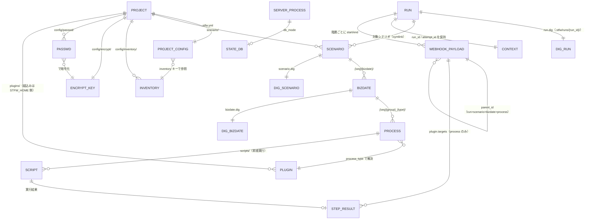

# 05 システムレイヤー

## 解析メタ情報

| 項目 | 値 |
|------|-----|
| 解析対象リポジトリ | /Users/suwa_sh/src/github.com/scenario-test-framework/stfw |
| コミットハッシュ | ed02ba61d48212a49c416e309925bbe0ac825759 |
| 解析日 | 2026-07-07 |
| フェーズ | Phase5（システム: 情報 / 状態モデル / 条件 / バリエーション） |
| 前提 | analysis/01-overview.md 〜 analysis/04-boundary.md |

前提・読み方:

- stfw は RDBMS を使わない。情報は**ディレクトリ構造・YAML・生成ファイル**として永続化される
  （事実: 01-overview.md 技術スタック「データストア」, src/bin/lib/setenv:119-128）。
  情報の ID は「ディレクトリ名・ファイル名の命名規則」が担う（例: 業務日付 = `_{seq}_{bizdate}`）。
- コンテキストは、プロジェクトディレクトリ構成（config / scenario / .stfw）と処理の関心事から
  「プロジェクト環境 / シナリオ構造 / 実行 / 通知」の 4 つに分割した
  （推測: DDD 的なモジュール分割はリポジトリに明示されていないため、
  ディレクトリ境界と adapter/usecase/service の分割単位からの再構成）。
- Phase4 の情報仮置き名との対応は「Phase4 仮置き名との対応」の表で整合を取った（04-boundary.md 申し送り対応）。

## 情報モデル一覧

| コンテキスト | 情報 | 属性 | 関連情報 | 状態モデル | バリエーション | 確度 | 根拠 |
|-------------|-----|------|---------|-----------|---------------|------|------|
| プロジェクト環境 | stfw 本体 | STFW_HOME, VERSION, bin/ config/ plugins/ archives/ modules/ 構成 | 依存モジュール, プラグイン | - | - | high | 事実: src/bin/stfw:31-32, src/bin/lib/setenv:60-104, src/VERSION:1 |
| プロジェクト環境 | 依存モジュール | 配布 URL（URL_DIGDAG）, 配置先（modules/）, ダウンロードタイムアウト | stfw 本体 | - | - | high | 事実: src/bin/lib/setenv:100-104, src/bin/install:100-144 |
| プロジェクト環境 | プロジェクト | ID: プロジェクトディレクトリ（stfw.yml の存在で識別・探索）。config/, plugins/, scenario/, .stfw/（内部データ） | プロジェクト設定, シナリオ, インベントリ, パスワード, プラグイン | - | - | high | 事実: src/bin/stfw:14-23（stfw.yml を上位へ探索）, src/bin/lib/setenv:115-128, src/bin/lib/stfw/domain/service/spec/project_spec:14-27 |
| プロジェクト環境 | プロジェクト設定（stfw.yml） | project_version, loglevel, inventory（参照ファイル名）, webhooks.urls / on_start / on_success / on_error, server.bind / port / db_mode / max_task_threads / timezone。デフォルト → プロジェクトの順に読込・環境変数へ export | プロジェクト, インベントリ | - | ログレベル, DB モード, webhook 通知設定 | high | 事実: src/template/stfw.yml:1-33, src/config/stfw.yml:1-16, src/bin/stfw:42-49 |
| プロジェクト環境 | インベントリ | ID: インベントリファイル名（環境単位。例 staging.yml）× グループ名。グループ名, ホスト（ip \| hostname）のリスト | プロジェクト設定（inventory キーで参照）, パスワード（ホスト） | - | ホストグループ | high | 事実: src/bin/lib/stfw/domain/repository/inventory_repository:13-27（レイアウト定義）, src/template/config/inventory/staging.yml:1-8, src/bin/lib/stfw/domain/service/spec/inventory_spec:14-16 |
| プロジェクト環境 | 暗号化キー | ID: キーペア（config/encrypt/ 配下の encrypt_key / decrypt_key。プロジェクトに 1 組） | パスワード | - | - | high | 事実: src/bin/lib/stfw/domain/service/spec/passwd_spec:14-26, src/bin/lib/commons/bash_utils:249-263（RSA 2048 生成） |
| プロジェクト環境 | パスワード | ID: ホスト × ユーザー（ファイル名 `{host}-{user}`, config/passwd/ 配下）。暗号化済み文字列（password, token 等） | 暗号化キー, インベントリ（ホスト） | - | - | high | 事実: src/bin/lib/stfw/domain/service/spec/passwd_spec:28-39, src/bin/lib/stfw/domain/repository/passwd_repository:55-93 |
| プロジェクト環境 | プラグイン | ID: プラグイン名（`process/{process_type}`）。bin/（install / run / webhook）, config.yml, template/ | プロセス（プロセスタイプ）, Process 設定 | - | プロセスタイプ, プラグインスコープ | high | 事実: src/bin/lib/stfw/stfw_utils:180-205（解決順）, src/plugins/process/scripts/ のディレクトリ構成, src/bin/lib/stfw/domain/service/spec/process_spec:30-47 |
| シナリオ構造 | シナリオ | ID: シナリオ名（scenario/{name} ディレクトリ）。metadata.yml, scenario.dig | プロジェクト, 業務日付, ワークフロー定義, メタ情報 | - | - | high | 事実: src/bin/lib/stfw/domain/service/spec/scenario_spec:14-48, src/template/scenario/sample/ |
| シナリオ構造 | 業務日付 | ID: ディレクトリ名 `_{seq}_{bizdate}`。seq（実行順）, bizdate（YYYYMMDD）, metadata.yml, bizdate.dig | シナリオ, プロセス, メタ情報 | - | - | high | 事実: src/bin/lib/stfw/domain/service/spec/bizdate_spec:15-30, src/bin/lib/commons/checks:31-36（YYYYMMDD 8 桁数字） |
| シナリオ構造 | プロセス | ID: ディレクトリ名 `_{seq}_{group}_{process_type}`。seq（実行順）, group, process_type, config/config.yml（Process 設定）, metadata.yml | 業務日付, プラグイン, スクリプト, メタ情報 | 階層実行ステータス | プロセスタイプ | high | 事実: src/bin/lib/stfw/domain/service/spec/process_spec:50-74, src/plugins/process/scripts/README.adoc:19-25 |
| シナリオ構造 | スクリプト（ステップ） | ID: プロセス内 scripts/ 直下のファイル名（昇順 = 実行順）。任意言語の実行可能ファイル | プロセス, ステップ実行結果 | ステップ実行ステータス（実行結果として記録） | - | high | 事実: src/plugins/process/scripts/bin/lib/common:25-35（昇順リスト）, src/plugins/process/scripts/README.adoc:22-25,243-245, src/template/scenario/sample/_10_99990101/_10_pre_scripts/scripts/ |
| シナリオ構造 | Process / Plugin 設定（config.yml） | stfw.process.{type} 配下の任意キー（環境変数として全スクリプトへ export）。組込み → プロジェクト → シナリオ内の順に上書き | プラグイン, プロセス | - | - | high | 事実: src/bin/lib/stfw/domain/service/process_service:231-248, src/plugins/process/scripts/bin/run/execute:6-10, src/template/scenario/sample/_10_99990101/_10_pre_scripts/config/config.yml |
| シナリオ構造 | メタ情報（metadata.yml） | description, requirement_specifications（scaffold / dig 生成時に空で生成） | シナリオ, 業務日付, プロセス | - | - | high（用途は low） | 事実: src/bin/lib/stfw/domain/repository/metadata_repository:27-40, src/bin/lib/setenv:94。用途は 推測: 生成のみで参照コードが無い（FIXME 参照） |
| シナリオ構造 | ワークフロー定義（dig） | ID: run.dig / scenario.dig / bizdate.dig（各階層ディレクトリに 1 つ）。timezone, _export 変数（run_id, run_mode, stfw_*）, タスク列, _error ハンドラ | シナリオ, 業務日付, プロセス, 実行 | - | dig 生成モード | high | 事実: src/bin/lib/setenv:88-91, src/bin/lib/stfw/domain/repository/dig_repository:38-281, src/template/scenario/sample/scenario.dig:1-30 |
| 実行 | 実行（run） | ID: run_id（`_{YYYYMMDDHHMMSS}_{PID}`）。run_mode, 対象シナリオ群, attempt_id（digdag 起動後に取得）, digdag プロジェクトディレクトリ（.stfw/runs/{run_id}）, params（起動パラメータ）, digdag_start.info | ワークフロー定義, 実行コンテキスト, webhook payload | 階層実行ステータス（run 階層）, （外部）digdag attempt state | 実行モード | high | 事実: src/bin/lib/stfw/domain/service/spec/run_spec:14-58, src/bin/lib/stfw/domain/repository/run_repository:13-94, src/bin/lib/stfw/stfw_utils:361-392（params）, src/bin/lib/setenv:49（digdag_start.info） |
| 実行 | 実行コンテキスト | ID: プロセス ID（.stfw/context/{pid} ファイル）。key=value ペア（run_id, attempt_id 等）。コマンド実行の開始で初期化・終了で破棄 | 実行 | - | - | high | 事実: src/bin/lib/stfw/stfw_utils:558-610, src/bin/stfw:152-160 |
| 実行 | サーバプロセス | ID: pid ファイル（.stfw/pid、1 プロジェクト 1 プロセス）。digdag server の PID | プロジェクト, 状態 DB | server 稼働状態 | - | high | 事実: src/bin/lib/setenv:126, src/bin/lib/stfw/domain/gateway/digdag_gateway:337-459, src/bin/lib/stfw/domain/service/spec/server_spec:21-41 |
| 実行 | 状態 DB（digdag DB） | db_mode 設定で --memory / --database {dir}（テンプレート既定 .stfw/db）を切替。内容は digdag が管理 | サーバプロセス, プロジェクト設定 | - | DB モード | high | 事実: src/config/stfw.yml:11-12, src/template/stfw.yml:30-31 |
| 実行 | 実行ログ | ID: ログファイル .stfw/stfw.log（日次ローテーション）。シークレットマスキング済みログ行, セクション別処理時間 | プロジェクト, 実行 | - | ログレベル | high | 事実: src/bin/lib/setenv:144-151, src/bin/stfw:167-168（rotatelog_by_day_first）, src/bin/lib/stfw/stfw_utils:497-548（処理時間付き開始終了ログ） |
| 実行 | digdag 管理情報 | 外部システム digdag 内の project / session / attempt / task。stfw は attempt_id・state・log を参照し、UC14 で全操作をラップ | 実行 | （外部）digdag attempt state | - | medium | 事実: src/bin/lib/stfw/domain/gateway/digdag_gateway:204-316（attempt_id / log / state 取得）。推測: 内部データモデルは digdag 側の資産で、stfw リポジトリに定義は無い |
| 通知 | webhook payload | ID: webhook_id（run_id + digdag task_name から導出。parent_id で run > scenario > bizdate > process の親子ツリーを構成）。type, status, create/start/end_time, processing_time, stfw.host/user/home/version, digdag.url/version, project.home/version ＋階層別属性（run: run_id/workspace_dir/params, scenario: name, bizdate: dirname/seq/bizdate, process: dirname/seq/group） | 実行, シナリオ, 業務日付, プロセス, ステップ実行結果 | 階層実行ステータス（status として記録） | 階層タイプ, webhook イベント種別, webhook 通知設定 | high | 事実: src/config/webhook/payload.yml:1-21, src/config/webhook/{run,scenario,bizdate,process}.yml, src/bin/lib/stfw/domain/service/spec/webhook_spec:14-47, src/bin/lib/stfw/domain/repository/webhook_repository:252-288（階層別テンプレート合成） |
| 通知 | ステップ実行結果 | ID: script_name（process payload の plugin.targets 配下）。result, start_time, end_time, processing_time | webhook payload, スクリプト | ステップ実行ステータス | - | high | 事実: src/plugins/process/scripts/bin/webhook/template_detail.yml, src/plugins/process/scripts/bin/lib/common:134-184, src/plugins/process/scripts/README.adoc:33-57 |

### Phase4 仮置き名との対応

| Phase4 の仮置き名（04-boundary.md） | 本書の情報 | 備考 |
|--------------------------------------|-----------|------|
| プロジェクト / プロジェクト設定 | プロジェクト / プロジェクト設定（stfw.yml） | そのまま |
| 暗号化キー / パスワード / インベントリ | 同名 | そのまま |
| シナリオ / 業務日付 / プロセス / スクリプト | 同名（スクリプト＝ステップ） | そのまま |
| ワークフロー定義（dig） | ワークフロー定義（dig） | そのまま |
| 実行（run_id・attempt_id） | 実行（run） | attempt_id は実行の属性に整理 |
| 実行コンテキスト | 実行コンテキスト | そのまま |
| webhook payload | webhook payload | そのまま |
| 処理時間（UC11） | webhook payload / 実行ログの属性 processing_time | 独立情報とせず属性に整理（事実: src/bin/lib/commons/processing_time を webhook_repository:201-246 とログが利用） |
| ステップ実行結果（UC12） | ステップ実行結果 | そのまま |
| 実行ログ | 実行ログ | そのまま |
| プラグイン | プラグイン | そのまま |
| stfw 本体 / 依存モジュール（UC01） | stfw 本体 / 依存モジュール | そのまま |
| サーバプロセス（pid）/ 状態 DB（UC08） | サーバプロセス / 状態 DB（digdag DB） | そのまま |
| digdag 管理情報全般（UC14） | digdag 管理情報 | 外部システム内の情報として medium で記録 |
| SSH known_hosts（UC15・候補） | （情報として不採用） | UC15 自体が low の候補のため、情報モデルには含めない。採否は Phase3 ユーザー確認に委ねる（推測: gen_ssh_server_key は未参照。04-boundary.md FIXME の引き継ぎ） |

## 情報モデル間の連携

（根拠: 事実: 各エンティティの根拠は情報モデル一覧の該当行を参照。ツリー構造は
src/bin/lib/stfw/domain/repository/dig_repository:38-281 と src/config/webhook/process.yml:1-8
のコメントアウトされた階層構造）

## 状態モデル一覧

| コンテキスト | 状態モデル | 状態 | 遷移UC | 遷移先状態 | 確度 | 根拠 |
|-------------|-----------|------|--------|-----------|------|------|
| 通知 / 実行 | 階層実行ステータス（run / scenario / bizdate / process の各階層） | （初期） | UC11 階層 setup / UC12 プロセス開始（webhook start 通知で記録） | Started | high | 事実: src/bin/lib/stfw/domain/repository/webhook_repository:17,59,101,144（start 時 status=STATUS_STARTED）, src/plugins/{run,scenario,bizdate,process}/__common/setup/10_webhook_start |
| 通知 / 実行 | 階層実行ステータス | Started | UC11 階層 teardown（正常経路: stfw_run_status=Success）/ UC12 プロセス正常終了（retcode=0） | Success | high | 事実: src/bin/lib/stfw/domain/repository/dig_repository:80-83,169-173,265-269（teardown で stfw_run_status=Success を _export）, src/bin/lib/stfw/domain/repository/webhook_repository:39,80,122（end 時 status=stfw_run_status）,170-174（process: retcode=0 → Success） |
| 通知 / 実行 | 階層実行ステータス | Started | UC11 階層 teardown（_error 経路: stfw_run_status=Error）/ UC12 プロセス異常終了（retcode≠0） | Error | high | 事実: src/bin/lib/stfw/domain/repository/dig_repository:85-88,175-178,271-274（_error で stfw_run_status=Error）, src/bin/lib/stfw/domain/repository/webhook_repository:170-174, src/template/scenario/sample/scenario.dig:26-30 |
| 通知 / 実行 | 階層実行ステータス | Success / Error | （終了状態） | - | high | 事実: end 通知後の遷移コードは存在しない（webhook_repository:32-190） |
| 通知 / シナリオ構造 | ステップ実行ステータス（scripts プラグインのスクリプト単位） | （初期） | UC12 プロセス開始（start 通知の詳細生成時に全スクリプトを Pending で列挙） | Pending | high | 事実: src/plugins/process/scripts/bin/webhook/get_start_content:10-13, src/plugins/process/scripts/bin/lib/common:141-146（mode=start → STATUS_PENDING） |
| 通知 / シナリオ構造 | ステップ実行ステータス | Pending | UC12 スクリプト正常終了（retcode=0） | Success | high | 事実: src/plugins/process/scripts/bin/lib/common:155-157（result: retcode=0 → Success） |
| 通知 / シナリオ構造 | ステップ実行ステータス | Pending | UC12 スクリプト異常終了（retcode≠0） | Error | high | 事実: src/plugins/process/scripts/bin/lib/common:155-157（retcode≠0 → Error）,91-96 |
| 通知 / シナリオ構造 | ステップ実行ステータス | Pending | UC12 先行スクリプトのエラーによりスキップ | Blocked | high | 事実: src/plugins/process/scripts/bin/lib/common:75-80（skip 判定）,148-153（mode=skip → STATUS_BLOCKED）, src/plugins/process/scripts/README.adoc:212-213 |
| 通知 / シナリオ構造 | ステップ実行ステータス | Success / Error / Blocked | （終了状態） | - | high | 事実: 遷移コードは bulk_exec_scripts の 1 パスのみ（common:61-108） |
| 実行 | server 稼働状態 | 停止中 | UC08 server start（digdag server を nohup 起動し pid ファイル作成） | 起動中 | high | 事実: src/bin/lib/stfw/domain/gateway/digdag_gateway:337-381, src/bin/lib/stfw/domain/service/spec/server_spec:21-29（pid ファイル存在で多重起動拒否） |
| 実行 | server 稼働状態 | 起動中 | UC08 server stop（SIGTERM + pid ファイル削除）。プロセス消滅検知時は is_running が pid ファイルを自動削除 | 停止中 | high | 事実: src/bin/lib/stfw/domain/gateway/digdag_gateway:402-417,439-459 |

- 補足（状態の帰属）: 「階層実行ステータス」は情報「webhook payload」の status 属性として永続化される。
  stfw 内部に階層ステータスの永続テーブルは無く、dig の `_export`（stfw_run_status）と webhook 通知が
  状態の実体である（事実: src/bin/lib/stfw/domain/repository/dig_repository:80-88, webhook_repository:32-50）。
- 補足（外部の状態モデル）: digdag attempt state（running → success / error 等）は外部システム digdag が
  管理する。stfw は UC10 で `get_state` により参照し「success 以外はエラー」とだけ判定する
  （事実: src/bin/lib/stfw/domain/repository/run_repository:86-91, digdag_gateway:308-316。
  推測: digdag 内部の状態遷移全体は stfw リポジトリからは読めないため対象外とした）。
- 補足（Phase1/Phase4 との整合）: setenv:27-31 の 5 定数（Pending/Started/Success/Error/Blocked）は
  単一の enum だが、実装上は「階層実行ステータス（Started→Success/Error）」と
  「ステップ実行ステータス（Pending→Success/Error/Blocked）」の 2 つの状態モデルに分かれて使われる。
  Phase4 UC12 の仮置き「Pending → Started → Success/Error/Blocked」は本書で上記 2 モデルに分割・確定した
  （04-boundary.md は状態名を Phase5 確定前の仮置きと明記しているため矛盾ではない）。

## バリエーション一覧

| コンテキスト | バリエーション | 値 | 説明 | 確度 | 根拠 |
|-------------|---------------|----|----|------|------|
| 実行 | 実行モード（run_mode） | --run, --dry-run | dry-run は実タスク（execute / post_execute）を実行しない検証モード | high | 事実: src/bin/lib/stfw/domain/repository/dig_repository:24,39, src/bin/cmd/run:34, src/bin/lib/stfw/domain/service/process_service:77-121 |
| シナリオ構造 | dig 生成モード | self, cascade | 自階層のみ生成 / 配下の bizdate.dig まで連鎖生成 | high | 事実: src/bin/lib/setenv:36-41, src/bin/lib/stfw/domain/repository/dig_repository:103,182-188, src/bin/cmd/scenario:35-36（-g / -G） |
| 通知 | 階層タイプ（webhook type） | run, scenario, bizdate, process | payload のテンプレート合成と id 導出の軸 | high | 事実: src/bin/lib/stfw/domain/repository/webhook_repository:15,57,99,142,256-279, src/config/webhook/{run,scenario,bizdate,process}.yml |
| 通知 | webhook イベント種別 | start, end | 各階層の開始 / 終了時に通知。end の status は Success / Error | high | 事実: src/bin/lib/stfw/domain/repository/webhook_repository:20,41（_event）, src/bin/lib/stfw/domain/service/spec/webhook_spec:42-47 |
| 通知 | webhook 通知設定 | on_start, on_success, on_error（各 true / false） | イベント種別ごとの通知 ON/OFF | high | 事実: src/template/stfw.yml:20-22, src/bin/lib/stfw/domain/service/spec/webhook_spec:55-212 |
| プロジェクト環境 | ログレベル | trace, debug, info, warn, error | 設定・-l オプションで変更可（デフォルト info） | high | 事実: src/config/stfw.yml:2-3, src/bin/lib/stfw/stfw_utils:79-97, src/bin/stfw:71,109-112 |
| 実行 | DB モード | --memory, --database {dir} | digdag 状態 DB の保持方式（デフォルト config は --memory、プロジェクトテンプレートは --database .stfw/db） | high | 事実: src/config/stfw.yml:11-12, src/template/stfw.yml:30-31 |
| プロジェクト環境 | ホストグループ | web, ap, db（サンプル。名称は任意定義）＋ all（全グループ横断の予約値） | inventory のグルーピング単位 | high | 事実: src/template/config/inventory/staging.yml:1-8, src/bin/lib/setenv:43-45（STFW__INVENTORY_GROUP_ALL）, src/bin/lib/stfw/domain/repository/inventory_repository:62-64 |
| プロジェクト環境 | プロセスタイプ | scripts（同梱はこれのみ。プラグイン追加で拡張可） | プロセスの実行方式の種別 | high | 事実: src/plugins/process/{__common,scripts}, src/bin/cmd/process:36（--init <process-type>） |
| プロジェクト環境 | プラグインスコープ | プロジェクト（{proj}/plugins/）, 組込み（STFW_HOME/plugins/） | 同名プラグインはプロジェクト側が優先 | high | 事実: src/bin/lib/stfw/stfw_utils:180-205, src/bin/lib/stfw/domain/service/process_service:20-35（--global 切替） |
| 実行 | 終了コード | 0（SUCCESS）, 3（WARN）, 6（ERROR） | スクリプト・コマンド共通の終了コード体系 | high | 事実: src/bin/lib/setenv:20-22, src/plugins/process/scripts/README.adoc:233-236 |
| プロジェクト環境 | 対応 OS 種別 | linux, mac（cygwin はコメントアウトで未対応） | OS 依存設定（JAVA_HOME 等）の分岐軸 | medium | 事実: src/bin/lib/setenv:162-177。推測: 分岐は mac のみ実装済みで、明示的な OS サポート宣言は無い |

## 条件一覧

| コンテキスト | 条件 | 条件の説明 | バリエーション | 状態モデル | 確度 | 根拠 |
|-------------|-----|-----------|---------------|-----------|------|------|
| シナリオ構造 | 業務日付フォーマット | bizdate は YYYYMMDD の 8 桁数字であること（scaffold 生成時に検証） | - | - | high | 事実: src/bin/lib/commons/checks:31-36, src/bin/lib/stfw/domain/service/spec/bizdate_spec:78-80 |
| シナリオ構造 | 連番フォーマット | bizdate / process の seq は数値のみであること | - | - | high | 事実: src/bin/lib/commons/checks:15-20, bizdate_spec:75-76, process_spec:130-132 |
| シナリオ構造 | グループ名制約 | process の group に `_` を含めないこと（ディレクトリ名の `_` 区切りパースを保護） | - | - | high | 事実: src/bin/lib/stfw/domain/service/spec/process_spec:134-136, checks:39-47, process_spec:70-74（`cut -d '_'` でのパース） |
| シナリオ構造 | 実行対象ディレクトリ規則 | `_` 始まりのディレクトリのみを dig のタスクとして採用し、名前昇順に実行順を決定する | - | - | high | 事実: src/bin/lib/stfw/domain/repository/dig_repository:136-140,229-234（grep "^_" + sort） |
| シナリオ構造 | 階層ディレクトリ判定 | scenario / bizdate / process ディレクトリは「scenario ルートからの深さ」と「プロジェクト直下の stfw.yml の存在」で判定する | - | - | high | 事実: src/bin/lib/stfw/domain/service/spec/scenario_spec:30-69, bizdate_spec:33-51, process_spec:77-95 |
| シナリオ構造 / 通知 | 逐次実行・エラー時 Blocked | スクリプトはファイル名昇順に逐次実行し、エラー発生後の後続スクリプトは実行せず Blocked として記録する | - | ステップ実行ステータス | high | 事実: src/plugins/process/scripts/bin/lib/common:61-108（skip 判定と Blocked 記録）, README.adoc:212-213 |
| 実行 | run 実行の前提条件 | シナリオ実行は digdag server が起動中（pid 生存）であること。対象シナリオディレクトリが存在すること | - | server 稼働状態 | high | 事実: src/bin/lib/stfw/domain/service/spec/run_spec:66-88 |
| 実行 | server 多重起動禁止 | pid ファイルが存在する場合は start 不可。存在しない場合は stop 不可 | - | server 稼働状態 | high | 事実: src/bin/lib/stfw/domain/service/spec/server_spec:21-41 |
| 実行 | dry-run の実行範囲 | dry-run は setup → pre_execute → teardown のみ実行し、execute / post_execute をスキップする | 実行モード | - | high | 事実: src/bin/lib/stfw/domain/service/process_service:77-121, src/bin/cmd/process:37 |
| 実行 | プロセス実行の前提条件 | 対象プロセスタイプのプラグインがインストール済み（is_installed=true）であること | プロセスタイプ, プラグインスコープ | - | high | 事実: src/bin/lib/stfw/domain/service/spec/process_spec:142-181 |
| プロジェクト環境 | プロジェクト再初期化禁止 | プロジェクトディレクトリに stfw.yml が既に存在する場合、init はエラーとする | - | - | high | 事実: src/bin/lib/stfw/domain/service/spec/project_spec:33-43 |
| プロジェクト環境 | パスワード重複登録禁止 | 同一ホスト × ユーザーの passwd ファイルが存在する場合、保存不可（参照は存在必須） | - | - | high | 事実: src/bin/lib/stfw/domain/service/spec/passwd_spec:56-77 |
| プロジェクト環境 | 暗号化キー再生成の抑止 | キーディレクトリが存在する場合、生成不可。--force 指定時のみ削除して再生成 | - | - | high | 事実: src/bin/lib/stfw/domain/service/spec/passwd_spec:47-53, src/bin/cmd/gen-encrypt-key:36,58-61（-f, --force） |
| プロジェクト環境 | 設定の上書き順 | stfw.yml はデフォルト（STFW_HOME/config）→ プロジェクトの順に読込・上書き。プラグイン設定は組込み config.yml → プロジェクト config.yml → シナリオ内 Process 設定の順 | プラグインスコープ | - | high | 事実: src/bin/stfw:42-49, src/bin/lib/stfw/domain/service/process_service:231-248, src/plugins/process/scripts/bin/run/execute:6-10 |
| プロジェクト環境 | プラグイン解決順 | 同名プラグインはプロジェクト側 → 組込みの順で解決する | プラグインスコープ | - | high | 事実: src/bin/lib/stfw/stfw_utils:180-205 |
| プロジェクト環境 | inventory 全件指定 | グループ名 all 指定時は全グループのホストを対象とする（グループ存在確認はホスト取得結果の有無で判定） | ホストグループ | - | high | 事実: src/bin/lib/stfw/domain/repository/inventory_repository:62-64,103-118 |
| 通知 | webhook 送信判定 | start 通知は on_start=true の場合のみ、end 通知は結果ステータスに応じて on_success / on_error=true の場合のみ送信する | webhook イベント種別, webhook 通知設定 | 階層実行ステータス | high（実装バグ疑いは FIXME 参照） | 事実: src/bin/lib/stfw/domain/service/spec/webhook_spec:55-212 |
| 通知 | webhook status 決定 | start 時は Started 固定。end 時は run/scenario/bizdate が dig の stfw_run_status（Success / Error）、process はリターンコード 0 → Success / それ以外 → Error | 階層タイプ | 階層実行ステータス | high | 事実: src/bin/lib/stfw/domain/repository/webhook_repository:17,38-39,170-174, src/bin/lib/stfw/domain/repository/dig_repository:80-88 |
| 実行 | シークレットマスキング | ログ出力時に環境変数 PASSWORD / TOKEN の値を `[secret]` に置換する | - | - | high | 事実: src/bin/lib/setenv:146-151 |
| 実行 | run_id / attempt_id の採番・保持 | run_id は `_{YYYYMMDDHHMMSS}_{PID}` で採番し実行コンテキストに保持。attempt_id は digdag start の出力（digdag_start.info）から取得し、無ければエラー | - | - | high | 事実: src/bin/lib/stfw/domain/service/spec/run_spec:14-58, src/bin/lib/stfw/domain/gateway/digdag_gateway:170-227,480- |

## FIXME / 申し送り

- FIXME: **webhook end 通知の ON/OFF 判定に実装バグの疑い**。
  `webhook_spec` の end 系判定が文字列ステータスを数値比較演算子 `-eq` で比較している
  （`[[ "${stfw_run_status}" -eq "${STATUS_SUCCESS}" ]]` 等。事実: src/bin/lib/stfw/domain/service/spec/webhook_spec:73-78,109-114,148-153,193-198）。
  bash の `[[ -eq ]]` は非数値文字列を 0 と評価するため Success / Error の両分岐が常に真となり、
  on_success=false / on_error=false による抑制が意図どおり機能しない可能性が高い。
  as-is 挙動として記録し、要件化の際は「設定による抑制が仕様」か「常時送信が実態」かを確認すること。
- FIXME: **webhook_id 導出の引数に余分な `}`**。
  `stfw.domain.service.spec.webhook.id` が process 以外の階層で `"${_tmp_webhook_id}}"` と
  閉じ括弧を 1 つ余分に渡している（事実: src/bin/lib/stfw/domain/service/spec/webhook_spec:23）。
  id 末尾に `}` が混入し、payload の親子ツリー（parent_id 連結）が崩れる可能性がある。as-is 記録。
- FIXME: **metadata.yml は生成のみで未参照**。
  scaffold / dig 生成時に description / requirement_specifications を空で生成するが、
  読み取るコードがリポジトリに存在しない（事実: src/bin/lib/stfw/domain/repository/metadata_repository:27-40。
  grep で参照箇所ゼロ）。将来のドキュメント連携用と推測されるが用途不明。Phase3 確認対象。
- FIXME: **process setup の呼び分けロジックが teardown と非対称**。
  setup は組込みプラグインの setup が**失敗した場合のみ**プロジェクトプラグインの setup を実行するが
  （事実: src/bin/lib/stfw/domain/service/process_service:196-206 の `-ne` 判定）、
  teardown は両方を無条件実行する（同 210-228）。フォールバック仕様か `-eq` の誤記かを読み取れない。
  as-is 記録とし、要件化時に確認すること。
- FIXME: **process の group と inventory のホストグループの対応が不明**。
  プロセスディレクトリ名の group（例: サンプルは `pre`）と inventory のグループ（web/ap/db）を
  関連づけるコードは存在しない（事実: src/bin/lib/stfw/domain/service/spec/process_spec:50-74 は命名にのみ使用。
  推測: webhook payload への表示ラベル兼、ユーザースクリプトが inventory 参照時に使う想定）。
  情報モデル上は両者を独立として扱った。Phase3 確認対象。
- 申し送り（USDM / RDRA フルビルドへ）: 状態モデルは「階層実行ステータス」「ステップ実行ステータス」
  「server 稼働状態」の 3 つを正とする。setenv:27-31 の 5 定数を単一 enum として扱わないこと。
- 申し送り: 「情報」の永続化はすべてファイル/ディレクトリであり、ID はパス命名規則が担う。
  スキーマ移行（マイグレーション）に相当する資産は無いため、命名規則の変更は破壊的変更になる。

## 整合性チェック結果（01〜05 全ドキュメント）

| # | チェック観点 | 結果 | 備考 |
|---|-------------|------|------|
| 1 | BUC（03）が参照するアクター / 外部システムが 02 の定義に存在するか | OK | アクター 4 名（テスト実行者 / シナリオ作成者 / 環境管理者 / テスト結果確認者）、外部システム（digdag / webhook 受信先 / テスト対象ホスト群 / dl.bintray.com）とも 02 の申し送りどおり 03・04 で一貫使用 |
| 2 | UC（04）が操作する情報が 05 の情報モデルに定義されているか | OK（1 件保留） | 「Phase4 仮置き名との対応」表で全件マッピング済み。処理時間・ステップ実行結果は属性 / 独立情報として整理。UC15 の「SSH known_hosts」のみ UC 自体が low 候補のため情報化を保留（04-boundary.md の FIXME と連動） |
| 3 | 状態モデル（05）の遷移 UC が UC 一覧（04）に存在するか | OK | 階層実行ステータス→UC11/UC12、ステップ実行ステータス→UC12、server 稼働状態→UC08。いずれも 04 の UC 一覧に存在 |
| 4 | 情報が参照する状態モデル / バリエーション / 関連情報が定義されているか | OK | 情報モデル一覧の状態モデル・バリエーション列はすべて本書の状態モデル一覧・バリエーション一覧に定義あり |
| 5 | 条件（05）が参照するバリエーション / 状態モデルが定義されているか | OK | 条件一覧の参照はすべて定義済み |
| 6 | 04 の状態仮置きとの整合 | OK（分割を記録） | UC12 の仮置き「Pending → Started → Success/Error/Blocked」は、実装証拠に基づき「階層実行ステータス」と「ステップ実行ステータス」の 2 モデルに分割した（状態モデル一覧の補足参照）。04 は仮置きと明記しているため矛盾ではない |
| 7 | 定義したが未参照の要素 | 2 件 FIXME | metadata.yml（生成のみ・未参照）、gen_ssh_server_key（03/04 からの継続 FIXME）。いずれも Phase3 確認対象 |
| 8 | ドキュメント間の記述矛盾 | なし（補足 1 件） | 01 の「プロセス実行ステータス（5 値の単一 enum）」は 05 で 2 状態モデルへ精緻化した。値の集合自体は一致しており矛盾ではない（本書の申し送りに記録） |

## confidence: low 項目一覧（Phase3 ユーザー確認対象）

| # | 項目 | 内容 | 手がかり |
|---|------|------|---------|
| 1 | メタ情報（metadata.yml）の用途 | description / requirement_specifications フィールドの利用目的 | 推測: 生成コードのみ存在し参照コードゼロ。将来のドキュメント連携用と推測 |
| 2 | process の group と inventory ホストグループの対応 | group がテスト対象ホストグループを指すのか、単なる表示ラベルなのか | 推測: 関連づけるコードが無い。サンプルの group は `pre` で inventory のグループ名（web/ap/db）と不一致 |
| 3 | webhook 送信抑制（on_success / on_error）の仕様 | `-eq` 比較バグにより抑制が機能していない可能性。仕様として「設定で抑制できる」を採るか「常時送信」を採るか | 推測: テンプレート（stfw.yml:20-22）は設定可能を意図しているが、実装は判定が常に真になる疑い |
| 4 | process setup のプラグイン呼び分け | 組込み setup 失敗時のみプロジェクト setup を実行する挙動が仕様かバグか | 推測: teardown は両方を無条件実行しており非対称。`-ne` は `-eq` の誤記の可能性 |
