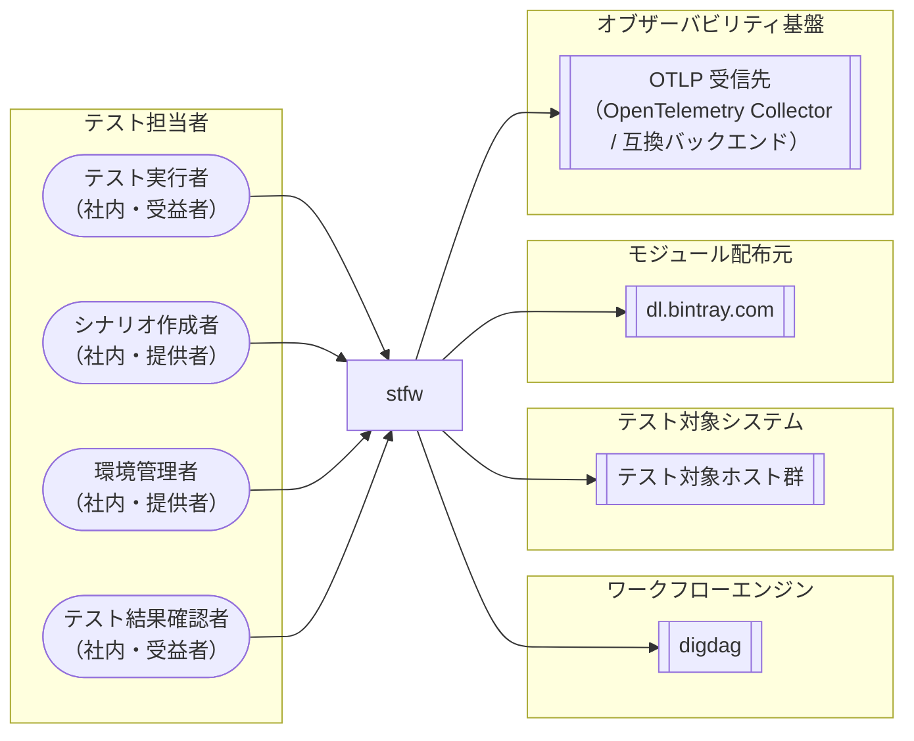

<!-- generateRdraMd.js による自動生成ファイル。手動編集しないこと。元データ: docs/rdra/latest/*.tsv -->

# システムコンテキスト

RDRA システム価値レイヤー。システムに関わるアクターと外部システムの全体像。

> 凡例: `(丸角)` アクター / `[四角]` システム / `[[二重枠]]` 外部システム

## アクター

| アクター群 | アクター | 役割 | 社内外 | 立場 | 主担当業務 |
|---|---|---|---|---|---|
| テスト担当者 | テスト実行者 | プロジェクトの初期化、実行基盤（digdag server）の起動・停止・状態確認、シナリオテストの一括自動実行を行う。導入済み環境・接続情報・検証済みテストシナリオを受け取り、順序保証・エラー時停止のもとで再現性のあるテスト結果を得る | 社内 | 受益者 | stfw導入フロー、プロジェクト初期化フロー、接続情報管理フロー、テストシナリオ作成フロー、ワークフロー定義生成・検証フロー、実行基盤制御フロー、シナリオ一括自動実行フロー |
| テスト担当者 | シナリオ作成者 | scenario > bizdate > process の3階層 scaffold 生成とテストスクリプト配置でテストシナリオを記述し、ワークフロー定義の生成・dry-run 検証とプロセスプラグインの追加・拡張を行う。追加したプロセスタイプでテスト対象固有の処理をシナリオに組み込める | 社内 | 提供者 | プロセスプラグイン拡張フロー |
| テスト担当者 | 環境管理者 | stfw の導入（アーカイブ展開・install・PATH 登録）、環境別 inventory によるテスト対象ホストのグループ管理、暗号化キー生成と資格情報（パスワード）の暗号化保管・参照、SSH サーバキーの登録を行う | 社内 | 提供者 |  |
| テスト担当者 | テスト結果確認者 | OTel トレース（OTLP 受信先経由で既存オブザーバビリティ基盤に記録されたスパンツリー）・実行ログの追従表示・ログファイル・digdag Web UI により実行状況と結果を確認し、失敗時の調査を行う | 社内 | 受益者 | 実行結果監視・確認フロー |

## 外部システム

| 外部システム群 | 外部システム | 役割 |
|---|---|---|
| ワークフローエンジン | digdag | シナリオ実行の委譲先となるワークフローエンジン。stfwがワークフロー定義（run.dig/scenario.dig/bizdate.dig）をpushして実行を開始し、sh>オペレータでstfwを呼び戻して各階層のsetup/teardown・プロセス実行を進める。server起動・停止・状態確認の制御対象であり、Web UIとログ追従で実行状況・結果の確認手段を提供する |
| テスト対象システム | テスト対象ホスト群 | シナリオテストを適用するテスト対象のホスト群（web/ap/db等）。環境別inventoryでグループ管理され、ホスト×ユーザー単位の暗号化パスワードとSSHサーバキー登録の対象となる。実際の操作はプロセスのユーザースクリプトに委ねられる |
| モジュール配布元 | dl.bintray.com | インストール時に依存モジュール（digdag jar等）をダウンロードする配布元サイト |
| オブザーバビリティ基盤 | OTLP 受信先（OpenTelemetry Collector / 互換バックエンド） | run/scenario/bizdate/process/step 各階層の実行状況を OTLP トレース（スパンツリー）として受信する OpenTelemetry Collector または OTLP 互換バックエンド（Jaeger / Grafana Tempo / Datadog 等）。既存のオブザーバビリティ基盤でそのまま可視化・分析でき、実行状況の外部監視に使う。送信先未設定時は送信されず、送信失敗は実行を失敗させない（ログ警告のみ） |
