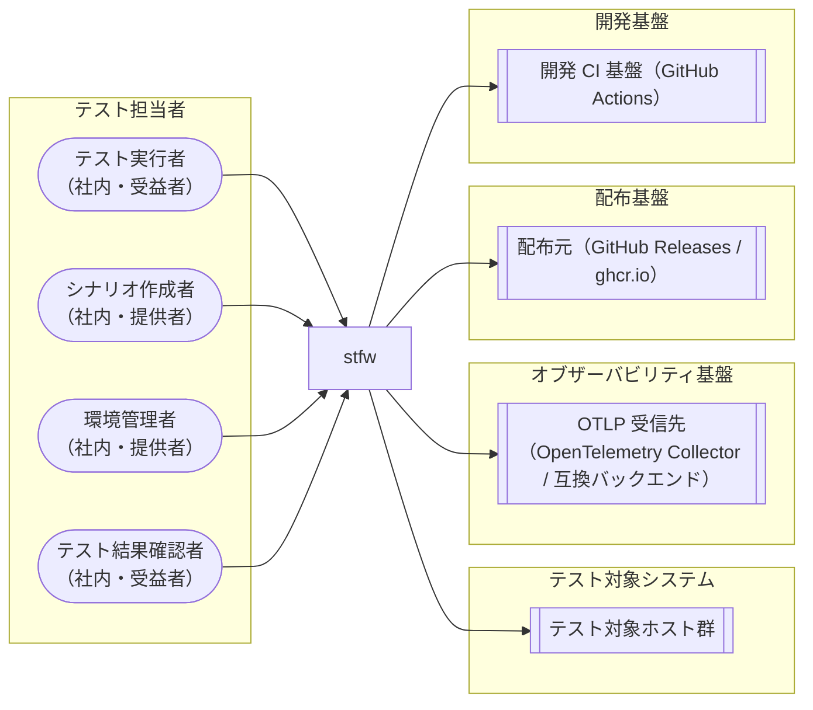

<!-- generateRdraMd.js による自動生成ファイル。手動編集しないこと。元データ: docs/rdra/latest/*.tsv -->

# システムコンテキスト

RDRA システム価値レイヤー。システムに関わるアクターと外部システムの全体像。

> 凡例: `(丸角)` アクター / `[四角]` システム / `[[二重枠]]` 外部システム

## アクター

| アクター群 | アクター | 役割 | 社内外 | 立場 | 主担当業務 |
|---|---|---|---|---|---|
| テスト担当者 | テスト実行者 | プロジェクトの初期化と、シナリオテストの一括自動実行を行う。stfw run の 1 コマンドで前準備なしに実行を開始でき、導入済み環境・接続情報・検証済みテストシナリオを受け取り、内蔵ランナーによる順序保証・エラー時停止のもとで再現性のあるテスト結果を得る | 社内 | 受益者 | stfw導入フロー、プロジェクト初期化フロー、接続情報管理フロー、テストシナリオ作成フロー、シナリオ静的検証フロー、シナリオ一括自動実行フロー |
| テスト担当者 | シナリオ作成者 | scenario > bizdate > process の3階層 scaffold 生成（stfw new）とテストスクリプト配置でテストシナリオを記述し、静的検証（stfw validate）・dry-run 検証とプロセスプラグインの追加・拡張を行う。追加したプロセスタイプでテスト対象固有の処理をシナリオに組み込める | 社内 | 提供者 | プロセスプラグイン拡張フロー |
| テスト担当者 | 環境管理者 | stfw の導入（配布物: マルチプラットフォームバイナリ / Docker image / compose.yaml の取得・配置）、環境別 inventory によるテスト対象ホストのグループ管理、暗号化キー生成と資格情報の暗号化保管・参照・旧形式からの移行（stfw secret）、SSH サーバキーの一括登録（stfw ssh trust）を行う | 社内 | 提供者 |  |
| テスト担当者 | テスト結果確認者 | stfw status（実行ジャーナルのリプレイによる階層ツリー表示）・stfw report（静的 HTML レポート）・OTel トレース（OTLP 受信先経由で既存オブザーバビリティ基盤に記録されたスパンツリー）・ログファイルにより実行状況と結果を確認し、失敗時の調査を行う | 社内 | 受益者 | 実行結果監視・確認フロー |

## 外部システム

| 外部システム群 | 外部システム | 役割 |
|---|---|---|
| テスト対象システム | テスト対象ホスト群 | シナリオテストを適用するテスト対象のホスト群（web/ap/db等）。環境別inventoryでグループ管理され、ホスト×ユーザー単位の暗号化資格情報（age (X25519)）とstfw ssh trustによるSSHサーバキー一括登録の対象となる。実際の操作はプロセスのユーザースクリプトに委ねられる |
| オブザーバビリティ基盤 | OTLP 受信先（OpenTelemetry Collector / 互換バックエンド） | run/scenario/bizdate/process/step 各階層の実行状況を OTLP トレース（スパンツリー）として受信する OpenTelemetry Collector または OTLP 互換バックエンド（Jaeger / Grafana Tempo / Datadog 等）。既存のオブザーバビリティ基盤でそのまま可視化・分析でき、実行状況の外部監視に使う。送信先未設定時は送信されず、送信失敗は実行を失敗させない（ログ警告のみ） |
| 配布基盤 | 配布元（GitHub Releases / ghcr.io） | stfwの配布物の取得元。GitHub Releasesがマルチプラットフォームバイナリ（linux/darwin × amd64/arm64 + windows/amd64）を、ghcr.ioがDocker image / compose.yaml（stfw + nginx）を配布する。tag付与時に開発CI基盤（goreleaser）から公開され、環境管理者が導入時に取得する（旧dl.bintray.comからの依存モジュールダウンロードは廃止） |
| 開発基盤 | 開発 CI 基盤（GitHub Actions） | フレームワーク自体の品質保証と配布を担うCI/CD基盤。PRでlint（golangci-lint）+ test（Go単体テスト + testscript受け入れテスト）、masterマージでsnapshotビルド、tag付与でgoreleaserによるリリースとghcr.ioへのDocker image配布を実行する（shunit2 / serverspec / kcov / shellcheck / Travis CIによる検証基盤は廃止） |
