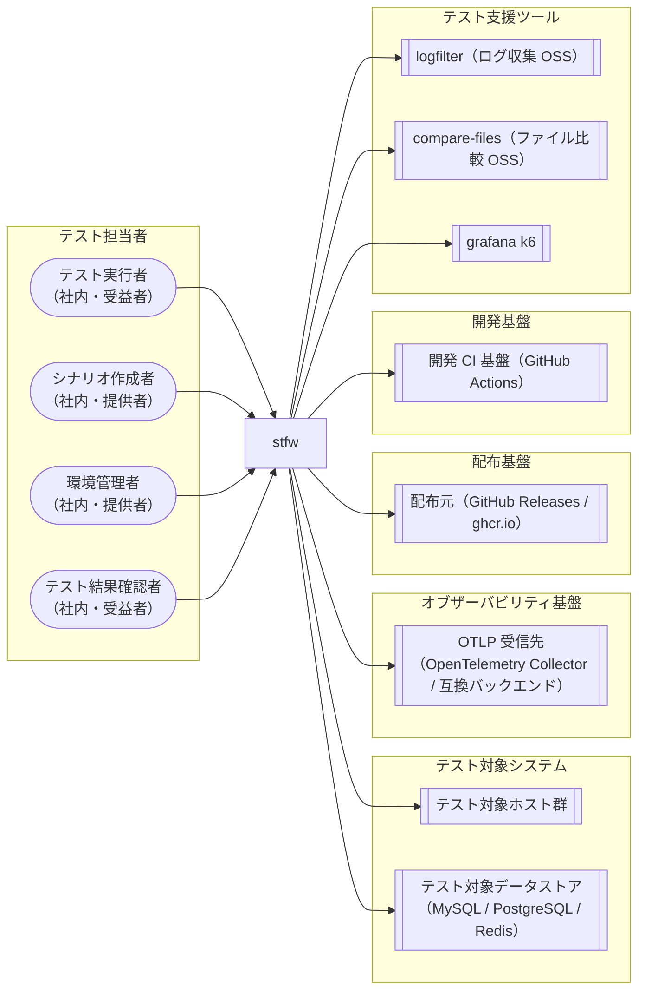

<!-- generateRdraMd.js による自動生成ファイル。手動編集しないこと。元データ: docs/rdra/latest/*.tsv -->

# システムコンテキスト

RDRA システム価値レイヤー。システムに関わるアクターと外部システムの全体像。

> 凡例: `(丸角)` アクター / `[四角]` システム / `[[二重枠]]` 外部システム

## アクター

| アクター群 | アクター | 役割 | 社内外 | 立場 | 主担当業務 |
|---|---|---|---|---|---|
| テスト担当者 | テスト実行者 | プロジェクトの初期化と、シナリオテストの一括自動実行を行う。stfw run の 1 コマンドで前準備なしに実行を開始でき、導入済み環境・接続情報・検証済みテストシナリオを受け取り、内蔵ランナーによる順序保証・エラー時停止のもとで再現性のあるテスト結果を得る。実行ステータス Warn の一級化により、回帰テストモード（比較不一致で Error 停止・従来挙動）と機能変更の差分確認モード（比較不一致等を Warn として記録し最後まで実行）の 2 つの運用を選択でき、CI では stfw run の終了コード（全 Success=0 / Warn あり・Error なし=3 / Error あり=6）だけで「差分あり」を検知できる。run 開始時には保存期間を過ぎた過去の実行結果（実行ジャーナル・HTML レポート）が自動ハウスキープされ、継続的に利用しても実行結果の累積でストレージが逼迫しない | 社内 | 受益者 | stfw導入フロー、プロジェクト初期化フロー、接続情報管理フロー、テストシナリオ作成フロー、シナリオ静的検証フロー、シナリオ一括自動実行フロー |
| テスト担当者 | シナリオ作成者 | scenario > bizdate > process の3階層 scaffold 生成（stfw new）とテストスクリプト配置でテストシナリオを記述し、静的検証（stfw validate）・dry-run 検証とプロセスプラグインの追加・拡張を行う。組み込みプラグイン群（収集系 collectLog / collectFile・データストア系 export / import / clear・検証系 compare・実行系 invokeWeb / invokeRest）でデータ準備・実行・エビデンス収集・期待値比較をシナリオに組み込め、カスタムプラグイン実装ガイドを参照してプロダクト固有のカスタムプラグイン（updateBizDate / invokeJob / importMaster 等）を組み込みプラグインの組み合わせで実装できる。さらに stfw scenario reverse でシナリオツリー（規約ベースの記述＝正）から spec（<name>.yml）とドキュメント（<name>.md）をセット生成し、stfw scaffold で spec からツリーを生成・差分同期（--sync）して、シナリオ構造を単一ファイルで版管理・共有・再生成できる | 社内 | 提供者 | プロセスプラグイン拡張フロー |
| テスト担当者 | 環境管理者 | stfw の導入（配布物: マルチプラットフォームバイナリ / Docker image / compose.yaml の取得・配置）、環境別 inventory によるテスト対象ホストのグループ管理、暗号化キー生成と資格情報の暗号化保管・参照・旧形式からの移行（stfw secret）、SSH サーバキーの一括登録（stfw ssh trust）を行う | 社内 | 提供者 |  |
| テスト担当者 | テスト結果確認者 | stfw status（実行ジャーナルのリプレイによる階層ツリー表示）・stfw report（静的 HTML レポート）・OTel トレース（OTLP 受信先経由で既存オブザーバビリティ基盤に記録されたスパンツリー）・ログファイルにより実行状況と結果を確認し、失敗時の調査を行う。Warn ステータスは stfw status・HTML レポートで黄系の色で表示され、OTel トレースではスパンステータス Ok + stfw の status 属性で確認できる。HTML レポートは Warn の一覧性により、そのまま「比較 NG の鳥瞰」ビューとして利用できる。invoke 系（invokeRest / invokeWeb）の Act 実行については、エビデンス（k6 サマリ evidence/summary.json と人間可読な HTML レポート evidence/report.html）で API / ブラウザ実行の結果を確認できる | 社内 | 受益者 | 実行結果監視・確認フロー |

## 外部システム

| 外部システム群 | 外部システム | 役割 |
|---|---|---|
| テスト対象システム | テスト対象ホスト群 | シナリオテストを適用するテスト対象のホスト群（web/ap/db等）。環境別inventoryでグループ管理され、ホスト×ユーザー単位の暗号化資格情報（age (X25519)）とstfw ssh trustによるSSHサーバキー一括登録の対象となる。実際の操作はプロセスのユーザースクリプトに委ねられるほか、組み込みプラグインによるscp/ssh経由のログ・ファイル収集（collectLog / collectFile）、sshでのリモートスクリプト一括実行（sshExec）とscpでのローカルファイル原子的配置（scpPut）、grafana k6による画面・APIでの取引入力・検証（invokeWeb / invokeRest）の対象となる。リモートアクセス系（sshExec / scpPut）の接続先もinventoryのグループ名参照で指定され、資格情報はsecret（age暗号化）の{host}-{user}自動参照・SSHホストキーはssh trust（known_hosts）の既存機構を再利用する |
| オブザーバビリティ基盤 | OTLP 受信先（OpenTelemetry Collector / 互換バックエンド） | run/scenario/bizdate/process/step 各階層の実行状況を OTLP トレース（スパンツリー）として受信する OpenTelemetry Collector または OTLP 互換バックエンド（Jaeger / Grafana Tempo / Datadog 等）。既存のオブザーバビリティ基盤でそのまま可視化・分析でき、実行状況の外部監視に使う。送信先未設定時は送信されず、送信失敗は実行を失敗させない（ログ警告のみ） |
| 配布基盤 | 配布元（GitHub Releases / ghcr.io） | stfwの配布物の取得元。GitHub Releasesがマルチプラットフォームバイナリ（linux/darwin × amd64/arm64 + windows/amd64）を、ghcr.ioがDocker image / compose.yaml（stfw + nginx）を配布する。Docker imageは既存の最小構成に加えて、プラグインのランタイム依存（k6・mysql/psqlクライアント・ssh/scp等）全部入りのタグ（例: stfw:full）を提供する。tag付与時に開発CI基盤（goreleaser）から公開され、環境管理者が導入時に取得する（旧dl.bintray.comからの依存モジュールダウンロードは廃止） |
| 開発基盤 | 開発 CI 基盤（GitHub Actions） | フレームワーク自体の品質保証と配布を担うCI/CD基盤。PRでlint（golangci-lint）+ test（Go単体テスト + testscript受け入れテスト）、masterマージでsnapshotビルド、tag付与でgoreleaserによるリリースとghcr.ioへのDocker image配布を実行する（shunit2 / serverspec / kcov / shellcheck / Travis CIによる検証基盤は廃止） |
| テスト対象システム | テスト対象データストア（MySQL / PostgreSQL / Redis） | データストア系プラグイン（export / import / clear）の接続先となるテスト対象のデータストア。対象製品は代表的なOSSのみ（MySQL（MariaDBはMySQL互換として同一プラグインでサポート）、PostgreSQL、Redis（ValkeyはRedis互換として同一プラグインでサポート））とし、public cloudのマネージド製品はまだ対象にしない（将来の製品追加はプラグイン追加で対応）。接続先はinventoryのホストグループ名参照、資格情報はsecret（age暗号化）の既存機構で管理される |
| テスト支援ツール | logfilter（ログ収集 OSS） | collectLogプラグインが利用するログ収集OSSバイナリ（scenario-test-framework/logfilter、別リポジトリ）。scpで収集先ホストへ転送され、sshでの実行により「bizdateの実行開始日時」（プラグインenv契約 stfw_bizdate_start_ts 等）以降のログ行にフィルタし、フィルタ結果はscpでローカルのエビデンスディレクトリへ収集される。収集完了後に転送したバイナリは削除される |
| テスト支援ツール | compare-files（ファイル比較 OSS） | compareプラグインが利用するファイル比較OSS（scenario-test-framework/compare-files、別リポジトリ）。起動設定・比較レイアウトはstfwプロジェクトごとに保持し、期待値（expect）とエビデンス（actual）のディレクトリ比較を実行して比較結果を出力する。比較不一致時は exit 3 を返し、compare プラグインの on_mismatch 設定により、error（既定）では Error（exit 6）に変換されてステップ失敗（停止 + Blocked 伝播）、warn では exit 3 のまま Warn として記録・続行として扱われる |
| テスト支援ツール | grafana k6 | invokeWeb（ブラウザモード）/ invokeRestプラグインが利用するテスト実行OSS。画面での取引入力と画面操作での検証（invokeWeb）、APIでの取引入力とレスポンス検証（invokeRest）を実行する。Act 実行後は k6 の end-of-test サマリを自プロセスディレクトリ配下の evidence/summary.json へ出力し、テスト実行時間が集計周期の 2 倍以上（実時間およそ 1 秒以上）でデータが十分な場合は k6 web dashboard が evidence/report.html を生成する（データ不足時は summary.json から自己完結の HTML をプラグイン側でフォールバック生成する）。k6 が閾値割れ等で失敗してもサマリ（summary.json）は出力され report.html は常に残る |
