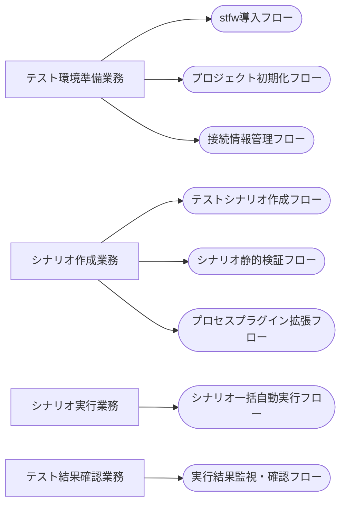

<!-- generateRdraMd.js による自動生成ファイル。手動編集しないこと。元データ: docs/rdra/latest/*.tsv -->

# 業務構成

RDRA システム外部環境レイヤー。業務とビジネスユースケース（BUC）の構成。

> 凡例: `[四角]` 業務 / `(丸角)` BUC

## BUC 一覧

| 業務 | BUC | アクティビティ数 | UC 数 |
|---|---|---|---|
| テスト環境準備業務 | stfw導入フロー | 3 | 0 |
| テスト環境準備業務 | プロジェクト初期化フロー | 4 | 2 |
| テスト環境準備業務 | 接続情報管理フロー | 6 | 4 |
| シナリオ作成業務 | テストシナリオ作成フロー | 7 | 3 |
| シナリオ作成業務 | シナリオ静的検証フロー | 3 | 2 |
| シナリオ作成業務 | プロセスプラグイン拡張フロー | 4 | 1 |
| シナリオ実行業務 | シナリオ一括自動実行フロー | 4 | 3 |
| テスト結果確認業務 | 実行結果監視・確認フロー | 6 | 4 |
