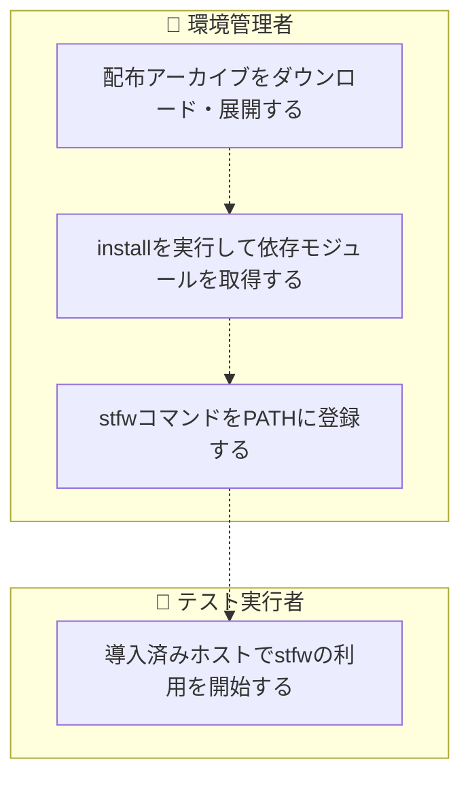
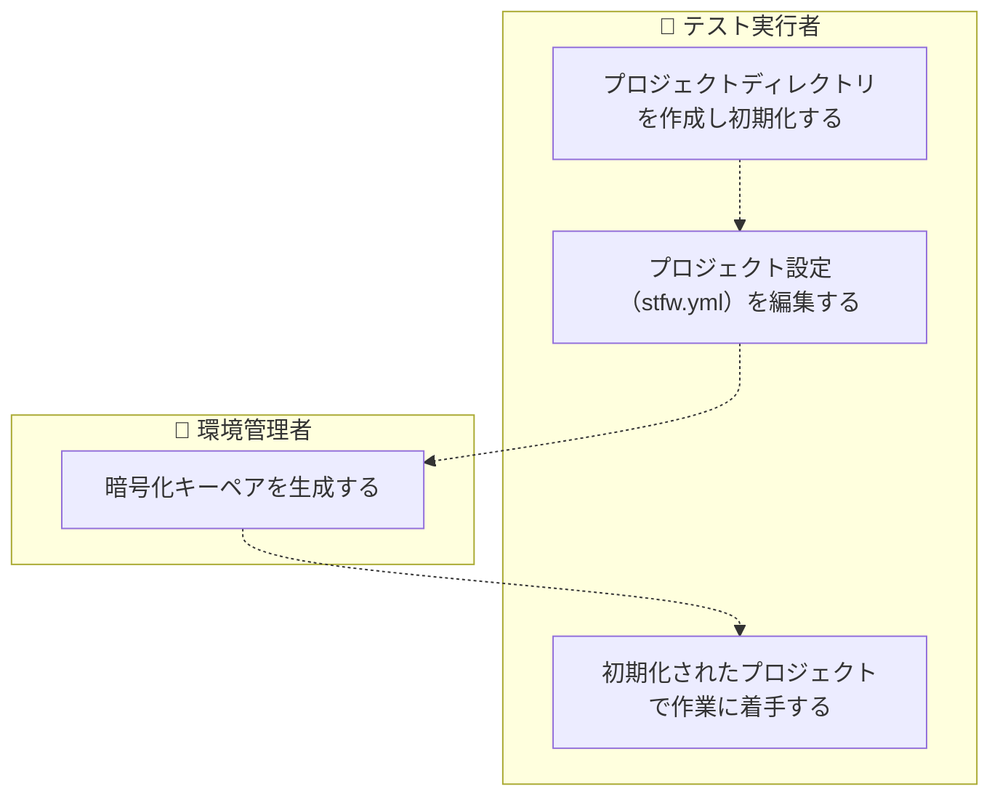
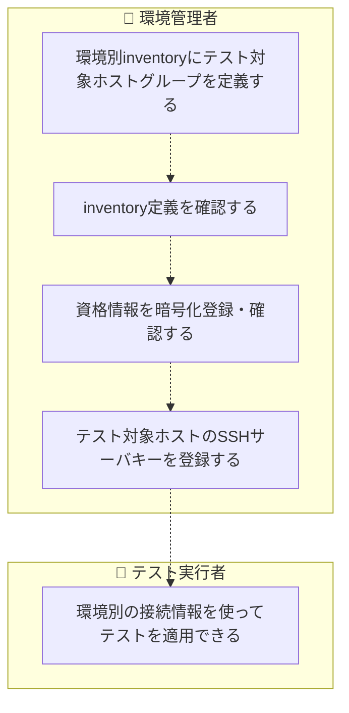
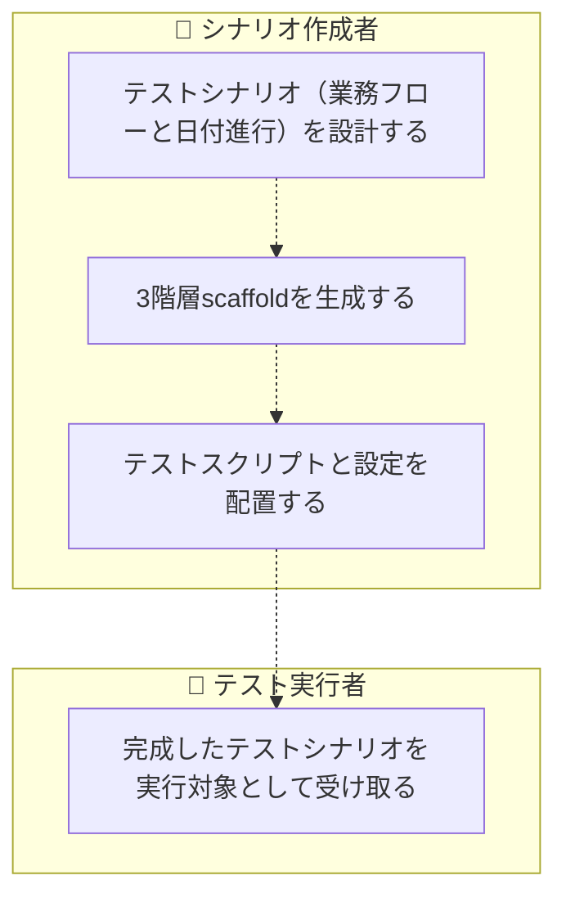
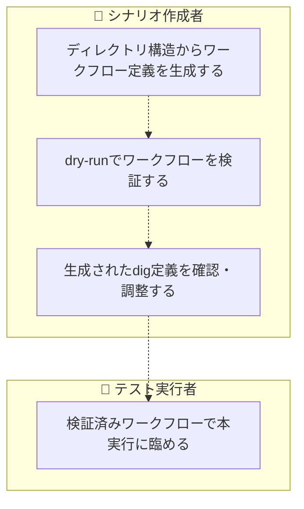
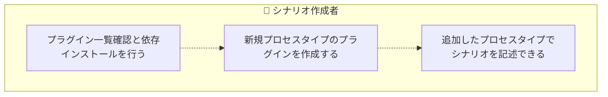
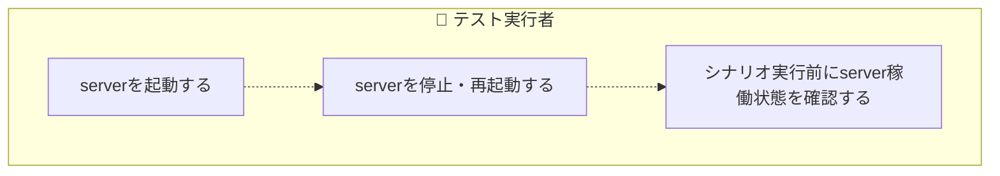
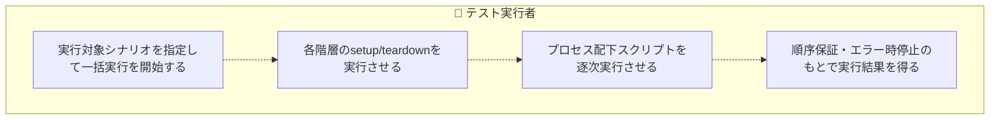
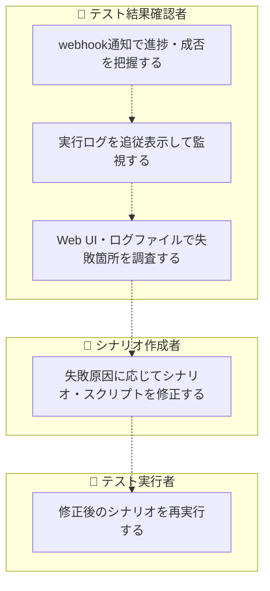

<!-- generateRdraMd.js による自動生成ファイル。手動編集しないこと。元データ: docs/rdra/latest/*.tsv -->

# 業務フロー

RDRA システム外部環境レイヤー。BUC ごとのアクティビティの流れ。
担当（アクター）ごとのレーンに分けて表示する。

## テスト環境準備業務

### stfw導入フロー

> 点線矢印は TSV の行順にもとづく推定順序（`先`/`次` 未指定のため）。

| アクティビティ | 担当 | UC | 説明 |
|---|---|---|---|
| 配布アーカイブをダウンロード・展開する | 環境管理者 |  | GitHub Releasesから配布アーカイブ（tar.gz）をダウンロードし、導入先ホストに展開する（システム外作業: curl・tar） |
| installを実行して依存モジュールを取得する | 環境管理者 | stfwをインストールする | 展開したstfwのinstallを実行し、依存モジュール（digdag jar等）を配布元からダウンロードして実行基盤を整える |
| stfwコマンドをPATHに登録する | 環境管理者 |  | ln -s等でstfwコマンドをPATHへ登録し、各ホストでコマンドを実行できるようにする（システム外作業） |
| 導入済みホストでstfwの利用を開始する | テスト実行者 |  | tar.gz展開とinstallのみの最短手順で用意されたシナリオテスト実行基盤を受け取り、プロジェクト初期化以降の作業に着手する |

### プロジェクト初期化フロー

> 点線矢印は TSV の行順にもとづく推定順序（`先`/`次` 未指定のため）。

| アクティビティ | 担当 | UC | 説明 |
|---|---|---|---|
| プロジェクトディレクトリを作成し初期化する | テスト実行者 | プロジェクトを初期化する | stfw initでテンプレート一式（stfw.yml・config・sampleシナリオ）をプロジェクトディレクトリへ展開してプロジェクトを開始する（再初期化は禁止） |
| プロジェクト設定（stfw.yml）を編集する | テスト実行者 |  | webhook URL・inventory・timezone・server設定等をプロジェクトに合わせて編集する。設定はデフォルト→プロジェクトの順に上書きされ、全スクリプトへ環境変数として公開される（システム外作業: エディタ） |
| 暗号化キーペアを生成する | 環境管理者 | 暗号化キーを生成する | stfw gen-encrypt-keyでパスワード暗号化用のRSAキーペアを生成し、資格情報を平文で扱わない準備を整える |
| 初期化されたプロジェクトで作業に着手する | テスト実行者 |  | テンプレートとsampleシナリオが展開されたプロジェクトを受け取り、即座にシナリオ作成・実行の作業を開始できる |

### 接続情報管理フロー

> 点線矢印は TSV の行順にもとづく推定順序（`先`/`次` 未指定のため）。

| アクティビティ | 担当 | UC | 説明 |
|---|---|---|---|
| 環境別inventoryにテスト対象ホストグループを定義する | 環境管理者 |  | staging等の環境別inventoryファイルにweb/ap/db等のホストグループを定義する（システム外作業: エディタ） |
| inventory定義を確認する | 環境管理者 | テスト対象ホスト情報を参照する | stfw inventoryでホストグループの存在確認・ホスト一覧取得を行い、定義内容を検証する |
| 資格情報を暗号化登録・確認する | 環境管理者 | パスワードを暗号化登録・参照する | stfw passwdでホスト×ユーザー単位のパスワードを暗号化保管（RSA+S/MIME）し、--showで復号表示して登録内容を確認する |
| テスト対象ホストのSSHサーバキーを登録する | 環境管理者 | SSHサーバキーを登録する | テスト対象ホストのサーバキーをknown_hostsへ登録し、リモート適用時のSSH接続を準備する（呼出経路未確定・ユーザースクリプトからの利用想定） |
| 環境別の接続情報を使ってテストを適用できる | テスト実行者 |  | 環境別inventoryと暗号化保管された資格情報により、シナリオ本体の変更なしに環境を切り替えてテスト対象ホストへ適用できる |

## シナリオ作成業務

### テストシナリオ作成フロー

> 点線矢印は TSV の行順にもとづく推定順序（`先`/`次` 未指定のため）。

| アクティビティ | 担当 | UC | 説明 |
|---|---|---|---|
| テストシナリオ（業務フローと日付進行）を設計する | シナリオ作成者 |  | テスト対象の一連の業務処理と業務日付の進行をscenario > bizdate > processの3階層に割り付けて設計する（システム外作業: 人手の設計） |
| 3階層scaffoldを生成する | シナリオ作成者 | シナリオ構造を組み立てる | stfw scenario -i / bizdate -i / process -iでscenario > bizdate > processの3階層scaffoldを生成し、テストシナリオの骨格を作る |
| テストスクリプトと設定を配置する | シナリオ作成者 |  | scripts/配下に任意言語のテストスクリプトをファイル名昇順=実行順で配置し、Process/Plugin設定（config.yml）に共通環境変数を定義する（システム外作業: スクリプト作成） |
| 完成したテストシナリオを実行対象として受け取る | テスト実行者 |  | ディレクトリ構造と命名規則で表現されたテストシナリオにより、手書きの実行手順書なしに一括自動実行の対象を得られる |

### ワークフロー定義生成・検証フロー

> 点線矢印は TSV の行順にもとづく推定順序（`先`/`次` 未指定のため）。

| アクティビティ | 担当 | UC | 説明 |
|---|---|---|---|
| ディレクトリ構造からワークフロー定義を生成する | シナリオ作成者 | ワークフロー定義を生成する | stfw scenario -g/-G・bizdate -gでディレクトリ構造からワークフロー定義（scenario.dig / bizdate.dig）を自動生成する（cascade生成含む） |
| dry-runでワークフローを検証する | シナリオ作成者 | シナリオをdry-runする | stfw run -d / process -dで実タスクを実行せずにワークフロー定義と実行経路を事前検証し、テスト対象環境への影響なしに確認する |
| 生成されたdig定義を確認・調整する | シナリオ作成者 |  | 生成されたscenario.dig / bizdate.digの内容を確認し、必要に応じて調整する（システム外作業: エディタ） |
| 検証済みワークフローで本実行に臨める | テスト実行者 |  | dry-run検証済みのワークフロー定義により、テスト対象環境へ影響する本実行を安全に開始できる |

### プロセスプラグイン拡張フロー

> 点線矢印は TSV の行順にもとづく推定順序（`先`/`次` 未指定のため）。

| アクティビティ | 担当 | UC | 説明 |
|---|---|---|---|
| プラグイン一覧確認と依存インストールを行う | シナリオ作成者 | プロセスプラグインを管理する | stfw process -lで利用可能なプロセスプラグインを一覧し、-Iでプラグインの依存モジュールをインストールする |
| 新規プロセスタイプのプラグインを作成する | シナリオ作成者 |  | __commonの構造に従いsetup/execute/teardown等を実装し、テスト対象固有のプロセスタイプを追加する（システム外作業: プラグイン開発） |
| 追加したプロセスタイプでシナリオを記述できる | シナリオ作成者 |  | 同梱のscripts以外のプロセスタイプをプロセスscaffold生成で選択でき、テスト対象固有の処理をシナリオに組み込める |

## シナリオ実行業務

### 実行基盤制御フロー

> 点線矢印は TSV の行順にもとづく推定順序（`先`/`次` 未指定のため）。

| アクティビティ | 担当 | UC | 説明 |
|---|---|---|---|
| serverを起動する | テスト実行者 | serverを起動する | stfw server startでワークフローエンジン（digdag server）を起動する（bind/port/状態DB/スレッド数の切替可）。pid管理で多重起動を禁止し、server稼働状態を停止中→起動中に遷移させる |
| serverを停止・再起動する | テスト実行者 | serverを停止・再起動する | stfw server stop/restartでdigdag serverをSIGTERM停止・再起動し、server稼働状態を起動中→停止中に遷移させる |
| シナリオ実行前にserver稼働状態を確認する | テスト実行者 | server状態を確認する | stfw server statusでserverの稼働状態を確認し、シナリオ実行の前提条件（server起動中）を満たしていることを確かめる |

### シナリオ一括自動実行フロー

> 点線矢印は TSV の行順にもとづく推定順序（`先`/`次` 未指定のため）。

| アクティビティ | 担当 | UC | 説明 |
|---|---|---|---|
| 実行対象シナリオを指定して一括実行を開始する | テスト実行者 | シナリオを実行する | stfw runで指定シナリオ群にrun_idを採番し、digdagプロジェクトをpushしてワークフローの実行を開始する（attempt_idを保存。run共通setup/teardownは-s/-tで手動実行も可） |
| 各階層のsetup/teardownを実行させる | テスト実行者 | 階層setup/teardownを実行する | digdagからの呼び戻しでrun/scenario/bizdate各階層の前処理・後処理（処理時間記録・webhook通知起動）を実行し、階層実行ステータスをStarted→Success/Errorへ遷移させる |
| プロセス配下スクリプトを逐次実行させる | テスト実行者 | プロセスを実行する | digdagからの呼び戻しでプロセスをsetup→execute→teardownの順に実行する。スクリプトはファイル名昇順で逐次実行し、エラー時は後続をBlockedとして停止、ステップ実行ステータスをPending→Success/Error/Blockedへ遷移させる |
| 順序保証・エラー時停止のもとで実行結果を得る | テスト実行者 |  | 指定したシナリオ群が業務日付順・連番順に自動実行され、途中エラー時は後続を実行せず停止するため、再現性と信頼性のあるテスト結果を得られる |

## テスト結果確認業務

### 実行結果監視・確認フロー

> 点線矢印は TSV の行順にもとづく推定順序（`先`/`次` 未指定のため）。

| アクティビティ | 担当 | UC | 説明 |
|---|---|---|---|
| webhook通知で進捗・成否を把握する | テスト結果確認者 | 実行状況を通知する | 各階層の開始・成功・失敗時にpayload（id・status・所要時間・digdag URL等）がwebhook受信先へHTTP POSTされ、外部システムから進捗・成否・所要時間を把握できる（on_start/on_success/on_errorで抑制可） |
| 実行ログを追従表示して監視する | テスト結果確認者 | 実行ログを追従する | stfw run -fで実行中attemptのログを終了までリアルタイム追従表示し、最終stateを確認する |
| Web UI・ログファイルで失敗箇所を調査する | テスト結果確認者 |  | digdag Web UI（attempt URL）とシークレットマスキング済みログファイルで実行詳細を確認し、失敗箇所を特定する（外部システムUI・ログ閲覧） |
| 失敗原因に応じてシナリオ・スクリプトを修正する | シナリオ作成者 |  | 調査結果をもとにテストスクリプト・設定・シナリオ構造を修正する（システム外作業: エディタ） |
| 修正後のシナリオを再実行する | テスト実行者 | シナリオを実行する | 修正済みシナリオをstfw runで再実行し、失敗からの回復を確認する（専用のリラン・途中再開I/Fは無く、実行のやり直しとなる） |
