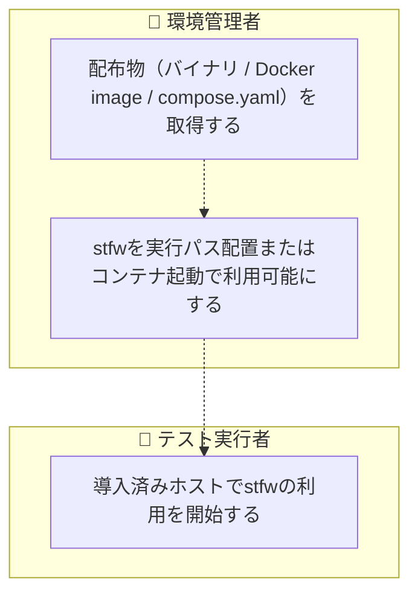
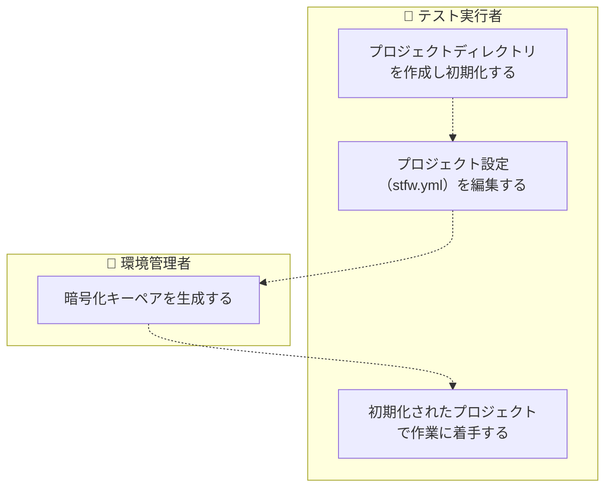
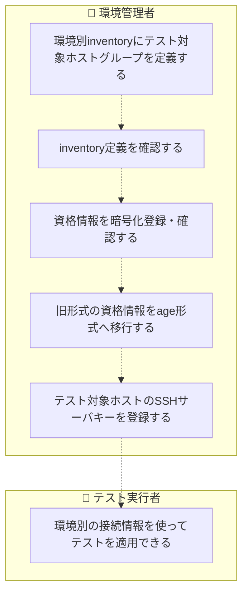
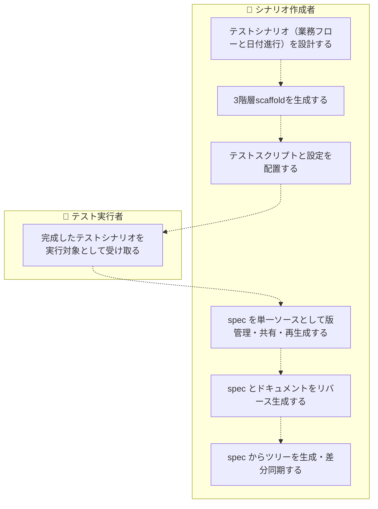
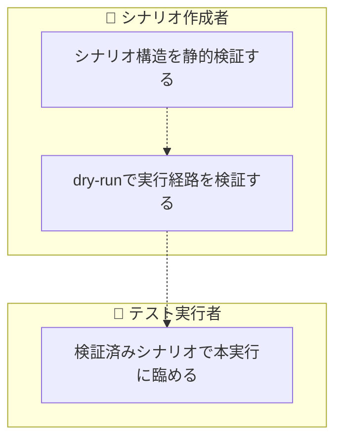
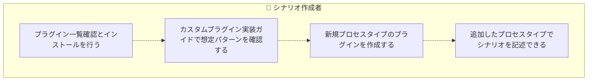
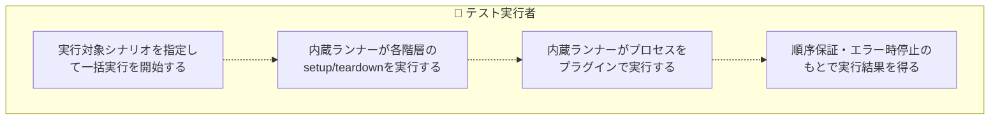
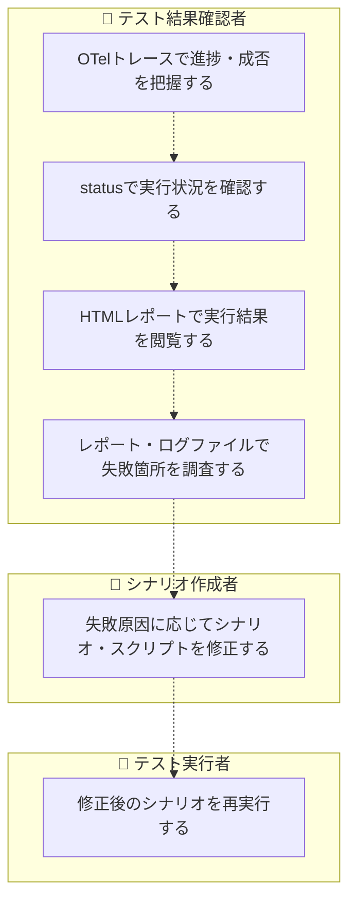

<!-- generateRdraMd.js による自動生成ファイル。手動編集しないこと。元データ: docs/rdra/latest/*.tsv -->

# 業務フロー

RDRA システム外部環境レイヤー。BUC ごとのアクティビティの流れ。
担当（アクター）ごとのレーンに分けて表示する。

## テスト環境準備業務

### stfw導入フロー

> 点線矢印は TSV の行順にもとづく推定順序（`先`/`次` 未指定のため）。

| アクティビティ | 担当 | UC | 説明 |
|---|---|---|---|
| 配布物（バイナリ / Docker image / compose.yaml）を取得する | 環境管理者 |  | GitHub Releasesから対象プラットフォームのバイナリ（linux/darwin × amd64/arm64 + windows/amd64）を、またはghcr.ioからDocker image / compose.yaml（stfw + nginx）を取得する（システム外作業: curl・docker pull。installスクリプトと依存モジュール（dl.bintray.com）のダウンロードは廃止） |
| stfwを実行パス配置またはコンテナ起動で利用可能にする | 環境管理者 |  | バイナリを実行パスに配置、またはDockerコンテナ / composeを起動してstfwコマンドを利用可能にする。追加のランタイム（JVM / Python 2 / Ruby）・依存モジュールは不要（システム外作業） |
| 導入済みホストでstfwの利用を開始する | テスト実行者 |  | 配布物の配置のみの最短手順で用意されたシナリオテスト実行基盤を受け取り、プロジェクト初期化以降の作業に着手する |

### プロジェクト初期化フロー

> 点線矢印は TSV の行順にもとづく推定順序（`先`/`次` 未指定のため）。

| アクティビティ | 担当 | UC | 説明 |
|---|---|---|---|
| プロジェクトディレクトリを作成し初期化する | テスト実行者 | プロジェクトを初期化する | stfw initでテンプレート一式（stfw.yml・config・sampleシナリオ）をプロジェクトディレクトリへ展開してプロジェクトを開始する（再初期化は禁止） |
| プロジェクト設定（stfw.yml）を編集する | テスト実行者 |  | OTelエンドポイント・inventory・timezone等をプロジェクトに合わせて編集する。設定はデフォルト（stfw本体の内蔵デフォルト）→プロジェクトの順に上書きされ、全スクリプトへ環境変数として公開される。stfw.server.*設定は廃止され読み込み時に廃止警告が表示される（システム外作業: エディタ） |
| 暗号化キーペアを生成する | 環境管理者 | 暗号化キーを生成する | stfw secret keygenで資格情報暗号化用のage (X25519)キーペアを生成し、資格情報を平文で扱わない準備を整える（再生成は--force指定時のみ） |
| 初期化されたプロジェクトで作業に着手する | テスト実行者 |  | テンプレートとsampleシナリオが展開されたプロジェクトを受け取り、即座にシナリオ作成・実行の作業を開始できる |

### 接続情報管理フロー

> 点線矢印は TSV の行順にもとづく推定順序（`先`/`次` 未指定のため）。

| アクティビティ | 担当 | UC | 説明 |
|---|---|---|---|
| 環境別inventoryにテスト対象ホストグループを定義する | 環境管理者 |  | staging等の環境別inventoryファイルにweb/ap/db等のホストグループを定義する。組み込みプラグインの収集先・接続先はこのホストグループ名参照で指定される（システム外作業: エディタ） |
| inventory定義を確認する | 環境管理者 | テスト対象ホスト情報を参照する | stfw inventory existsでホストグループの存在確認、stfw inventory listでホスト一覧取得を行い、定義内容を検証する（旧 --is-exist / --list と出力互換） |
| 資格情報を暗号化登録・確認する | 環境管理者 | 資格情報を暗号化登録・参照する | stfw secret setでホスト×ユーザー単位の資格情報をage (X25519)で暗号化保管し、stfw secret showで復号表示して登録内容を確認する（重複登録は禁止）。組み込みプラグインの収集先・接続先への接続資格情報も本機構で参照される |
| 旧形式の資格情報をage形式へ移行する | 環境管理者 | 資格情報を旧形式から移行する | stfw secret migrateで旧S/MIME形式の資格情報をage形式へ一括変換する（旧ファイルは.bak退避）。移行前も旧形式は読み込み専用でサポートされ復号参照できる |
| テスト対象ホストのSSHサーバキーを登録する | 環境管理者 | SSHサーバキーを登録する | stfw ssh trust <host\|group>でテスト対象ホストのサーバキーをknown_hostsへ登録する（旧キー削除+新キー登録）。inventoryグループ指定で一括登録できる（旧実装で未配線だった機能の正式コマンド化）。組み込みプラグイン（collectLog / collectFile）のscp/ssh接続でも本登録が利用される |
| 環境別の接続情報を使ってテストを適用できる | テスト実行者 |  | 環境別inventoryと暗号化保管された資格情報により、シナリオ本体の変更なしに環境を切り替えてテスト対象ホストへ適用できる。組み込みプラグインの設定にはホスト名・資格情報を直接書かず、グループ名参照のみで安全に利用できる |

## シナリオ作成業務

### テストシナリオ作成フロー

> 点線矢印は TSV の行順にもとづく推定順序（`先`/`次` 未指定のため）。

| アクティビティ | 担当 | UC | 説明 |
|---|---|---|---|
| テストシナリオ（業務フローと日付進行）を設計する | シナリオ作成者 |  | テスト対象の一連の業務処理と業務日付の進行をscenario > bizdate > processの3階層に割り付けて設計する（システム外作業: 人手の設計） |
| 3階層scaffoldを生成する | シナリオ作成者 | シナリオ構造を組み立てる | stfw new scenario / new bizdate / new processでscenario > bizdate > processの3階層scaffold（ディレクトリ・metadata.yml・config・scripts雛形）を生成し、テストシナリオの骨格を作る（旧 scenario -i / bizdate -i / process -i） |
| テストスクリプトと設定を配置する | シナリオ作成者 |  | scripts/配下に任意言語のテストスクリプトをファイル名昇順=実行順で配置し、Process/Plugin設定（config.yml）に共通環境変数を定義する（システム外作業: スクリプト作成） |
| 完成したテストシナリオを実行対象として受け取る | テスト実行者 |  | ディレクトリ構造と命名規則で表現されたテストシナリオにより、手書きの実行手順書なしに一括自動実行の対象を得られる |
| spec を単一ソースとして版管理・共有・再生成する | シナリオ作成者 |  | spec（<name>.yml）とドキュメント（<name>.md）でシナリオ構造を単一ファイルとしてレビュー・共有し、そこからツリーを再生成できるため、版管理・移送が容易になる |
| spec とドキュメントをリバース生成する | シナリオ作成者 | シナリオを spec・ドキュメントに変換する | stfw scenario reverse <name> [-o, --out-dir <dir>] でシナリオツリー（規約ベースの記述＝正）から spec（<name>.yml）とドキュメント（<name>.md）をセット生成する（既定の出力先は docs/）。ドキュメントには各プロセスの group / type / description・要求トレーサビリティ（metadata.yml の requirement_specifications = どの要求をどの process が検証するか）・config サブツリーを表形式で出力する |
| spec からツリーを生成・差分同期する | シナリオ作成者 | spec からシナリオツリーを生成する | stfw scaffold <spec.yml> [--sync] で spec からディレクトリ骨格（scenario > bizdate > process のディレクトリ・metadata.yml・config）を生成する。既存ツリーがある場合 --sync は差分同期（spec に有りツリーに無いディレクトリは追加、両方に有るディレクトリは維持、spec に無くなったディレクトリは削除）、--sync 無しはエラー終了。対話的 scaffold 生成（stfw new）とは別に spec ファイルを単一ソースとしたツリー生成・差分同期の入口を提供する |

### シナリオ静的検証フロー

> 点線矢印は TSV の行順にもとづく推定順序（`先`/`次` 未指定のため）。

| アクティビティ | 担当 | UC | 説明 |
|---|---|---|---|
| シナリオ構造を静的検証する | シナリオ作成者 | シナリオを検証する | stfw validateでディレクトリ規約・プラグイン解決可否・config.yml・プラグインが宣言したランタイム依存（前提コマンド: k6・mysql/psqlクライアント・ssh/scp等）を静的検証し、実行可能性を事前確認する。残存する*.digファイルには不要である旨を警告する（ワークフロー定義の生成は廃止され、記述したディレクトリ構造そのものが実行定義となる） |
| dry-runで実行経路を検証する | シナリオ作成者 | シナリオをdry-runする | stfw run --dry-runでexecute / post_executeをスキップして実行し（setup → pre_execute → teardownは実行）、テスト対象環境への影響なしに実行経路と前後処理を事前検証する |
| 検証済みシナリオで本実行に臨める | テスト実行者 |  | 静的検証・dry-run検証済みのシナリオにより、テスト対象環境へ影響する本実行を安全に開始できる |

### プロセスプラグイン拡張フロー

> 点線矢印は TSV の行順にもとづく推定順序（`先`/`次` 未指定のため）。

| アクティビティ | 担当 | UC | 説明 |
|---|---|---|---|
| プラグイン一覧確認とインストールを行う | シナリオ作成者 | プロセスプラグインを管理する | stfw plugin listで利用可能なプロセスプラグイン（組込みプラグイン群: scripts・収集系 collectLog / collectFile・データストア系 exportXxx / importXxx / clearXxx・検証系 compare・実行系 invokeWeb / invokeRest、およびプロジェクトのカスタムプラグイン）を一覧し、stfw plugin installでプラグインをインストールする（旧 process -l / -I。解決順互換。scaffold生成はstfw new processで行う） |
| カスタムプラグイン実装ガイドで想定パターンを確認する | シナリオ作成者 |  | カスタムプラグイン実装ガイドを参照し、updateBizDate（業務日付更新）/ invokeJob（ジョブスケジューラ起動）/ importMaster（共通マスターデータ投入）等の想定パターンを組み込みプラグインの組み合わせ例として確認する。想定パターンは組み込みプラグインとしては提供されない（システム外作業: ドキュメント参照） |
| 新規プロセスタイプのプラグインを作成する | シナリオ作成者 |  | __commonの構造に従いsetup/execute/teardown等を実装し、テスト対象固有のプロセスタイプを追加する。プロダクト固有の知識（業務日付の更新方法・ジョブスケジューラの呼び出し方・共通マスターデータ）は、組み込みプラグイン（収集系・データストア系・検証系・実行系）を組み合わせたカスタムプラグインとして実装する2層構造とする。プラグインenv契約（stfw_* / STFW_PROJ_DIR系）は維持される（システム外作業: プラグイン開発） |
| 追加したプロセスタイプでシナリオを記述できる | シナリオ作成者 |  | 組込みプラグイン群とカスタムプラグインのプロセスタイプをstfw new processで選択でき、データ準備・実行・エビデンス収集・期待値比較とテスト対象固有の処理をシナリオに組み込める |

## シナリオ実行業務

### シナリオ一括自動実行フロー

> 点線矢印は TSV の行順にもとづく推定順序（`先`/`次` 未指定のため）。

| アクティビティ | 担当 | UC | 説明 |
|---|---|---|---|
| 実行対象シナリオを指定して一括実行を開始する | テスト実行者 | シナリオを実行する | stfw run <scenario-names...>でrun_id（_{YYYYMMDDHHMMSS}_{PID}）を採番し、run前静的検証（対象シナリオの存在チェック等を統合）の通過後に内蔵ランナーで実行を開始する。run開始時には保存期間（stfw.housekeep.retention）を過ぎた過去の実行結果（実行ジャーナル・HTMLレポート）を自動ハウスキープする。digdagプロジェクトのpush・server起動等の前準備は不要で、旧server start → run -fの2段階を1コマンドに統合 |
| 内蔵ランナーが各階層のsetup/teardownを実行する | テスト実行者 | 階層setup/teardownを実行する | 内蔵ランナーがrun/scenario/bizdate各階層のsetup/teardownを直接実行し（digdagからの呼び戻しは廃止）、実行ジャーナルへ開始・終了イベントを記録して階層実行ステータスをStarted→Success/Warn/Errorへ遷移させる。上位階層の実行ステータスは配下のError > Warn > Successの優先度で集約され、子にWarnがあれば親もWarnになる。run階層のteardownフックへ公開される環境変数stfw_run_statusは、Warnあり・ErrorなしのrunでWarnになる。bizdateのnode_startイベント時刻はプラグインenv契約（stfw_bizdate_start_ts等）として後続のプロセス実行へ公開される |
| 内蔵ランナーがプロセスをプラグインで実行する | テスト実行者 | プロセスを実行する | 内蔵ランナーがプロセスをsetup→pre_execute→execute→post_execute→teardownの順に直接実行する（digdagからの呼び戻しは廃止）。プロセスはプロセスタイプに応じたプラグインとして実行され、scriptsのほか組込みプラグイン群（収集系 collectLog / collectFile、データストア系 exportXxx / importXxx / clearXxx、検証系 compare、実行系 invokeWeb / invokeRest、リモートアクセス系 sshExec / scpPut）により、1つの業務日付をArrange（準備）→Act（実行）→Collect（収集）→Assert（検証）のパイプラインとして人手を介さず反復できる。scriptsプラグインではscripts/配下をファイル名昇順に逐次実行し、リターンコード3（Warn）のステップはWarnとして記録して続行、Error時（リターンコード0・3以外。on_mismatch: error（既定）のcompare比較不一致によるステップ失敗を含む）は後続をBlockedとして停止し、ステップ実行ステータスをPending→Success/Warn/Error/Blockedへ遷移させる。compareプラグインは設定キーon_mismatch: error（既定）\| warnで比較不一致時の扱い（Error停止 / Warn続行）を選択できる。実行系（invokeWeb / invokeRest）はActの結果をk6サマリ（evidence/summary.json）と人間可読なHTMLレポート（evidence/report.html）としてエビデンスに出力する。configチェーンの値中の${...}は実行環境の環境変数（run開始時にexportされたstfw.ymlのフラット化値を含む）を参照して展開され、共通identity（database / user）は${stfw_...}で参照できる |
| 順序保証・エラー時停止のもとで実行結果を得る | テスト実行者 |  | 指定したシナリオ群が業務日付順・連番順に自動実行され、データ準備（Arrange）・取引入力（Act）・エビデンス収集（Collect）・期待値比較（Assert）までが人手を介さず反復される。回帰テストモードでは途中Error（on_mismatch: error（既定）の比較不一致によるステップ失敗を含む）時に後続を実行せず停止するため、再現性と信頼性のあるテスト結果を得られる。機能変更の差分確認モードでは比較不一致等をWarnとして記録して最後まで実行を進められ、CIではstfw runの終了コード（全Success=0 / Warnあり・Errorなし=3 / Errorあり=6）で「差分あり」を検知できる |

## テスト結果確認業務

### 実行結果監視・確認フロー

> 点線矢印は TSV の行順にもとづく推定順序（`先`/`次` 未指定のため）。

| アクティビティ | 担当 | UC | 説明 |
|---|---|---|---|
| OTelトレースで進捗・成否を把握する | テスト結果確認者 | 実行状況を通知する | 実行ジャーナル（journal.jsonl）のイベントの投影として、runをルートにscenario/bizdate/process/stepを子孫とするスパンツリーがOTLP受信先へ送信され、既存のオブザーバビリティ基盤（Jaeger/Grafana Tempo/Datadog等）でそのまま進捗・成否・所要時間を可視化・分析できる（送信先未設定時は送信せず、送信失敗は実行を失敗させない）。WarnはOTelのスパンステータスに相当が無い（Ok / Error / Unsetのみ）ため、スパンステータスOk + stfwのstatus属性（Warn）として投影される（Errorは従来どおりスパンステータスError） |
| statusで実行状況を確認する | テスト結果確認者 | 実行状況を確認する | stfw status [run_id]で実行ジャーナルをリプレイし、階層ツリーと各階層・ステップのステータスを表示する（digdag Web UI・ログ追従（run -f）・attempt URL案内による確認は廃止）。Warnステータスは黄系の色で表示される。旧バージョンのrunのジャーナル（Warnなし）が混在してもエラーなく表示される |
| HTMLレポートで実行結果を閲覧する | テスト結果確認者 | HTMLレポートを生成する | stfw report [run_id]で実行ジャーナルから静的HTMLレポート（.stfw/reports/にindex + run詳細）を生成する。実行中もprocess終了ごとに増分再生成され、Docker Compose構成ではnginxがreports共有volumeを配信し、ブラウザ（http://localhost:8080）で準リアルタイムに閲覧できる。Warnステータスは黄系の色で表示され、どのシナリオ・どのプロセスでWarn（比較NG）が発生したかを一覧で鳥瞰できる（「比較NGの鳥瞰」ビュー）。旧バージョンのrunのジャーナル（Warnなし）が混在しても再生成は壊れない。run開始時のハウスキープで保存期間を過ぎたHTMLレポート（.stfw/reports/runs/{run_id}.html）は物理削除され、削除に伴いレポートindexが再生成される（削除済みrunはindexに残らない） |
| レポート・ログファイルで失敗箇所を調査する | テスト結果確認者 |  | HTMLレポートとシークレットマスキング済みログファイル（.stfw/stfw.log）で実行詳細を確認し、失敗箇所を特定する（レポート・ログ閲覧） |
| 失敗原因に応じてシナリオ・スクリプトを修正する | シナリオ作成者 |  | 調査結果をもとにテストスクリプト・設定・シナリオ構造を修正する（システム外作業: エディタ） |
| 修正後のシナリオを再実行する | テスト実行者 | シナリオを実行する | 修正済みシナリオをstfw runで再実行し、失敗からの回復を確認する（専用のリラン・途中再開I/Fは無く、実行のやり直しとなる） |
