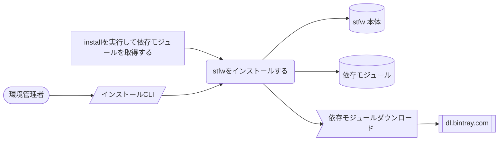
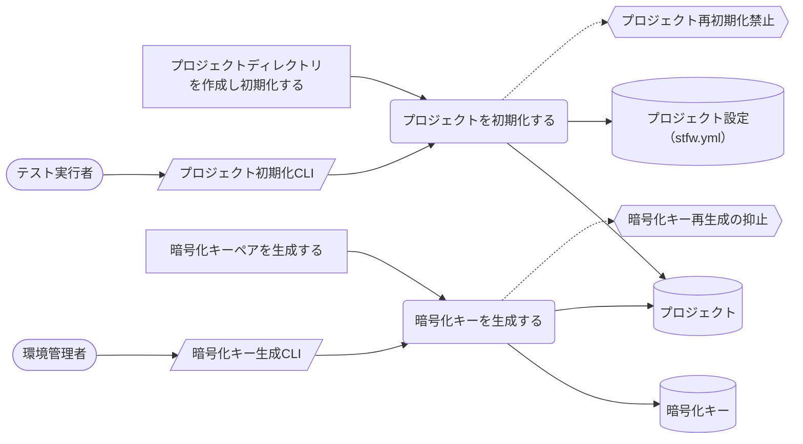
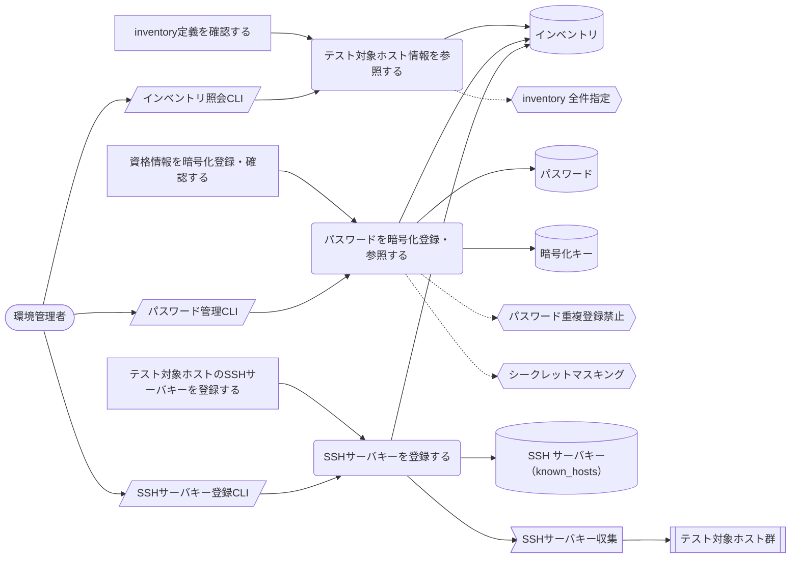
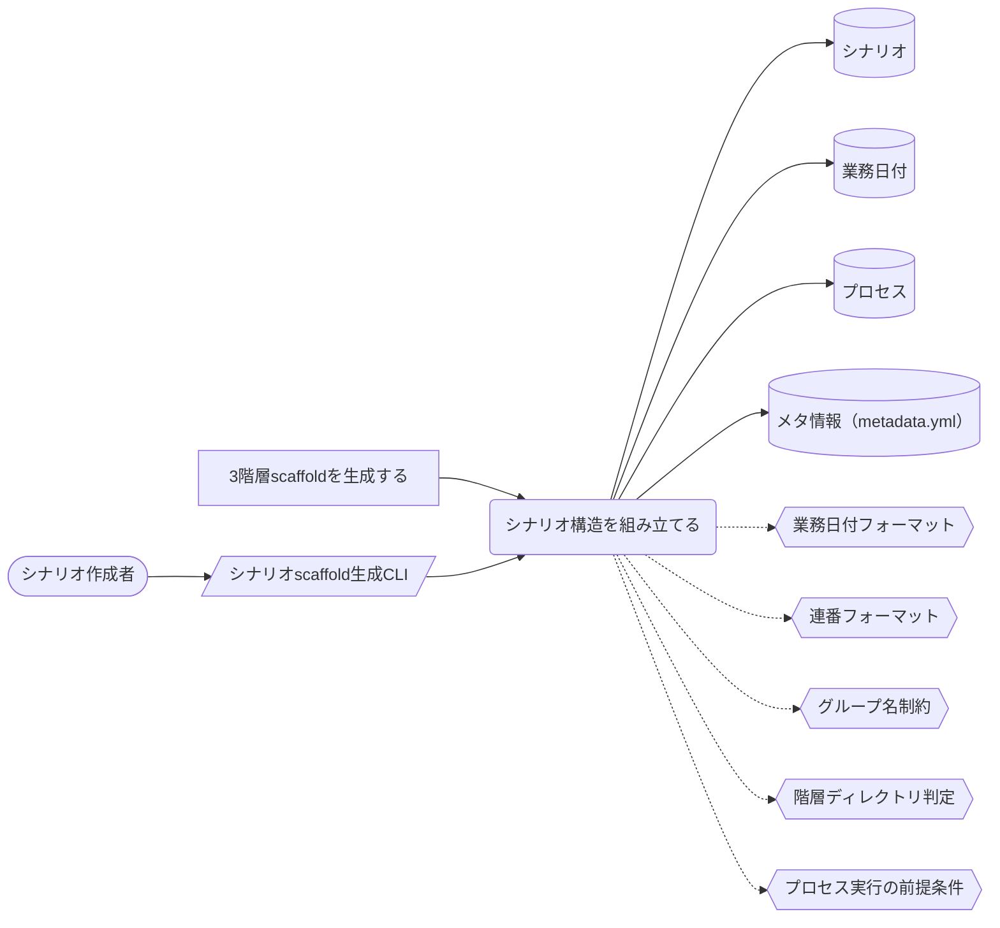
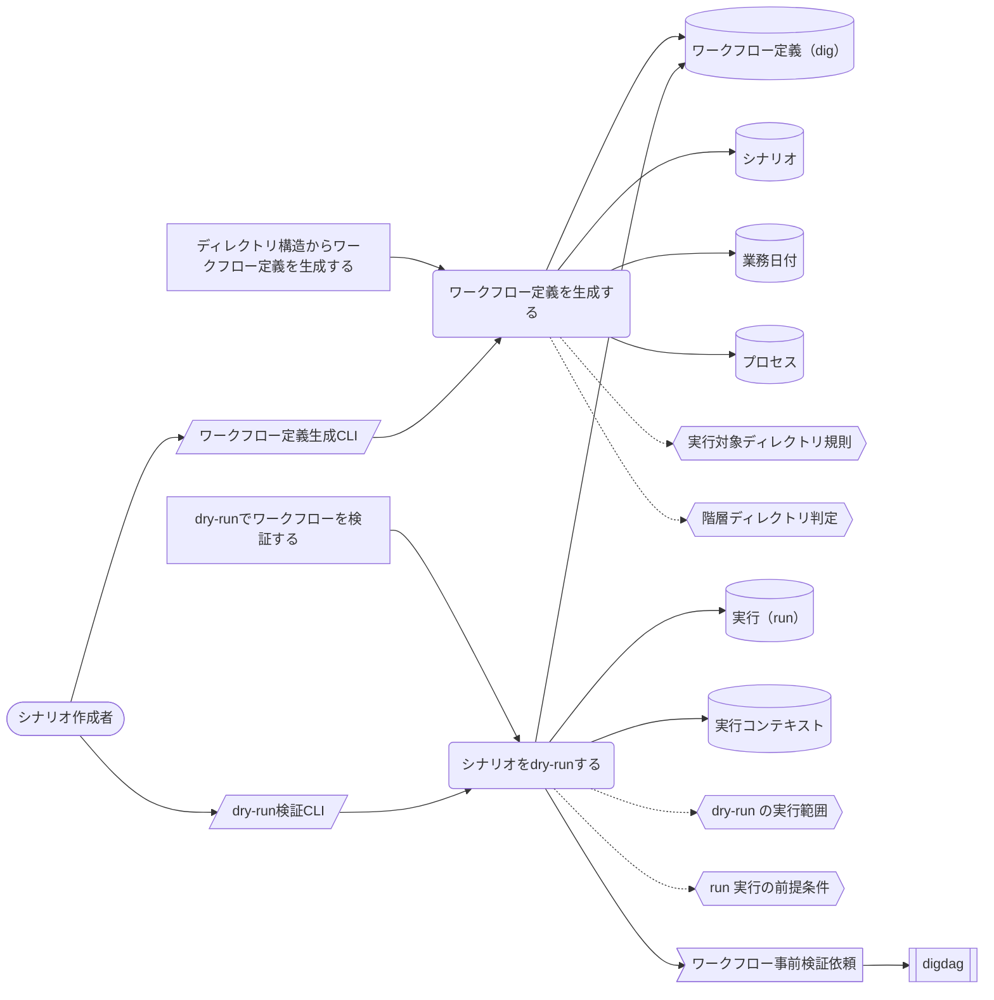
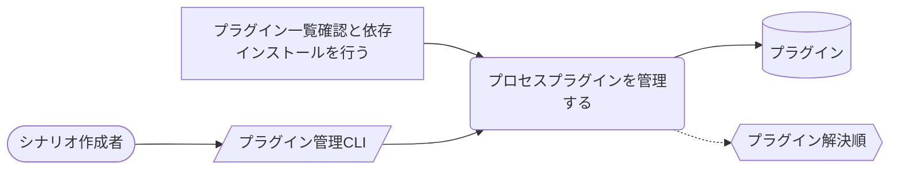
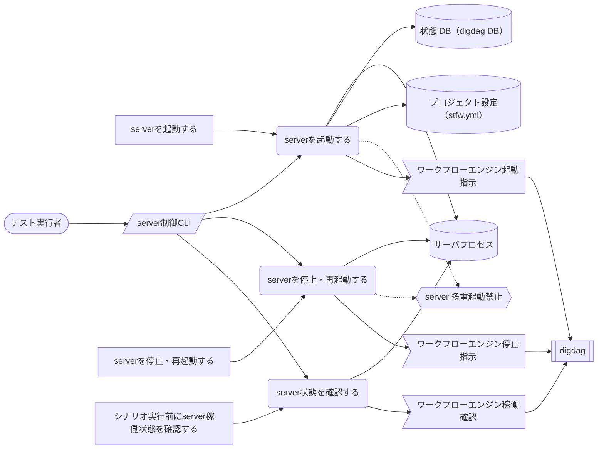
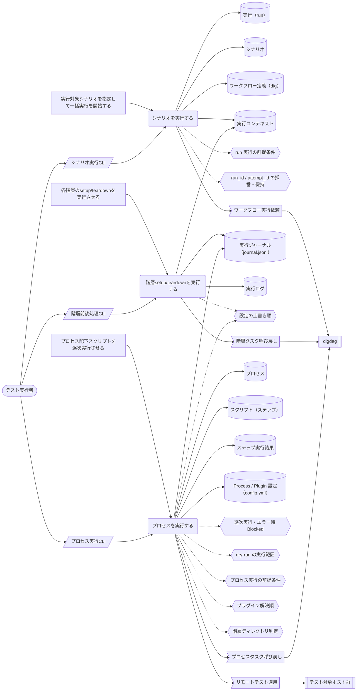
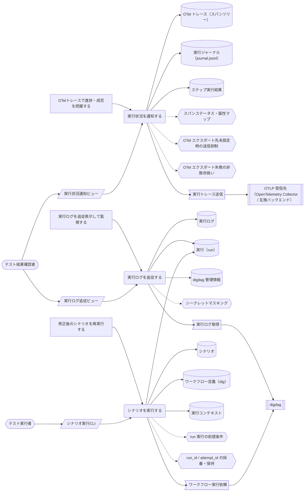

<!-- generateRdraMd.js による自動生成ファイル。手動編集しないこと。元データ: docs/rdra/latest/*.tsv -->

# UC複合図

RDRA システム境界レイヤー。BUC ごとに、アクティビティ・UC・画面・イベント・
情報・条件・外部システムの関係を表す。

## テスト環境準備業務

### stfw導入フロー

> 凡例: `(丸角)` アクター・UC / `[四角]` アクティビティ / `[/斜め/]` 画面 / `[(円柱)]` 情報 / `{{六角}}` 条件 / `>旗]` イベント / `[[二重枠]]` 外部システム。点線は条件参照。

| UC | アクティビティ | 画面 | 情報 | 条件 | イベント | 説明 |
|---|---|---|---|---|---|---|
| stfwをインストールする | installを実行して依存モジュールを取得する | インストールCLI | stfw 本体、依存モジュール |  | 依存モジュールダウンロード | 展開したstfwのinstallを実行し、依存モジュール（digdag jar等）を配布元からダウンロードして実行基盤を整える |

### プロジェクト初期化フロー

> 凡例: `(丸角)` アクター・UC / `[四角]` アクティビティ / `[/斜め/]` 画面 / `[(円柱)]` 情報 / `{{六角}}` 条件 / `>旗]` イベント / `[[二重枠]]` 外部システム。点線は条件参照。

| UC | アクティビティ | 画面 | 情報 | 条件 | イベント | 説明 |
|---|---|---|---|---|---|---|
| プロジェクトを初期化する | プロジェクトディレクトリを作成し初期化する | プロジェクト初期化CLI | プロジェクト、プロジェクト設定（stfw.yml） | プロジェクト再初期化禁止 |  | stfw initでテンプレート一式（stfw.yml・config・sampleシナリオ）をプロジェクトディレクトリへ展開してプロジェクトを開始する（再初期化は禁止） |
| 暗号化キーを生成する | 暗号化キーペアを生成する | 暗号化キー生成CLI | 暗号化キー、プロジェクト | 暗号化キー再生成の抑止 |  | stfw gen-encrypt-keyでパスワード暗号化用のRSAキーペアを生成し、資格情報を平文で扱わない準備を整える |

### 接続情報管理フロー

> 凡例: `(丸角)` アクター・UC / `[四角]` アクティビティ / `[/斜め/]` 画面 / `[(円柱)]` 情報 / `{{六角}}` 条件 / `>旗]` イベント / `[[二重枠]]` 外部システム。点線は条件参照。

| UC | アクティビティ | 画面 | 情報 | 条件 | イベント | 説明 |
|---|---|---|---|---|---|---|
| テスト対象ホスト情報を参照する | inventory定義を確認する | インベントリ照会CLI | インベントリ | inventory 全件指定 |  | stfw inventoryでホストグループの存在確認・ホスト一覧取得を行い、定義内容を検証する |
| パスワードを暗号化登録・参照する | 資格情報を暗号化登録・確認する | パスワード管理CLI | パスワード、暗号化キー、インベントリ | パスワード重複登録禁止、シークレットマスキング |  | stfw passwdでホスト×ユーザー単位のパスワードを暗号化保管（RSA+S/MIME）し、--showで復号表示して登録内容を確認する |
| SSHサーバキーを登録する | テスト対象ホストのSSHサーバキーを登録する | SSHサーバキー登録CLI | SSH サーバキー（known_hosts）、インベントリ |  | SSHサーバキー収集 | テスト対象ホストのサーバキーをknown_hostsへ登録し、リモート適用時のSSH接続を準備する（呼出経路未確定・ユーザースクリプトからの利用想定） |

## シナリオ作成業務

### テストシナリオ作成フロー

> 凡例: `(丸角)` アクター・UC / `[四角]` アクティビティ / `[/斜め/]` 画面 / `[(円柱)]` 情報 / `{{六角}}` 条件 / `>旗]` イベント / `[[二重枠]]` 外部システム。点線は条件参照。

| UC | アクティビティ | 画面 | 情報 | 条件 | イベント | 説明 |
|---|---|---|---|---|---|---|
| シナリオ構造を組み立てる | 3階層scaffoldを生成する | シナリオscaffold生成CLI | シナリオ、業務日付、プロセス、メタ情報（metadata.yml） | 業務日付フォーマット、連番フォーマット、グループ名制約、階層ディレクトリ判定、プロセス実行の前提条件 |  | stfw scenario -i / bizdate -i / process -iでscenario > bizdate > processの3階層scaffoldを生成し、テストシナリオの骨格を作る |

### ワークフロー定義生成・検証フロー

> 凡例: `(丸角)` アクター・UC / `[四角]` アクティビティ / `[/斜め/]` 画面 / `[(円柱)]` 情報 / `{{六角}}` 条件 / `>旗]` イベント / `[[二重枠]]` 外部システム。点線は条件参照。

| UC | アクティビティ | 画面 | 情報 | 条件 | イベント | 説明 |
|---|---|---|---|---|---|---|
| ワークフロー定義を生成する | ディレクトリ構造からワークフロー定義を生成する | ワークフロー定義生成CLI | ワークフロー定義（dig）、シナリオ、業務日付、プロセス | 実行対象ディレクトリ規則、階層ディレクトリ判定 |  | stfw scenario -g/-G・bizdate -gでディレクトリ構造からワークフロー定義（scenario.dig / bizdate.dig）を自動生成する（cascade生成含む） |
| シナリオをdry-runする | dry-runでワークフローを検証する | dry-run検証CLI | 実行（run）、ワークフロー定義（dig）、実行コンテキスト | dry-run の実行範囲、run 実行の前提条件 | ワークフロー事前検証依頼 | stfw run -d / process -dで実タスクを実行せずにワークフロー定義と実行経路を事前検証し、テスト対象環境への影響なしに確認する |

### プロセスプラグイン拡張フロー

> 凡例: `(丸角)` アクター・UC / `[四角]` アクティビティ / `[/斜め/]` 画面 / `[(円柱)]` 情報 / `{{六角}}` 条件 / `>旗]` イベント / `[[二重枠]]` 外部システム。点線は条件参照。

| UC | アクティビティ | 画面 | 情報 | 条件 | イベント | 説明 |
|---|---|---|---|---|---|---|
| プロセスプラグインを管理する | プラグイン一覧確認と依存インストールを行う | プラグイン管理CLI | プラグイン | プラグイン解決順 |  | stfw process -lで利用可能なプロセスプラグインを一覧し、-Iでプラグインの依存モジュールをインストールする |

## シナリオ実行業務

### 実行基盤制御フロー

> 凡例: `(丸角)` アクター・UC / `[四角]` アクティビティ / `[/斜め/]` 画面 / `[(円柱)]` 情報 / `{{六角}}` 条件 / `>旗]` イベント / `[[二重枠]]` 外部システム。点線は条件参照。

| UC | アクティビティ | 画面 | 情報 | 条件 | イベント | 説明 |
|---|---|---|---|---|---|---|
| serverを起動する | serverを起動する | server制御CLI | サーバプロセス、状態 DB（digdag DB）、プロジェクト設定（stfw.yml） | server 多重起動禁止 | ワークフローエンジン起動指示 | stfw server startでワークフローエンジン（digdag server）を起動する（bind/port/状態DB/スレッド数の切替可）。pid管理で多重起動を禁止し、server稼働状態を停止中→起動中に遷移させる |
| serverを停止・再起動する | serverを停止・再起動する | server制御CLI | サーバプロセス | server 多重起動禁止 | ワークフローエンジン停止指示 | stfw server stop/restartでdigdag serverをSIGTERM停止・再起動し、server稼働状態を起動中→停止中に遷移させる |
| server状態を確認する | シナリオ実行前にserver稼働状態を確認する | server制御CLI | サーバプロセス |  | ワークフローエンジン稼働確認 | stfw server statusでserverの稼働状態を確認し、シナリオ実行の前提条件（server起動中）を満たしていることを確かめる |

### シナリオ一括自動実行フロー

> 凡例: `(丸角)` アクター・UC / `[四角]` アクティビティ / `[/斜め/]` 画面 / `[(円柱)]` 情報 / `{{六角}}` 条件 / `>旗]` イベント / `[[二重枠]]` 外部システム。点線は条件参照。

| UC | アクティビティ | 画面 | 情報 | 条件 | イベント | 説明 |
|---|---|---|---|---|---|---|
| シナリオを実行する | 実行対象シナリオを指定して一括実行を開始する | シナリオ実行CLI | 実行（run）、シナリオ、ワークフロー定義（dig）、実行コンテキスト | run 実行の前提条件、run_id / attempt_id の採番・保持 | ワークフロー実行依頼 | stfw runで指定シナリオ群にrun_idを採番し、digdagプロジェクトをpushしてワークフローの実行を開始する（attempt_idを保存。run共通setup/teardownは-s/-tで手動実行も可） |
| 階層setup/teardownを実行する | 各階層のsetup/teardownを実行させる | 階層前後処理CLI | 実行コンテキスト、実行ジャーナル（journal.jsonl）、実行ログ | 設定の上書き順 | 階層タスク呼び戻し | digdagからの呼び戻しでrun/scenario/bizdate各階層の前処理・後処理（処理時間記録・実行ジャーナルへの開始・終了イベント記録）を実行し、階層実行ステータスをStarted→Success/Errorへ遷移させる |
| プロセスを実行する | プロセス配下スクリプトを逐次実行させる | プロセス実行CLI | プロセス、スクリプト（ステップ）、ステップ実行結果、Process / Plugin 設定（config.yml）、実行ジャーナル（journal.jsonl） | 逐次実行・エラー時 Blocked、dry-run の実行範囲、プロセス実行の前提条件、設定の上書き順、プラグイン解決順、階層ディレクトリ判定 | プロセスタスク呼び戻し、リモートテスト適用 | digdagからの呼び戻しでプロセスをsetup→execute→teardownの順に実行する。スクリプトはファイル名昇順で逐次実行し、エラー時は後続をBlockedとして停止、ステップ実行ステータスをPending→Success/Error/Blockedへ遷移させる |

## テスト結果確認業務

### 実行結果監視・確認フロー

> 凡例: `(丸角)` アクター・UC / `[四角]` アクティビティ / `[/斜め/]` 画面 / `[(円柱)]` 情報 / `{{六角}}` 条件 / `>旗]` イベント / `[[二重枠]]` 外部システム。点線は条件参照。

| UC | アクティビティ | 画面 | 情報 | 条件 | イベント | 説明 |
|---|---|---|---|---|---|---|
| 実行状況を通知する | OTelトレースで進捗・成否を把握する | 実行状況通知ビュー | OTel トレース（スパンツリー）、実行ジャーナル（journal.jsonl）、ステップ実行結果 | スパンステータス・属性マップ、OTel エクスポート先未設定時の送信抑制、OTel エクスポート失敗の非致命扱い | 実行トレース送信 | 実行ジャーナル（journal.jsonl）のイベントの投影として、runをルートにscenario/bizdate/process/stepを子孫とするスパンツリーがOTLP受信先へ送信され、既存のオブザーバビリティ基盤（Jaeger/Grafana Tempo/Datadog等）でそのまま進捗・成否・所要時間を可視化・分析できる（送信先未設定時は送信せず、送信失敗は実行を失敗させない） |
| 実行ログを追従する | 実行ログを追従表示して監視する | 実行ログ追従ビュー | 実行ログ、実行（run）、digdag 管理情報 | シークレットマスキング | 実行ログ取得 | stfw run -fで実行中attemptのログを終了までリアルタイム追従表示し、最終stateを確認する |
| シナリオを実行する | 修正後のシナリオを再実行する | シナリオ実行CLI | 実行（run）、シナリオ、ワークフロー定義（dig）、実行コンテキスト | run 実行の前提条件、run_id / attempt_id の採番・保持 | ワークフロー実行依頼 | 修正済みシナリオをstfw runで再実行し、失敗からの回復を確認する（専用のリラン・途中再開I/Fは無く、実行のやり直しとなる） |
