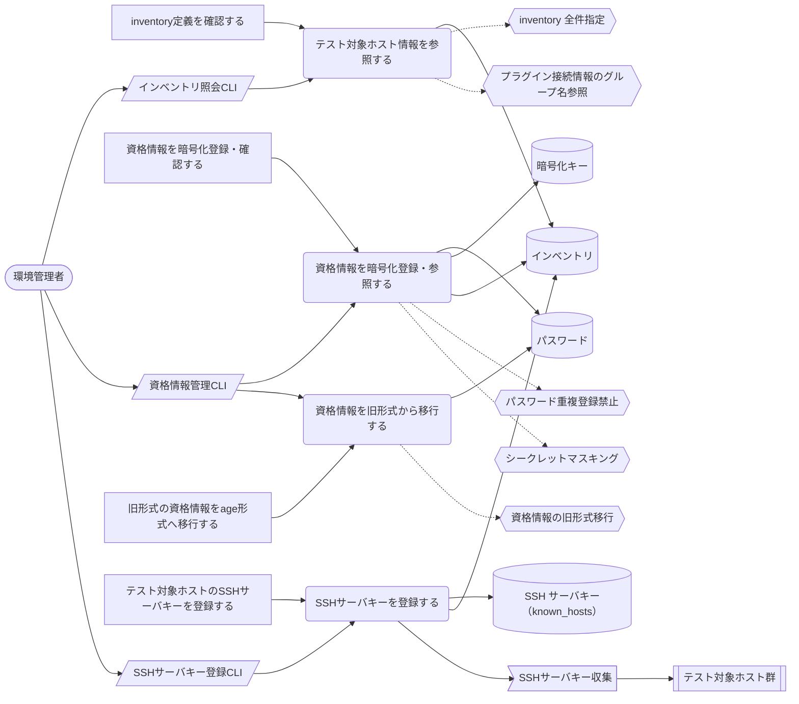
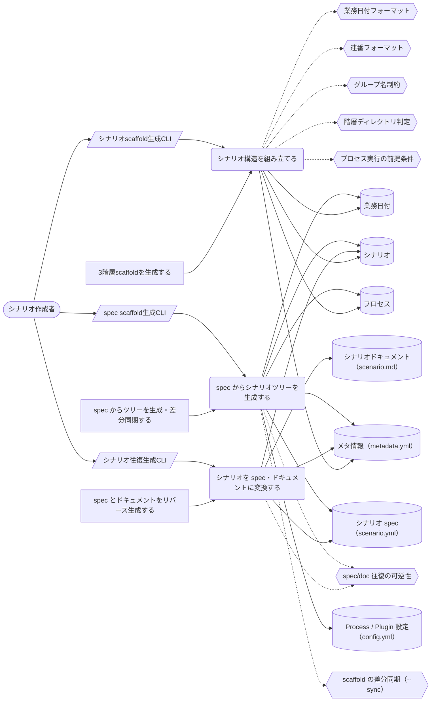
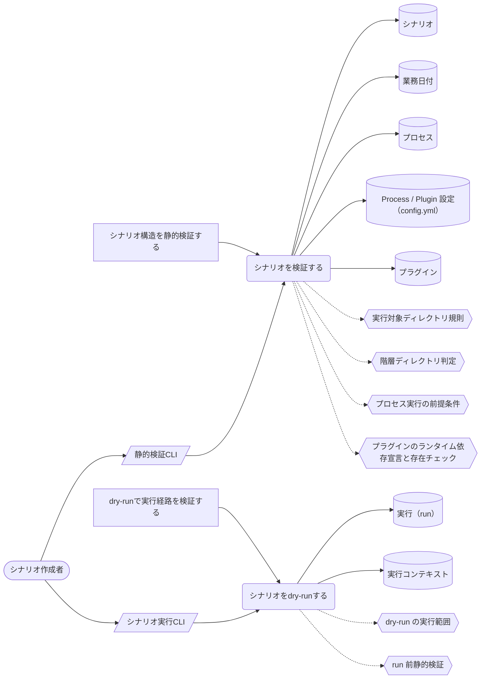
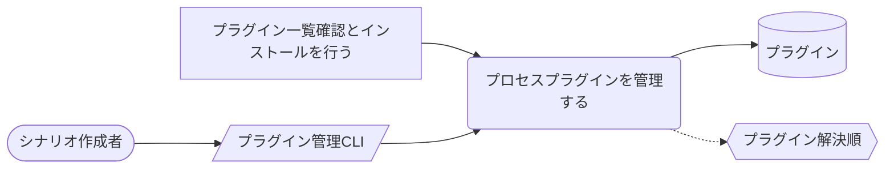
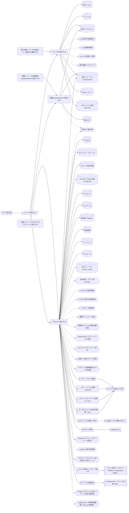
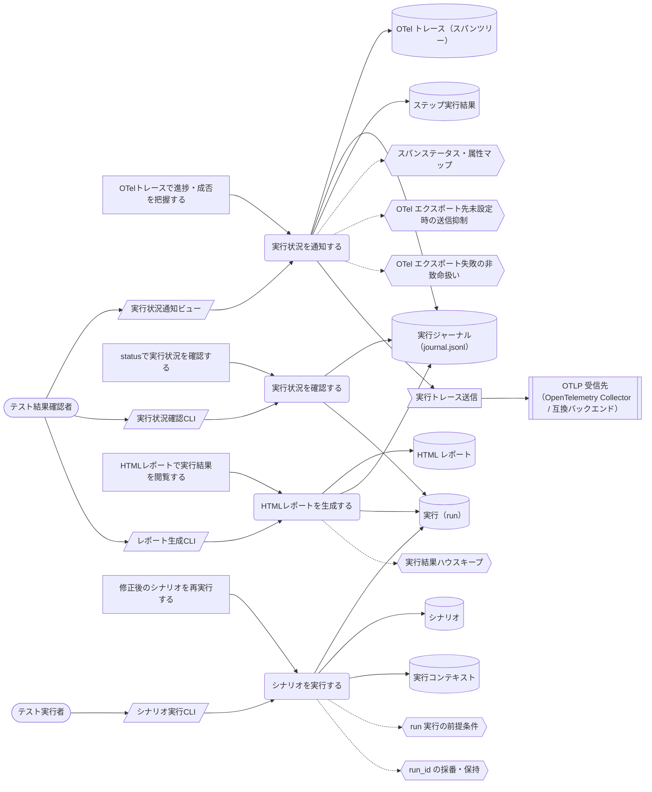

<!-- generateRdraMd.js による自動生成ファイル。手動編集しないこと。元データ: docs/rdra/latest/*.tsv -->

# UC複合図

RDRA システム境界レイヤー。BUC ごとに、アクティビティ・UC・画面・イベント・
情報・条件・外部システムの関係を表す。

## テスト環境準備業務

### プロジェクト初期化フロー

> 凡例: `(丸角)` アクター・UC / `[四角]` アクティビティ / `[/斜め/]` 画面 / `[(円柱)]` 情報 / `{{六角}}` 条件 / `>旗]` イベント / `[[二重枠]]` 外部システム。点線は条件参照。

| UC | アクティビティ | 画面 | 情報 | 条件 | イベント | 説明 |
|---|---|---|---|---|---|---|
| プロジェクトを初期化する | プロジェクトディレクトリを作成し初期化する | プロジェクト初期化CLI | プロジェクト、プロジェクト設定（stfw.yml） | プロジェクト再初期化禁止 |  | stfw initでテンプレート一式（stfw.yml・config・sampleシナリオ）をプロジェクトディレクトリへ展開してプロジェクトを開始する（再初期化は禁止） |
| 暗号化キーを生成する | 暗号化キーペアを生成する | 暗号化キー生成CLI | 暗号化キー、プロジェクト | 暗号化キー再生成の抑止 |  | stfw secret keygenで資格情報暗号化用のage (X25519)キーペアを生成し、資格情報を平文で扱わない準備を整える（再生成は--force指定時のみ） |

### 接続情報管理フロー

> 凡例: `(丸角)` アクター・UC / `[四角]` アクティビティ / `[/斜め/]` 画面 / `[(円柱)]` 情報 / `{{六角}}` 条件 / `>旗]` イベント / `[[二重枠]]` 外部システム。点線は条件参照。

| UC | アクティビティ | 画面 | 情報 | 条件 | イベント | 説明 |
|---|---|---|---|---|---|---|
| テスト対象ホスト情報を参照する | inventory定義を確認する | インベントリ照会CLI | インベントリ | inventory 全件指定、プラグイン接続情報のグループ名参照 |  | stfw inventory existsでホストグループの存在確認、stfw inventory listでホスト一覧取得を行い、定義内容を検証する（旧 --is-exist / --list と出力互換） |
| 資格情報を暗号化登録・参照する | 資格情報を暗号化登録・確認する | 資格情報管理CLI | パスワード、暗号化キー、インベントリ | パスワード重複登録禁止、シークレットマスキング |  | stfw secret setでホスト×ユーザー単位の資格情報をage (X25519)で暗号化保管し、stfw secret showで復号表示して登録内容を確認する（重複登録は禁止）。組み込みプラグインの収集先・接続先への接続資格情報も本機構で参照される |
| 資格情報を旧形式から移行する | 旧形式の資格情報をage形式へ移行する | 資格情報管理CLI | パスワード | 資格情報の旧形式移行 |  | stfw secret migrateで旧S/MIME形式の資格情報をage形式へ一括変換する（旧ファイルは.bak退避）。移行前も旧形式は読み込み専用でサポートされ復号参照できる |
| SSHサーバキーを登録する | テスト対象ホストのSSHサーバキーを登録する | SSHサーバキー登録CLI | SSH サーバキー（known_hosts）、インベントリ |  | SSHサーバキー収集 | stfw ssh trust <host\|group>でテスト対象ホストのサーバキーをknown_hostsへ登録する（旧キー削除+新キー登録）。inventoryグループ指定で一括登録できる（旧実装で未配線だった機能の正式コマンド化）。組み込みプラグイン（collectLog / collectFile）のscp/ssh接続でも本登録が利用される |

## シナリオ作成業務

### テストシナリオ作成フロー

> 凡例: `(丸角)` アクター・UC / `[四角]` アクティビティ / `[/斜め/]` 画面 / `[(円柱)]` 情報 / `{{六角}}` 条件 / `>旗]` イベント / `[[二重枠]]` 外部システム。点線は条件参照。

| UC | アクティビティ | 画面 | 情報 | 条件 | イベント | 説明 |
|---|---|---|---|---|---|---|
| シナリオ構造を組み立てる | 3階層scaffoldを生成する | シナリオscaffold生成CLI | シナリオ、業務日付、プロセス、メタ情報（metadata.yml） | 業務日付フォーマット、連番フォーマット、グループ名制約、階層ディレクトリ判定、プロセス実行の前提条件 |  | stfw new scenario / new bizdate / new processでscenario > bizdate > processの3階層scaffold（ディレクトリ・metadata.yml・config・scripts雛形）を生成し、テストシナリオの骨格を作る（旧 scenario -i / bizdate -i / process -i） |
| シナリオを spec・ドキュメントに変換する | spec とドキュメントをリバース生成する | シナリオ往復生成CLI | シナリオ spec（scenario.yml）、シナリオドキュメント（scenario.md）、メタ情報（metadata.yml）、シナリオ | spec/doc 往復の可逆性 |  | stfw scenario reverse <name> [-o, --out-dir <dir>] でシナリオツリー（規約ベースの記述＝正）から spec（<name>.yml）とドキュメント（<name>.md）をセット生成する（既定の出力先は docs/）。ドキュメントには各プロセスの group / type / description・要求トレーサビリティ（metadata.yml の requirement_specifications = どの要求をどの process が検証するか）・config サブツリーを表形式で出力する |
| spec からシナリオツリーを生成する | spec からツリーを生成・差分同期する | spec scaffold生成CLI | シナリオ spec（scenario.yml）、シナリオ、業務日付、プロセス、メタ情報（metadata.yml）、Process / Plugin 設定（config.yml） | scaffold の差分同期（--sync）、spec/doc 往復の可逆性 |  | stfw scaffold <spec.yml> [--sync] で spec からディレクトリ骨格（scenario > bizdate > process のディレクトリ・metadata.yml・config）を生成する。既存ツリーがある場合 --sync は差分同期（spec に有りツリーに無いディレクトリは追加、両方に有るディレクトリは維持、spec に無くなったディレクトリは削除）、--sync 無しはエラー終了。対話的 scaffold 生成（stfw new）とは別に spec ファイルを単一ソースとしたツリー生成・差分同期の入口を提供する |

### シナリオ静的検証フロー

> 凡例: `(丸角)` アクター・UC / `[四角]` アクティビティ / `[/斜め/]` 画面 / `[(円柱)]` 情報 / `{{六角}}` 条件 / `>旗]` イベント / `[[二重枠]]` 外部システム。点線は条件参照。

| UC | アクティビティ | 画面 | 情報 | 条件 | イベント | 説明 |
|---|---|---|---|---|---|---|
| シナリオを検証する | シナリオ構造を静的検証する | 静的検証CLI | シナリオ、業務日付、プロセス、Process / Plugin 設定（config.yml）、プラグイン | 実行対象ディレクトリ規則、階層ディレクトリ判定、プロセス実行の前提条件、プラグインのランタイム依存宣言と存在チェック |  | stfw validateでディレクトリ規約・プラグイン解決可否・config.yml・プラグインが宣言したランタイム依存（前提コマンド: k6・mysql/psqlクライアント・ssh/scp等）を静的検証し、実行可能性を事前確認する。残存する*.digファイルには不要である旨を警告する（ワークフロー定義の生成は廃止され、記述したディレクトリ構造そのものが実行定義となる） |
| シナリオをdry-runする | dry-runで実行経路を検証する | シナリオ実行CLI | 実行（run）、実行コンテキスト | dry-run の実行範囲、run 前静的検証 |  | stfw run --dry-runでexecute / post_executeをスキップして実行し（setup → pre_execute → teardownは実行）、テスト対象環境への影響なしに実行経路と前後処理を事前検証する |

### プロセスプラグイン拡張フロー

> 凡例: `(丸角)` アクター・UC / `[四角]` アクティビティ / `[/斜め/]` 画面 / `[(円柱)]` 情報 / `{{六角}}` 条件 / `>旗]` イベント / `[[二重枠]]` 外部システム。点線は条件参照。

| UC | アクティビティ | 画面 | 情報 | 条件 | イベント | 説明 |
|---|---|---|---|---|---|---|
| プロセスプラグインを管理する | プラグイン一覧確認とインストールを行う | プラグイン管理CLI | プラグイン | プラグイン解決順 |  | stfw plugin listで利用可能なプロセスプラグイン（組込みプラグイン群: scripts・収集系 collectLog / collectFile・データストア系 exportXxx / importXxx / clearXxx・検証系 compare・実行系 invokeWeb / invokeRest、およびプロジェクトのカスタムプラグイン）を一覧し、stfw plugin installでプラグインをインストールする（旧 process -l / -I。解決順互換。scaffold生成はstfw new processで行う） |

## シナリオ実行業務

### シナリオ一括自動実行フロー

> 凡例: `(丸角)` アクター・UC / `[四角]` アクティビティ / `[/斜め/]` 画面 / `[(円柱)]` 情報 / `{{六角}}` 条件 / `>旗]` イベント / `[[二重枠]]` 外部システム。点線は条件参照。

| UC | アクティビティ | 画面 | 情報 | 条件 | イベント | 説明 |
|---|---|---|---|---|---|---|
| シナリオを実行する | 実行対象シナリオを指定して一括実行を開始する | シナリオ実行CLI | 実行（run）、シナリオ、実行コンテキスト、実行ジャーナル（journal.jsonl）、HTML レポート、プロジェクト設定（stfw.yml） | run 実行の前提条件、run 前静的検証、run_id の採番・保持、実行結果ハウスキープ |  | stfw run <scenario-names...>でrun_id（_{YYYYMMDDHHMMSS}_{PID}）を採番し、run前静的検証（対象シナリオの存在チェック等を統合）の通過後に内蔵ランナーで実行を開始する。run開始時には保存期間（stfw.housekeep.retention）を過ぎた過去の実行結果（実行ジャーナル・HTMLレポート）を自動ハウスキープする。digdagプロジェクトのpush・server起動等の前準備は不要で、旧server start → run -fの2段階を1コマンドに統合 |
| 階層setup/teardownを実行する | 内蔵ランナーが各階層のsetup/teardownを実行する | シナリオ実行CLI | 実行コンテキスト、実行ジャーナル（journal.jsonl）、実行ログ | 設定の上書き順 |  | 内蔵ランナーがrun/scenario/bizdate各階層のsetup/teardownを直接実行し（digdagからの呼び戻しは廃止）、実行ジャーナルへ開始・終了イベントを記録して階層実行ステータスをStarted→Success/Errorへ遷移させる。bizdateのnode_startイベント時刻はプラグインenv契約（stfw_bizdate_start_ts等）として後続のプロセス実行へ公開される |
| プロセスを実行する | 内蔵ランナーがプロセスをプラグインで実行する | シナリオ実行CLI | プロセス、スクリプト（ステップ）、ステップ実行結果、Process / Plugin 設定（config.yml）、実行ジャーナル（journal.jsonl）、プラグイン、エビデンス、期待値（expect）、比較結果、インベントリ、パスワード、SSH サーバキー（known_hosts） | 逐次実行・エラー時 Blocked、dry-run の実行範囲、プロセス実行の前提条件、設定の上書き順、プラグイン解決順、階層ディレクトリ判定、収集先ホストとの時刻同期前提、export/import ラウンドトリップ互換、エビデンスディレクトリ規約、比較不一致はステップ失敗、プラグイン接続情報のグループ名参照、sshExec のリモートスクリプト一括実行、scpPut の原子的配置、プラグインのランタイム依存宣言と存在チェック、invoke エビデンス HTML レポート生成の優先順、config の ${...} 環境変数展開（stfw.yml 値参照） | リモートテスト適用、ログ・ファイル収集（scp/ssh）、ログフィルタ転送・実行、k6テスト実行、テスト対象データストア接続、ファイル比較実行、リモートスクリプト一括実行（ssh）、ローカルファイル原子的配置（scp） | 内蔵ランナーがプロセスをsetup→pre_execute→execute→post_execute→teardownの順に直接実行する（digdagからの呼び戻しは廃止）。プロセスはプロセスタイプに応じたプラグインとして実行され、scriptsのほか組込みプラグイン群（収集系 collectLog / collectFile、データストア系 exportXxx / importXxx / clearXxx、検証系 compare、実行系 invokeWeb / invokeRest、リモートアクセス系 sshExec / scpPut）により、1つの業務日付をArrange（準備）→Act（実行）→Collect（収集）→Assert（検証）のパイプラインとして人手を介さず反復できる。scriptsプラグインではscripts/配下をファイル名昇順に逐次実行し、エラー時（compareの比較不一致によるステップ失敗を含む）は後続をBlockedとして停止、ステップ実行ステータスをPending→Success/Error/Blockedへ遷移させる。実行系（invokeWeb / invokeRest）はActの結果をk6サマリ（evidence/summary.json）と人間可読なHTMLレポート（evidence/report.html）としてエビデンスに出力する。configチェーンの値中の${...}は実行環境の環境変数（run開始時にexportされたstfw.ymlのフラット化値を含む）を参照して展開され、共通identity（database / user）は${stfw_...}で参照できる |

## テスト結果確認業務

### 実行結果監視・確認フロー

> 凡例: `(丸角)` アクター・UC / `[四角]` アクティビティ / `[/斜め/]` 画面 / `[(円柱)]` 情報 / `{{六角}}` 条件 / `>旗]` イベント / `[[二重枠]]` 外部システム。点線は条件参照。

| UC | アクティビティ | 画面 | 情報 | 条件 | イベント | 説明 |
|---|---|---|---|---|---|---|
| 実行状況を通知する | OTelトレースで進捗・成否を把握する | 実行状況通知ビュー | OTel トレース（スパンツリー）、実行ジャーナル（journal.jsonl）、ステップ実行結果 | スパンステータス・属性マップ、OTel エクスポート先未設定時の送信抑制、OTel エクスポート失敗の非致命扱い | 実行トレース送信 | 実行ジャーナル（journal.jsonl）のイベントの投影として、runをルートにscenario/bizdate/process/stepを子孫とするスパンツリーがOTLP受信先へ送信され、既存のオブザーバビリティ基盤（Jaeger/Grafana Tempo/Datadog等）でそのまま進捗・成否・所要時間を可視化・分析できる（送信先未設定時は送信せず、送信失敗は実行を失敗させない） |
| 実行状況を確認する | statusで実行状況を確認する | 実行状況確認CLI | 実行ジャーナル（journal.jsonl）、実行（run） |  |  | stfw status [run_id]で実行ジャーナルをリプレイし、階層ツリーと各階層・ステップのステータスを表示する（digdag Web UI・ログ追従（run -f）・attempt URL案内による確認は廃止） |
| HTMLレポートを生成する | HTMLレポートで実行結果を閲覧する | レポート生成CLI | HTML レポート、実行ジャーナル（journal.jsonl）、実行（run） | 実行結果ハウスキープ |  | stfw report [run_id]で実行ジャーナルから静的HTMLレポート（.stfw/reports/にindex + run詳細）を生成する。実行中もprocess終了ごとに増分再生成され、Docker Compose構成ではnginxがreports共有volumeを配信し、ブラウザ（http://localhost:8080）で準リアルタイムに閲覧できる。run開始時のハウスキープで保存期間を過ぎたHTMLレポート（.stfw/reports/runs/{run_id}.html）は物理削除され、削除に伴いレポートindexが再生成される（削除済みrunはindexに残らない） |
| シナリオを実行する | 修正後のシナリオを再実行する | シナリオ実行CLI | 実行（run）、シナリオ、実行コンテキスト | run 実行の前提条件、run_id の採番・保持 |  | 修正済みシナリオをstfw runで再実行し、失敗からの回復を確認する（専用のリラン・途中再開I/Fは無く、実行のやり直しとなる） |
