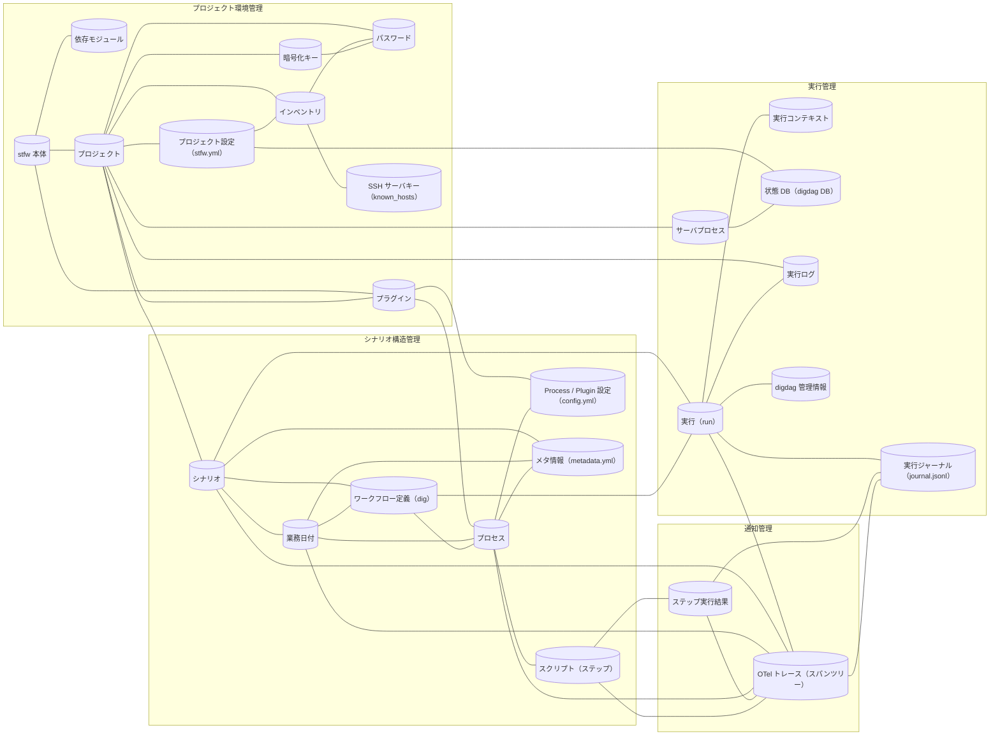

<!-- generateRdraMd.js による自動生成ファイル。手動編集しないこと。元データ: docs/rdra/latest/*.tsv -->

# 情報モデル

RDRA システム内部レイヤー。コンテキストごとの情報と情報間の関連。

> 凡例: `[(円柱)]` 情報 / `[四角]` 情報.tsv 未定義の参照。実線は関連情報。

## 情報一覧

| コンテキスト | 情報 | 属性 | 状態モデル | バリエーション | 説明 |
|---|---|---|---|---|---|
| プロジェクト環境管理 | stfw 本体 | STFW_HOME、VERSION、bin/ config/ plugins/ archives/ modules/ ディレクトリ構成 |  | 対応 OS 種別 | tar.gz 展開と install で各ホストに配置されるシナリオテスト実行基盤そのもの（bin/config/plugins/modules 構成・バージョン）を管理するため。実行ホストの OS 依存設定（JAVA_HOME 等）は対応 OS 種別で分岐する |
| プロジェクト環境管理 | 依存モジュール | 配布 URL（URL_DIGDAG）、配置先（modules/）、ダウンロードタイムアウト |  |  | install 時に配布元からダウンロードして配置する digdag jar 等の依存物（配布 URL・配置先）を管理し、実行基盤を構成するため |
| プロジェクト環境管理 | プロジェクト | プロジェクトディレクトリ（stfw.yml の存在で識別・上位探索）、config/、plugins/、scenario/、.stfw/（内部データ） |  |  | stfw init で開始されるシナリオテストの管理単位。stfw.yml の存在で識別され、config・scenario・内部データを束ねるため（再初期化は禁止） |
| プロジェクト環境管理 | プロジェクト設定（stfw.yml） | project_version、loglevel、inventory（参照ファイル名）、otel.endpoint（OTLP エクスポート先）、server.bind、server.port、server.db_mode、server.max_task_threads、server.timezone |  | ログレベル、DB モード、OTel エクスポート設定 | ログレベル・inventory 参照・OTel エクスポート先・server 設定を保持し、デフォルト→プロジェクトの順に上書きして全スクリプトへ環境変数として公開するため。OTel エクスポート先は OTel 標準の環境変数（OTEL_EXPORTER_OTLP_ENDPOINT 等）も尊重する。stfw.webhooks.*（urls / on_start / on_success / on_error）設定は廃止され、stfw init のテンプレートにも含まれない |
| プロジェクト環境管理 | インベントリ | インベントリファイル名（環境単位。例: staging.yml）、グループ名（web/ap/db 等＋予約値 all）、ホスト一覧（ip または hostname） |  | ホストグループ | 環境単位（例: staging）にテスト対象ホストをグループ（web/ap/db 等）で管理し、グループ存在確認・ホスト一覧取得に使うため。グループ名 all は全グループ横断の予約値 |
| プロジェクト環境管理 | 暗号化キー | encrypt_key（暗号化キー）、decrypt_key（復号キー）、RSA 2048 キーペア（config/encrypt/ 配下、プロジェクトに 1 組） |  |  | パスワードを S/MIME(AES256) で暗号化・復号するための RSA 2048 キーペア（プロジェクトに 1 組）を管理するため |
| プロジェクト環境管理 | パスワード | ホスト、ユーザー（ファイル名 {host}-{user}、config/passwd/ 配下）、暗号化済み文字列（password・token 等） |  |  | テスト対象ホストへの資格情報をホスト×ユーザー単位で暗号化保管し、平文保管を避けて参照できるようにするため（重複登録は禁止） |
| プロジェクト環境管理 | プラグイン | プラグイン名（process/{process_type}）、bin/（install・run・webhook）、config.yml、template/、スコープ（プロジェクト/組込み） |  | プロセスタイプ、プラグインスコープ | プロセスタイプの実行方式を提供する拡張単位（同梱は scripts のみ）。プロジェクト→組込みの解決順で管理するため |
| プロジェクト環境管理 | SSH サーバキー（known_hosts） | 対象ホスト、SSH サーバ公開鍵、known_hosts ファイル |  |  | テスト対象ホストへのリモート適用に先立ち、SSH サーバキーを known_hosts へ自動登録して接続確認の手間と中間者リスクを避けるため（実装上は未参照候補であり、採否はユーザー確認対象として継続） |
| シナリオ構造管理 | シナリオ | シナリオ名（scenario/{name} ディレクトリ）、metadata.yml、scenario.dig |  |  | 業務日付をまたぐ一連の業務処理を記述するテストの最上位単位（scenario/{name} ディレクトリ）を識別・管理するため |
| シナリオ構造管理 | 業務日付 | ディレクトリ名（_{seq}_{bizdate}）、seq（実行順）、bizdate（YYYYMMDD）、metadata.yml、bizdate.dig |  |  | シナリオ内でテストを日付単位に区切って進行させる単位（_{seq}_{bizdate}、YYYYMMDD）を実行順つきで管理するため |
| シナリオ構造管理 | プロセス | ディレクトリ名（_{seq}_{group}_{process_type}）、seq（実行順）、group、process_type、config/config.yml、metadata.yml | 階層実行ステータス | プロセスタイプ | 業務日付内のまとまった処理単位（_{seq}_{group}_{process_type}）を実行順・プロセスタイプつきで管理するため。setup→execute→teardown の実行状況は階層実行ステータスで確定する |
| シナリオ構造管理 | スクリプト（ステップ） | ファイル名（scripts/ 直下、昇順＝実行順）、任意言語の実行可能ファイル | ステップ実行ステータス |  | プロセス内 scripts/ 直下に置く任意言語の実行可能ファイル。ファイル名昇順＝実行順として管理し、実行状況をステップ実行ステータス（Pending→Success/Error/Blocked）で追跡するため |
| シナリオ構造管理 | Process / Plugin 設定（config.yml） | stfw.process.{type} 配下の任意キー（全スクリプトへ環境変数として export）、上書き順（組込み→プロジェクト→シナリオ内） |  |  | プロセス実行時に全スクリプトへ環境変数として公開する設定値を、組込み→プロジェクト→シナリオ内の順に上書き管理するため |
| シナリオ構造管理 | メタ情報（metadata.yml） | description、requirement_specifications（scaffold / dig 生成時に空で生成） |  |  | scaffold 生成時にシナリオ・業務日付・プロセスへ付与する説明・要求仕様の記述欄を管理するため（生成のみで参照実装は無く、用途はユーザー確認対象として継続） |
| シナリオ構造管理 | ワークフロー定義（dig） | ファイル種別（run.dig / scenario.dig / bizdate.dig、各階層に 1 つ）、timezone、_export 変数（run_id・run_mode・stfw_*）、タスク列（名前昇順）、_error ハンドラ、生成モード（self / cascade） |  | dig 生成モード | ディレクトリ構造から自動生成する digdag 実行定義（run.dig / scenario.dig / bizdate.dig）で、実行順序の保証とエラー時停止を担保するため |
| 実行管理 | 実行（run） | run_id（_{YYYYMMDDHHMMSS}_{PID}）、run_mode（--run / --dry-run）、対象シナリオ群（symlink）、attempt_id（digdag 起動後に取得）、digdag プロジェクトディレクトリ（.stfw/runs/{run_id}）、params（起動パラメータ）、digdag_start.info | 階層実行ステータス | 実行モード（run_mode） | stfw run で採番される run_id を ID とする一括自動実行の単位。対象シナリオ群・run_mode・attempt_id を管理し、run 階層の実行状況を階層実行ステータスで確定するため |
| 実行管理 | 実行コンテキスト | プロセス ID（.stfw/context/{pid} ファイル）、key=value ペア（run_id・attempt_id 等）、ライフサイクル（コマンド開始で初期化・終了で破棄） |  |  | コマンド実行中に run_id・attempt_id 等の key=value を保持し、digdag からの呼び戻し間で実行情報を引き継ぐため |
| 実行管理 | サーバプロセス | pid ファイル（.stfw/pid、1 プロジェクト 1 プロセス）、digdag server の PID | server 稼働状態 |  | digdag server の PID を pid ファイルで管理し、起動・停止・状態確認と多重起動禁止を実現するため。稼働状況は server 稼働状態（停止中⇔起動中）で管理する |
| 実行管理 | 状態 DB（digdag DB） | db_mode（--memory / --database {dir}）、配置先ディレクトリ（テンプレート既定 .stfw/db） |  | DB モード | digdag server の状態保持方式（--memory / --database）を管理し、実行基盤の状態管理を制御するため。永続化時は再起動後も実行状態を保持する |
| 実行管理 | 実行ログ | ログファイル（.stfw/stfw.log）、日次ローテーション、ログレベル（trace〜error）、シークレットマスキング済みログ行、セクション別処理時間、OTel エクスポート失敗の警告 |  | ログレベル | 実行状況の追従表示・障害調査のためのログ（日次ローテーション・シークレットマスキング済み）を集約管理するため。OTLP トレースの送信失敗は実行を失敗させず、警告として本ログに記録される |
| 実行管理 | digdag 管理情報 | project、session、attempt、task（外部システム digdag 内）、attempt_id、state、log |  |  | 外部システム digdag が管理する project / session / attempt / task のうち attempt_id・state・log を参照し、実行状況確認と Web UI 案内に使うため（digdag attempt state は外部システム側の状態であり本モデルの状態モデル対象外） |
| 通知管理 | ステップ実行結果 | script_name、result（Pending / Success / Error / Blocked）、start_time、end_time、processing_time | ステップ実行ステータス | 終了コード | スクリプト単位の実行結果（result・処理時間）を step スパンの属性として OTLP トレースに投影し、失敗時の調査に使うため。result はスクリプトの終了コード（0/3/6）を基準にステップ実行ステータスとして確定し、Blocked はスパン属性で表現される |
| 通知管理 | OTel トレース（スパンツリー） | trace_id、スパンツリー（run＝ルートスパン、scenario / bizdate / process＝子スパン、step＝末端スパン）、スパン属性（run_id、階層タイプ、bizdate、seq、group、プロセスタイプ、終了コード、Blocked 表現 等）、スパンステータス（Error マップ）、開始・終了時刻（実行ジャーナルのイベント時刻と一致） | 階層実行ステータス | スパン階層タイプ、OTel エクスポート設定 | run > scenario > bizdate > process > step の実行状況を OTLP トレースとして OTLP 受信先へ送信し、既存のオブザーバビリティ基盤（Jaeger / Grafana Tempo / Datadog 等）でそのまま可視化・分析できるようにするため。実行ジャーナル（journal.jsonl）のイベントの投影として生成され、階層実行ステータスはスパンステータス・属性として永続化される。シグナルはトレースのみとしログ・メトリクスは送らない |
| 実行管理 | 実行ジャーナル（journal.jsonl） | journal.jsonl ファイル、イベント行（run / scenario / bizdate / process / step の開始・終了イベント、イベント時刻、ステータス） |  |  | 実行状況イベントの唯一のソースとして、各階層・ステップの開始・終了をイベント時刻つきで記録するため。OTel エクスポートは本ジャーナルのイベントの投影として実装され、スパンの開始・終了時刻はジャーナルのイベント時刻と一致する |
