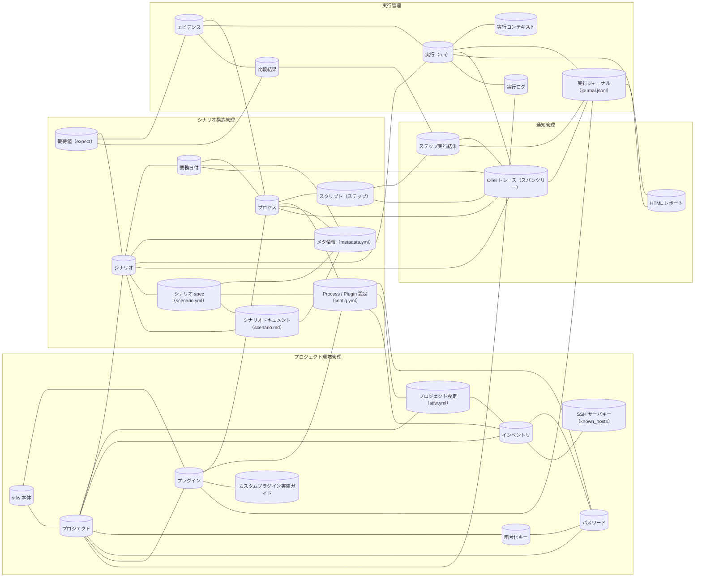

<!-- generateRdraMd.js による自動生成ファイル。手動編集しないこと。元データ: docs/rdra/latest/*.tsv -->

# 情報モデル

RDRA システム内部レイヤー。コンテキストごとの情報と情報間の関連。

> 凡例: `[(円柱)]` 情報 / `[四角]` 情報.tsv 未定義の参照。実線は関連情報。

## 情報一覧

| コンテキスト | 情報 | 属性 | 状態モデル | バリエーション | 説明 |
|---|---|---|---|---|---|
| プロジェクト環境管理 | stfw 本体 | 配布形態（マルチプラットフォームバイナリ: linux/darwin × amd64/arm64 + windows/amd64、Docker image（ghcr.io）、compose.yaml（stfw + nginx））、Docker image タグ構成（最小構成 / 依存全部入り（例: stfw:full））、VERSION、内蔵ランナー、組込みプラグイン群、内蔵デフォルト設定 |  | 対応 OS 種別、Docker イメージ構成 | 配布物（バイナリ / Docker image / compose.yaml）の配置のみで各ホストに用意されるシナリオテスト実行基盤そのもの（Go 単一バイナリ）を管理するため。JVM / Python 2 / Ruby 等のランタイムや依存モジュールは不要で、STFW_HOME（配布ディレクトリ）概念は廃止。対応プラットフォームは対応 OS 種別で管理する。Docker イメージは既存の最小構成に加えて、プラグインのランタイム依存（k6・mysql/psql クライアント・ssh/scp 等）全部入りのタグ（例: stfw:full）を提供する |
| プロジェクト環境管理 | プロジェクト | プロジェクトディレクトリ（stfw.yml の存在で識別・上位探索）、config/、plugins/、scenario/、.stfw/（runs / reports 等の内部データ） |  |  | stfw init で開始されるシナリオテストの管理単位。stfw.yml の存在で識別され、config・scenario・内部データを束ねるため（再初期化は禁止） |
| プロジェクト環境管理 | プロジェクト設定（stfw.yml） | project_version、loglevel、inventory（参照ファイル名）、otel.endpoint（OTLP エクスポート先）、timezone、housekeep.retention（実行結果の保存期間）、共通設定値（例: db.database / db.user 等の共通 identity） |  | ログレベル、OTel エクスポート設定、実行結果保存期間設定 | ログレベル・inventory 参照・OTel エクスポート先等を保持し、デフォルト（stfw 本体の内蔵デフォルト）→ プロジェクトの順に上書きして全スクリプトへ環境変数として公開するため（STFW_HOME/config は廃止）。OTel エクスポート先は OTel 標準の環境変数（OTEL_EXPORTER_OTLP_ENDPOINT 等）も尊重する。実行結果の保存期間（stfw.housekeep.retention）を保持し、stfw run 開始時のハウスキープにおける実行結果削除の基準とする。stfw.server.* 設定は廃止され、読み込み時に廃止警告を表示する（設定値は実行に影響しない）。stfw run 開始時に stfw.yml（+ 同梱デフォルト）のフラット化結果を実行環境へ export する（v0.2 の export_yaml 互換）ため、各プロセスの config から ${stfw_...} で stfw.yml の設定値を参照できる。複数プロセスで共通の identity（database / user 等）を stfw.yml に集約すると、各プロセス config には固有値（テーブル名等）だけを書けば済む |
| プロジェクト環境管理 | インベントリ | インベントリファイル名（環境単位。例: staging.yml）、グループ名（web/ap/db 等＋予約値 all）、ホスト一覧（ip または hostname） |  | ホストグループ | 環境単位（例: staging）にテスト対象ホストをグループ（web/ap/db 等）で管理し、stfw inventory exists によるグループ存在確認・stfw inventory list によるホスト一覧取得（旧 --is-exist / --list と出力互換）に使うため。グループ名 all は全グループ横断の予約値。組み込みプラグインの収集先・接続先（収集系・データストア系・リモートアクセス系 sshExec / scpPut）はホストグループ名参照のみで指定される（プラグイン設定に接続情報を直接書かない） |
| プロジェクト環境管理 | 暗号化キー | 秘密鍵・公開鍵（age (X25519) キーペア、config/encrypt/ 配下、プロジェクトに 1 組） |  |  | 資格情報を age (X25519) で暗号化・復号するためのキーペア（プロジェクトに 1 組）を stfw secret keygen で生成・管理するため（再生成は --force 指定時のみ） |
| プロジェクト環境管理 | パスワード | ホスト、ユーザー（ファイル名 {host}-{user}、config/passwd/ 配下）、暗号化済み文字列（password・token 等）、暗号化方式（age (X25519)。旧 S/MIME は読み込み専用） |  | 資格情報暗号化方式 | テスト対象ホストへの資格情報をホスト×ユーザー単位で stfw secret set / show により暗号化保管・参照し、平文保管を避けるため（重複登録は禁止）。旧 S/MIME 形式は読み込み専用でサポートし、stfw secret migrate で age 形式へ一括移行できる（旧ファイルは .bak 退避）。組み込みプラグインが収集先・接続先ホスト・データストアへ接続する際の資格情報としても既存機構のまま利用される（データストア系・リモートアクセス系 sshExec / scpPut プラグインは {host}-{user} を自動参照し、config.yml への直接記述は禁止） |
| プロジェクト環境管理 | プラグイン | プラグイン名（process/{process_type}）、bin/、config.yml、template/、plugin.yml（メタデータ: requires = 前提コマンドのリスト。例: mysql, ssh, scp, k6）、スコープ（プロジェクト / 組込み（配布物同梱））、フェーズ（Arrange / Act / Collect / Assert）、env 契約（stfw_* / STFW_PROJ_DIR / stfw_bizdate_start_ts（RFC3339 形式）/ stfw_run_status（teardown フックへ公開。Warn あり・Error なしの run では Warn）系） |  | プロセスタイプ、プラグインスコープ、プラグインフェーズ | プロセスタイプの実行方式を提供する拡張単位。組込みプラグイン群（scripts・収集系 collectLog / collectFile・データストア系 exportMysql / importMysql / clearMysql・exportPostgres / importPostgres / clearPostgres・exportRedis / importRedis / clearRedis・検証系 compare・実行系 invokeWeb / invokeRest・リモートアクセス系 sshExec / scpPut）が Arrange → Act → Collect → Assert 各フェーズの汎用部品を提供し、プロダクト固有の処理は利用者がカスタムプラグインとして組み込みプラグインを組み合わせて実装する 2 層構造とするため。stfw plugin list / install で管理し、プロジェクト → 組込みの解決順とプラグイン env 契約（stfw_* / STFW_PROJ_DIR 系の環境変数公開）を維持する。プロセスプラグイン実行契約のリターンコード体系（0=Success / 3=Warn / 6=Error）は変更せず、3（Warn）に実行意味論を追加する。3 を返したステップ / プロセスは Warn として実行ジャーナルに記録され後続の実行は止めない（従来 3 は Error と同じ扱いで停止していたため、3 を返していたプラグインが「止まらなくなる」挙動変化はリリースノートで明示する）。compare プラグインは設定キー on_mismatch: error（既定）\| warn で比較不一致時の扱いを選択できる。teardown フックへ公開する stfw_run_status は Warn あり・Error なしの run で Warn になる（全 Success の run は従来どおり Success）。前提コマンドはメタデータファイル plugin.yml の requires としてランタイム依存宣言し、stfw validate と run 前静的検証がシナリオで使用するプロセスタイプの requires をコマンド存在チェックで検証する。実行系（invokeWeb / invokeRest）は Act 実行後に k6 の end-of-test サマリ（evidence/summary.json）と HTML レポート（evidence/report.html）を自プロセスディレクトリ配下の evidence/（gitignore 対象）へ出力する。プラグイン / プロセスの config チェーン（プラグイン既定 → プロジェクト config/plugins/process/{type}/ → プロセス config/config.yml）の値中の ${VAR} は実行環境の環境変数を参照して展開され、run 開始時に export された stfw.yml のフラット化値を ${stfw_...} で参照できる |
| プロジェクト環境管理 | SSH サーバキー（known_hosts） | 対象ホスト、SSH サーバ公開鍵、known_hosts ファイル |  |  | テスト対象ホストへのリモート適用に先立ち、stfw ssh trust <host\|group> で SSH サーバキーを known_hosts へ登録（旧キー削除＋新キー登録、inventory グループ指定で一括登録）し、接続確認の手間と中間者リスクを避けるため（旧実装で未配線だった機能の正式コマンド化）。組み込みプラグイン（collectLog / collectFile・リモートアクセス系 sshExec / scpPut）の scp / ssh 接続でも既存機構のまま利用される |
| シナリオ構造管理 | シナリオ | シナリオ名（scenario/{name} ディレクトリ）、metadata.yml |  |  | 業務日付をまたぐ一連の業務処理を記述するテストの最上位単位（scenario/{name} ディレクトリ）を識別・管理するため。記述したディレクトリ構造そのものが実行定義となる（ワークフロー定義（dig）の生成・管理は廃止）。stfw scenario reverse でツリーから spec（<name>.yml）・ドキュメント（<name>.md）を生成し、stfw scaffold で spec からツリーを生成・差分同期（--sync）できる（往復可逆） |
| シナリオ構造管理 | 業務日付 | ディレクトリ名（_{seq}_{bizdate}）、seq（実行順）、bizdate（YYYYMMDD）、metadata.yml |  |  | シナリオ内でテストを日付単位に区切って進行させる単位（_{seq}_{bizdate}、YYYYMMDD）を実行順つきで管理するため |
| シナリオ構造管理 | プロセス | ディレクトリ名（_{seq}_{group}_{process_type}）、seq（実行順）、group、process_type、config/config.yml、metadata.yml | 階層実行ステータス | プロセスタイプ | 業務日付内のまとまった処理単位（_{seq}_{group}_{process_type}）を実行順・プロセスタイプつきで管理するため。setup → pre_execute → execute → post_execute → teardown の実行状況は階層実行ステータスで確定する |
| シナリオ構造管理 | スクリプト（ステップ） | ファイル名（scripts/ 直下、昇順＝実行順）、任意言語の実行可能ファイル | ステップ実行ステータス |  | プロセス内 scripts/ 直下に置く任意言語の実行可能ファイル。ファイル名昇順＝実行順として管理し、実行状況をステップ実行ステータス（Pending→Success/Warn/Error/Blocked）で追跡するため |
| シナリオ構造管理 | Process / Plugin 設定（config.yml） | stfw.process.{type} 配下の任意キー（既存の env フラット化規則で全スクリプトへ環境変数として export）、上書き順（組込み→プロジェクト→シナリオ内）、収集系スキーマ（targets リスト: group = inventory グループ名参照、paths = 収集ファイルパス正規表現リスト）、データストア系スキーマ（host_group = inventory グループ名参照、port、database、user、tables = テーブル名リスト 等。パスワードは secret の {host}-{user} を自動参照）、リモートアクセス系スキーマ（sshExec / scpPut: group = inventory グループ名参照、user = ログインユーザ、scpPut のグループ毎の配置先ディレクトリ 等。パスワードは secret の {host}-{user} を自動参照）、検証系スキーマ（compare: on_mismatch = error（既定）\| warn。比較不一致時の扱いの選択）、値中の ${VAR} 展開（実行環境の環境変数を参照。run 開始時に export された stfw.yml のフラット化値を ${stfw_...} で参照可。例: ${stfw_db_database} / ${stfw_db_user}） |  | compare on_mismatch 設定 | プロセス実行時に全スクリプトへ環境変数として公開する設定値を、組込み→プロジェクト→シナリオ内の順に上書き管理するため。stfw validate / run 前静的検証の検証対象となる。組み込みプラグインの収集先・接続先は inventory のホストグループ名参照のみで指定し（収集系: targets（group / paths）、データストア系: host_group 等、リモートアクセス系 sshExec / scpPut: group / user / scpPut の配置先ディレクトリ）、接続情報（ホスト名・パスワード）を config.yml に直接記述しない（データストア系・リモートアクセス系のパスワードは secret の {host}-{user} を自動参照する）。検証系（compare）の on_mismatch: error（既定）\| warn で比較不一致時の扱い（Error 停止 / Warn 続行）を選択できる。値中の ${VAR} は実行環境の環境変数を参照して展開され、run 開始時に export された stfw.yml のフラット化値（例: ${stfw_db_database} / ${stfw_db_user}）を参照できるため、共通の identity（database / user）を stfw.yml に集約し、各シナリオのプロセス config にはテーブル名等の固有値だけを書ける。集約対象は identity（database / user）のみで、接続情報（ホスト・パスワード）の直書きは解禁されない（inventory + secret の禁止契約を維持） |
| シナリオ構造管理 | メタ情報（metadata.yml） | description、requirement_specifications（scaffold 生成時に空で生成。requirement_specifications = どの要求をどの process が検証するか） |  |  | scaffold 生成時にシナリオ・業務日付・プロセスへ付与する説明・要求仕様の記述欄を管理するため。requirement_specifications は stfw scenario reverse が生成するドキュメント（<name>.md）の要求トレーサビリティ（どの要求をどの process が検証するか）として表形式で出力される（scaffold 生成のみで実行時参照実装は無く、用途はユーザー確認・ドキュメント出力として継続） |
| 実行管理 | 実行（run） | run_id（_{YYYYMMDDHHMMSS}_{PID}）、run_mode（run / dry-run）、対象シナリオ群、実行ディレクトリ（.stfw/runs/{run_id}）、終了コード（全 Success=0 / Warn あり（Error なし）=3 / Error あり=6） | 階層実行ステータス | 実行モード（run_mode） | stfw run で採番される run_id を ID とする一括自動実行の単位。前準備コマンドなしに 1 コマンドで開始される。run 開始時には保存期間（stfw.housekeep.retention）を過ぎた過去の実行結果（実行ジャーナル・HTML レポート）を自動ハウスキープしてから、run 前静的検証の通過後に内蔵ランナーが実行する。attempt_id は存在せず run_id で実行を識別し、run 階層の実行状況を階層実行ステータスで確定するため。run の実行ステータスは配下の Error > Warn > Success の優先度で集約され、終了コード（全 Success=0 / Warn あり（Error なし）=3 / Error あり=6）として CI から「差分あり（Warn）」を検知できる |
| 実行管理 | 実行コンテキスト | key=value ペア（run_id 等）、ライフサイクル（コマンド開始で初期化・終了で破棄） |  |  | コマンド実行中に run_id 等の key=value を保持し、内蔵ランナーの階層・プロセス実行間で実行情報を引き継ぐため（digdag からの呼び戻し・attempt_id は廃止） |
| 実行管理 | 実行ログ | ログファイル（.stfw/stfw.log）、日次ローテーション、ログレベル（trace〜error）、terminal 実行時のカラー出力、シークレットマスキング済みログ行、OTel エクスポート失敗の警告 |  | ログレベル | 障害調査のためのログ（日次ローテーション・シークレットマスキング済み・terminal 実行時はカラー出力）を .stfw/stfw.log へ集約管理するため。OTLP トレースの送信失敗は実行を失敗させず、警告として本ログに記録される（ログ追従（run -f）による確認は廃止） |
| 通知管理 | ステップ実行結果 | script_name、result（Pending / Success / Warn / Error / Blocked）、start_time、end_time、processing_time | ステップ実行ステータス | 終了コード | スクリプト単位の実行結果（result・処理時間）を step スパンの属性として OTLP トレースに投影し、失敗時の調査に使うため。result はスクリプトの終了コード（0=Success / 3=Warn / 0・3 以外=Error）を基準にステップ実行ステータスとして確定し、Blocked はスパン属性で表現される。Warn はスパンステータス Ok + stfw の status 属性として投影される |
| 通知管理 | OTel トレース（スパンツリー） | trace_id、スパンツリー（run＝ルートスパン、scenario / bizdate / process＝子スパン、step＝末端スパン）、スパン属性（run_id、階層タイプ、bizdate、seq、group、プロセスタイプ、終了コード、Blocked 表現、status 属性（Warn 表現）等）、スパンステータス（Error マップ。Warn はスパンステータス Ok + status 属性で表現）、開始・終了時刻（実行ジャーナルのイベント時刻と一致） | 階層実行ステータス | スパン階層タイプ、OTel エクスポート設定 | run > scenario > bizdate > process > step の実行状況を OTLP トレースとして OTLP 受信先へ送信し、既存のオブザーバビリティ基盤（Jaeger / Grafana Tempo / Datadog 等）でそのまま可視化・分析できるようにするため。実行ジャーナル（.stfw/runs/{run_id}/journal.jsonl）のイベントの投影として生成され、階層実行ステータスはスパンステータス・属性として永続化される。Warn は OTel のスパンステータスに相当が無い（Ok / Error / Unset のみ）ため、スパンステータス Ok + stfw の status 属性（Warn）として投影される（Error は従来どおりスパンステータス Error）。シグナルはトレースのみとしログ・メトリクスは送らない |
| 実行管理 | 実行ジャーナル（journal.jsonl） | journal.jsonl ファイル（.stfw/runs/{run_id}/ 配下、追記専用 JSONL）、イベント行（node_start / steps_enumerated / step_end / node_end、イベント時刻、ステータス（Success / Warn / Error / Blocked。Warn は本改訂で追加）） |  |  | 実行結果の唯一のソースとして、各階層・ステップの開始・終了をイベント時刻つきで追記専用 JSONL に記録するため。stfw status / stfw report は本ジャーナルのリプレイで実行状況を再構成し、OTel エクスポートも本ジャーナルのイベントの投影として実装される。status には Warn が追加され、Warn のステップ / 階層も記録される。旧バージョンの run のジャーナル（Warn なし）と混在しても、report 再生成・status 表示・ハウスキープは壊れない（Warn ステータスの後方互換）。bizdate の node_start イベント時刻は collectLog のフィルタ基準時刻として、プラグイン env 契約に追加された環境変数 stfw_bizdate_start_ts（RFC3339 形式）として公開される。保存期間（stfw.yml の stfw.housekeep.retention）を過ぎた実行ジャーナル（.stfw/runs/{run_id}）は stfw run 開始時のハウスキープで物理削除される |
| 通知管理 | HTML レポート | 出力先（.stfw/reports/、index + run 詳細（runs/{run_id}.html））、静的 HTML、増分再生成（実行中も process 終了ごと）、ハウスキープによる物理削除・index 再生成、nginx 配信（Docker Compose 構成、http://localhost:8080） |  |  | stfw report で実行ジャーナルから生成する静的 HTML レポート（index + run 詳細）。実行中も process 終了ごとに増分再生成され準リアルタイムに閲覧でき、Docker Compose 構成では nginx が reports 共有 volume を配信してブラウザ（http://localhost:8080）で閲覧できるため。Warn ステータスは黄系の色で表示され、どのシナリオ・どのプロセスで Warn（比較 NG）が発生したかを一覧で鳥瞰できる（機能変更の差分確認モードにおける「比較 NG の鳥瞰」ビュー）。旧バージョンの run のジャーナル（Warn なし）と混在しても再生成は壊れない（Warn ステータスの後方互換）。保存期間を過ぎた HTML レポート（.stfw/reports/runs/{run_id}.html）は stfw run 開始時のハウスキープで物理削除され、削除に伴いレポート index が再生成される（削除済み run は index に残らない） |
| プロジェクト環境管理 | カスタムプラグイン実装ガイド | ガイドドキュメント、想定パターン（updateBizDate / invokeJob / importMaster / export / clear）、組み込みプラグインの組み合わせ例 |  |  | プロダクト固有のカスタムプラグイン（業務日付の更新・ジョブスケジューラの呼び出し・共通マスターデータの投入等）を組み込みプラグインの組み合わせで実装するためのガイドドキュメント。プロダクト固有の知識は利用者側にしか無いため、フレームワークは汎用部品の提供に留め、想定パターンは組み込みプラグインとしては提供せずドキュメント化のみを要求範囲とするため |
| シナリオ構造管理 | 期待値（expect） | expect ディレクトリ（git 管理。直下に同一 bizdate 内の収集系 process ディレクトリ名、その配下は当該 process の evidence/ 配下と同型）、期待値ファイル（実行ログ・外部 IF ファイル・ヘッダー付き CSV） |  |  | compare プラグインの比較基準となる期待値。エビデンスディレクトリ規約により expect/ 直下に同一 bizdate 内の収集系 process ディレクトリ名を置き、その配下を当該 process の evidence/ 配下と同型にして対応づけて管理し、export の出力（ヘッダー付き CSV）から期待値を作成できるため |
| 実行管理 | エビデンス | evidence/ ディレクトリ（自プロセスディレクトリ配下の出力ルート、gitignore 対象）、収集ファイル配置（collectFile / collectLog: evidence/{host}/{収集元の絶対パスをそのまま再現}、exportMysql / exportPostgres: evidence/{database}/{table}.csv、exportRedis: evidence/{host}/{keyパターン名}.csv、invokeWeb / invokeRest: evidence/summary.json（k6 end-of-test サマリ）・evidence/report.html（HTML レポート））、収集元（ホストグループ / テーブル名リスト / key パターン / invoke の Act 実行結果） |  |  | 収集系プラグイン（collectLog / collectFile / exportXxx）がテスト対象ホスト・データストアから収集した実行ログ・ファイル・データ。エビデンスディレクトリ規約に従い自プロセスディレクトリ配下の evidence/（gitignore 対象）へ保管し、期待値比較（compare）の入力（actual）とするため。エクスポート CSV は RFC 4180 準拠（LF・UTF-8・必要時 quote）で 1 行目はヘッダー（カラム名）、NULL は \N で表現して空文字と区別する（mysqldump 慣行）。Redis はヘッダー付き CSV（key,type,ttl,value）で string 型は生値、hash / list / set / zset 型はキー順ソートの正規化 JSON とする。業務日付をまたぐ長時間シナリオでも人手を介さず機械的に収集できる。実行系（invokeWeb / invokeRest）も Act 実行後に k6 の end-of-test サマリ（evidence/summary.json）と HTML レポート（evidence/report.html）をエビデンスとして出力し（k6 が閾値割れ等で失敗しても summary.json・report.html は残る）、収集系プラグインに加えて invoke 系（実行系）のエビデンス出力がエビデンスディレクトリ規約（第 3 の互換境界）の対象に含まれる |
| 実行管理 | 比較結果 | result ディレクトリ（gitignore 対象。compare-files の比較結果出力）、actual ディレクトリ（gitignore・自動生成。expect と同じ構造で実体は各収集系 process の evidence/ への symlink）、比較成否（一致 / 不一致） |  | compare on_mismatch 設定 | compare プラグインが compare-files を実行して出力する期待値とエビデンス（actual）の比較結果。actual/ は expect と同じ構造で各収集系 process の evidence/ への symlink として自動生成される。比較不一致の扱いは compare プラグインの on_mismatch 設定による選択制で、error（既定）はステップ失敗（Error）として既存のエラー時停止・Blocked 伝播に載せ、失敗の検知と調査を既存の結果確認手段（status / report / OTel トレース）に一元化し、warn は Warn として記録して最後まで実行を進めた後に比較 NG を鳥瞰する。actual / result ディレクトリは gitignore 対象とする |
| シナリオ構造管理 | シナリオ spec（scenario.yml） | spec ファイル（<name>.yml、既定出力先 docs/）、骨格（seq / bizdate / group / type / description / requirement_specifications / config サブツリー） |  |  | シナリオツリー（規約ベースの記述＝正）を機械可読化した単一ファイルの spec。stfw scenario reverse がツリーから生成し、stfw scaffold が spec からツリー骨格（scenario > bizdate > process のディレクトリ・metadata.yml・config）を生成・差分同期（--sync）する。reverse → scaffold → reverse は骨格（seq / bizdate / group / type / description / requirement_specifications / config サブツリー）が完全一致（可逆）で、data CSV・テストスクリプト・expect などの葉ファイルは往復対象外。シナリオ構造を単一ファイルで版管理・移送・再生成できるようにするため |
| シナリオ構造管理 | シナリオドキュメント（scenario.md） | ドキュメントファイル（<name>.md、既定出力先 docs/）、各プロセスの group / type / description、要求トレーサビリティ（metadata.yml の requirement_specifications = どの要求をどの process が検証するか）、config サブツリー（表形式） |  |  | stfw scenario reverse が spec とセット生成する人間可読なドキュメント。各プロセスの group / type / description・要求トレーサビリティ・config サブツリーを表形式で出力し、シナリオ構造を単一ファイルでレビュー・共有できるようにするため |
