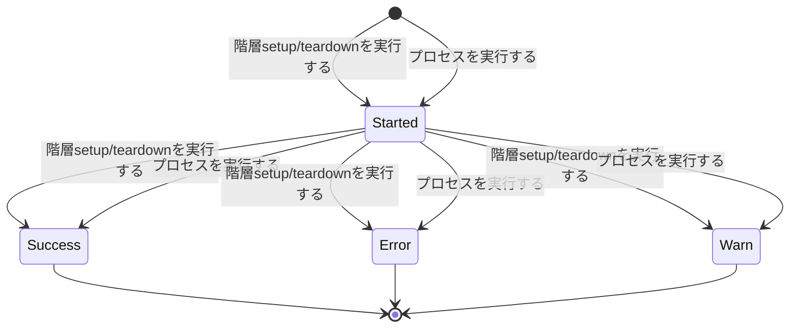
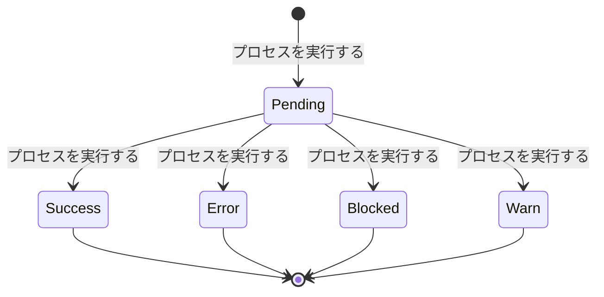

<!-- generateRdraMd.js による自動生成ファイル。手動編集しないこと。元データ: docs/rdra/latest/*.tsv -->

# 状態モデル

RDRA システム内部レイヤー。状態モデルごとの状態遷移。遷移ラベルは UC。

## 階層実行ステータス（実行管理）

| 状態 | 遷移UC | 遷移先状態 | 説明 |
|---|---|---|---|
|  | 階層setup/teardownを実行する | Started | run / scenario / bizdate / process の各階層の実行状況を管理する状態モデル。内蔵ランナーが直接実行する各階層の setup（実行ジャーナルへの開始イベント記録）で実行が開始され Started になる。テスト結果確認者が階層単位の成否を把握するために必要となる |
|  | プロセスを実行する | Started | process 階層は内蔵ランナーによるプロセス実行の setup（実行ジャーナルへの開始イベント記録）で Started になる |
| Started | 階層setup/teardownを実行する | Success | 配下の全タスクが Success（Warn・Error なし）のとき teardown（正常経路）で Success に確定する。実行ステータスは Error > Warn > Success の優先度で集約される。実行ジャーナルの終了イベントとして記録され、stfw status / stfw report とスパンステータス・属性（OTLP トレース）に投影される |
| Started | プロセスを実行する | Success | process 階層はリターンコード 0 の teardown（かつ配下ステップに Warn・Error なし）で Success に確定する |
| Started | 階層setup/teardownを実行する | Error | タスクのエラー発生時に内蔵ランナーがエラー経路の teardown を実行し Error に確定する。エラー時停止のビジネスポリシーを担保し、失敗の検知と調査の起点になる。Error はスパンステータス Error として OTLP トレースに投影される |
| Started | プロセスを実行する | Error | process 階層はリターンコード 0・3 以外（例: 6）の teardown で Error に確定する |
| Success |  |  | Success は終了状態であり、以降の遷移はない。再実行は「シナリオを実行する」による新しい run_id の別の実行として扱う |
| Error |  |  | Error は終了状態であり、以降の遷移はない。失敗調査とシナリオ修正のうえ、再実行は「シナリオを実行する」による新しい run_id の別の実行として扱う |
| Started | 階層setup/teardownを実行する | Warn | 配下に Warn があり Error が無いとき teardown で Warn に確定する（Error > Warn > Success の優先度で集約）。Warn は実行を停止させず最後まで進み、stfw status / stfw report に黄系の色で表示され、OTLP トレースではスパンステータス Ok + status 属性として投影される |
| Started | プロセスを実行する | Warn | process 階層はリターンコード 3（Warn）の teardown、または配下ステップに Warn があり Error が無い場合に Warn に確定する。後続の実行は止めない |
| Warn |  |  | Warn は終了状態であり、以降の遷移はない。機能変更の差分確認モードで「狙い通りの差分（比較 NG 等）」の発生を示し、teardown フックへ公開される環境変数 stfw_run_status にも Warn が入る（Warn あり・Error なしの run）。再実行は「シナリオを実行する」による新しい run_id の別の実行として扱う |

## ステップ実行ステータス（シナリオ構造管理）

| 状態 | 遷移UC | 遷移先状態 | 説明 |
|---|---|---|---|
|  | プロセスを実行する | Pending | プロセス内スクリプト（ステップ）単位の実行結果を管理する状態モデル。内蔵ランナーがプロセス開始時に scripts/ 直下の全スクリプトを Pending（未実行）として列挙する（実行ジャーナルの steps_enumerated イベント）。組込み parallel プロセスでは子プロセス 1 件を 1 ステップとして、子ディレクトリ名を昇順に Pending として列挙する。実行順序の保証と失敗箇所の特定のために必要となる |
| Pending | プロセスを実行する | Success | スクリプトがファイル名昇順の逐次実行で正常終了（リターンコード 0）すると Success になる。compare プラグインでは期待値（expect）とエビデンス（actual）が一致すると on_mismatch の設定によらず Success になり後続処理が継続する |
| Pending | プロセスを実行する | Error | スクリプトが異常終了（リターンコード 0・3 以外。例: 6）するか、compare プラグイン（on_mismatch: error（既定））の比較不一致（compare-files の exit 3 を exit 6 に変換）が検出されると Error になり、プロセスはエラー停止する。該当 step スパンのスパンステータスは Error として OTLP トレースに投影される |
| Pending | プロセスを実行する | Blocked | 先行スクリプトの Error（on_mismatch: error（既定）の compare 比較不一致によるステップ失敗を含む）により未実行のままスキップされたスクリプトは Blocked として記録される。Warn は後続を止めないため Blocked を発生させない。組込み parallel プロセスの子同士に Blocked は無い（並走に順序依存が無いため、先行子が Error でも全子を最後まで実行する）。エラー時に後続を実行しないビジネスポリシーの担保と、未実行範囲の特定に必要となる。Blocked は step スパンの属性で表現される |
| Success |  |  | Success は終了状態であり、結果はステップ実行結果として実行ジャーナルと step スパンの属性（OTLP トレース）に投影される |
| Error |  |  | Error は終了状態であり、結果はステップ実行結果として実行ジャーナルと step スパンの属性（OTLP トレース）に投影され、失敗箇所の特定に使われる |
| Blocked |  |  | Blocked は終了状態であり、結果はステップ実行結果として実行ジャーナルと step スパンの属性（OTLP トレース）に投影され、未実行範囲の把握に使われる |
| Pending | プロセスを実行する | Warn | スクリプトがリターンコード 3 で終了すると Warn になり、実行ジャーナルに Warn として記録されるが後続スクリプトの実行は止めない（記録して続行）。compare プラグイン（on_mismatch: warn）の比較不一致（compare-files の exit 3 をそのまま返却）もこれに該当し、機能変更の差分確認モード（比較 NG を最後まで進めて鳥瞰）を成立させる |
| Warn |  |  | Warn は終了状態であり、結果はステップ実行結果として実行ジャーナルと step スパンの属性（OTLP トレース。スパンステータスは Ok + status 属性で表現）に投影され、比較 NG 等の差分発生箇所の鳥瞰に使われる |
