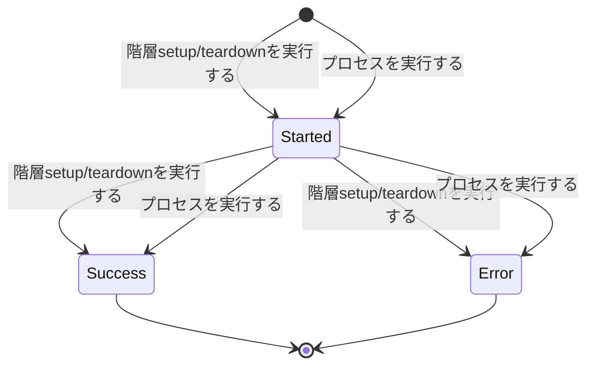
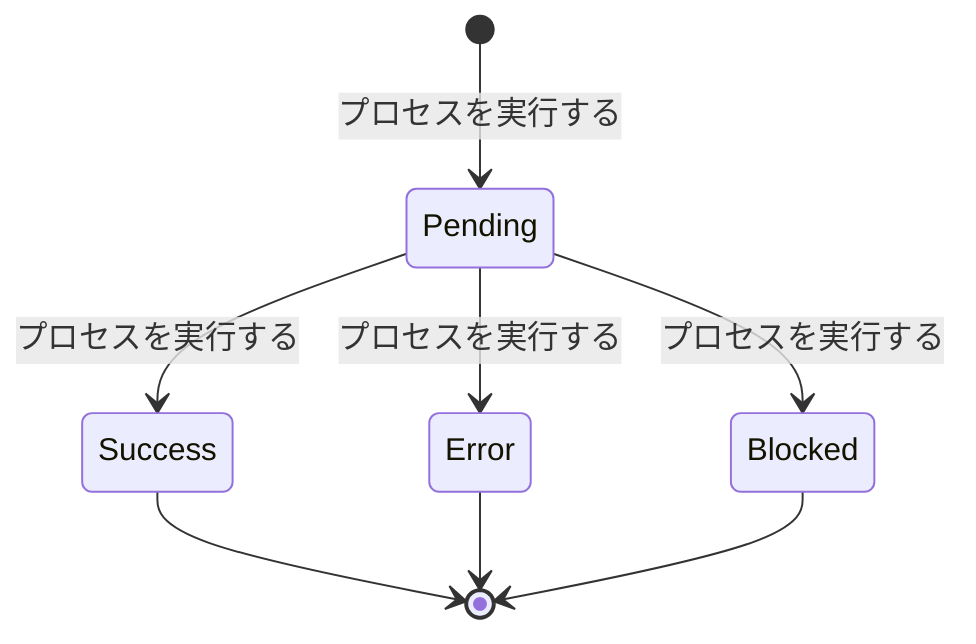
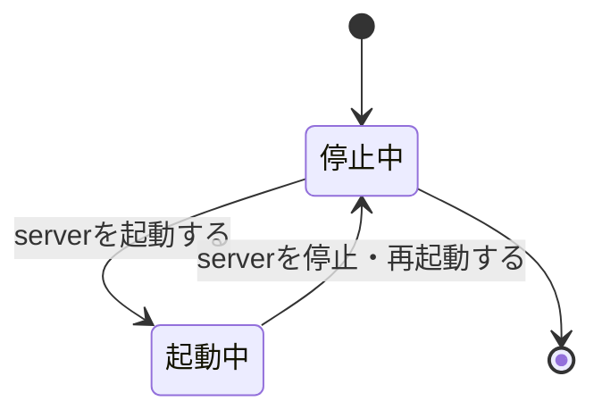

<!-- generateRdraMd.js による自動生成ファイル。手動編集しないこと。元データ: docs/rdra/latest/*.tsv -->

# 状態モデル

RDRA システム内部レイヤー。状態モデルごとの状態遷移。遷移ラベルは UC。

## 階層実行ステータス（実行管理）

| 状態 | 遷移UC | 遷移先状態 | 説明 |
|---|---|---|---|
|  | 階層setup/teardownを実行する | Started | run / scenario / bizdate / process の各階層の実行状況を管理する状態モデル。各階層の setup（実行ジャーナルへの開始イベント記録）で実行が開始され Started になる。テスト結果確認者が階層単位の成否を把握するために必要となる |
|  | プロセスを実行する | Started | process 階層はプロセス実行の setup（実行ジャーナルへの開始イベント記録）で Started になる |
| Started | 階層setup/teardownを実行する | Success | 全タスク正常終了時の teardown（正常経路）で Success に確定する。実行ジャーナルの終了イベントとして記録され、スパンステータス・属性として OTLP トレースに投影される |
| Started | プロセスを実行する | Success | process 階層はリターンコード 0 の teardown で Success に確定する |
| Started | 階層setup/teardownを実行する | Error | タスクのエラー発生時に _error 経路の teardown で Error に確定する。エラー時停止のビジネスポリシーを担保し、失敗の検知と調査の起点になる。Error はスパンステータス Error として OTLP トレースに投影される |
| Started | プロセスを実行する | Error | process 階層はリターンコード 0 以外の teardown で Error に確定する |
| Success |  |  | Success は終了状態であり、以降の遷移はない。再実行は「シナリオを実行する」による新しい run_id の別の実行として扱う |
| Error |  |  | Error は終了状態であり、以降の遷移はない。失敗調査とシナリオ修正のうえ、再実行は「シナリオを実行する」による新しい run_id の別の実行として扱う |

## ステップ実行ステータス（シナリオ構造管理）

| 状態 | 遷移UC | 遷移先状態 | 説明 |
|---|---|---|---|
|  | プロセスを実行する | Pending | プロセス内スクリプト（ステップ）単位の実行結果を管理する状態モデル。プロセス開始時に scripts/ 直下の全スクリプトを Pending（未実行）として列挙する。実行順序の保証と失敗箇所の特定のために必要となる |
| Pending | プロセスを実行する | Success | スクリプトがファイル名昇順の逐次実行で正常終了（リターンコード 0）すると Success になる |
| Pending | プロセスを実行する | Error | スクリプトが異常終了（リターンコード 0 以外）すると Error になり、プロセスはエラー停止する。該当 step スパンのスパンステータスは Error として OTLP トレースに投影される |
| Pending | プロセスを実行する | Blocked | 先行スクリプトのエラーにより未実行のままスキップされたスクリプトは Blocked として記録される。エラー時に後続を実行しないビジネスポリシーの担保と、未実行範囲の特定に必要となる。Blocked は step スパンの属性で表現される |
| Success |  |  | Success は終了状態であり、結果はステップ実行結果として step スパンの属性（OTLP トレース）に投影される |
| Error |  |  | Error は終了状態であり、結果はステップ実行結果として step スパンの属性（OTLP トレース）に投影され、失敗箇所の特定に使われる |
| Blocked |  |  | Blocked は終了状態であり、結果はステップ実行結果として step スパンの属性（OTLP トレース）に投影され、未実行範囲の把握に使われる |

## server 稼働状態（実行管理）

| 状態 | 遷移UC | 遷移先状態 | 説明 |
|---|---|---|---|
|  |  | 停止中 | ワークフローエンジン（digdag server）の稼働状況を管理する状態モデル。初期状態は停止中（pid ファイルなし）。シナリオ実行の前提条件チェックと多重起動禁止の判定に必要となる |
| 停止中 | serverを起動する | 起動中 | server start（digdag server の起動と pid ファイル作成）で起動中に遷移する。pid ファイルが既に存在する場合は多重起動として start を拒否する |
| 起動中 | serverを停止・再起動する | 停止中 | server stop（SIGTERM 送信と pid ファイル削除）で停止中に遷移する。プロセス消滅を検知した場合も pid ファイルを自動削除して停止中とみなす |
| 停止中 |  |  | 停止中は終了状態にもなる。server が停止中はシナリオ一括自動実行の前提条件を満たさないため、「server状態を確認する」による実行前チェックで検出される |
