<!-- generateRdraMd.js による自動生成ファイル。手動編集しないこと。元データ: docs/rdra/latest/*.tsv -->

# 条件・バリエーション

RDRA システム内部レイヤー。判断条件（ビジネスルール）と区分・種別の一覧。

## 条件（ビジネスルール）

```mermaid
graph LR
  CD1{{"業務日付フォーマット"}}
  CD2{{"連番フォーマット"}}
  CD3{{"グループ名制約"}}
  CD4{{"実行対象ディレクトリ規則"}}
  CD5{{"階層ディレクトリ判定"}}
  CD6{{"逐次実行・エラー時 Blocked"}}
  SM1[["ステップ実行ステータス"]]
  VR1[/"終了コード"/]
  CD7{{"run 実行の前提条件"}}
  VR2[/"部分実行指定"/]
  CD8{{"dry-run の実行範囲"}}
  VR3[/"実行モード（run_mode）"/]
  CD9{{"プロセス実行の前提条件"}}
  VR4[/"プロセスタイプ"/]
  CD10{{"プロジェクト再初期化禁止"}}
  CD11{{"パスワード重複登録禁止"}}
  CD12{{"暗号化キー再生成の抑止"}}
  CD13{{"設定の上書き順"}}
  CD14{{"プラグイン解決順"}}
  VR5[/"プラグインスコープ"/]
  CD15{{"inventory 全件指定"}}
  VR6[/"ホストグループ"/]
  CD16{{"シークレットマスキング"}}
  CD17{{"スパンステータス・属性マップ"}}
  SM2[["階層実行ステータス"]]
  VR7[/"スパン階層タイプ"/]
  CD18{{"OTel エクスポート先未設定時の送信抑制"}}
  VR8[/"OTel エクスポート設定"/]
  CD19{{"OTel エクスポート失敗の非致命扱い"}}
  CD20{{"run 前静的検証"}}
  CD21{{"server 設定の廃止警告"}}
  CD22{{"資格情報の旧形式移行"}}
  VR9[/"資格情報暗号化方式"/]
  CD23{{"run_id の採番・保持"}}
  CD24{{"エビデンスディレクトリ規約"}}
  CD25{{"プラグイン接続情報のグループ名参照"}}
  CD26{{"プラグインのランタイム依存宣言と存在チェック"}}
  VR10[/"Docker イメージ構成"/]
  CD27{{"export/import ラウンドトリップ互換"}}
  VR11[/"対応データストア製品"/]
  CD28{{"収集先ホストとの時刻同期前提"}}
  CD29{{"比較不一致はステップ失敗"}}
  VR12[/"compare on_mismatch 設定"/]
  CD30{{"sshExec のリモートスクリプト一括実行"}}
  CD31{{"scpPut の原子的配置"}}
  CD32{{"実行結果ハウスキープ"}}
  VR13[/"実行結果保存期間設定"/]
  CD33{{"scaffold の差分同期（--sync）"}}
  CD34{{"spec/doc 往復の可逆性"}}
  CD35{{"invoke エビデンス HTML レポート生成の優先順"}}
  CD36{{"config の ${...} 環境変数展開（stfw.yml 値参照）"}}
  CD37{{"実行ステータス集約（Error > Warn > Success）"}}
  CD38{{"run 終了コードの集約（0/3/6）"}}
  CD39{{"Warn ステータスの後方互換（旧ジャーナル混在）"}}
  CD40{{"部分実行の指定制約"}}
  CD41{{"部分実行のスキップ意味論"}}
  CD42{{"parallel 子プロセスの並走実行"}}
  VR14[/"parallel 同時実行数設定"/]
  CD6 -.-> SM1
  CD6 -.-> VR1
  CD7 -.-> VR2
  CD8 -.-> VR3
  CD9 -.-> VR4
  CD14 -.-> VR5
  CD15 -.-> VR6
  CD17 -.-> SM2
  CD17 -.-> SM1
  CD17 -.-> VR7
  CD17 -.-> VR1
  CD18 -.-> VR8
  CD20 -.-> VR2
  CD22 -.-> VR9
  CD25 -.-> VR6
  CD26 -.-> VR10
  CD27 -.-> VR11
  CD29 -.-> SM1
  CD29 -.-> VR12
  CD30 -.-> VR4
  CD31 -.-> VR4
  CD32 -.-> VR13
  CD32 -.-> VR2
  CD35 -.-> VR4
  CD37 -.-> SM2
  CD37 -.-> SM1
  CD38 -.-> SM2
  CD38 -.-> VR1
  CD40 -.-> VR2
  CD41 -.-> VR2
  CD42 -.-> SM1
  CD42 -.-> SM2
  CD42 -.-> VR4
  CD42 -.-> VR14
```

> 凡例: `{{六角}}` 条件 / `[[二重枠]]` 状態モデル / `[/斜め/]` バリエーション

| コンテキスト | 条件 | 条件の説明 | バリエーション | 状態モデル |
|---|---|---|---|---|
| シナリオ構造管理 | 業務日付フォーマット | 業務日付（bizdate）は YYYYMMDD の 8 桁数字であること。8 桁数字以外はエラーとする。業務日付 scaffold の生成時に検証し、日付順のテスト進行（業務日付単位の区切り）を成立させる |  |  |
| シナリオ構造管理 | 連番フォーマット | 業務日付・プロセスの連番（seq）は数値のみであること。scaffold 生成時に検証し、ディレクトリ名昇順による実行順序の決定を保証する |  |  |
| シナリオ構造管理 | グループ名制約 | プロセスのグループ名に「_」を含めないこと。ディレクトリ名の「_」区切りパースを保護する。プロセス scaffold の生成時に検証し、ディレクトリ名から seq・group・プロセスタイプを正しく解釈できるようにする |  |  |
| シナリオ構造管理 | 実行対象ディレクトリ規則 | 「_」始まりのディレクトリのみを実行対象として採用し、名前昇順に実行順を決定する。記述したディレクトリ構造そのものが実行定義となり、静的検証（stfw validate）と内蔵ランナーの実行対象列挙で機械的に解釈されるため、手書きの実行手順書を不要にする（ワークフロー定義（dig）の生成は廃止） |  |  |
| シナリオ構造管理 | 階層ディレクトリ判定 | シナリオ・業務日付・プロセスの各ディレクトリは、scenario ルートからの深さとプロジェクト直下の stfw.yml の存在で判定する。scaffold 生成（stfw new）・静的検証（stfw validate）・プロセス実行の各コマンドで、実行位置が正しい階層かを判定し、誤った階層での操作を防ぐ |  |  |
| シナリオ構造管理 | 逐次実行・エラー時 Blocked | 内蔵ランナーがスクリプトをファイル名昇順に逐次実行する。Error 発生（終了コード 0・3 以外。on_mismatch: error（既定）の compare 比較不一致によるステップ失敗を含む）後の後続スクリプトは実行せず Blocked として記録し停止する。Warn（終了コード 3。on_mismatch: warn の compare 比較不一致を含む）は Warn として記録するのみで後続の実行は止めない（記録して続行）。実行モデルは逐次実行（1 実行 = 1 プロセス）であり、例外として組込み parallel プロセス配下の子プロセスのみ並走する（子同士に Blocked は無い。parallel 子プロセスの並走実行を参照）。実行順序の保証とエラー時停止を担保しつつ、機能変更の差分確認モード（比較 NG を最後まで進めて鳥瞰）を両立し、テスト結果の再現性と失敗箇所の特定を可能にする | 終了コード | ステップ実行ステータス |
| 実行管理 | run 実行の前提条件 | シナリオ実行は対象シナリオディレクトリが存在し、run 前静的検証を通過していること。部分実行（--from / --only）時は指定ノード（シナリオ相対の {bizdate_dir}[/{process_dir}]）が存在すること（存在しない場合は run_id の採番・ジャーナル作成・ハウスキープの前に fail-fast でエラー終了）。digdag server の起動等の前準備は不要で、stfw run の 1 コマンドで実行を開始できる。実行できない状態での起動失敗や中途半端な実行を防ぐ | 部分実行指定 |  |
| 実行管理 | dry-run の実行範囲 | dry-run（stfw run --dry-run）は実タスク（execute / post_execute）をスキップし、setup → pre_execute → teardown を実行する。テスト対象環境に影響を与えずに実行経路と前後処理を本実行前に安全に確認する | 実行モード（run_mode） |  |
| プロジェクト環境管理 | プロセス実行の前提条件 | 対象プロセスタイプのプラグインがインストール済みであること。プロセスの実行・scaffold 生成時に検証し、未インストールのプロセスタイプによる実行時の失敗を防ぐ | プロセスタイプ |  |
| プロジェクト環境管理 | プロジェクト再初期化禁止 | stfw.yml が既に存在するディレクトリでは stfw init をエラーとする。既存プロジェクトの設定・シナリオをテンプレートで上書き破壊することを防ぐ（従来仕様を維持） |  |  |
| プロジェクト環境管理 | パスワード重複登録禁止 | 同一ホスト×ユーザーの資格情報ファイルが存在する場合は stfw secret set での登録・再登録は不可。参照時は存在必須。資格情報の意図しない上書きを防ぎ、登録済み情報の一意性を保つ |  |  |
| プロジェクト環境管理 | 暗号化キー再生成の抑止 | 暗号化キーペアが既に存在する場合は stfw secret keygen での生成は不可。--force 指定時のみ削除して再生成する。キー再生成により既存の暗号化済み資格情報が復号不能になる事故を防ぐ |  |  |
| プロジェクト環境管理 | 設定の上書き順 | プロジェクト設定はデフォルト（stfw 本体の内蔵デフォルト）→ プロジェクトの順、プラグイン設定は組込み → プロジェクト → シナリオ内 Process 設定の順に読込・上書きし、環境変数として全スクリプトへ公開する（STFW_HOME/config は廃止）。共通デフォルトを保ちながらプロジェクト・シナリオ単位の個別調整を可能にする |  |  |
| プロジェクト環境管理 | プラグイン解決順 | 同名プラグインはプロジェクト（{proj}/plugins/）→ 組込み（配布物同梱。STFW_HOME 廃止に伴い配置変更）の順に解決し、プロジェクト側を優先する（従来仕様を維持）。プラグインへの env 契約（stfw_* / STFW_PROJ_DIR 系の環境変数公開）は維持する。組込みプラグイン群（収集系・データストア系・検証系・実行系）をプロジェクト側でカスタマイズ・差し替えできるようにする | プラグインスコープ |  |
| プロジェクト環境管理 | inventory 全件指定 | グループ名 all は全グループ横断の予約値とし、指定時は全グループのホストを対象とする。グループ存在確認はホスト取得結果の有無で判定する。環境内の全ホストを一括対象にする指定を可能にする | ホストグループ |  |
| 実行管理 | シークレットマスキング | ログ出力時に環境変数 PASSWORD / TOKEN の値を [secret] に置換する（v1.0 でも従来仕様を維持）。実行ログを出力・確認するすべての場面で、資格情報を平文で扱わない原則を守り、ログ経由の漏えいを防ぐ |  |  |
| 通知管理 | スパンステータス・属性マップ | スパン属性に実行コンテキスト（run_id・階層タイプ・bizdate・seq・group・プロセスタイプ・終了コード等。旧 webhook payload が持っていた情報を引き継ぐ）を載せる。実行ステータス Error はスパンステータス Error にマップし、Blocked ステップはスパン属性で表現する。Warn は OTel のスパンステータスに相当が無い（Ok / Error / Unset のみ）ため、スパンステータス Ok + stfw の status 属性（Warn）で表現する。既存オブザーバビリティ基盤での進捗把握・失敗検知・失敗箇所の特定を可能にする | スパン階層タイプ、終了コード | 階層実行ステータス、ステップ実行ステータス |
| 通知管理 | OTel エクスポート先未設定時の送信抑制 | 環境変数 OTEL_EXPORTER_OTLP_ENDPOINT・stfw.yml の stfw.otel.endpoint のいずれにも送信先が未設定の場合はトレースを送信しない。エクスポート先の無い環境での不要な送信試行を避ける（現行 webhook の「URL 未設定なら送信しない」と同じ方針） | OTel エクスポート設定 |  |
| 通知管理 | OTel エクスポート失敗の非致命扱い | OTLP トレースの送信失敗は実行を失敗させず、実行ログへの警告記録のみとする。通知経路の障害がテスト実行そのものを止めないようにし、テスト結果の取得を優先する |  |  |
| 実行管理 | run 前静的検証 | stfw run の開始前に validate 相当の静的検証（ディレクトリ規約・プラグイン解決可否・config.yml・対象シナリオの存在チェック・シナリオで使用するプロセスタイプが plugin.yml の requires に宣言したランタイム依存（前提コマンド）の存在チェック等を統合）を自動実行し、エラー時は実行を開始しない。部分実行（--from / --only）時もフィルタ前のシナリオ全体を検証対象とする（実行範囲の絞り込みは検証範囲を狭めない）。残存する *.dig ファイルには不要である旨を警告する。規約違反のあるシナリオ構造や依存不足による実行時失敗を事前に防ぐ | 部分実行指定 |  |
| プロジェクト環境管理 | server 設定の廃止警告 | stfw.server.* 設定を含む stfw.yml の読み込み時に廃止警告を表示し、設定値は実行に影響させない。digdag server 廃止後も旧設定を残したプロジェクトが暗黙に誤動作せず、廃止を利用者に確実に伝える |  |  |
| プロジェクト環境管理 | 資格情報の旧形式移行 | 旧 S/MIME 形式の資格情報は読み込み専用でサポートし、stfw secret migrate で age (X25519) 形式へ一括変換する（旧ファイルは .bak 退避）。旧環境からの移行時に資格情報を失わず、平文経由の再登録を不要にする | 資格情報暗号化方式 |  |
| 実行管理 | run_id の採番・保持 | run_id は _{YYYYMMDDHHMMSS}_{PID} 形式（従来形式を維持）で採番し実行コンテキストに保持する。attempt_id は存在せず、run_id のみで一括自動実行を一意に識別し、stfw status / stfw report / OTel トレースの基点とする |  |  |
| シナリオ構造管理 | エビデンスディレクトリ規約 | 収集系プラグイン（collectFile / collectLog / exportXxx）の出力ルートは自プロセスディレクトリ配下の evidence/（gitignore 対象）とし、collectFile / collectLog は evidence/{host}/{収集元の絶対パスをそのまま再現}、exportMysql / exportPostgres は evidence/{database}/{table}.csv、exportRedis は evidence/{host}/{keyパターン名}.csv へ出力する。compare プラグインは expect/（git 管理。直下に同一 bizdate 内の収集系 process ディレクトリ名を置き、その配下は当該 process の evidence/ 配下と同型）・actual/（gitignore・自動生成。expect と同じ構造で実体は各収集系 process の evidence/ への symlink）・result/（gitignore。compare-files の比較結果出力）のディレクトリを持つ。ディレクトリ規約・プラグイン env 契約に次ぐ第 3 の互換境界として文書化し、組み込みプラグインとカスタムプラグインの 2 層エコシステム全体の互換性を担保する |  |  |
| プロジェクト環境管理 | プラグイン接続情報のグループ名参照 | 組み込みプラグインの設定（config.yml の stfw.process.{type} 配下）では、収集系は targets リスト（group: inventory グループ名参照、paths: 収集ファイルパス正規表現リスト）、データストア系は host_group（inventory グループ名参照）・port・database・user・tables（テーブル名リスト）等、リモートアクセス系（sshExec / scpPut）は group（inventory グループ名参照）・user（ログインユーザ）・scpPut のグループ毎の配置先ディレクトリ等で指定し、接続情報（ホスト名・パスワード）を直接記述しない。パスワードは secret（age 暗号化）の {host}-{user} を自動参照し、SSH ホストキーは ssh trust（known_hosts）の既存機構を利用する。共通の identity（database / user）は stfw.yml に集約し config から ${stfw_...} で参照できるが、これは identity の集約であって接続情報（ホスト・パスワード）の config 直書き解禁ではない。接続先ホストは inventory、パスワードは secret から解決する禁止契約を維持する。プラグインごとの接続情報の重複と平文資格情報の混入を防ぐ | ホストグループ |  |
| プロジェクト環境管理 | プラグインのランタイム依存宣言と存在チェック | プラグインはメタデータファイル plugin.yml に requires（前提コマンドのリスト。例: mysql, ssh, scp, k6）をランタイム依存として宣言し、stfw validate と run 前静的検証が、シナリオで使用するプロセスタイプの requires をコマンド存在チェックで検証する。リモートアクセス系（sshExec / scpPut）は ssh / scp を requires に宣言する。Docker イメージは既存の最小構成に加えて依存全部入りのタグ（例: stfw:full）を提供する。実行時になって判明する依存不足を実行前に検出する | Docker イメージ構成 |  |
| プロジェクト環境管理 | export/import ラウンドトリップ互換 | データストア系プラグインの export はヘッダー付き CSV（1 行目はカラム名）でエクスポートし、import は export が出力した形式をそのままインポートできること（ラウンドトリップ可能）。CSV は RFC 4180 準拠（LF・UTF-8・必要時 quote）、NULL は \N で表現して空文字と区別する（mysqldump 慣行）。Redis の export はヘッダー付き CSV（key,type,ttl,value）で、string 型は生値、hash / list / set / zset 型はキー順ソートの正規化 JSON とする（compare の安定性のため）。エビデンス収集・期待値作成（export）とデータ準備（import）を同一形式で往復させ、人手の変換なしに業務日付ごとの反復を可能にする | 対応データストア製品 |  |
| 実行管理 | 収集先ホストとの時刻同期前提 | collectLog は実行ジャーナルの bizdate node_start イベント時刻（プラグイン env 契約に追加された環境変数 stfw_bizdate_start_ts、RFC3339 形式として公開）をフィルタ基準時刻とするため、収集先ホストとの時刻同期を前提とする。この制約は利用ドキュメントに明記し、時刻ずれによるログの収集漏れ・過剰収集を防ぐ |  |  |
| 実行管理 | 比較不一致はステップ失敗 | compare の比較で期待値（expect）とエビデンス（actual）に差分がある場合の扱いを、compare プラグインの設定キー on_mismatch: error（既定）\| warn の選択制とする。error（既定）は比較不一致（compare-files exit 3）を Error（exit 6）に変換して該当ステップを失敗とし、既存のエラー時停止・Blocked 伝播の対象とする（従来挙動を維持する回帰テスト運用との後方互換）。warn は compare-files の exit 3 を exit 3 のまま返し（6 に変換しない）、該当ステップは Warn として記録され後続の実行が継続する。一致した場合はいずれの設定でもステップを Success とし後続処理を継続する。期待値比較の失敗検知と調査を既存の結果確認手段（status / report / OTel トレース）に一元化する | compare on_mismatch 設定 | ステップ実行ステータス |
| プロジェクト環境管理 | sshExec のリモートスクリプト一括実行 | sshExec は自プロセスの scripts/ ディレクトリ配下のスクリプトを、inventory グループで解決した各ホストへ ssh 経由で送り、ファイル名昇順に一括実行する（Act フェーズのリモート実行）。ログインユーザは config.yml（stfw.process.{type} 配下）で指定し、パスワードは secret（age 暗号化）の {host}-{user} を自動参照する（config.yml への直書きは禁止）。SSH ホストキーは ssh trust（known_hosts）の既存機構を利用する。途中のスクリプトがエラー終了した場合は以降のスクリプトを実行せず、リターンコード 6 で即時終了する | プロセスタイプ |  |
| プロジェクト環境管理 | scpPut の原子的配置 | scpPut は scp でローカルの target/{グループ} 配下のディレクトリ構成を、inventory グループで解決した各ホストへ一括で put する（Arrange フェーズのファイル配置）。グループ毎の配置先ディレクトリを config.yml（stfw.process.{type} 配下）で指定でき、まず一時ディレクトリへ scp put した後に指定した配置先ディレクトリへ mv して原子的に配置する。ログインユーザは config.yml 指定、パスワードは secret（age 暗号化）の {host}-{user} 自動参照（config.yml への直書きは禁止）、SSH ホストキーは ssh trust（known_hosts）の既存機構を利用する | プロセスタイプ |  |
| 実行管理 | 実行結果ハウスキープ | stfw run の開始時の振る舞いとして、保存期間（stfw.yml の stfw.housekeep.retention）を過ぎた実行ジャーナル（.stfw/runs/{run_id}）と HTML レポート（.stfw/reports/runs/{run_id}.html）を物理削除する。HTML レポート削除に伴いレポート index を再生成し、削除済み run を index に残さない。専用サブコマンドや常駐ジョブは設けず、定期実行が必要な場合は外部スケジューラ（cron 等）から stfw run を回す運用とする（run 都度ハウスキープにより保存期間が実質的に維持される）。エビデンスは scenario 配下の固定パスで毎回上書きされ累積しないため対象外とする。旧バージョンの run のジャーナル（Warn なし）が混在しても保存期間判定・削除は壊れずに動作する（Warn ステータスの後方互換）。部分実行（--from / --only）で指定ノードが存在しない場合は fail-fast が先行し、ハウスキープは実行されない（run_id 採番・ジャーナル作成・ハウスキープの前にエラー終了） | 実行結果保存期間設定、部分実行指定 |  |
| シナリオ構造管理 | scaffold の差分同期（--sync） | stfw scaffold <spec.yml> [--sync] は spec からディレクトリ骨格（scenario > bizdate > process のディレクトリ・metadata.yml・config）を生成する。既存ツリーが無い場合はそのまま生成し、既存ツリーがある場合 --sync は差分同期（spec に有りツリーに無いディレクトリは追加、両方に有るディレクトリは維持、spec に無くなったディレクトリは削除）を行う。--sync 無しで既存ツリーがある場合はエラー終了する。対話的 scaffold 生成（stfw new）とは別に、spec ファイルを単一ソースとしたツリー生成・差分同期の入口を提供する |  |  |
| シナリオ構造管理 | spec/doc 往復の可逆性 | reverse → scaffold → reverse は骨格（seq / bizdate / group / type / description / requirement_specifications / config サブツリー）が完全一致する（可逆）。data CSV・テストスクリプト・expect などの葉ファイルは往復の対象外とする。シナリオ構造を単一ファイル（spec / ドキュメント）でレビュー・共有し、そこからツリーを再生成できるようにして版管理・移送を容易にする |  |  |
| 実行管理 | invoke エビデンス HTML レポート生成の優先順 | invokeRest / invokeWeb の HTML レポート（{process}/evidence/report.html）生成の優先順は、(1) k6 web dashboard が十分なデータ（テスト実行時間が集計周期の 2 倍以上、実時間およそ 1 秒以上）でレポートを生成した場合はそれを採用、(2) 生成されない場合（単発 Act 等でデータ不足）は summary.json から自己完結の HTML をプラグイン側でフォールバック生成する。k6 が閾値割れ等で失敗してもサマリ（summary.json）が出力されるため report.html は常に残る | プロセスタイプ |  |
| プロジェクト環境管理 | config の ${...} 環境変数展開（stfw.yml 値参照） | プラグイン / プロセスの config チェーン（プラグイン既定 → プロジェクト config/plugins/process/{type}/ → プロセス config/config.yml）の値中の ${VAR} は実行環境の環境変数を参照して展開する。stfw run 開始時に stfw.yml（+ 同梱デフォルト）のフラット化結果を実行環境へ export する（v0.2 の export_yaml 互換）ため、config から stfw.yml の設定値を ${stfw_...} で参照できる（例: DB 接続先の identity を stfw.yml の stfw.db.database / stfw.db.user に集約し、config/plugins/process/{type}/config.yml から ${stfw_db_database} / ${stfw_db_user} で参照する）。各シナリオのプロセス config には固有値（テーブル名等）だけを書けばよく、共通設定値の重複記述によるメンテ漏れを防ぐ |  |  |
| プロジェクト環境管理 | エビデンスディレクトリ規約 | 収集系プラグイン（collectFile / collectLog / exportXxx）の出力ルートは自プロセスディレクトリ配下の evidence/（gitignore 対象）とし、collectFile / collectLog は evidence/{host}/{収集元の絶対パスをそのまま再現}、exportMysql / exportPostgres は evidence/{database}/{table}.csv、exportRedis は evidence/{host}/{keyパターン名}.csv へ出力する。compare プラグインは expect/（git 管理。直下に同一 bizdate 内の収集系 process ディレクトリ名を置き、その配下は当該 process の evidence/ 配下と同型）・actual/（gitignore・自動生成。expect と同じ構造で実体は各収集系 process の evidence/ への symlink）・result/（gitignore。compare-files の比較結果出力）のディレクトリを持つ。実行系（invokeWeb / invokeRest）のエビデンス出力（evidence/summary.json（k6 サマリ）・evidence/report.html（HTML レポート））も本規約の対象に含め、収集系プラグインに加えて invoke 系（実行系）のエビデンス出力を対象とする。ディレクトリ規約・プラグイン env 契約に次ぐ第 3 の互換境界として文書化し、組み込みプラグインとカスタムプラグインの 2 層エコシステム全体の互換性を担保する |  |  |
| 実行管理 | 実行ステータス集約（Error > Warn > Success） | 上位階層（process / bizdate / scenario / run）の実行ステータスは、配下の実行ステータスを Error > Warn > Success の優先度で集約して確定する。子に Warn があれば親も Warn になり、子に Error があれば親は Error になる。Warn を一級実行ステータスとして全階層に伝搬させ、差分発生（比較 NG 等）の検知を階層単位で可能にする |  | 階層実行ステータス、ステップ実行ステータス |
| 実行管理 | run 終了コードの集約（0/3/6） | stfw run の終了コードは、全 Success=0 / Warn あり（Error なし）=3 / Error あり=6 とする。CI では stfw run の終了コードだけで「差分あり（Warn）」を検知できる | 終了コード | 階層実行ステータス |
| 実行管理 | Warn ステータスの後方互換（旧ジャーナル混在） | 実行ジャーナルの status に Warn を追加しても、旧バージョンの run のジャーナル（Warn なし）と混在した状態で stfw report の再生成・stfw status の表示・stfw run 開始時のハウスキープ（保存期間判定・削除）が壊れないこと。バージョン更新後も過去の実行結果をそのまま参照・管理できるようにする |  |  |
| 実行管理 | 部分実行の指定制約 | 部分実行（--from / --only）の指定パスはシナリオ相対の {bizdate_dir}[/{process_dir}]（ディレクトリ名の完全一致）とする。--from と --only は排他（同時指定はエラー）とし、空値の明示指定（--from= / --only=）もエラーとする。部分実行時に run へ指定できるシナリオは 1 つのみ（複数・重複指定はエラー）とする。--dry-run とは併用できる。指定ノードが存在しない場合は fail-fast（run_id の採番・ジャーナル作成・ハウスキープの前にエラー終了）とする。静的検証（validate 相当・プラグイン requires・接続情報直書き禁止）はフィルタ前のシナリオ全体に実施する。誤指定による中途半端な実行と、不要な実行結果の残骸（run_id・ジャーナル）の発生を防ぐ | 部分実行指定 |  |
| 実行管理 | 部分実行のスキップ意味論 | 部分実行でスキップされたノードは実行されず、実行ジャーナルへ一切記録されない（node_start / node_end もフックも無い）。実行されるノードの祖先階層のフック（run / scenario / 実行対象を含む bizdate の setup・teardown）は通常どおり実行する。実行ジャーナルの run node_start の attrs に、部分実行時のみ from / only（指定パス）を記録する（部分実行の指定なしの run では記録しない）。スキップしたノードの副作用（データ投入等）の再現はユーザー責務とし、ツールは前提を再現しない。部分実行の実行範囲・記録の解釈を一意にし、ジャーナルから部分実行であったことを追跡可能にする | 部分実行指定 |  |
| シナリオ構造管理 | parallel 子プロセスの並走実行 | 組込み parallel プロセスは、プロセスディレクトリ配下に定義した子プロセス（親と同形式 _{seq}_{group}_{type}。子のタイプに parallel は指定不可（入れ子禁止）・子 0 件は定義不正として validate エラー）を並走させる。子プロセス 1 件 = 実行ジャーナル上の 1 ステップとし、steps_enumerated イベントで子ディレクトリ名を昇順に全件 Pending 登録する。process 階層フック（setup / teardown）は親で 1 回のみ実行し、子では実行しない。子は seq 昇順に実行キューへ投入されて並走し（完了順は不定）、子同士に Blocked は無く、先行子が Error でも全子を最後まで実行する。親のステータスは全子の悪い方（Error > Warn > Success）で集約し、親が Error の場合は既存規則どおり後続の兄弟プロセスを実行せず停止する。同時実行数は max_parallel（0 = 上限なし、正整数 = 上限（超過分は seq 順に待機）、負数・非整数は設定不正として親 Error）を設定チェーン（同梱デフォルト stfw.yml → プロジェクト stfw.yml → プロジェクト config/plugins/process/parallel/config.yml → プロセス config/config.yml、後勝ち）で解決する。部分実行（--from / --only）で指定できるのは親 parallel プロセスまでとする（子は指定不可）。互換境界（ディレクトリ規約・プロセスプラグイン実行契約・エビデンスディレクトリ規約・ジャーナル）は不変のまま、順序依存の無い処理の実行時間を短縮する | プロセスタイプ、parallel 同時実行数設定 | ステップ実行ステータス、階層実行ステータス |

## バリエーション

| コンテキスト | バリエーション | 値 | 説明 |
|---|---|---|---|
| 実行管理 | 実行モード（run_mode） | run、dry-run | シナリオ実行時の動作区分。run は全タスクを実行し、dry-run（stfw run --dry-run）は実タスク（execute / post_execute）をスキップして setup → pre_execute → teardown のみ実行する |
| 実行管理 | ログレベル | trace、debug、info、warn、error | 実行ログの出力詳細度の区分。プロジェクト設定（stfw.yml）またはコマンドオプションで変更でき、デフォルトは info |
| プロジェクト環境管理 | ホストグループ | web、ap、db（名称は任意定義）、all（全グループ横断の予約値） | 環境別 inventory におけるテスト対象ホストのグルーピング単位。all は全グループのホストを横断対象とする予約値 |
| シナリオ構造管理 | プロセスタイプ | scripts、collectLog、collectFile、exportMysql / importMysql / clearMysql、exportPostgres / importPostgres / clearPostgres、exportRedis / importRedis / clearRedis、compare、invokeWeb、invokeRest、sshExec / scpPut、parallel（プラグイン追加で拡張可） | プロセスの実行方式の種別。プラグインとして追加・拡張でき、scaffold 生成・依存インストール・実行の単位になる。scripts に加えて組込みプラグイン群（収集系・データストア系・検証系・実行系・リモートアクセス系・並走系）が提供され、リモートアクセス系は sshExec（ssh でのリモートスクリプト一括実行・Act）と scpPut（scp でのローカルファイル原子的配置・Arrange）を含む。実行系（invokeWeb / invokeRest）は Act の結果を自プロセスディレクトリ配下の evidence/（summary.json / report.html）へエビデンスとして出力する。並走系（parallel）は組込みネイティブタイプで、プロセスディレクトリ配下に定義した子プロセス（親と同形式）を並走させる（子のタイプに parallel は指定不可）。プロダクト固有のプロセスタイプはカスタムプラグインとして追加する |
| プロジェクト環境管理 | プラグインスコープ | プロジェクト、組込み | プラグインの配置場所の区分。同名プラグインはプロジェクト（{proj}/plugins/）→ 組込み（配布物同梱。STFW_HOME 廃止に伴い配置変更）の順に解決され、プロジェクト側が優先される。組込みプラグイン群が汎用部品を提供し、プロダクト固有のカスタムプラグインをプロジェクト側に配置する 2 層構造を成立させる |
| 通知管理 | 終了コード | 0（SUCCESS）、3（WARN）、6（ERROR） | スクリプト・コマンド共通の終了コード体系。ステップ実行結果の Success / Warn / Error 判定と後続 Blocked 判定の基準になる。3（WARN）は Warn として記録して実行を続行し、0・3 以外は Error として停止 + 後続 Blocked とする（プロセスプラグイン実行契約の RC 体系 0/3/6 自体は変更せず、3 に実行意味論を追加）。stfw run 自体の終了コードも同体系で集約され、全 Success=0 / Warn あり（Error なし）=3 / Error あり=6 として CI の「差分あり」検知に使われる |
| プロジェクト環境管理 | 対応 OS 種別 | linux、darwin（mac）、windows | 配布バイナリの対応プラットフォームの区分（linux/darwin × amd64/arm64、windows/amd64）。配布物の選択軸となる（JAVA_HOME 等のランタイム依存分岐は廃止） |
| 通知管理 | スパン階層タイプ | run、scenario、bizdate、process、step | OTLP トレースのスパンツリーを構成する実行階層の区分。run をルートスパン、scenario / bizdate / process を子スパン、step を末端スパンとしてマップする |
| 通知管理 | OTel エクスポート設定 | OTEL_EXPORTER_OTLP_ENDPOINT（OTel 標準環境変数）、stfw.otel.endpoint（stfw.yml） | OTLP トレースのエクスポート先の指定方法の区分。OTel 標準の環境変数を尊重し、stfw.yml でも設定できる。いずれも未設定の場合はトレースを送信しない |
| プロジェクト環境管理 | 資格情報暗号化方式 | age (X25519)（現行）、S/MIME (RSA+AES256)（旧形式・読み込み専用） | 資格情報の暗号化方式の区分。現行は age (X25519) で、旧 S/MIME 形式は読み込み専用でサポートされ stfw secret migrate で一括移行できる |
| プロジェクト環境管理 | プラグインフェーズ | Arrange（準備）、Act（実行）、Collect（収集）、Assert（検証） | 1 つの業務日付（bizdate）を構成するパイプラインのフェーズ区分。組み込みプラグインが各フェーズの汎用部品（Arrange / Collect: データストア系、Act: 実行系、Collect: 収集系、Assert: 検証系）を提供し、カスタムプラグインは組み込みプラグインの組み合わせとして実装される |
| プロジェクト環境管理 | 対応データストア製品 | MySQL（MariaDB は MySQL 互換として同一プラグインでサポート）、PostgreSQL、Redis（Valkey は Redis 互換として同一プラグインでサポート） | データストア系プラグイン（export / import / clear）の対象製品の区分。代表的な OSS のみを対象とし、public cloud のマネージド製品はまだ対象にしない。将来の製品追加はプラグイン追加で対応する |
| プロジェクト環境管理 | Docker イメージ構成 | 最小構成（既存）、依存全部入り（例: stfw:full） | Docker 配布イメージのタグ構成の区分。依存全部入りタグはプラグインのランタイム依存（k6・mysql/psql クライアント・ssh/scp 等）を同梱し、依存準備なしで組込みプラグイン群を利用できるようにする |
| 実行管理 | 実行結果保存期間設定 | 保存期間（例: stfw.housekeep.retention: 30d）、未設定（削除しない） | run 開始時の実行結果ハウスキープで削除対象を判定する保存期間の区分。stfw.yml の stfw.housekeep.retention で指定し、保存期間を過ぎた実行ジャーナル（.stfw/runs/{run_id}）と HTML レポート（.stfw/reports/runs/{run_id}.html）を物理削除する。未設定時は削除しない |
| 実行管理 | compare on_mismatch 設定 | error（既定）、warn | compare プラグインの比較不一致時の扱いの区分。Process / Plugin 設定（config.yml）の設定キー on_mismatch で選択する。error（既定）は比較不一致（compare-files exit 3）を Error（exit 6）に変換してステップ失敗とし従来挙動を維持する（回帰テストモード）。warn は exit 3 のまま返して Warn として記録し実行を継続する（機能変更の差分確認モード） |
| 実行管理 | 部分実行指定 | --from {bizdate_dir}[/{process_dir}]（再開）、--only {bizdate_dir}[/{process_dir}]（ピンポイント実行）、指定なし（全体実行） | stfw run の部分実行の指定方法の区分。--from は指定ノードより実行順で前のノードをスキップし、指定ノードから最後まで実行する（process まで指定した場合はその bizdate 内の先行 process のみスキップし、後続 bizdate は全 process を実行）。--only は指定ノードのサブツリーのみ実行する（bizdate 指定なら配下全 process、process 指定ならその process のみ）。指定パスはシナリオ相対の {bizdate_dir}[/{process_dir}]（ディレクトリ名の完全一致）で、--from と --only は排他、--dry-run とは併用できる。失敗した run の途中からの再開と特定ノードのピンポイント実行を可能にする |
| 実行管理 | parallel 同時実行数設定 | 0（上限なし・同梱デフォルト）、正整数（同時実行数の上限。超過分は seq 順に待機）、負数・非整数（設定不正。親プロセスを Error にする） | 組込み parallel プロセスの同時実行数上限（max_parallel）の区分。同梱デフォルト stfw.yml（stfw.process.parallel.max_parallel: 0）→ プロジェクト stfw.yml → プロジェクト config/plugins/process/parallel/config.yml → プロセス config/config.yml の設定チェーン（後勝ち）で解決する |
