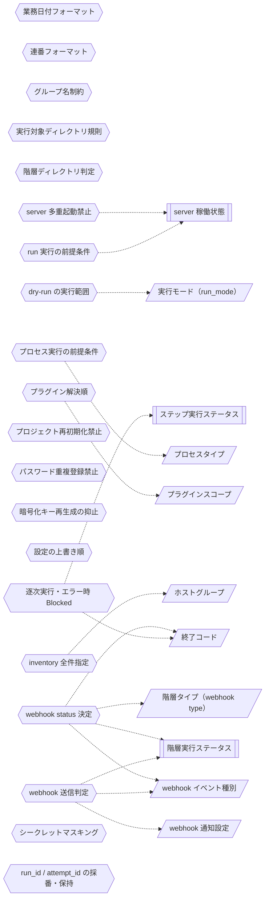

<!-- generateRdraMd.js による自動生成ファイル。手動編集しないこと。元データ: docs/rdra/latest/*.tsv -->

# 条件・バリエーション

RDRA システム内部レイヤー。判断条件（ビジネスルール）と区分・種別の一覧。

## 条件（ビジネスルール）

> 凡例: `{{六角}}` 条件 / `[[二重枠]]` 状態モデル / `[/斜め/]` バリエーション

| コンテキスト | 条件 | 条件の説明 | バリエーション | 状態モデル |
|---|---|---|---|---|
| シナリオ構造管理 | 業務日付フォーマット | 業務日付（bizdate）は YYYYMMDD の 8 桁数字であること。8 桁数字以外はエラーとする。業務日付 scaffold の生成時に検証し、日付順のテスト進行（業務日付単位の区切り）を成立させる |  |  |
| シナリオ構造管理 | 連番フォーマット | 業務日付・プロセスの連番（seq）は数値のみであること。scaffold 生成時に検証し、ディレクトリ名昇順による実行順序の決定を保証する |  |  |
| シナリオ構造管理 | グループ名制約 | プロセスのグループ名に「_」を含めないこと。ディレクトリ名の「_」区切りパースを保護する。プロセス scaffold の生成時に検証し、ディレクトリ名から seq・group・プロセスタイプを正しく解釈できるようにする |  |  |
| シナリオ構造管理 | 実行対象ディレクトリ規則 | 「_」始まりのディレクトリのみをワークフローのタスクとして採用し、名前昇順に実行順を決定する。ワークフロー定義（dig）の自動生成時に実行対象と実行順序をディレクトリ構造から機械的に決定し、手書きの実行手順書を不要にする |  |  |
| シナリオ構造管理 | 階層ディレクトリ判定 | シナリオ・業務日付・プロセスの各ディレクトリは、scenario ルートからの深さとプロジェクト直下の stfw.yml の存在で判定する。scaffold 生成・ワークフロー定義生成・プロセス実行の各コマンドで、実行位置が正しい階層かを判定し、誤った階層での操作を防ぐ |  |  |
| シナリオ構造管理 | 逐次実行・エラー時 Blocked | スクリプトはファイル名昇順に逐次実行し、エラー発生（終了コード 0 以外）後の後続スクリプトは実行せず Blocked として記録し停止する。実行順序の保証とエラー時停止を担保し、テスト結果の再現性と失敗箇所の特定を可能にする | 終了コード | ステップ実行ステータス |
| 実行管理 | run 実行の前提条件 | シナリオ実行は digdag server が起動中（pid 生存）であり、対象シナリオディレクトリが存在すること。一括自動実行の開始時に前提条件をチェックし、実行できない状態での起動失敗や中途半端な実行を防ぐ |  | server 稼働状態 |
| 実行管理 | server 多重起動禁止 | pid ファイルが存在する場合は server start 不可。存在しない場合は stop 不可。1 プロジェクト 1 サーバプロセスを保証し、多重起動による実行の競合・破壊を防ぐ |  | server 稼働状態 |
| 実行管理 | dry-run の実行範囲 | dry-run は setup → pre_execute → teardown のみ実行し、実タスク（execute / post_execute）をスキップする。テスト対象環境に影響を与えずにワークフロー定義と実行経路を本実行前に安全に確認する | 実行モード（run_mode） |  |
| プロジェクト環境管理 | プロセス実行の前提条件 | 対象プロセスタイプのプラグインがインストール済みであること。プロセスの実行・scaffold 生成時に検証し、未インストールのプロセスタイプによる実行時の失敗を防ぐ | プロセスタイプ |  |
| プロジェクト環境管理 | プロジェクト再初期化禁止 | stfw.yml が既に存在するディレクトリでは init をエラーとする。既存プロジェクトの設定・シナリオをテンプレートで上書き破壊することを防ぐ |  |  |
| プロジェクト環境管理 | パスワード重複登録禁止 | 同一ホスト×ユーザーのパスワードファイルが存在する場合は登録不可。参照時は存在必須。資格情報の意図しない上書きを防ぎ、登録済み情報の一意性を保つ |  |  |
| プロジェクト環境管理 | 暗号化キー再生成の抑止 | 暗号化キーペアが既に存在する場合は生成不可。--force 指定時のみ削除して再生成する。キー再生成により既存の暗号化済みパスワードが復号不能になる事故を防ぐ |  |  |
| プロジェクト環境管理 | 設定の上書き順 | プロジェクト設定はデフォルト（STFW_HOME/config）→ プロジェクトの順、プラグイン設定は組込み → プロジェクト → シナリオ内 Process 設定の順に読込・上書きし、環境変数として全スクリプトへ公開する。共通デフォルトを保ちながらプロジェクト・シナリオ単位の個別調整を可能にする |  |  |
| プロジェクト環境管理 | プラグイン解決順 | 同名プラグインはプロジェクト（{proj}/plugins/）→ 組込み（STFW_HOME/plugins/）の順に解決し、プロジェクト側を優先する。組込みプラグインをプロジェクト側でカスタマイズ・差し替えできるようにする | プラグインスコープ |  |
| プロジェクト環境管理 | inventory 全件指定 | グループ名 all は全グループ横断の予約値とし、指定時は全グループのホストを対象とする。グループ存在確認はホスト取得結果の有無で判定する。環境内の全ホストを一括対象にする指定を可能にする | ホストグループ |  |
| 通知管理 | webhook 送信判定 | start 通知は on_start=true の場合のみ、end 通知は結果ステータス（Success / Error）に応じて on_success / on_error=true の場合のみ送信する。通知のイベント種別ごとの ON/OFF 設定により、受信先に必要な通知だけを届ける | webhook イベント種別、webhook 通知設定 | 階層実行ステータス |
| 通知管理 | webhook status 決定 | start 時は Started 固定。end 時は run / scenario / bizdate がワークフローの stfw_run_status（Success / Error）、process はリターンコード 0 → Success / それ以外 → Error で決定する。各階層の成功・失敗を通知の status として確定し、外部システムでの進捗把握と失敗検知を可能にする | 階層タイプ（webhook type）、webhook イベント種別、終了コード | 階層実行ステータス |
| 実行管理 | シークレットマスキング | ログ出力時に環境変数 PASSWORD / TOKEN の値を [secret] に置換する。実行ログを出力・確認するすべての場面で、資格情報を平文で扱わない原則を守り、ログ経由の漏えいを防ぐ |  |  |
| 実行管理 | run_id / attempt_id の採番・保持 | run_id は _{YYYYMMDDHHMMSS}_{PID} 形式で採番し実行コンテキストに保持する。attempt_id は digdag start の出力から取得し、取得できない場合はエラーとする。一括自動実行を一意に識別し、ログ追従・Web UI 確認・通知の親子ツリー構成の基点とする |  |  |

## バリエーション

| コンテキスト | バリエーション | 値 | 説明 |
|---|---|---|---|
| 実行管理 | 実行モード（run_mode） | run、dry-run | シナリオ実行時の動作区分。run は全タスクを実行し、dry-run は実タスク（execute / post_execute）を実行せず setup → pre_execute → teardown のみでワークフロー定義を検証する |
| シナリオ構造管理 | dig 生成モード | self、cascade | ワークフロー定義（dig）の生成範囲の区分。self は自階層の dig のみ生成し、cascade は配下の bizdate.dig まで連鎖生成する |
| 通知管理 | 階層タイプ（webhook type） | run、scenario、bizdate、process | webhook payload のテンプレート合成と id 導出の軸となる実行階層の区分。run > scenario > bizdate > process の親子ツリーを構成する |
| 通知管理 | webhook イベント種別 | start、end | webhook 通知の契機となるイベントの区分。各階層の開始時に start、終了時に end を通知し、end の status は Success / Error で確定する |
| 通知管理 | webhook 通知設定 | on_start、on_success、on_error（各 true / false） | webhook 通知のイベント種別ごとの ON/OFF 設定。start 通知・正常終了通知・エラー終了通知を個別に抑制できる |
| 実行管理 | ログレベル | trace、debug、info、warn、error | 実行ログの出力詳細度の区分。プロジェクト設定（stfw.yml）またはコマンドオプションで変更でき、デフォルトは info |
| 実行管理 | DB モード | memory、database | digdag server の状態 DB の保持方式の区分。memory はインメモリ保持、database は指定ディレクトリ（既定 .stfw/db）への永続化 |
| プロジェクト環境管理 | ホストグループ | web、ap、db（名称は任意定義）、all（全グループ横断の予約値） | 環境別 inventory におけるテスト対象ホストのグルーピング単位。all は全グループのホストを横断対象とする予約値 |
| シナリオ構造管理 | プロセスタイプ | scripts（同梱はこれのみ。プラグイン追加で拡張可） | プロセスの実行方式の種別。プラグインとして追加・拡張でき、scaffold 生成・依存インストール・実行の単位になる |
| プロジェクト環境管理 | プラグインスコープ | プロジェクト、組込み | プラグインの配置場所の区分。同名プラグインはプロジェクト（{proj}/plugins/）→ 組込み（STFW_HOME/plugins/）の順に解決され、プロジェクト側が優先される |
| 通知管理 | 終了コード | 0（SUCCESS）、3（WARN）、6（ERROR） | スクリプト・コマンド共通の終了コード体系。ステップ実行結果の Success / Error 判定と後続 Blocked 判定の基準になる |
| プロジェクト環境管理 | 対応 OS 種別 | linux、mac | stfw 実行ホストの OS 依存設定（JAVA_HOME 等）の分岐軸となる区分 |
