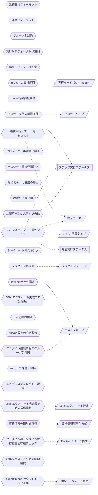

<!-- generateRdraMd.js による自動生成ファイル。手動編集しないこと。元データ: docs/rdra/latest/*.tsv -->

# 条件・バリエーション

RDRA システム内部レイヤー。判断条件（ビジネスルール）と区分・種別の一覧。

## 条件（ビジネスルール）

> 凡例: `{{六角}}` 条件 / `[[二重枠]]` 状態モデル / `[/斜め/]` バリエーション

| コンテキスト | 条件 | 条件の説明 | バリエーション | 状態モデル |
|---|---|---|---|---|
| シナリオ構造管理 | 業務日付フォーマット | 業務日付（bizdate）は YYYYMMDD の 8 桁数字であること。8 桁数字以外はエラーとする。業務日付 scaffold の生成時に検証し、日付順のテスト進行（業務日付単位の区切り）を成立させる |  |  |
| シナリオ構造管理 | 連番フォーマット | 業務日付・プロセスの連番（seq）は数値のみであること。scaffold 生成時に検証し、ディレクトリ名昇順による実行順序の決定を保証する |  |  |
| シナリオ構造管理 | グループ名制約 | プロセスのグループ名に「_」を含めないこと。ディレクトリ名の「_」区切りパースを保護する。プロセス scaffold の生成時に検証し、ディレクトリ名から seq・group・プロセスタイプを正しく解釈できるようにする |  |  |
| シナリオ構造管理 | 実行対象ディレクトリ規則 | 「_」始まりのディレクトリのみを実行対象として採用し、名前昇順に実行順を決定する。記述したディレクトリ構造そのものが実行定義となり、静的検証（stfw validate）と内蔵ランナーの実行対象列挙で機械的に解釈されるため、手書きの実行手順書を不要にする（ワークフロー定義（dig）の生成は廃止） |  |  |
| シナリオ構造管理 | 階層ディレクトリ判定 | シナリオ・業務日付・プロセスの各ディレクトリは、scenario ルートからの深さとプロジェクト直下の stfw.yml の存在で判定する。scaffold 生成（stfw new）・静的検証（stfw validate）・プロセス実行の各コマンドで、実行位置が正しい階層かを判定し、誤った階層での操作を防ぐ |  |  |
| シナリオ構造管理 | 逐次実行・エラー時 Blocked | 内蔵ランナーがスクリプトをファイル名昇順に逐次実行し、エラー発生（終了コード 0 以外。compare の比較不一致によるステップ失敗を含む）後の後続スクリプトは実行せず Blocked として記録し停止する。実行順序の保証とエラー時停止を担保し、テスト結果の再現性と失敗箇所の特定を可能にする（従来と同一仕様を内蔵ランナーが提供する） | 終了コード | ステップ実行ステータス |
| 実行管理 | run 実行の前提条件 | シナリオ実行は対象シナリオディレクトリが存在し、run 前静的検証を通過していること。digdag server の起動等の前準備は不要で、stfw run の 1 コマンドで実行を開始できる。実行できない状態での起動失敗や中途半端な実行を防ぐ |  |  |
| 実行管理 | dry-run の実行範囲 | dry-run（stfw run --dry-run）は実タスク（execute / post_execute）をスキップし、setup → pre_execute → teardown を実行する。テスト対象環境に影響を与えずに実行経路と前後処理を本実行前に安全に確認する | 実行モード（run_mode） |  |
| プロジェクト環境管理 | プロセス実行の前提条件 | 対象プロセスタイプのプラグインがインストール済みであること。プロセスの実行・scaffold 生成時に検証し、未インストールのプロセスタイプによる実行時の失敗を防ぐ | プロセスタイプ |  |
| プロジェクト環境管理 | プロジェクト再初期化禁止 | stfw.yml が既に存在するディレクトリでは stfw init をエラーとする。既存プロジェクトの設定・シナリオをテンプレートで上書き破壊することを防ぐ（従来仕様を維持） |  |  |
| プロジェクト環境管理 | パスワード重複登録禁止 | 同一ホスト×ユーザーの資格情報ファイルが存在する場合は stfw secret set での登録・再登録は不可。参照時は存在必須。資格情報の意図しない上書きを防ぎ、登録済み情報の一意性を保つ |  |  |
| プロジェクト環境管理 | 暗号化キー再生成の抑止 | 暗号化キーペアが既に存在する場合は stfw secret keygen での生成は不可。--force 指定時のみ削除して再生成する。キー再生成により既存の暗号化済み資格情報が復号不能になる事故を防ぐ |  |  |
| プロジェクト環境管理 | 設定の上書き順 | プロジェクト設定はデフォルト（stfw 本体の内蔵デフォルト）→ プロジェクトの順、プラグイン設定は組込み → プロジェクト → シナリオ内 Process 設定の順に読込・上書きし、環境変数として全スクリプトへ公開する（STFW_HOME/config は廃止）。共通デフォルトを保ちながらプロジェクト・シナリオ単位の個別調整を可能にする |  |  |
| プロジェクト環境管理 | プラグイン解決順 | 同名プラグインはプロジェクト（{proj}/plugins/）→ 組込み（配布物同梱。STFW_HOME 廃止に伴い配置変更）の順に解決し、プロジェクト側を優先する（従来仕様を維持）。プラグインへの env 契約（stfw_* / STFW_PROJ_DIR 系の環境変数公開）は維持する。組込みプラグイン群（収集系・データストア系・検証系・実行系）をプロジェクト側でカスタマイズ・差し替えできるようにする | プラグインスコープ |  |
| プロジェクト環境管理 | inventory 全件指定 | グループ名 all は全グループ横断の予約値とし、指定時は全グループのホストを対象とする。グループ存在確認はホスト取得結果の有無で判定する。環境内の全ホストを一括対象にする指定を可能にする | ホストグループ |  |
| 実行管理 | シークレットマスキング | ログ出力時に環境変数 PASSWORD / TOKEN の値を [secret] に置換する（v1.0 でも従来仕様を維持）。実行ログを出力・確認するすべての場面で、資格情報を平文で扱わない原則を守り、ログ経由の漏えいを防ぐ |  |  |
| 通知管理 | スパンステータス・属性マップ | スパン属性に実行コンテキスト（run_id・階層タイプ・bizdate・seq・group・プロセスタイプ・終了コード等。旧 webhook payload が持っていた情報を引き継ぐ）を載せる。実行ステータス Error はスパンステータス Error にマップし、Blocked ステップはスパン属性で表現する。既存オブザーバビリティ基盤での進捗把握・失敗検知・失敗箇所の特定を可能にする | スパン階層タイプ、終了コード | 階層実行ステータス、ステップ実行ステータス |
| 通知管理 | OTel エクスポート先未設定時の送信抑制 | 環境変数 OTEL_EXPORTER_OTLP_ENDPOINT・stfw.yml の stfw.otel.endpoint のいずれにも送信先が未設定の場合はトレースを送信しない。エクスポート先の無い環境での不要な送信試行を避ける（現行 webhook の「URL 未設定なら送信しない」と同じ方針） | OTel エクスポート設定 |  |
| 通知管理 | OTel エクスポート失敗の非致命扱い | OTLP トレースの送信失敗は実行を失敗させず、実行ログへの警告記録のみとする。通知経路の障害がテスト実行そのものを止めないようにし、テスト結果の取得を優先する |  |  |
| 実行管理 | run 前静的検証 | stfw run の開始前に validate 相当の静的検証（ディレクトリ規約・プラグイン解決可否・config.yml・対象シナリオの存在チェック・プラグインが宣言したランタイム依存（前提コマンド）の存在チェック等を統合）を自動実行し、エラー時は実行を開始しない。残存する *.dig ファイルには不要である旨を警告する。規約違反のあるシナリオ構造や依存不足による実行時失敗を事前に防ぐ |  |  |
| プロジェクト環境管理 | server 設定の廃止警告 | stfw.server.* 設定を含む stfw.yml の読み込み時に廃止警告を表示し、設定値は実行に影響させない。digdag server 廃止後も旧設定を残したプロジェクトが暗黙に誤動作せず、廃止を利用者に確実に伝える |  |  |
| プロジェクト環境管理 | 資格情報の旧形式移行 | 旧 S/MIME 形式の資格情報は読み込み専用でサポートし、stfw secret migrate で age (X25519) 形式へ一括変換する（旧ファイルは .bak 退避）。旧環境からの移行時に資格情報を失わず、平文経由の再登録を不要にする | 資格情報暗号化方式 |  |
| 実行管理 | run_id の採番・保持 | run_id は _{YYYYMMDDHHMMSS}_{PID} 形式（従来形式を維持）で採番し実行コンテキストに保持する。attempt_id は存在せず、run_id のみで一括自動実行を一意に識別し、stfw status / stfw report / OTel トレースの基点とする |  |  |
| シナリオ構造管理 | エビデンスディレクトリ規約 | 収集系プラグイン（collectFile / exportXxx）の出力構造と compare の expect 構造を同型にするディレクトリ命名規約（具体的な命名は設計フェーズで確定）。ディレクトリ規約・プラグイン env 契約に次ぐ第 3 の互換境界として文書化し、組み込みプラグインとカスタムプラグインの 2 層エコシステム全体の互換性を担保する |  |  |
| プロジェクト環境管理 | プラグイン接続情報のグループ名参照 | 組み込みプラグインの設定（config.yml）では収集先・接続先を inventory のホストグループ名参照のみで指定し、ホスト名・資格情報を直接記述しない。資格情報は secret（age 暗号化）、SSH ホストキーは ssh trust（known_hosts）の既存機構を利用する。プラグインごとの接続情報の重複と平文資格情報の混入を防ぐ | ホストグループ |  |
| プロジェクト環境管理 | プラグインのランタイム依存宣言と存在チェック | プラグインごとに前提コマンド（k6・mysql/psql クライアント・ssh/scp 等）をランタイム依存として宣言し、stfw validate と run 前静的検証が存在チェックで検出する。Docker イメージは既存の最小構成に加えて依存全部入りのタグ（例: stfw:full）を提供する。実行時になって判明する依存不足を実行前に検出する | Docker イメージ構成 |  |
| プロジェクト環境管理 | export/import ラウンドトリップ互換 | データストア系プラグインの export はテーブル名リストを指定してヘッダー付き CSV でエクスポートし、import は export が出力した形式をそのままインポートできること（ラウンドトリップ可能）。エビデンス収集・期待値作成（export）とデータ準備（import）を同一形式で往復させ、人手の変換なしに業務日付ごとの反復を可能にする | 対応データストア製品 |  |
| 実行管理 | 収集先ホストとの時刻同期前提 | collectLog は実行ジャーナルの bizdate node_start イベント時刻（プラグイン env 契約 stfw_bizdate_start_ts 等として公開）をフィルタ基準時刻とするため、収集先ホストとの時刻同期を前提とする。この制約は利用ドキュメントに明記し、時刻ずれによるログの収集漏れ・過剰収集を防ぐ |  |  |
| 実行管理 | 比較不一致はステップ失敗 | compare の比較で期待値（expect）とエビデンス（actual）に差分がある場合、該当ステップを Error とし、既存のエラー時停止・Blocked 伝播の対象とする。一致した場合はステップを Success とし後続処理を継続する。期待値比較の失敗検知と調査を既存の結果確認手段（status / report / OTel トレース）に一元化する |  | ステップ実行ステータス |

## バリエーション

| コンテキスト | バリエーション | 値 | 説明 |
|---|---|---|---|
| 実行管理 | 実行モード（run_mode） | run、dry-run | シナリオ実行時の動作区分。run は全タスクを実行し、dry-run（stfw run --dry-run）は実タスク（execute / post_execute）をスキップして setup → pre_execute → teardown のみ実行する |
| 実行管理 | ログレベル | trace、debug、info、warn、error | 実行ログの出力詳細度の区分。プロジェクト設定（stfw.yml）またはコマンドオプションで変更でき、デフォルトは info |
| プロジェクト環境管理 | ホストグループ | web、ap、db（名称は任意定義）、all（全グループ横断の予約値） | 環境別 inventory におけるテスト対象ホストのグルーピング単位。all は全グループのホストを横断対象とする予約値 |
| シナリオ構造管理 | プロセスタイプ | scripts、collectLog、collectFile、exportMysql / importMysql / clearMysql、exportPostgres / importPostgres / clearPostgres、exportRedis / importRedis / clearRedis、compare、invokeWeb、invokeRest（プラグイン追加で拡張可） | プロセスの実行方式の種別。プラグインとして追加・拡張でき、scaffold 生成・依存インストール・実行の単位になる。scripts に加えて組込みプラグイン群（収集系・データストア系・検証系・実行系）が提供され、プロダクト固有のプロセスタイプはカスタムプラグインとして追加する |
| プロジェクト環境管理 | プラグインスコープ | プロジェクト、組込み | プラグインの配置場所の区分。同名プラグインはプロジェクト（{proj}/plugins/）→ 組込み（配布物同梱。STFW_HOME 廃止に伴い配置変更）の順に解決され、プロジェクト側が優先される。組込みプラグイン群が汎用部品を提供し、プロダクト固有のカスタムプラグインをプロジェクト側に配置する 2 層構造を成立させる |
| 通知管理 | 終了コード | 0（SUCCESS）、3（WARN）、6（ERROR） | スクリプト・コマンド共通の終了コード体系。ステップ実行結果の Success / Error 判定と後続 Blocked 判定の基準になる |
| プロジェクト環境管理 | 対応 OS 種別 | linux、darwin（mac）、windows | 配布バイナリの対応プラットフォームの区分（linux/darwin × amd64/arm64、windows/amd64）。配布物の選択軸となる（JAVA_HOME 等のランタイム依存分岐は廃止） |
| 通知管理 | スパン階層タイプ | run、scenario、bizdate、process、step | OTLP トレースのスパンツリーを構成する実行階層の区分。run をルートスパン、scenario / bizdate / process を子スパン、step を末端スパンとしてマップする |
| 通知管理 | OTel エクスポート設定 | OTEL_EXPORTER_OTLP_ENDPOINT（OTel 標準環境変数）、stfw.otel.endpoint（stfw.yml） | OTLP トレースのエクスポート先の指定方法の区分。OTel 標準の環境変数を尊重し、stfw.yml でも設定できる。いずれも未設定の場合はトレースを送信しない |
| プロジェクト環境管理 | 資格情報暗号化方式 | age (X25519)（現行）、S/MIME (RSA+AES256)（旧形式・読み込み専用） | 資格情報の暗号化方式の区分。現行は age (X25519) で、旧 S/MIME 形式は読み込み専用でサポートされ stfw secret migrate で一括移行できる |
| プロジェクト環境管理 | プラグインフェーズ | Arrange（準備）、Act（実行）、Collect（収集）、Assert（検証） | 1 つの業務日付（bizdate）を構成するパイプラインのフェーズ区分。組み込みプラグインが各フェーズの汎用部品（Arrange / Collect: データストア系、Act: 実行系、Collect: 収集系、Assert: 検証系）を提供し、カスタムプラグインは組み込みプラグインの組み合わせとして実装される |
| プロジェクト環境管理 | 対応データストア製品 | MySQL（MariaDB は MySQL 互換として同一プラグインでサポート）、PostgreSQL、Redis（Valkey は Redis 互換として同一プラグインでサポート） | データストア系プラグイン（export / import / clear）の対象製品の区分。代表的な OSS のみを対象とし、public cloud のマネージド製品はまだ対象にしない。将来の製品追加はプラグイン追加で対応する |
| プロジェクト環境管理 | Docker イメージ構成 | 最小構成（既存）、依存全部入り（例: stfw:full） | Docker 配布イメージのタグ構成の区分。依存全部入りタグはプラグインのランタイム依存（k6・mysql/psql クライアント・ssh/scp 等）を同梱し、依存準備なしで組込みプラグイン群を利用できるようにする |
